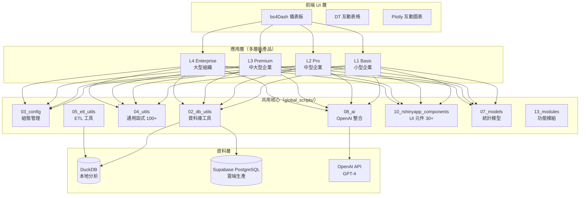
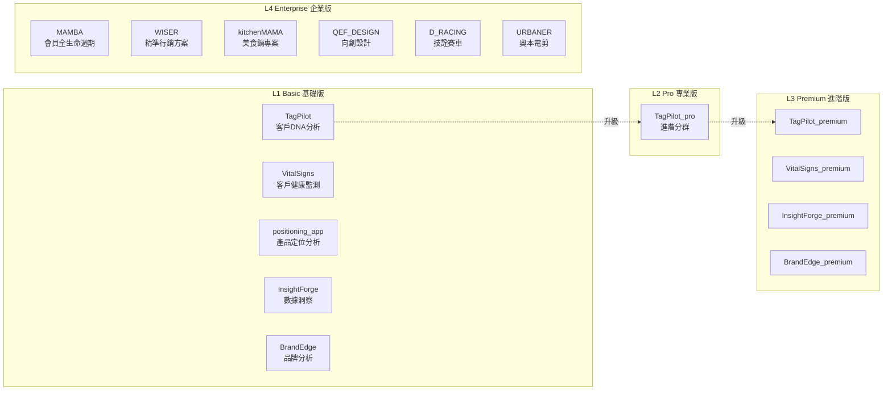
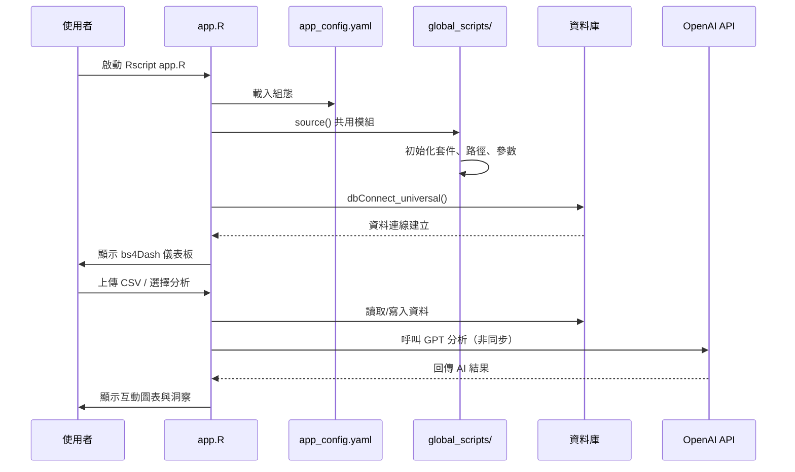
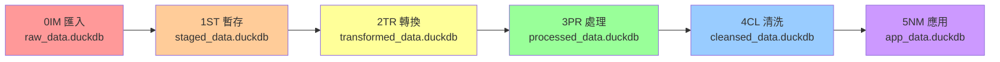
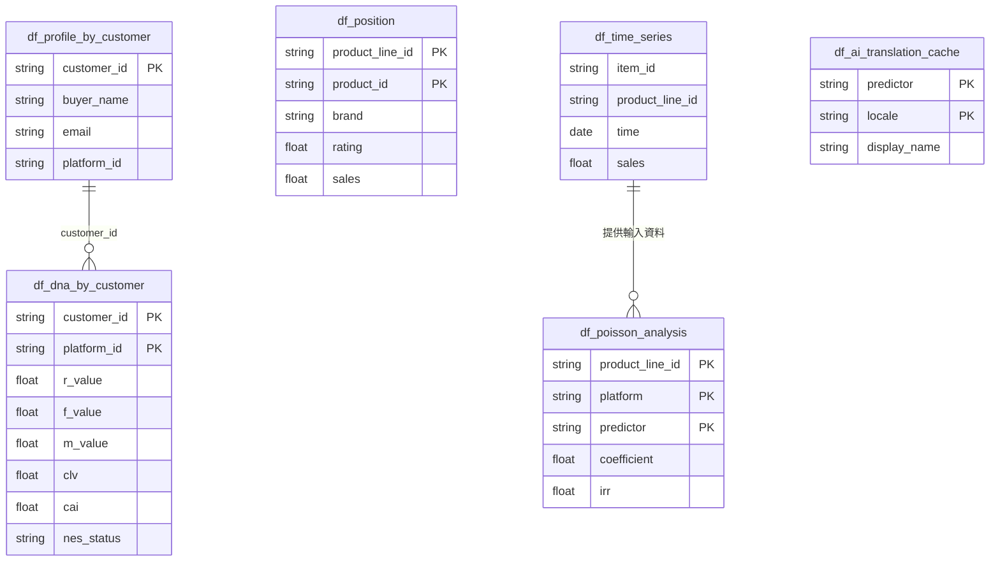

# CLAUDE.md

本文件為 Claude Code (claude.ai/code) 在此專案中的開發指引。

---

## 專案總覽

AI MarTech 是一個基於 AI 技術的**精準行銷科技平台**，以 R Shiny 為核心框架，整合 OpenAI GPT 模型，為不同規模企業提供客戶洞察、產品定位與行銷優化服務。

### 使用的程式語言與技術

| 語言/技術 | 用途 | 主要檔案類型 |
|-----------|------|-------------|
| **R** | 主要語言：Shiny 應用、統計建模、資料分析 | `.R` |
| **Python** | AI/ML 處理：評論評分、性別預測 | `.py` |
| **SQL** | 資料庫查詢、Schema 定義 | `.sql` |
| **YAML** | 組態管理（`app_config.yaml`） | `.yaml` |
| **HTML/CSS/JS** | Shiny UI 元件、前端樣式 | `.html`, `.css`, `.js` |
| **Bash** | 自動化腳本、部署工具 | `.sh` |
| **Markdown/Quarto** | 文件、原則系統 | `.md`, `.qmd` |

### 核心 R 套件

```r
# Shiny 生態系
shiny, bs4Dash, DT, plotly, dplyr, tidyverse

# 資料庫連線
DBI, RPostgres, RSQLite, duckdb

# 非同步處理
future, furrr

# API 整合
httr, jsonlite

# 安全性
bcrypt
```

---

## 架構總覽

### 系統架構圖



### 多層級產品架構



---

## 功能清單

### L1 Basic 應用程式

| 應用程式 | 功能描述 | 核心分析 |
|---------|---------|---------|
| **TagPilot** | 客戶 DNA 與 價值×活躍度 分析 | RFM 分析、9 宮格分群、CAI/PCV/CLV 指標 |
| **VitalSigns** | 客戶健康監測與流失預警 | DNA 分析、生命週期分析、風險指數 |
| **positioning_app** | 市場定位分析 | AI 評論分析、定位缺口辨識 |
| **InsightForge** | 銷售預測與產品評分 | Poisson 迴歸、AI 屬性評分、邊際效果 |
| **BrandEdge** | 品牌印記與定位分析 | 品牌認知分析、市場比較 |

### L4 Enterprise 企業專案

| 專案 | 客戶 | 核心功能 |
|------|------|---------|
| **MAMBA** | 通用平台 | 完整會員生命週期管理、精準行銷 |
| **WISER** | 範本平台 | 新公司專案範本、企業行銷自動化 |
| **kitchenMAMA** | 美食鍋 | 客製化行銷儀表板 |
| **QEF_DESIGN** | 向創設計 | 品牌行銷工具 |
| **D_RACING** | 技詮賽車精品 | 行銷儀表板 |
| **URBANER** | 奧本電剪 | 行銷分析 |

### 核心分析引擎

- **客戶 DNA 分析**：RFM（近期、頻率、金額）、CAI（客戶活躍指數）、PCV（預測客戶價值）、CLV（客戶終身價值）、CRI（客戶風險指數）
- **NES 分群**：新客（Newness）、興奮（Excitement）、穩定（Stability）
- **Poisson 迴歸**：銷售預測、邊際效果分析、軌道乘數
- **存活分析**：Cox 比例風險模型、BG/NBD 客戶終身價值
- **AI 評論評分**：GPT-4 自動評估 10+ 產品屬性（1-5 分）

---

## 程式運作邏輯

### 應用程式啟動流程



### 6 層 ETL 資料管線



- **0IM（匯入）**：原始資料匯入，不做任何修改
- **1ST（暫存）**：檔案層級前處理、統一編碼
- **2TR（轉換）**：Schema 標準化、統一資料類型
- **3PR（處理）**：商業邏輯處理、衍生計算
- **4CL（清洗）**：資料品質驗證、異常處理
- **5NM（應用）**：應用程式可直接使用的標準化資料

---

## 資料庫結構 Schema

### 核心資料表

#### SCHEMA_001：Poisson 分析表
```
df_{platform}_poisson_analysis_{product_line}
├── 識別欄位：product_line_id, platform, predictor
├── 模型結果：coefficient, incidence_rate_ratio, std_error, z_value, p_value
├── 信賴區間：conf_low, conf_high, irr_conf_low, irr_conf_high
├── UI 滑桿設定：predictor_min, predictor_max, track_multiplier
├── 顯示資訊：display_name, display_category, display_description
└── 主鍵：(product_line_id, platform, predictor, analysis_date)
```

#### SCHEMA_002：產品定位表
```
df_position
├── 識別欄位：product_line_id, product_id, brand
├── 績效指標：rating, sales
├── 33 個中文評論屬性欄位（DOUBLE, 0-1 範圍）
│   例：配送快速、品質優良、價格實惠、推薦他人、性能卓越...
└── 主鍵：(product_line_id, product_id)
```

#### SCHEMA_003：客戶檔案表
```
df_profile_by_customer
├── customer_id (PK), buyer_name, email, platform_id
│
df_dna_by_customer
├── RFM 指標：r_value, f_value, m_value + 百分位 + 標籤
├── 進階指標：clv, cai, pcv, cri
├── 購買行為：ipt（購買間隔）, total_spent, times
├── NES 分群：nes_ratio, nes_status
└── 主鍵：(customer_id, platform_id)
```

#### SCHEMA_004：時間序列銷售表
```
df_{platform}_sales_complete_time_series_{product_line}
├── 識別欄位：item_id, product_line_id
├── 時間欄位：time, year, day
├── 月份指標：month_1 ~ month_12（one-hot）
├── 星期指標：monday ~ sunday（one-hot）
├── 其他特徵：is_holiday, is_weekend, quarter
└── 150+ 豐富化欄位（產品屬性、賣家資訊等）
```

#### SCHEMA_005：AI 翻譯快取表
```
df_ai_translation_cache
├── predictor, locale (zh_TW/en_US/ja_JP/ko_KR)
├── display_name, display_name_en, display_name_zh
├── display_category, translation_method
└── 主鍵：(predictor, locale)
```

### 資料表關係圖



### 資料庫命名規則

```
表名格式：df_{platform}_{datatype}___{layer}
範例：df_cbz_sales___raw, df_eby_products___transformed

平台代碼：cbz (蝦皮), eby (eBay), amz (Amazon), shp (Shopify)
```

---

## 多國語系支援

### 支援語言

| 語言 | 代碼 | 用途 |
|------|------|------|
| **繁體中文** | `zh_TW` | 主要 UI 語言（預設） |
| **英文** | `en_US` | 後端邏輯鍵值、原則文件 |

### 多語系機制

1. **UI 文字翻譯** — `translate()` 函式
   - 來源：`11_rshinyapp_utils/translation/ui_terminology.csv`
   - 格式：英文鍵值 → 中文翻譯
   - 用法：`translate("Customer Count")` → `"顧客數"`

2. **AI Prompt 本地化** — `load_openai_prompt(locale=)`
   - 來源：`30_global_data/parameters/scd_type1/ai_prompts.yaml`
   - 結構：依語系 (en/zh_tw) 提供不同的 system_prompt

3. **組態語言設定**
   - `app_config.yaml` 中的 `language: "zh_TW.UTF-8"` 欄位

### 相關原則
- **DEV_R052**：商業邏輯使用英文鍵值，`translate()` 僅用於 UI 層
- **DEV_R053**：AI Prompt 依語系客製化，非逐字翻譯
- **UI_R025**：台灣繁體中文使用標準

---

## 前後端可擴充與移除選項

### 前端（可擴充）

| 元件 | 說明 | 擴充方式 |
|------|------|---------|
| **Shiny 模組** | `global_scripts/10_rshinyapp_components/` | 新增 `*UI.R` + `*Server.R` |
| **CSS 主題** | `global_scripts/19_CSS/` | 修改 Bootswatch 主題 |
| **互動圖表** | Plotly / DT | 新增 `renderPlotly()` / `renderDT()` |
| **頁面/分頁** | bs4Dash `tabItem` | 在 `dashboardBody()` 新增 tab |
| **翻譯** | `ui_terminology.csv` | 新增語言欄位 |

### 前端（可移除）

- 個別 `tabItem` 可從 `dashboardBody()` 移除
- 模組可從 `source()` 清單中移除
- Plotly 圖表可個別停用

### 後端（可擴充）

| 元件 | 說明 | 擴充方式 |
|------|------|---------|
| **資料庫** | PostgreSQL / SQLite / DuckDB | 修改 `app_config.yaml` 的 `database.mode` |
| **AI 模型** | OpenAI GPT | 修改 `ai_prompts.yaml` 的 `model` 欄位 |
| **統計模型** | `global_scripts/07_models/` | 新增 `*.R` 模型檔 |
| **ETL 管線** | 6 層資料管線 | 新增平台 ETL 腳本 |
| **平台 API** | `global_scripts/26_platform_apis/` | 新增 Amazon/eBay/Shopify 等整合 |
| **新公司專案** | L4 Enterprise | 使用 `/new-company` skill |

### 後端（可移除）

- AI 功能可透過移除 `08_ai/` 的 `source()` 停用
- 個別平台 API 可獨立移除
- 資料庫可從 PostgreSQL 切換為純 DuckDB（離線模式）

---

## 安裝、啟動、執行與使用

### 1. 系統需求

- **R** >= 4.0.0
- **RStudio**（建議，非必要）
- **PostgreSQL**（生產環境）或 DuckDB（開發環境）
- **OpenAI API Key**（AI 分析功能）
- **Python 3**（評論評分功能，選用）

### 2. 安裝步驟

```bash
# 複製專案
git clone --recursive https://github.com/kiki830621/ai_martech.git
cd ai_martech

# 智能同步所有元件
./bash/subrepo_sync.sh

# 設定環境變數
cp .env.example .env
# 編輯 .env 填入實際值：
# PGHOST, PGPORT, PGUSER, PGPASSWORD, PGDATABASE, PGSSLMODE
# OPENAI_API_KEY
```

### 3. 啟動應用程式

```bash
# 進入應用程式目錄
cd l1_basic/TagPilot

# 啟動應用（依 app_config.yaml 中的 main_file）
Rscript app.R
```

### 4. 執行測試

```bash
# 資料庫連線測試
Rscript global_scripts/98_test/test_database.R

# OpenAI API 測試
Rscript global_scripts/98_test/test_openai_api.R

# 應用程式特定測試
Rscript tests/test_complete_flow.R
```

### 5. 部署

```bash
# 部署至 Posit Connect Cloud（主要）
Rscript global_scripts/23_deployment/sc_deployment.R

# 或使用自動化部署
Rscript global_scripts/23_deployment/sc_deployment_auto.R
```

**部署目標：**
- **主要**：Posit Connect Cloud（connect.posit.cloud）
- **替代**：ShinyApps.io
- **開發**：本地搭配 DuckDB

---

## # memorize

### 核心開發流程
```sql
-- FLOW: 開發初始化
FLOW {
  START: new_task
  -> READ(global_scripts/00_principles/README.md)
  -> LOAD(app_config.yaml)
  -> SOURCE(global_scripts/modules)
  -> IMPLEMENT(solution)
  -> TEST(validation)
}
```

### 關鍵模式
```sql
-- PATTERN: 變數命名
TRANSFORM(code_elements -> descriptive_names)
-- 範例：customer_dna_matrix 而非 cdm

-- PATTERN: 命令命名（動詞開頭理論）
TRANSFORM(commands -> VERB + OBJECT)
-- 結構：/VERB OBJECT（空格分隔，不使用連字號）
-- 範例：/CHECK STATUS, /OPEN NSQL, /RUN APP, /GO ROOT
-- 理由：動詞開頭明確表達動作意圖，區分固定命令vs變動參數
```

### 任務前必要操作
```sql
-- DEPENDENCY: 原則審查
BEFORE_TASK: READ(global_scripts/00_principles/README.md)
-- 確保：遵循 257+ 條文件化規則的架構合規性

-- DEPENDENCY: 組態載入
INITIALIZE: LOAD(app_config.yaml) -> SOURCE(global_scripts/03_config/)
-- 模式：組態驅動開發
```

### 資料流相依性
```sql
-- REACTIVE: 資料庫連線
SOURCE: global_scripts/01_db/dbConnect.R
PATTERN: R092_universal_DBI -> dbConnect_universal()

-- REACTIVE: UI 元件
SOURCE: global_scripts/10_rshinyapp_components/
DEPENDS_ON: bs4Dash, existing_modules
AVOID: 在檢查現有元件之前建立新元件
```

---

## 開發指令

### 執行應用程式

進入應用程式目錄，執行 `app_config.yaml` 中指定的主檔案：

```bash
cd l1_basic/positioning_app
Rscript app.R
# 或版本特定檔案：Rscript full_app_v17.R
```

### 測試

從全域測試模組執行測試檔案：

```bash
Rscript global_scripts/98_test/test_database.R
Rscript global_scripts/98_test/test_openai_api.R
Rscript tests/test_complete_flow.R  # 應用程式特定測試
```

---

## 開發原則

### 核心要求（務必遵循）

1. **先讀原則**：架構變更前先查閱 `global_scripts/00_principles/README.md`
2. **Universal DBI 模式**：使用 `global_scripts/01_db/dbConnect.R` 建立資料庫連線
3. **組態驅動**：透過 `global_scripts/03_config/` 從 `app_config.yaml` 載入設定
4. **模組化函式**：建立新程式碼前，先善用現有 `global_scripts/` 模組

### 原則系統

- `global_scripts/00_principles/` 中有 **257+ 條文件化規則**
- **Meta-Principles (MP)**：系統架構基礎
- **Principles (P)**：實作指引
- **Rules (R)**：具體實作模式
- **所有架構變更必須先更新原則**

### 程式碼模式

#### 資料庫連線（使用 R092 Universal DBI）

```r
# 所有應用程式的標準模式
source("scripts/global_scripts/01_db/dbConnect.R")
conn <- dbConnect_universal()

# 基於組態的連線
source("scripts/global_scripts/03_config/load_config.R")
config <- load_app_config("app_config.yaml")
```

#### 組態載入

```r
# 載入應用程式特定組態
source("scripts/global_scripts/03_config/load_config.R")
config <- load_app_config("app_config.yaml")

# 存取巢狀組態值
db_config <- config$database
ui_theme <- config$theme$bootswatch
```

#### UI 元件

```r
# 使用 bs4Dash 框架
library(bs4Dash)

# 善用現有 UI 模組
source("scripts/global_scripts/10_rshinyapp_components/macro/macroTrend.R")
source("scripts/global_scripts/10_rshinyapp_components/micro/microCustomer.R")
```

#### OpenAI 整合

```r
# API 金鑰使用環境變數
openai_key <- Sys.getenv("OPENAI_API_KEY")

# 使用現有 OpenAI 工具函式
source("scripts/global_scripts/05_openai/openai_utils.R")
```

---

## 檔案組織規則

### 必要結構

- **應用程式**：每個 app 必須有 `app_config.yaml`、`manifest.json`、`www/` 目錄
- **腳本**：所有 shell 腳本放在 `bash/` 目錄
- **文件**：所有 `.md` 檔案放在 `docs/` 子目錄
- **環境變數**：使用 `.env` 檔案存放機密（絕不提交）
- **資料**：存放在 `data/` 或 `database/` 目錄（檢查 `.gitignore`）

### 命名慣例

- **變數**：使用描述性名稱（例：`customer_dna_matrix` 而非 `cdm`）
- **函式**：遵循 `verb_noun` 模式（例：`load_config`, `analyze_customer`）
- **檔案**：R 檔使用 snake_case，目錄使用 kebab-case

---

## 安全性要求

### 環境變數（絕不提交）

```bash
# 每個應用程式必要的環境變數
PGHOST, PGPORT, PGUSER, PGPASSWORD, PGDATABASE, PGSSLMODE
OPENAI_API_KEY  # 統一使用此名稱；過去的 OPENAI_API_KEY_LIN 已全面移除
```

### 資料保護

- 客戶資料檔案必須列入 `.gitignore`
- 大型檔案（>10MB）應排除
- 程式碼中不得包含敏感資訊

---

## 部署組態

### 應用程式需求

每個應用程式需要：

```yaml
# app_config.yaml 結構
app_info:
  name: "應用程式名稱"
  version: "1.0"
  language: "zh_TW.UTF-8"

deployment:
  target: "connect"  # 或 "shinyapps"
  main_file: "app.R"

env_vars:
  - "PGHOST"
  - "OPENAI_API_KEY"
```

### 部署目標

- **主要**：Posit Connect Cloud
- **替代**：ShinyApps.io
- **開發**：本地搭配 SQLite/DuckDB

---

## 除錯與開發

### 常見問題

- **資料庫連線**：檢查環境變數並使用 Universal DBI 模式
- **缺少模組**：先從 `global_scripts/` 引用，再建立新函式
- **UI 問題**：檢查 bs4Dash 版本相容性

### 測試策略

- **單元測試**：在 `global_scripts/98_test/`（100+ 測試檔案）
- **應用程式測試**：在各別 `tests/` 目錄
- **整合測試**：使用 `test_complete_flow.R` 模式
- **資料庫測試**：使用 `test_database.R` 驗證連線
- **E2E 測試**：shinytest2 自動化 UI 測試

---

## 效能最佳化

### 非同步處理

```r
# 使用 future/furrr 進行並行操作
library(future)
plan(multisession)

# OpenAI API 呼叫
results <- future_map(data_chunks, analyze_with_openai)
```

### 資料庫最佳化

```r
# 依情境選擇適當資料庫
# PostgreSQL：生產環境、多使用者
# SQLite：開發環境、單一使用者
# DuckDB：分析用途、大型資料集
```

---

## global_scripts/ 模組索引

| 模組 | 用途 |
|------|------|
| `00_principles/` | 核心原則、規則與治理（257+ 條原則） |
| `01_db/` | 資料庫初始化腳本 |
| `02_db_utils/` | 資料庫連線工具（dbConnect, DBI 模式） |
| `03_config/` | 全域組態載入 |
| `04_utils/` | 通用工具函式（100+ 個） |
| `05_etl_utils/` | ETL 工具與轉接器 |
| `06_queries/` | SQL 查詢範本 |
| `07_models/` | 統計建模函式 |
| `08_ai/` | OpenAI API 整合、Prompt 管理 |
| `09_python_scripts/` | Python 資料處理（評論評分、性別預測） |
| `10_rshinyapp_components/` | Shiny UI/Server 元件（最大模組，30+） |
| `11_rshinyapp_utils/` | Shiny 專用工具（含翻譯系統） |
| `13_modules/` | 功能模組與模組映射系統 |
| `14_sql_utils/` | SQL 專用工具 |
| `15_cleanse/` | 資料清洗函式 |
| `16_derivations/` | 衍生腳本（D01-D04 群組、商業邏輯） |
| `16_NSQL_Language/` | 自然語言 SQL 規格與範例 |
| `17_transform/` | 資料轉換工具 |
| `18_AIMETA_Language/` | AI 溝通後設語言 |
| `19_CSS/` | 樣式與 CSS 資源 |
| `20_R_packages/` | 套件管理 |
| `21_rshinyapp_templates/` | Shiny 元件範本 |
| `22_initializations/` | 應用程式初始化腳本 |
| `23_deployment/` | 部署自動化與組態 |
| `24_assets/` | 靜態資源（圖片、字型等） |
| `25_scripts/` | 其他工具腳本 |
| `26_platform_apis/` | 外部 API 整合（Amazon、eBay、Shopify） |
| `27_company_info/` | 公司特定中繼資料 |
| `28_migration_scripts/` | Schema/資料遷移腳本 |
| `30_global_data/` | 全域資料與參數 |
| `98_test/` | 完整測試套件（100+ 測試檔案） |
| `99_archive/` | 封存程式碼（舊版參考） |

---

本程式庫採用**原則驅動開發**模式，搭配為 AI 驅動行銷應用程式最佳化的**模組化架構**。

> **2025-07 更新**：為簡化多應用維運，所有程式碼已改為讀取 `Sys.getenv("OPENAI_API_KEY")`。
> 若需為不同內容使用不同金鑰，請在 Posit Connect 建立 **Variable Set**，為各 app 指派不同的 `OPENAI_API_KEY` 值即可。
