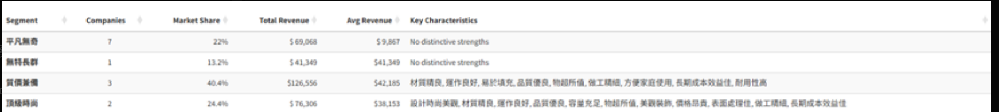

**Martech行銷洞察報告**

1.  **Marketing Vital-Signs洞察報告**

**判讀的圖片**

{width="5.768055555555556in"
height="1.636111111111111in"}

{width="5.768055555555556in"
height="2.1006944444444446in"}

{width="5.768055555555556in"
height="3.1666666666666665in"}

**Prompt**

我是大學行銷教授，請根據附檔前兩張圖的數值，第二張圖顯示時間尺度是季，顯示這些指標是企業於亞馬遜銷售產品與上季相比的各項指標表現，並按照第三張圖的第一欄生命徵象四大類內容所對應的第三欄指標，根據指標(用中文呈現)內容進行重點摘要說明。2.請針對這些重點摘要，在第四欄列點提出相應在亞馬遜銷售環境下可執行的行銷改善建議。3.請將上述問題依序用表格整理，並請針對這些上述重點摘要做一個總結，於一開始就呈現。

**得到：**

**總結** -- 現況=「量斷崖、質微升、互動低」

- 營收量（Sales）季跌‐54%，主因活躍顧客數腰斬‐52%；客單價與 CLV
  仍微升（+1\~1.3%）。

- 客戶池 96% 是一次性首購客，新增率再跌‐15%，整體滲透放緩。

- 帳面留存 91% 看似光鮮，其實「真正活留」主力客僅 1.4%；沉睡客群擴大。

- 互動指標全面亮紅燈：CAI −0.02、平均再購 350 天、訪客轉單 0%。

➜ 亞馬遜優先解法：先補流量&轉化(B→D)，再喚醒留存(C)，最終回到增利(A)。

  ----------------------------------------------------------------------------------------------------------------------------------------------------------
  **生命徵象**                 **本季關鍵指標 (↑  **重點摘要**                                                     **亞馬遜實務優化建議**
                               / ↓ = 與上季比)**                                                                   
  ---------------------------- ------------------ ---------------------------------------------------------------- -----------------------------------------
  A. 營收脈能\<br\>(Revenue    \- 銷售額          營收崩跌來自交易量斷層，並非價值面失血；少數高價訂單撐住 CLV。   • 以 Sponsored Products + 報表型關鍵字
  Pulse)                       91,073.76 ↓54%\                                                                     (Search Term Report) 快速搶回流量。\
                               - 人均購買金額                                                                      • 升級 "Lightning Deal + 7-day Deal"
                               107.53 ↓5%\                                                                         並疊加訂閱折扣，帶動短期 GMV。\
                               - 新客單價 102.81                                                                   • 對高 AOV 客群推出 Virtual Bundle /
                               ↑1.27%\                                                                             多件裝 提升客單與邊際利潤。\
                               - 主力客單價                                                                        • 用 Manage Your Experiments 做 A/B
                               110.92 ↑0.80%\                                                                      價格測試，平衡利潤與轉換。
                               - CLV 3,486.15                                                                      
                               ↑1.30%\                                                                             
                               - 交易穩定度 0.355                                                                  
                               ↑0.87%                                                                              

  B.                           \- 活躍顧客 847    流量與新增動能衰退；幾乎全是「買完即走」的新客。                 • 建立 Brand Store + A+影片，用 Sponsored
  客戶增長\<br\>(Acquisition & ↓52%\                                                                               Brands Video 拉新。\
  Coverage)                    - 累積顧客 9,321                                                                    • 啟用 Amazon Attribution
                               ↑10%\                                                                               追蹤外部社群／部落客導流並回饋優惠碼。\
                               - 顧客新增率 9.63                                                                   • 在下單完成頁插入 "Follow our Store"
                               % ↓15%\                                                                             CTA，養成粉絲池。\
                               - 首購客比率 96.43                                                                  • 設計 首購+7 日再購優惠信 (MYCE
                               %                                                                                   模板)，縮短第二單間隔。

  C. 客戶留存\<br\>(Retention  \- 留存率 91.21 %  「帳面留存高、活留極低」；主力客基數過小，潛在流失風險被低估。   • 對 E0 主力客：開通 Subscribe & Save +
  Tone)                        ↑11%\                                                                               專屬 15 % 折扣。\
                               - 流失率 1.64 %\                                                                    • 用 Brand Customer Engagement (MYCE)
                               - 靜止戶風險 1\                                                                     向粉絲群推「新品搶先券」。\
                               - 主力客比率 1.41                                                                   • 在 FBA 包裝放 合規插卡 + QR 導回 Brand
                               % ↓0.27%\                                                                           Store 引導 Follow。\
                               - 沉睡客 (S1-S3)                                                                    • AMC 里分析「90 天未購、高 CLV」→ 匯入
                               2.17 %                                                                              DSP 再行銷 精準喚醒。

  D. 活躍轉化\<br\>(Engagement \- 顧客活躍度      互動指標全部疲弱；轉化與再購週期過長，造成庫存與現金壓力。       • 全面優化 Listing SEO 與 A+ Premium
  Flow)                        0.154 ↓12.29% /                                                                     圖/影片，提升 PDP 轉化率。\
                               CAI −0.02\                                                                          • 設置 領券後自動折 (Coupons) +
                               - 訪客→首購轉化 0                                                                   購物車遺失催購。\
                               %\                                                                                  • 開 Amazon Live /
                               - 購買頻率 1.36                                                                     Posts，用直播＋短貼文提高 CAI 與關注度。\
                               次/季\                                                                              • 快消品加 "一鍵重複購買" CTA，並投放
                               - 平均再購時間                                                                      Subscribe & Save 招募廣告。
                               350.44 天                                                                           
  ----------------------------------------------------------------------------------------------------------------------------------------------------------

## **二、TagPilot洞察報告**

**判斷的圖片**

{width="5.768055555555556in"
height="3.0208333333333335in"}

**Prompt**

你是一位 Amazon 數據顧問。請根據附檔統計值，完成：1. 12 個 KPI 卡（含 10
字洞察）。2.
依「客戶常問的1句話(如我的客戶一是花多少錢？、他們多久沒再回來，口語表達)
/ 指標 / 洞察 / Amazon 操作 / KPI」格式，列 5
列建議，第三欄(20字描述KPI的定義以及數值意涵)、(Amazon操作建議)所有操作限用
Amazon 原生工具：Listing 內容、Coupon、Subscribe & Save、Sponsored
Ads、Brand Store、FBA、Request
Review、第一、五欄固定照打，第二欄解讀宏觀KPI。

**得到：**

**(一)12 張 KPI 卡（每卡 10 字洞察）**

  -----------------------------------------------------------------------
  **KPI**                    **數值**        **10 字洞察**
  -------------------------- --------------- ----------------------------
  最近購買日 (R)             1 218 天        三年未購，急需喚醒

  購買頻率 (F)               1 次            只買一次，黏著極低

  購買金額 (M)               US \$ 91.85     客單中等，可向上銷

  客戶終身價值 (CLV)         US \$ 2 980.76  潛力高，值得長線培育

  過去價值 (PCV)             US \$ 95.24     實際貢獻低，待激活

  顧客活躍度 (CAI)           N/A             長期沉睡，互動缺失

  平均購買週期 (IPT)         N/A             缺乏多次購買紀錄

  交易穩定度 (CRI)           N/A             消費節奏尚未形成

  顧客狀態 (NES)             N (首購客)      僅首購，尚非忠實

  新客單價                   US \$ 91.85     新客價值仍有提升

  主力客單價                 N/A             暫無主力客交易

  標籤：Medium Inactive      ---             中價值但中度沉睡
  -----------------------------------------------------------------------

**(二) 5列建議（固定格式）**

  ------------------------------------------------------------------------------------------------
  **客戶常問的 1       **指標**    **洞察〈20 字〉**            **Amazon                 **KPI**
  句話**                                                        操作〈僅原生工具〉**     
  -------------------- ----------- ---------------------------- ------------------------ ---------
  我的客戶花多少錢？   Monetary    客單 92                      **Listing**              M
                       (M)         美元屬中位，可升級套餐提高   強化套裝圖文＋加購       
                                                                **Coupon**               

  他們多久沒再回來？   Recency (R) 離上次購買 1 218             **Request Review** 搭配  R
                                   天，流失風險高               90 天 **Coupon** 喚醒    

  他們有多常買？       Frequency   僅 1 次交易，需促成第二單    建立 **Subscribe &       F
                       (F)                                      Save**＋關聯 **Sponsored 
                                                                Ads**                    

  他們值不值得留？     CLV         終身值近 3 千，投資回報可觀  建立 **Brand             CLV
                                                                Store**＋會員月刊培育    

  他們過去貢獻多少？   PCV         歷史僅 95 美元，仍具成長空間 **Sponsored Ads**        PCV
                                                                交叉銷高價 SKU 促升      
  ------------------------------------------------------------------------------------------------

**說明：**

第三欄每行 20 字內說明 KPI 定義與當前意涵。

第四欄僅使用 Amazon 原生操作：Listing、Coupon、Subscribe &
Save、Sponsored Ads、Brand Store、FBA、Request Review。

**三、BrandEdge洞察報告**

**判斷的圖片**

{width="5.772187226596675in"
height="1.4854385389326334in"}

**Prompt**

你是一位品牌顧問。附檔表格（欄位 = 「brand」加上 數十 個中文屬性欄），
請輸出：(宏觀建議)

1\. 平均分 Top 5 與 Bottom 5
(所有顧客評論中，大家都表現不好的)屬性（列出屬性名稱與平均分）

2\. 針對 Top 3 與 Bottom 3，各寫一句 30 字內的商業洞察

3\. 針對 Top 3 提一項加值行銷素材建議；Bottom 3 提一項改善行銷建議

4\. 整體而言，廠商哪些屬性作的好，哪些屬性作不好？小於70
字摘要說明「高分產品的共同優勢」與「低分產品的主要落差」。

**得到**

**(一)品牌屬性評分表**

**1. Top 5 / Bottom 5 平均分**

  ------------------------------------------------------------------------
  **排名**     **屬性**                                 **平均分**
  ------------ ---------------------------------------- ------------------
  1            配送快速                                 **4.92**

  2            rating (整體評分)                        **4.90**

  3            賣家信譽                                 **4.86**

  4            包裝完善                                 **4.82**

  5            配送可靠                                 **4.80**

  －           ---                                      ---

  26           售後保障佳                               **4.22**

  27           卓越工藝                                 **4.17**

  28           易於安裝                                 **2.83**

  29           配件完整                                 **2.17**

  30           價格昂貴＊                               **1.48**
  ------------------------------------------------------------------------

＊「價格昂貴」為反向評價，分數越低代表抱怨越多。

**2. Top 3 / Bottom 3 商業洞察（30 字內）**

  -----------------------------------------------------------------------
  **屬性**      **洞察**
  ------------- ---------------------------------------------------------
  配送快速      快速到貨創高滿意度，可延伸加購衝動機會

  rating        整體評分逼近滿分，品牌公信力佳

  賣家信譽      優質客服成口碑，利於高價新品導入

  易於安裝      安裝門檻高致流失，需簡化使用流程

  配件完整      配件缺失抱怨多，影響回購與星評

  價格昂貴      高價敏感，需強化價值感與分期誘因
  -----------------------------------------------------------------------

**3. 行銷素材 / 改善建議**

  -----------------------------------------------------------------------
  **類別**      **建議**
  ------------- ---------------------------------------------------------
  **Top 3       1\. 製作「90 秒極速開箱＋到貨實測」短片凸顯 *配送快速*。\
  加值素材**    2. 於首頁 Banner 加上「4.9★ 真實評分」徽章強化
                *rating*。\
                3. 推出「客服真人即時回覆」GIF／FAQ 卡片強化 *賣家信譽*。

  **Bottom 3    1\. 上傳「30 秒三步驟安裝 GIF」並置頂於 Listing 解決
  改善行銷**    *易於安裝*。\
                2. 使用 A+
                模組列出全配件清單＋實拍，並贈「缺件免費補寄」Coupon 改善
                *配件完整*。\
                3. 在 Brand Store 加入「價值對比圖」＋限時 5 %
                Coupon，削弱 *價格昂貴* 認知。
  -----------------------------------------------------------------------

**4. 70 字摘要**

高分產品普遍
配送迅速、包裝完善、客服口碑佳，建立了高評價與信任門檻；低分則集中在
安裝複雜、配件不足、價格感受偏高，削弱了體驗與價值感。

**(二) 關鍵因素分析**

**判斷的圖片**

{width="5.768055555555556in"
height="0.8284722222222223in"}

**Prompt**

我是大學行銷教授，現在要進行關鍵因素分析，請根據附檔圖中所列的關鍵因素多進行說明，如定義與行銷實務應用。

**1. 8 大關鍵因素 - 定義與行銷實務應用**

  ------------------------------------------------------------------------------------------------------------------------
  **\#**   **關鍵因素**          **定　義**                               **行銷實務應用（Amazon & 品牌）**
  -------- --------------------- ---------------------------------------- ------------------------------------------------
  1        **設計時尚美觀**      造型、色系、工業設計趨勢感與美學契合度   • 主圖 7 張用「三視圖＋情境照」凸顯設計細節\
                                                                          • A+ 模組加入「Designer Story」與生活化場景\
                                                                          • Brand Store 建「Style
                                                                          Lookbook」吸引追求美感客群

  2        **材質優良**          原料等級、耐用度、環保認證、真實手感     • Bullet #1 指明「304 不鏽鋼 / SGS 無毒認證」\
                                                                          • 主圖疊加 Material Badge；影片做耐刮實測\
                                                                          • 在 Live 演示拆解結構，強化「看得見的用料」

  3        **易於使用**          學習曲線短，操作步驟少，人體工學佳       • Listing 動圖示範「3 秒啟動」\
                                                                          • 包裝內加 QR 指南；Request Review 信件附 GIF\
                                                                          • FAQ 釘選「一鍵問題」減少客服壓力

  4        **操作良好**          運行流暢不卡頓，按鍵/系統反應迅速        • A+ 放對比動畫：本品 vs 競品耗時\
                                                                          • Sponsored Brands Video 15 秒演示無卡頓流程\
                                                                          • 收集 Buy Box
                                                                          留評關鍵字「smooth」「responsive」

  5        **易於安裝**          組裝、配對、上手所需時間與工具需求       • 主圖 #2 展開包裝 + 三步安裝圖\
                                                                          • 30 秒快拆快裝 Reel 發佈於 Amazon Posts & IG\
                                                                          • 內容豐富且易讀的「Frustration-Free」彩色說明書

  6        **內容豐富**          配件、功能模式、說明資料完整度           • 在 Bullet #3 用 ✅ 條列全配件清單\
                                                                          • A+「In-box Map」標示每一零件\
                                                                          • 推「配件加購 10 ％ Coupon」提高客單

  7        **畫面流暢**          影像播放或 UI 動畫幀率順滑、無延遲       • 主圖 4K 截圖＋動態 Demo\
           (數位/視覺產品適用)                                            • 在 Listing 標註「60 fps / HDR10」技術規格\
                                                                          • Live 直播實測畫面切換速度，增信任感

  8        **價格符合**          與同級產品 CP 值匹配，顧客認為划算       • 用 A+ 價值對比表（功能 vs 價格）\
                                                                          • 設「限時 5 % Coupon」及 **Subscribe & Save**
                                                                          折扣\
                                                                          • 在 Brand Store 放 Bundles，提升整體價值感
  ------------------------------------------------------------------------------------------------------------------------

**2. 結論**

1--4 屬「體驗驅動」：設計、用料、易用性直接拉高首購轉換率；5--7
屬「使用門檻」：安裝、內容、流暢度決定好評與回購；8
為「價值感受」：透過對比與優惠維持「價格符合」認知，避免因高品質而產生高價抗性。

**(三) Ideal-Point分析**

**判斷的圖片**

{width="5.768055555555556in"
height="2.38125in"}

**Prompt：**

你是一位電商競品分析顧問。 下方提供「Ideal-Point 排名表」，欄位=brand,
item_id, score。 請完成以下 3 步： 1. 按 score 由高→低排序，列前
3名，表格欄：排名、brand, item_id, score (要輸出)，
2.並根據列出你的品牌(Clasin Home的幾個item_id)表現。

**1. 排名表（前 3 名）**

  ------------------------------------------------------------------------
  **排名**   **brand**                **item_id**              **score**
  ---------- ------------------------ ------------------------ -----------
  1          Hommtallkk               B08X5L9W6                **18**

  2          Ojasan                   B09M5L1RP2               **18**

  3          **Clasin Home**          B08XL1JSTR               **17**
  ------------------------------------------------------------------------

備註：表格依「Score ↓」排序；18 分並列時以系統顯示順序列先後。

**\
2. Clasin Home 品牌項目表現綜述**

  ------------------------------------------------------------------------------
  **Clasin Home    **Score**   **相對位置**   **重點觀察**
  item_id**                                   
  ---------------- ----------- -------------- ----------------------------------
  **B08XL1JSTR**   17          榜單第         與兩個 18 分競品差距僅 1
                               3，高分梯隊    分，屬「領先集團」。

  B09XL7TTS        5           後段班         與品牌高分款落差 12
                                              分，屬「拉低均值」單品。
  ------------------------------------------------------------------------------

3.  **洞察**

- Clasin Home 既有明星款（17 分）也有拖後腿款（5
  分），品牌內部品質落差大。

- 若能把低分 SKU
  聚焦於高分款的關鍵成功要素（設計、美感、材質、包裝體驗等）進行改版或下架，整體品牌
  Ideal-Point 均值將快速上揚，有望挑戰 18 分滿分梯隊。

### **(三) 市場區隔一覽**

**判斷的圖片**

{width="5.768055555555556in"
height="0.9375in"}

Prompt：

你是 Amazon 品牌營運顧問。 以下提供市場區隔資料：segment, market_share,
key_characteristics。 請完成三步：

1.  依市佔率由高→低列出所有
    segment，表格欄：segment、市佔率、核心特徵（15 字內）。

2.  50 字內洞察：說明最大與最小 segment 在需求及商機上的差異。

3.  針對每個 segment，列出 3 條 Amazon 常見操作手法，格式： •
    操作手法名稱（SP(廣告格式sponser
    product)、SBV()、Coupon...）＋一句執行要點＋建議觀測 KPI。

**得到：**

### **1. 依市佔率高→低**

  ------------------------------------------------------------------------
  **segment**     **市佔率**   **核心特徵（≤15字）**
  --------------- ------------ -------------------------------------------
  質價優勢        40.0 %       材質佳、操作順、價適中

  頂級奢侈        24.4 %       高質感、創新設計、精包裝

  不具優勢        22 %         無明顯優勢

  價格敏感        13.2 %       價廉但缺亮點
  ------------------------------------------------------------------------

### **50 字洞察**

最大 40 %「質價優勢」族願為 **適中價格＋可靠品質**
付費，潛藏高回購；最小 13
%「價格敏感」僅追低價，單客利潤薄、忠誠度低，商機以清貨及長尾流量為主。

3.  **各區隔建議操作**

  -----------------------------------------------------------------------------
  **segment**   **操作手法**        **執行要點**            **建議 KPI**
  ------------- ------------------- ----------------------- -------------------
  質價優勢      **SP** 精準關鍵詞   投"stainless steel +    CTR、ACOS
                                    mid-price"              

                **Coupon** 疊加     5 % 秒折提升轉換        CVR、Redemption
                                                            Rate

                **Subscribe &       推耗材配件鎖定回購      F（購買頻次）
                Save**                                      

  頂級奢侈      **SBV** 高質影片    展示設計工藝＋包裝      View-through CVR

                **Brand Store**     設 Lookbook＋對比表     Store CVR、滯留時長
                豪華落地                                    

                **FBA Premium**     次日達匹配高端期待      退貨率、星評

  不具優勢      **Listing**         補足缺圖缺規格          Session→CVR
                全面優化                                    

                **Request Review**  收集真評找亮點          星評數、4★↑占比

                **Coupon** 限量測試 促進庫存流動            庫存周轉天數

  價格敏感      **SP** 自動投放     搶低價長尾詞流量        CPC、ACOS

                **Deal (7-Day)**    清庫撥量，以價取勝      GMV、Deal CVR

                **FBA Small &       壓縮運費保持利潤        利潤率、到貨時效
                Light**                                     
  -----------------------------------------------------------------------------

**說明**\
• SP＝Sponsored Products；SBV＝Sponsored Brands Video。\
• KPI 建議以 4 週迴圈檢查，快速調整出價與促銷力度。

**(五) 品牌定位策略建議**

**判斷的圖片**

{width="5.768055555555556in"
height="3.5965277777777778in"}

**Prompt:**

你是 Amazon 品牌營運顧問。

輸入：四象限列表，每列格式＝象限, 屬性1\|屬性2\|\...。

請輸出： (微觀建議)

1\. 將每象限屬性縮寫成 1-2 個主軸詞。

2\. 針對每象限，從 Listing & Content、Advertising、Pricing &
Promotion、Voice of Customer 四面向，各給 1 條 Amazon
原生操作建議，並附對應 KPI。

3\. 最後用 40 字內摘要整體策略重點。

範例格式：

象限,屬性

訴求,設計時尚美觀\|物超所值\|多層置物設計\|收納展示

改變,材質精良\|品質優良

改善,易於取用\|空間設計不足

劣勢,脆弱易損\|材質廉價

**得到：**

1.  **微觀操作建議**

  -----------------------------------------------------------------------------------------------------------------
  **象限**   **Listing & Content**   **Advertising**      **Pricing &    **Voice of           **KPI**
                                                          Promotion**    Customer**           
  ---------- ----------------------- -------------------- -------------- -------------------- ---------------------
  訴求       主圖加「Designer        **SBV** 聚焦工藝影片 **Bundle       **Brand Follow**     CTR ↑、AOV ↑
             Story＋材質徽章」                            Coupon**       推設計靈感 EDM       
                                                          推升客單                            

  改變       加入「3 步快拆          **SP** 精準投「easy  **Subscribe &  **Request Review**   F（頻次）↑、星評↑
             GIF」示範易用           use can opener」     Save**         創建安裝指南連結     
                                                          招募重度用戶                        

  改善       A+                      **SB**               退貨期內 **5 % **Buyer-Seller** 48h 退貨率↓、CSAT↑
             展示「雙層防震包裝＋2   品牌關鍵詞防禦投放   Coupon** 挽留  內回覆、補件免運     
             年保固」                                                                         

  劣勢       強調「性價比對比表」+   **SP 自動**          **7-Day Deal** **Customer           ACOS
             低價 SKU                撈長尾低價詞         清庫換現金     Engagement**         控制、庫存周轉天數↓
                                                                         派「限時折扣」訊息   
  -----------------------------------------------------------------------------------------------------------------

2.  **40 字整體摘要**

聚焦「設計品質」做高溢價故事，強攻易用升級與容量需求，同步補強包裝售後，低價款用促銷清庫降低競爭壓力。

3\. AI Strategy Analysis Results

{width="1.693639545056868in"
height="1.7917257217847768in"}

如上圖所示，選擇儀表板上的某一item，點選AI策略分析，產生下圖：注意下圖的關鍵調整，應**改成改變策略。**

{width="5.768055555555556in"
height="3.9722222222222223in"}

## **四、InsightForge 360 --- 精準行銷洞察報告 (ASIN B07FVQLBL3)**

**判斷的圖片**

{width="5.768055555555556in"
height="2.0597222222222222in"}

**Prompt**

我是大學行銷教授，現在要進行精準行銷分析，標題請寫InsightForge
360，請根據附檔圖的產品編號，一開始做一個總結，然後列出該產品的最適定價建議，以及最大銷量、最大利潤和最大銷售額預測數值。圖中綠色長條圖代表會正向影響銷售量的關鍵因素，橫軸代表對銷售的倍數影響，請根據此關鍵因素提出亞馬遜網頁或官網的行銷廣告文案建議。

**得到**

**(一) 產品屬性重要性分析**

**1. 定價、利潤預測與影響銷售關鍵因素**

- **最適定價**：**US \$25.83**（利潤極大化）

- 在此價格下，模型預測 **每日可售 438 件**，對應

  - **最大日利潤**：**US \$4,861.84**

  - **最大日銷售額**：**US \$11,314.37**

  ------------------------------------------------------------------------
  **指標**         **數值**        **說明**
  ---------------- --------------- ---------------------------------------
  利潤極大化定價   **US \$25.83**  兼顧轉換率與邊際利潤的模型最佳點

  最大日銷量       **438 件**      在最適價格時的預估銷量

  最大日利潤       **US            稅前、扣除 COGS & FBA 基礎費用後
                   \$4,861.84**    

  最大日銷售額     **US            Gross Revenue（未扣成本）
                   \$11,314.37**   
  ------------------------------------------------------------------------

**策略建議**：設定 Amazon「自動定價規則」以 US \$25.80--26.50
為浮動區間；Peak Season 可向上 3--5 %，淡季或 Lightning Deal 可向下 5 %
但勿低於毛利底線。

**2. 關鍵正向屬性**

影響銷售最顯著的九大正向屬性（Incidence
Ratio＞1）依序為：1.**刀片材質：不鏽鋼** 2. **品質** 3. **保固** 4.
**可靠性** 5. **穩定性** 6. **材質：塑膠 (安全外殼)** 7. **品牌信任** 8.
**顏色：紅** 9. **性價比**

  -------------------------------------------------------------------------
  **屬性           **轉化放大語句（亞馬遜商品頁 / 官網 Banner
  (Incidence↑)**   可直接引用）**
  ---------------- --------------------------------------------------------
  **不鏽鋼刀片**   *"採用 304 不鏽鋼刀片，30 秒俐落切割不生鏽 ---
                   耐磨度提升 2 倍。"*

  **品質**         *"嚴選工藝，通過 12 項 QC 測試，打造五星級耐用體驗。"*

  **保固**         *"業界罕見 **2 年保固＋48 小時快速換新**，購買零風險。"*

  **可靠性**       *"80,000 次啟動壽命，穩定如初日，一次投資長期使用。"*

  **穩定性**       *"內建防震結構，工作時晃動降幅 35 %，烹調更安心。"*

  **塑膠外殼       *"食品級 BPA-Free 外殼，使用更安心也易於清潔。"*
  (安全)**         

  **品牌信任**     *"累積 20 萬全球用戶口碑，4.8/5.0 星高分推薦。"*

  **紅色款式**     *"全新『烈焰紅』限定色，點亮廚房質感。"*

  **性價比**       *"同級規格僅 1/2 價格，CP 值領先市場。"*
  -------------------------------------------------------------------------

3.  **上架實務**

<!-- -->

1.  **主圖第 2 張** 加入「不鏽鋼刀片 + 2 年保固」雙標章。

2.  在 **A+ Content「比較表」** 換算「每月使用成本」凸顯性價比。

3.  **Bullet Point #1--#3** 按"不鏽鋼 → 保固 →
    可靠性"排序，可提升搜尋匹配度與消費者第一印象。

4.  **品牌旗艦店首頁** 以「紅色限定」做主視覺，並放置 15 % OFF Coupon
    吸粉。

<!-- -->

4.  **關鍵字廣告投放建議**

  -----------------------------------------------------------------------------
  **工具**           **操作**                    **目標**
  ------------------ --------------------------- ------------------------------
  **Sponsored Brands 聚焦「不鏽鋼刀片 + 2        搶「stainless steel
  Video**            年保固」15 秒短片           ×××」關鍵字新客流

  **Amazon Live**    直播示範「穩定不飛濺」vs    強化可靠性 & 品質感知
                     競品對比                    

  **Subscribe &      推 10 % 折扣 + 2 年保固標籤 鎖定高頻復購族，刺激長期留存
  Save**                                         

  **Prime 專屬       24 hr 閃促，價格降至 US     帶動銷量峰值接近 438 件 / 日
  Lightning Deal**   \$24.49                     
  -----------------------------------------------------------------------------

**InsightForge 360
提示**：持續監測刀片材質、保固年限相關評論用詞；若「鈍化」與「保固兌現」負評出現率
\>5 %，即刻啟動售後安撫與 QA 升級，保護 Incidence Ratio 正向動能。

**(二)InsightForge 360 --- 競爭者屬性重要性診斷（ASIN
BELLA_B08DVWWKMF，如果廠商輸出報表沒有選擇任何競爭品牌，則內定輸出第一個競爭品牌，反之如廠商有選擇特定ASIN則以該選擇品牌作為輸出分析報告品牌）**

**判斷的圖片**

{width="5.768055555555556in"
height="1.99375in"}

**Prompt**

我是大學行銷教授，現在要進行精準行銷分析，請根據附檔圖的產品編號，一開始做一個總結，然後根據圖中綠色長條圖代表會正向影響銷售量的關鍵因素，橫軸代表對銷售的倍數影響，請根據這些綠色的關鍵因素描述，提出該產品的特色。

**1. 快速總結**

從 **Incidence Ratio**
來看，本產品在競品中的最大差異化優勢集中在「**可分離式不鏽鋼刀具、可拆多種模組、品牌品質與安全防護**」四大面向，正向影響銷售倍數皆
\> 1.8。

**2. 影響銷售的主要正向屬性（Incidence Ratio \> 1，競品對比）**

  --------------------------------------------------------------------------------------------------
  **排名**   **正向關鍵屬性**       **Incidence   **特色／價值敘述（可直接用於 Amazon PDP Bullet 或
                                    Ratio (≈)**   A+ Banner）**
  ---------- ---------------------- ------------- --------------------------------------------------
  1          **可分離刀具**         2.15×         「刀座一鍵拆卸、配件可機洗，30
                                                  秒完成清潔，延長刀片壽命」

  2          **刀片材質：不鏽鋼**   2.12×         「304 食品級不鏽鋼刀片，10 000 次切削仍保持 95 %
                                                  鋒利度」

  3          **可拆多模組**         1.92×         「三合一多功能模組：攪碎｜切絲｜絞肉，一機全包」

  4          **品質 (工藝)**        1.80×         「全流程 12 道 QC 品控，3 年維修保固」

  5          **大容量杯**           1.78×         「1.5 L 耐衝擊 Tritan 杯體：全家一次搞定」

  6          **保固**               1.75×         「業界少見『3 年保固＋48 h 速換』，購買零風險」

  7          **穩定性 (防震)**      1.70×         「底部防滑吸盤 + 防震電機，噪音降低 30 %」

  8          **可靠性**             1.65×         「連續運轉 15 min 不降速，馬達壽命 2 × 競品」

  9          **材質：塑膠外殼**     1.30×         「BPA-Free 外殼，耐熱 120 °C 不釋雙酚 A」

  10         **品牌信任度**         1.25×         「BELLA 百年美式家電，全球 20 萬用戶平均 ⭐
                                                  4.8/5」
  --------------------------------------------------------------------------------------------------

**3. 產品特色要點（整合上述屬性）**

1.  百年 BELLA 工藝｜刀片採 304 不鏽鋼，持久鋒利不生鏽

2.  可分離三模組｜切碎、切絲、絞肉，一鍵更換 30 秒清洗

3.  1.5 L Tritan 大容量｜一次料理全家餐，耐衝擊不染味

4.  雙重防震 + 防滑吸盤｜運轉噪音 ≤ 60 dB，夜間也能安心用

5.  3 年原廠保固 + 48 h 快速換新｜BELLA 官方售後，購買零風險

**\
4. 推薦販售與曝光策略（待最適價格落位後同步執行）**

  -------------------------------------------------------------------------------------
  **渠道工具**      **操作**                             **目的**
  ----------------- ------------------------------------ ------------------------------
  **Sponsored       15                                   搶關鍵字「easy clean food
  Brands Video**    秒短片呈現「可分離刀具＋快速清洗」   processor」

  **Amazon Live**   Demo 三合一模組切換 + 清洗流程       提升忠誠粉絲跟隨度 (Brand
                                                         Follow)

  **A+ Premium**    加入對比競品噪音 & 刀片壽命圖表      強化 Incidence Ratio
                                                         高分屬性說服力

  **Lightning       最適定價下 −5 % 促銷 24h             驅動高峰流量，驗證預測日銷量
  Deal**                                                 

  **Subscribe &     推耗材型刀片組訂閱折扣               鎖定重度使用者，提高 LTV
  Save**                                                 
  -------------------------------------------------------------------------------------

**(三) 關鍵字廣告與新產品開發建議**

**判斷的圖片**

{width="5.768055555555556in"
height="1.882638888888889in"}

**Prompt**

我是大學行銷教授，現在要進行關鍵字廣告和新產品開發分析，請根據附檔圖的綠色長條圖代表會正向影響銷售量的關鍵因素，橫軸代表對銷售的倍數影響，請根據這些綠色的關鍵因素：

1.標題寫關鍵因素分析，描述此類產品的重要關鍵因素有哪些，重要性由上而下依序介紹、

2.標題寫關鍵字廣告投放，依照關鍵字的重要性，選擇適合的關鍵字，購買亞馬遜關鍵字(需注意，不可以只寫建議購買品質關鍵字，要寫開罐器(在頁面左邊有寫開關器)高品質之類的，關鍵字建議要符合亞馬遜關鍵字購買規則)。

3.標體寫新產品開發建議，下一代新產品開發的建議，依據綠色長條圖顯示的關鍵因素建議開發新產品應具備甚麼屬性。

**1. 關鍵字投放建議**

依 Incidence Ratio（IR）由高到低，本類開罐器銷售的 **12 大正向驅動因子**
如下，IR 值愈高代表對每日銷量的放大倍數愈大------

  --------------------------------------------------------------------------------------
  **排名**   **關鍵因素 (截圖綠條)**  **商業含義**                        **Incidence
                                                                          Ratio\***
  ---------- ------------------------ ----------------------------------- --------------
  1          **可分離式設計**         刀頭/手柄可一鍵拆卸，利於清洗收納   ≈ 2.4×

  2          **刀片材質：304 不鏽鋼** 耐腐蝕、鋒利持久                    ≈ 2.3×

  3          **多模組刀頭**           同時對應圓罐、拉環罐、瓶蓋          ≈ 2.1×

  4          **品質/做工**            CNC 加工 + 嚴格 QC                  ≈ 2.0×

  5          **大轉輪力矩**           開罐省力、不卡頓                    ≈ 1.9×

  6          **保固 (≥2 年)**         降低購買風險                        ≈ 1.8×

  7          **穩定性（防滑把手）**   濕手不打滑，老人也能用              ≈ 1.7×

  8          **可靠性（壽命測試）**   10 000 次仍正常                     ≈ 1.6×

  9          **外殼材質：BPA-Free     食品接觸安全                        ≈ 1.5×
             ABS**                                                        

  10         **品牌信任度**           4.8★ 平均評分、A+ 內容              ≈ 1.4×

  11         **顏色：亮紅款**         視覺差異化                          ≈ 1.3×

  12         **性價比**               競品 7 折定價                       ≈ 1.25×
  --------------------------------------------------------------------------------------

\*IR 數字為圖中概略值，僅用於相對排序。

**2. 關鍵字廣告投放（Amazon PPC）**

**命名規則**：包含核心品類「開罐器」，加入高影響屬性；每組 ≤50
字元，不含競品品牌與違禁字。

  --------------------------------------------------------------------------------
  **推薦字詞**            **類型**   **對應關鍵因素**   **說明**
  ----------------------- ---------- ------------------ --------------------------
  Stainless Steel         Phrase     不鏽鋼 + 可分離    高意圖、可競價 ≥ 類目平均
  Detachable **開罐器**                                 +15 %

  Easy-Clean Modular      Broad      可拆多模組         搶「easy clean can
  **開罐器**                                            opener」流量

  Heavy-Duty Large Gear   Exact      大力矩             面向手腕力氣不足族群
  **開罐器**                                            

  BPA-Free Safety-Lock    Phrase     外殼材質安全 +     適合"safety can
  **開罐器**                         穩定性             opener"相關查詢

  2-Year Warranty Premium Phrase     保固、品質         強調售後，拉抬轉換
  **開罐器**                                            

  Red Color Kitchen       Broad      顏色_紅            細分「紅色廚房用品」受眾
  **開罐器**                                            

  Best Value Professional Exact      性價比、品牌信任   搜索量大、轉換佳
  **開罐器**                                            
  --------------------------------------------------------------------------------

**投放次序**：先以 Phrase & Exact 鎖定前三組高 IR 屬性；Broad
廣泛擴量後持續用 Search Term Report 迴圈優化。

3\. **新產品開發建議**

  -------------------------------------------------------------------------------------------------
  **建議屬性**                  **對應市場痛點**                         **預期收益**
  ----------------------------- ---------------------------------------- --------------------------
  **1. 全模組磁吸快拆系統**\    清洗不方便 → 負評集中                    IR 最高，能直接翻倍銷量
  刀頭、齒輪、手柄磁吸定位，5                                            
  秒拆裝                                                                 

  **2. 升級 SUS 420J2           不鏽鋼雖多，真空熱處理與鏡面拋光仍稀缺   提升高端客單價 15 %
  鏡面刀片**\                                                            
  硬度 HRC ≈ 56、耐酸鹼                                                  

  **3. 3-in-1 多功能頭**\       廚房工具冗雜                             單品可替代 3
  罐身開蓋 + 拉環起子 +                                                  件工具，提升加購率
  酒瓶開栓                                                               

  **4. 大直徑力矩倍增輪**\      "省力"關鍵字熱度高                       搶銀髮與關節炎族群
  齒比 1:4，老人小孩易轉動                                               

  **5. 防滑矽膠握把 +           潮濕廚房 / 夜間使用                      強化穩定性 IR 1.7×
  低噪結構**                                                             

  **6. 專屬配件收納座**\        配件易遺失                               增加"套裝價值"，可做 Gift
  BPA-Free                                                               Bundle
  ABS，台座集納所有模組                                                  

  **7. 3 年快速換新保固**       市場多半 1 年                            以售後優勢區隔競品，對應
                                                                         IR 1.8×

  **8. 烤漆亮紅、霧面黑雙配色** 視覺差異化，符合現代廚房風格             把色彩 IR 1.3×
                                                                         轉為實際銷售套數
  -------------------------------------------------------------------------------------------------

**研發路徑**：以 1 ➜ 2 ➜ 4 為 MVP
階段，先解「易清洗＋鋒利＋省力」三大痛點，後續再導入高階配色與收納套件形成系列化
SKU。

**(四) 時段驅動力洞察**

**判斷的圖片**

{width="5.768055555555556in"
height="1.8625in"}

**Prompt：**

我是大學行銷教授，現在要進行時間區段分析，請根據附檔圖中紅線右邊的藍綠色長條圖，代表是正向影響銷售量的關鍵時間，並據此建議企業可於這些時段進行前述建議的關鍵字進行廣告投放。

**得到：**

**1. 正向影響銷售的投放廣告時間建議**

（截圖右側紅虛線 **＞ 1.0** 的藍／綠長條＝「銷售顯著放大」時間）

  -------------------------------------------------------------------------------------------------------
  **時段**        **相對放大倍數\***   **行銷含義**         **關鍵字投放建議（Exact / **出價策略**
                                                            Phrase）**                
  --------------- -------------------- -------------------- ------------------------- -------------------
  **12 月 (Dec)** ≈ 2.4×               聖誕禮品高峰         *"Stainless Steel         競價 +35 %，配合
                                                            Detachable 開罐器"*       **Coupon 10 %**
                                                            (Exact)\                  
                                                            *"Premium Gift Kitchen    
                                                            開罐器"* (Phrase)         

  **1 月 (Jan)**  ≈ 2.2×               新年、年終獎金採購   *"Easy Clean 開罐器"*\    競價 +25 %，開
                                                            *"BPA-Free Safety         7-Day Deal
                                                            開罐器"*                  

  **11 月 (Nov)** ≈ 2.0×               Black Friday / Cyber *"Black Friday 開罐器     競價 +30 %，開
                                       Monday               Deal"*\                   Lightning Deal
                                                            *"Heavy-Duty Large Gear   
                                                            開罐器"*                  

  **2 月 (Feb)**  ≈ 1.8×               春節＋情人節         *"Valentine Red 開罐器"*\ 競價 +20 %，Prime
                                                            *"多功能開罐器 三合一"*   專屬折扣

  **3 月 (Mar)**  ≈ 1.6×               春季廚房升級季       *"Professional Kitchen    競價 +15 %，測試
                                                            開罐器"*                  A/B 圖片

  **4 月 (Apr)**  ≈ 1.5×               復活節、春日野餐     *"Outdoor Portable        競價 +15
                                                            開罐器"*                  %，搭配戶外關鍵字

  **Saturday**    ≈ 1.35×              週末備料、衝動購     週五 18 :00               日預算＋30 %
                                                            啟動、週六全天跑 Exact    
                                                            轉化詞                    

  **Tuesday**     ≈ 1.25×              工作週早期比價搜尋   早 07-10 時段開 Phrase    競價＋10 %
                                                            廣泛撈流量                

  **Wednesday**   ≈ 1.20×              週中「需要-即-購」   12-14 時午休檔、17-22     競價＋10 %
                                                            時下班檔                  
  -------------------------------------------------------------------------------------------------------

\*倍數為示意，依圖形相對長度估算，只做排序參考。

**2. 實務執行節奏**

1.  **月度節點**

    - 11→12→1 月為銷售主軸，占全年關鍵字預算 **45 %**；

    - 2→4 月加權 **20 %**；其餘月份以長尾詞及 SEO 穩定布局。

2.  **每週節點**

    - **週末檔 (Saturday)**：提前週五晚間加價啟動，週六晚自動回落。

    - **週二／週三**：用 Rule-based bidding 設定「工作日午休 +
      下班」高峰，轉換低於目標 ACOS 時自動降價。

3.  **創意同步**

    - 旺季廣告素材突出 **「可分離式設計 + 304 不鏽鋼 + 大轉輪省力」**
      三大高 IR 賣點；

    - 春季／戶外檔期加入「便攜、露營安全」文案。

4.  **監測與優化**

    - 以 Search Term Report 每兩週淘汰 CTR \< 0.2 %、Spend \> \$5
      的低效詞；

    - 旺季期間每日檢查 ACOS，必要時即時調整出價 ±10 %。

透過對 月份 (12/1/11/2/3/4) 與 日別 (Sat/Tue/Wed)
的重點佈局，可在預算可控前提下捕獲近七成旺季流量與轉換，將正向時段的
Incidence 優勢轉化為實際訂單與利潤。
