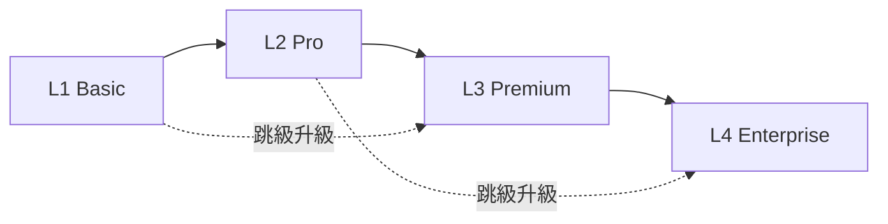

# AI MarTech 產品層級總覽

## 產品定位

| 版本 | 目標客群 | 核心價值 |
|------|----------|----------|
| **L1 Basic** | 小型企業、初學者 | 簡單易用、快速上手 |
| **L2 Pro** | 中型企業、專業團隊 | AI 驅動、深度分析 |
| **L3 Premium** | 成長企業、進階需求 | 高級功能、專業服務 |
| **L4 Enterprise** | 大型企業、跨國組織 | 完整平台、無限擴展 |

## 功能比較表

| 功能類別 | L1 Basic | L2 Pro | L3 Premium | L4 Enterprise |
|----------|----------|--------|--------------|
| **資料處理** |
| CSV 上傳 | ✅ | ✅ | ✅ | ✅ |
| Excel/JSON 支援 | ❌ | ✅ | ✅ | ✅ |
| 即時串流 | ❌ | ❌ | ✅ | ✅ |
| 資料量限制 | 10K | 1M | 10M | 無限 |
| **分析功能** |
| 基礎統計 | ✅ | ✅ | ✅ | ✅ |
| AI 評分 | ❌ | ✅ | ✅ | ✅ |
| Poisson 迴歸 | ❌ | ❌ | ✅ | ✅ |
| Survival Analysis | ❌ | ❌ | ✅ | ✅ |
| 自訂 ML 模型 | ❌ | ❌ | 基本 | ✅ |
| **協作與管理** |
| 使用者數量 | 1 | 10 | 50 | 無限 |
| 權限管理 | ❌ | ✅ | ✅ | ✅ (RBAC) |
| SSO 整合 | ❌ | ❌ | ❌ | ✅ |
| **整合能力** |
| API 存取 | ❌ | 有限 | 標準 | 完整 |
| 第三方整合 | ❌ | 基本 | 標準 | 進階 |
| 客製化開發 | ❌ | ❌ | 有限 | ✅ |
| **支援服務** |
| 技術支援 | 社群 | 工作時間 | 優先支援 | 24/7 |
| 培訓 | 線上文件 | 線上課程 | 專業培訓 | 客製化培訓 |
| 顧問服務 | ❌ | ❌ | 基本 | ✅ |

## 應用案例

### L1 Basic - 基礎應用
- 電商賣家分析客戶評論
- 小型品牌追蹤市場反饋
- 行銷新手學習數據分析

### L2 Pro - 專業應用
- 品牌經理分析多渠道數據
- 行銷團隊優化廣告投放
- 產品團隊洞察用戶需求

### L3 Premium - 進階應用
- 成長企業多部門數據整合
- 中型零售連鏈智能分析
- 專業服務業客戶洞察

### L4 Enterprise - 企業應用
- 跨國企業整合全球數據
- 金融業客戶風險分析
- 零售業供應鏈優化

## 遷移路徑

- **L1 Basic → L2 Pro**：資料量成長、需要 AI 分析時
- **L2 Pro → L3 Premium**：需要進階功能、多使用者管理時
- **L3 Premium → L4 Enterprise**：需要無限擴展、完整自定義時
- **L1 Basic → L3 Premium**：快速成長企業的直接升級
- **L2 Pro → L4 Enterprise**：跨國企業的直接升級

## 定價策略（建議）

| 版本 | 定價模式 | 參考價格 |
|------|----------|----------|
| L1 Basic | 月訂閱 | $99/月 |
| L2 Pro | 年訂閱 | $999/月 |
| L3 Premium | 年訂閱 | $2999/月 |
| L4 Enterprise | 客製報價 | 聯繫銷售 |

## 技術架構

- **L1 Basic**：單機部署、SQLite 資料庫
- **L2 Pro**：雲端部署、PostgreSQL 資料庫
- **L3 Premium**：雲端集群、PostgreSQL + Redis
- **L4 Enterprise**：分散式架構、多資料庫支援

## 下一步

1. 選擇適合的版本開始開發
2. 建立共用元件庫（在 global_scripts 中）
3. 實作版本間的功能差異
4. 設計升級流程 