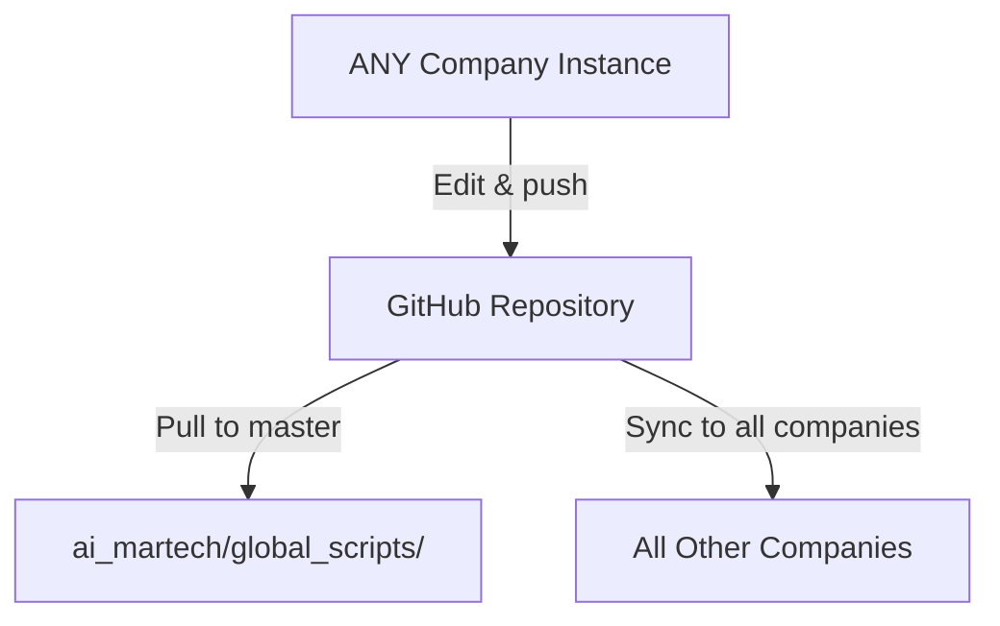

# Git Subrepo Architecture: Company-Agnostic Pattern

**Document Purpose**: Universal architecture pattern for ANY company project in ai_martech
**Date**: 2025-10-03
**Status**: COMPANY-AGNOSTIC DESIGN PATTERN
**Supersedes**: ARCHITECTURE_GIT_SUBREPO_CORRECTED.md (MAMBA-centric version)

---

## 🎯 Critical Clarification

### MAMBA is Just ONE Example Company

**Previous Documentation Issue**: Made it appear MAMBA-specific
**Corrected Understanding**: This pattern applies to **ALL companies** across **ALL tiers**

### Company Name is a VARIABLE

The pattern `{tier}/{company}/scripts/global_scripts/00_principles/` applies to:

| Tier | Company Examples (Not Exhaustive) |
|------|-----------------------------------|
| **l1_basic** | VitalSigns, InsightForge, BrandEdge, TagPilot, positioning_app, latex_test |
| **l2_pro** | {any_company_name} |
| **l3_premium** | VitalSigns_premium, BrandEdge_premium, InsightForge_premium |
| **l4_enterprise** | MAMBA, WISER, QEF_DESIGN, kitchenMAMA, {future_companies} |

**Key Point**: `{company}` is a **placeholder variable**, not a fixed value.

---

## 📂 Universal Directory Hierarchy

### Correct Mental Model

```
projects/ai_martech/                              # Project root
├── global_scripts/00_principles/                 # ✅ MASTER SOURCE (shared core)
│   └── .git/                                     # Full git repository
│       └── Remote: github.com/kiki830621/ai_martech_global_scripts.git
│
├── l1_basic/                                     # Tier 1 (all companies)
│   ├── {company_A}/scripts/global_scripts/00_principles/
│   ├── {company_B}/scripts/global_scripts/00_principles/
│   ├── {company_C}/scripts/global_scripts/00_principles/
│   └── ...
│
├── l2_pro/                                       # Tier 2 (all companies)
│   ├── {company_D}/scripts/global_scripts/00_principles/
│   └── ...
│
├── l3_premium/                                   # Tier 3 (all companies)
│   ├── {company_E}/scripts/global_scripts/00_principles/
│   └── ...
│
└── l4_enterprise/                                # Tier 4 (all companies)
    ├── {company_F}/scripts/global_scripts/00_principles/
    ├── {company_G}/scripts/global_scripts/00_principles/
    └── ...
```

### Real-World Examples (Current Implementation)

```
ai_martech/
├── global_scripts/00_principles/                 # Master source
│
├── l1_basic/
│   ├── VitalSigns/scripts/global_scripts/00_principles/        # Example 1
│   ├── InsightForge/scripts/global_scripts/00_principles/      # Example 2
│   ├── BrandEdge/scripts/global_scripts/00_principles/         # Example 3
│   ├── TagPilot/scripts/global_scripts/00_principles/          # Example 4
│   ├── positioning_app/scripts/global_scripts/00_principles/   # Example 5
│   └── latex_test/scripts/global_scripts/00_principles/        # Example 6
│
├── l3_premium/
│   ├── VitalSigns_premium/scripts/global_scripts/00_principles/
│   ├── BrandEdge_premium/scripts/global_scripts/00_principles/
│   └── InsightForge_premium/scripts/global_scripts/00_principles/
│
└── l4_enterprise/
    ├── MAMBA/scripts/global_scripts/00_principles/             # Example A
    ├── WISER/scripts/global_scripts/00_principles/             # Example B
    ├── QEF_DESIGN/scripts/global_scripts/00_principles/        # Example C
    └── kitchenMAMA/scripts/global_scripts/00_principles/       # Example D
```

**Pattern Recognition**:
- ANY company in ANY tier can have this structure
- MAMBA/WISER/kitchenMAMA are no different from VitalSigns/InsightForge
- The pattern is **tier-agnostic** and **company-agnostic**

---

## 🔍 Three-Tier Repository Hierarchy (Universal)

```
┌─────────────────────────────────────────────────────────────┐
│  Level 1: GitHub Repository (Single Source of Truth)        │
│  github.com/kiki830621/ai_martech_global_scripts            │
│  - Contains: 257+ principles (MP, P, R)                     │
│  - Branch: main                                              │
└─────────────────────────────────────────────────────────────┘
                    ↑ push              ↓ pull
                    |                   |
┌─────────────────────────────────────────────────────────────┐
│  Level 2: Master Repository (Development Hub)               │
│  ai_martech/global_scripts/                                 │
│  - Full git repository                                       │
│  - Primary editing location                                  │
│  - Maintains git history                                     │
└─────────────────────────────────────────────────────────────┘
                    ↑ push              ↓ pull
                    |                   |
┌─────────────────────────────────────────────────────────────┐
│  Level 3: Application Instances (Company-Specific Copies)   │
│  {tier}/{company}/scripts/global_scripts/                   │
│  - Git subrepo (not full git repo)                          │
│  - .gitrepo file tracks sync state                          │
│  - Can pull updates from GitHub                             │
│  - Can push emergency fixes to GitHub                       │
└─────────────────────────────────────────────────────────────┘

Examples of Level 3 instances (not exhaustive):
- l1_basic/VitalSigns/scripts/global_scripts/
- l1_basic/InsightForge/scripts/global_scripts/
- l4_enterprise/MAMBA/scripts/global_scripts/
- l4_enterprise/WISER/scripts/global_scripts/
- l4_enterprise/kitchenMAMA/scripts/global_scripts/
- {tier}/{your_company}/scripts/global_scripts/
```

---

## 🎯 Workflow Models (Company-Agnostic)

### Model A: Centralized Development (RECOMMENDED)

**Principle**: Edit principles in master, distribute to ALL companies

```mermaid
graph TD
    A[ai_martech/global_scripts/] -->|Edit MP*.md| B[Commit to master git]
    B -->|git push origin main| C[GitHub Repository]
    C -->|Automated Sync| D[All Companies in All Tiers]
    D -->|Parallel Updates| E[VitalSigns, InsightForge, ...]
    D -->|Parallel Updates| F[MAMBA, WISER, ...]
    D -->|Parallel Updates| G[{any_other_company}]
```

**Workflow Example (Generic)**:

```bash
# Step 1: Edit in master repository
cd /path/to/ai_martech/global_scripts/
vi 00_principles/MP031_new_principle.md
git add 00_principles/MP031_new_principle.md
git commit -m "Add MP031: [Description]"
git push origin main

# Step 2: Sync to ALL companies across ALL tiers
cd /path/to/ai_martech
./bash/sync_all_global_scripts.sh
# ↑ This syncs VitalSigns, MAMBA, WISER, kitchenMAMA, etc. automatically
```

**What Gets Updated**:
- ✅ l1_basic/VitalSigns
- ✅ l1_basic/InsightForge
- ✅ l1_basic/BrandEdge
- ✅ l4_enterprise/MAMBA
- ✅ l4_enterprise/WISER
- ✅ l4_enterprise/kitchenMAMA
- ✅ ALL other companies with subrepo setup

---

### Model B: Distributed Development (Emergency Use)

**Principle**: Fix in ANY company context, sync to ALL others



**Example 1: Hot-fix from VitalSigns (l1_basic)**

```bash
# Context: Bug found in MP015 while working on VitalSigns
cd /path/to/ai_martech/l1_basic/VitalSigns/
vi scripts/global_scripts/00_principles/MP015.md
cd scripts/global_scripts/
git add 00_principles/MP015.md
git commit -m "HOT-FIX from VitalSigns: Correct MP015 example"
cd ../..
git subrepo push scripts/global_scripts

# IMMEDIATELY sync to master + all other companies
cd /path/to/ai_martech/global_scripts/
git pull origin main
cd ..
./bash/sync_all_global_scripts.sh
# ↑ Syncs to MAMBA, WISER, InsightForge, etc.
```

**Example 2: Hot-fix from MAMBA (l4_enterprise)**

```bash
# Context: Bug found in R092 while working on MAMBA
cd /path/to/ai_martech/l4_enterprise/MAMBA/
vi scripts/global_scripts/02_db_utils/fn_tbl2.R
cd scripts/global_scripts/
git add 02_db_utils/fn_tbl2.R
git commit -m "HOT-FIX from MAMBA: Fix tbl2() parameter order"
cd ../..
git subrepo push scripts/global_scripts

# IMMEDIATELY sync everywhere
cd /path/to/ai_martech/global_scripts/
git pull origin main
cd ..
./bash/sync_all_global_scripts.sh
# ↑ Syncs to VitalSigns, WISER, kitchenMAMA, etc.
```

**Example 3: Hot-fix from kitchenMAMA (l4_enterprise)**

```bash
# Context: Database connection pattern needs update
cd /path/to/ai_martech/l4_enterprise/kitchenMAMA/
vi scripts/global_scripts/01_db/dbConnect.R
cd scripts/global_scripts/
git add 01_db/dbConnect.R
git commit -m "HOT-FIX from kitchenMAMA: Add SSL mode parameter"
cd ../..
git subrepo push scripts/global_scripts

# IMMEDIATELY sync everywhere
cd /path/to/ai_martech
./bash/sync_all_global_scripts.sh
# ↑ Syncs to MAMBA, VitalSigns, WISER, InsightForge, etc.
```

---

## 📋 Standard Operating Procedures (Multi-Company)

### SOP 1: Adding New Principle (Affects ALL Companies)

```bash
# 1. Edit in master repository (company-agnostic)
cd /path/to/ai_martech/global_scripts/
vi 00_principles/MP031_new_principle.md
vi 00_principles/INDEX.md

# 2. Commit to master
git add 00_principles/MP031_new_principle.md 00_principles/INDEX.md
git commit -m "Add MP031: [Description]

Applies to: ALL companies (tier-agnostic)
Related Principles: MP001, [others]
Per MP001_axiomatization_system"

# 3. Push to GitHub
git push origin main

# 4. Sync to ALL companies across ALL tiers
cd /path/to/ai_martech
./bash/sync_all_global_scripts.sh

# This will update:
# - l1_basic/VitalSigns, InsightForge, BrandEdge, TagPilot, ...
# - l3_premium/VitalSigns_premium, BrandEdge_premium, ...
# - l4_enterprise/MAMBA, WISER, QEF_DESIGN, kitchenMAMA, ...
# - ANY other company with subrepo configured
```

---

### SOP 2: Emergency Fix from ANY Company

```bash
# Generic template (replace {tier} and {company} with actual values)

# 1. Fix in company's subrepo
cd /path/to/ai_martech/{tier}/{company}/
vi scripts/global_scripts/00_principles/MP*.md

# 2. Commit within subrepo
cd scripts/global_scripts/
git add 00_principles/MP*.md
git commit -m "HOT-FIX from {company}: [Description]

Issue: [What was wrong]
Context: Discovered during {company} [operation]
Impact: Affects all companies using [feature]
Fix: [What was changed]

Per MP001_axiomatization_system"
cd ../..

# 3. Push to GitHub
git subrepo push scripts/global_scripts

# 4. IMMEDIATELY sync to master + all other companies
cd /path/to/ai_martech/global_scripts/
git pull origin main
cd ..
./bash/sync_all_global_scripts.sh

# 5. Notify team
echo "HOT-FIX from {company} synced to all companies" | notify_team
```

**Real Examples**:

```bash
# If fixing from VitalSigns (l1_basic):
cd /path/to/ai_martech/l1_basic/VitalSigns/
# ... (follow template above)

# If fixing from MAMBA (l4_enterprise):
cd /path/to/ai_martech/l4_enterprise/MAMBA/
# ... (follow template above)

# If fixing from WISER (l4_enterprise):
cd /path/to/ai_martech/l4_enterprise/WISER/
# ... (follow template above)

# If fixing from kitchenMAMA (l4_enterprise):
cd /path/to/ai_martech/l4_enterprise/kitchenMAMA/
# ... (follow template above)
```

---

## 🔧 Automated Sync Script (Company-Agnostic)

The sync script automatically detects ALL companies across ALL tiers:

```bash
#!/bin/bash
# File: bash/sync_all_global_scripts.sh

# Auto-detect ALL company directories
find_all_companies() {
    local MARTECH_ROOT="$1"
    local companies=()

    # Find all directories with .gitrepo files
    while IFS= read -r gitrepo_path; do
        # Extract tier/company path
        local company_path=$(dirname "$gitrepo_path" | sed "s|$MARTECH_ROOT/||" | sed 's|/scripts/global_scripts||')
        companies+=("$company_path")
    done < <(find "$MARTECH_ROOT" -path "*/scripts/global_scripts/.gitrepo" -type f 2>/dev/null)

    echo "${companies[@]}"
}

MARTECH_ROOT="/path/to/ai_martech"
COMPANIES=$(find_all_companies "$MARTECH_ROOT")

# Sync each company automatically
for company in $COMPANIES; do
    echo "Syncing $company..."
    cd "$MARTECH_ROOT/$company"
    git subrepo pull scripts/global_scripts
    git commit -m "Sync global_scripts: $(date +%Y-%m-%d)" || true
    git push origin main || echo "Warning: Could not push $company"
done
```

**Output Example**:

```
=== Global Scripts Synchronization ===
Auto-detected companies:
  - l1_basic/VitalSigns
  - l1_basic/InsightForge
  - l1_basic/BrandEdge
  - l1_basic/TagPilot
  - l3_premium/VitalSigns_premium
  - l4_enterprise/MAMBA
  - l4_enterprise/WISER
  - l4_enterprise/QEF_DESIGN
  - l4_enterprise/kitchenMAMA

Syncing l1_basic/VitalSigns... ✓
Syncing l1_basic/InsightForge... ✓
Syncing l1_basic/BrandEdge... ✓
...
Syncing l4_enterprise/MAMBA... ✓
Syncing l4_enterprise/WISER... ✓
Syncing l4_enterprise/kitchenMAMA... ✓

=== All Companies Synced ===
```

---

## 🎯 Pre-Deployment Checklist (ANY Company)

Before deploying **any company** in **any tier**:

```bash
# Generic template (works for VitalSigns, MAMBA, WISER, etc.)
cd /path/to/ai_martech/{tier}/{company}/

# Check sync status
git subrepo status scripts/global_scripts

# If not synced, pull latest
git subrepo pull scripts/global_scripts
git commit -m "Pre-deployment sync: global_scripts"
git push origin main

# Document principle version
grep "commit =" scripts/global_scripts/.gitrepo | awk '{print $3}' > deployment_principles_version.txt
```

**Specific Examples**:

```bash
# Before deploying VitalSigns (l1_basic)
cd /path/to/ai_martech/l1_basic/VitalSigns/
# ... (follow template above)

# Before deploying MAMBA (l4_enterprise)
cd /path/to/ai_martech/l4_enterprise/MAMBA/
# ... (follow template above)

# Before deploying kitchenMAMA (l4_enterprise)
cd /path/to/ai_martech/l4_enterprise/kitchenMAMA/
# ... (follow template above)

# Before deploying InsightForge (l1_basic)
cd /path/to/ai_martech/l1_basic/InsightForge/
# ... (follow template above)
```

---

## 📊 Multi-Company Sync Status Dashboard

```bash
# File: bash/check_all_sync_status.sh

#!/bin/bash
MARTECH_ROOT="/path/to/ai_martech"
MASTER_COMMIT=$(cd "$MARTECH_ROOT/global_scripts" && git rev-parse --short HEAD)

echo "=== Global Scripts Sync Status ==="
echo "Master Commit: $MASTER_COMMIT"
echo ""

# Auto-detect all companies
find "$MARTECH_ROOT" -path "*/scripts/global_scripts/.gitrepo" -type f | while read gitrepo; do
    company_dir=$(dirname "$gitrepo" | sed "s|$MARTECH_ROOT/||" | sed 's|/scripts/global_scripts||')
    subrepo_commit=$(grep "commit =" "$gitrepo" | awk '{print $3}' | cut -c1-8)

    if [ "$MASTER_COMMIT" == "$subrepo_commit" ]; then
        echo "✅ $company_dir - SYNCED ($subrepo_commit)"
    else
        echo "⚠️  $company_dir - OUT OF SYNC ($subrepo_commit ≠ $MASTER_COMMIT)"
    fi
done

echo ""
echo "=== Summary ==="
echo "Use ./bash/sync_all_global_scripts.sh to sync all companies"
```

**Output Example**:

```
=== Global Scripts Sync Status ===
Master Commit: a2610f2e

✅ l1_basic/VitalSigns - SYNCED (a2610f2e)
⚠️  l1_basic/InsightForge - OUT OF SYNC (718047a0 ≠ a2610f2e)
✅ l1_basic/BrandEdge - SYNCED (a2610f2e)
⚠️  l4_enterprise/MAMBA - OUT OF SYNC (5f3c8291 ≠ a2610f2e)
✅ l4_enterprise/WISER - SYNCED (a2610f2e)
✅ l4_enterprise/kitchenMAMA - SYNCED (a2610f2e)

=== Summary ===
2 companies need sync: InsightForge, MAMBA
Use ./bash/sync_all_global_scripts.sh to sync all companies
```

---

## 🏗️ Adding 00_principles to NEW Company

### Template for ANY New Company

```bash
# Step 1: Navigate to company directory
cd /path/to/ai_martech/{tier}/{new_company}/

# Step 2: Initialize git if not already a git repo
git init
git remote add origin https://github.com/{org}/{new_company}.git

# Step 3: Clone principles as subrepo
git subrepo clone https://github.com/kiki830621/ai_martech_global_scripts.git scripts/global_scripts

# Step 4: Verify setup
ls scripts/global_scripts/.gitrepo  # Should exist
git subrepo status scripts/global_scripts  # Should show "up to date"

# Step 5: Commit and push
git commit -m "Add global_scripts subrepo

Includes 257+ principles from master repository
Company: {new_company}
Tier: {tier}

Per MP001_axiomatization_system"
git push origin main

# Done! Company now synced with master principles
```

**Concrete Examples**:

```bash
# Example 1: Adding principles to new l1_basic company "ProductX"
cd /path/to/ai_martech/l1_basic/ProductX/
git subrepo clone https://github.com/kiki830621/ai_martech_global_scripts.git scripts/global_scripts

# Example 2: Adding principles to new l4_enterprise company "GlobalCorp"
cd /path/to/ai_martech/l4_enterprise/GlobalCorp/
git subrepo clone https://github.com/kiki830621/ai_martech_global_scripts.git scripts/global_scripts

# Example 3: Adding principles to new l3_premium company "EnterpriseOne"
cd /path/to/ai_martech/l3_premium/EnterpriseOne/
git subrepo clone https://github.com/kiki830621/ai_martech_global_scripts.git scripts/global_scripts
```

---

## 📖 Path Template Patterns

### Generic Path Templates

Use these templates in documentation, scripts, and commands:

```bash
# Template notation
{tier}/{company}/scripts/global_scripts/00_principles/

# Specific tier examples
l1_basic/{company}/scripts/global_scripts/00_principles/
l2_pro/{company}/scripts/global_scripts/00_principles/
l3_premium/{company}/scripts/global_scripts/00_principles/
l4_enterprise/{company}/scripts/global_scripts/00_principles/
```

### Variable Substitution in Scripts

```bash
# Detect current company from pwd
CURRENT_PATH=$(pwd)
TIER=$(echo "$CURRENT_PATH" | sed 's|.*/ai_martech/\([^/]*\)/.*|\1|')
COMPANY=$(echo "$CURRENT_PATH" | sed 's|.*/ai_martech/[^/]*/\([^/]*\)/.*|\1|')

echo "Working in: $TIER/$COMPANY"

# Example outputs:
# - Working in: l1_basic/VitalSigns
# - Working in: l4_enterprise/MAMBA
# - Working in: l4_enterprise/kitchenMAMA
```

---

## 🎓 Key Architectural Principles

This company-agnostic architecture implements:

### MP001 (Axiomatization System)
- All principle changes reference governing principles
- Applies to ALL companies regardless of tier

### MP030 (Archive Immutability)
- Archived principles protected from modification
- Enforced across ALL company instances

### R092 (Universal DBI)
- Database connection pattern consistent
- Used by VitalSigns, MAMBA, WISER, kitchenMAMA equally

### Principle Equality
- VitalSigns (l1_basic) has same principles as MAMBA (l4_enterprise)
- kitchenMAMA (l4_enterprise) has same principles as InsightForge (l1_basic)
- Tier does NOT affect principle applicability

---

## 🚨 Common Misconceptions

### ❌ WRONG: "MAMBA is special"
**Reality**: MAMBA is just one of many companies. No special status.

### ❌ WRONG: "l4_enterprise is different"
**Reality**: Principles apply equally across all tiers (l1/l2/l3/l4).

### ❌ WRONG: "Only certain companies can push to GitHub"
**Reality**: ANY company can push (Model B), though centralized (Model A) is recommended.

### ❌ WRONG: "Path must be l4_enterprise/MAMBA/..."
**Reality**: Path is `{tier}/{company}/...` where both are variables.

### ✅ CORRECT: "This pattern works for ANY company in ANY tier"
**Reality**: Universal pattern. Add any company, any tier, same structure.

---

## 📝 Summary & Best Practices

### Universal Truths

1. **Company-Agnostic**: Pattern applies to VitalSigns, MAMBA, WISER, kitchenMAMA, and ALL future companies
2. **Tier-Agnostic**: Works in l1_basic, l2_pro, l3_premium, l4_enterprise
3. **Single Source**: `ai_martech/global_scripts/` is master for ALL companies
4. **Automated Sync**: Scripts detect and sync ALL companies automatically
5. **Bidirectional**: ANY company can push/pull (though centralized preferred)

### Recommended Workflow

1. **Default**: Edit in master → sync to all companies (Model A)
2. **Emergency**: Fix in ANY company → sync to all others (Model B)
3. **Automation**: Run `sync_all_global_scripts.sh` weekly
4. **Monitoring**: Run `check_all_sync_status.sh` before deployments
5. **Pre-Deployment**: Always verify company is synced before deploying

### Documentation Standards

- Use `{tier}` and `{company}` as placeholders, not hard-coded values
- Provide examples from MULTIPLE companies (VitalSigns, MAMBA, WISER, etc.)
- Never imply MAMBA is special or primary
- Show tier diversity (l1 AND l4 examples)

---

## 📚 Related Documents

- **Workflow Guide**: `docs/WORKFLOWS_COMPANY_AGNOSTIC.md` (to be created)
- **Setup Template**: `docs/TEMPLATE_SETUP_COMPANY.md` (to be created)
- **Executive Summary**: `docs/GIT_SUBREPO_EXECUTIVE_SUMMARY.md` (to be updated)
- **Sync Script**: `bash/sync_all_global_scripts.sh`
- **Status Checker**: `bash/check_all_sync_status.sh`

---

**Document**: ARCHITECTURE_COMPANY_AGNOSTIC.md
**Author**: Principle-Explorer
**Date**: 2025-10-03
**Status**: CORRECTED - Company-Agnostic Design
**Per**: MP001_axiomatization_system

**Note**: This document supersedes ARCHITECTURE_GIT_SUBREPO_CORRECTED.md which incorrectly emphasized MAMBA as primary use case.
