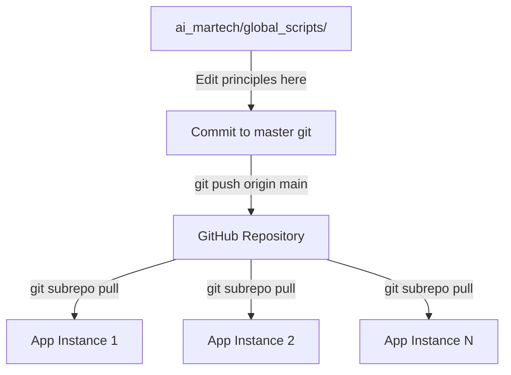
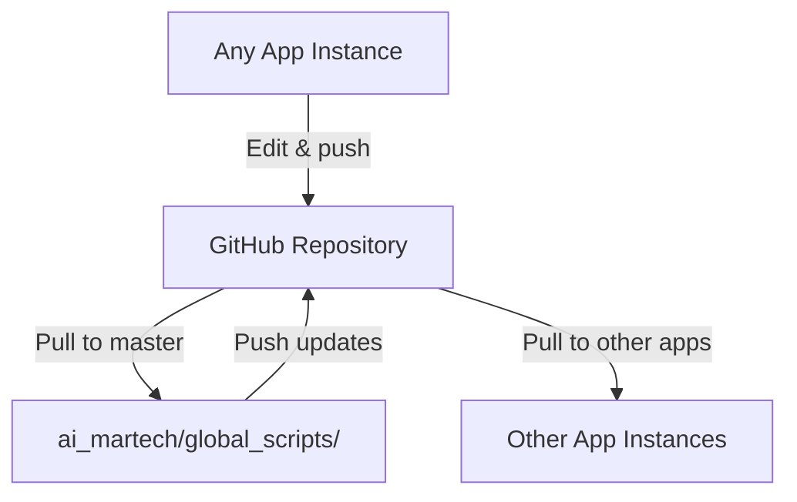

# Git Subrepo Architecture: Corrected Analysis

**Document Purpose**: Corrected understanding of git subrepo bidirectional synchronization architecture
**Date**: 2025-10-03
**Status**: CORRECTED ARCHITECTURE

---

## 🔍 Current Architecture Discovery

### Actual Setup (Verified 2025-10-03)

#### 1. Master Repository Structure
```
ai_martech/                           # NOT a git repository (Dropbox-synced)
├── global_scripts/                   # IS a git repository
│   ├── .git/                         # Full git repository
│   │   └── Remote: git@github.com:kiki830621/ai_martech_global_scripts.git
│   ├── 00_principles/                # 30 Meta-Principles (MP001-MP030)
│   ├── 01_db/                        # Database modules
│   ├── 02_db_utils/                  # Database utilities
│   └── ... (other modules)
│
├── l1_basic/[app]/scripts/global_scripts/.gitrepo     # Subrepo reference
├── l3_premium/[app]/scripts/global_scripts/.gitrepo   # Subrepo reference
└── l4_enterprise/[app]/scripts/global_scripts/.gitrepo # Subrepo reference
```

#### 2. Application Subrepo References
Each application has a `.gitrepo` file pointing to the GitHub repository:

```ini
; Example from l1_basic/VitalSigns/scripts/global_scripts/.gitrepo
[subrepo]
    remote = https://github.com/kiki830621/ai_martech_global_scripts.git
    branch = main
    commit = 718047a05d5a80662b88b624d8442a8d76f81a39
    parent = 7589d316bc51461d7deaf2fcc8ee7e7a1ea0fdeb
    method = merge
    cmdver = 0.4.9
```

---

## ✅ Corrected Understanding: Bidirectional Workflow

### Git Subrepo Capabilities

**Previous Misunderstanding**: "Apps are read-only consumers of global_scripts"
**Corrected Understanding**: "Git subrepo supports full bidirectional synchronization"

Git subrepo provides:
1. **Pull**: `git subrepo pull scripts/global_scripts` - Get updates from GitHub
2. **Push**: `git subrepo push scripts/global_scripts` - Send local changes to GitHub
3. **Clone**: `git subrepo clone URL path` - Initial setup
4. **Status**: `git subrepo status scripts/global_scripts` - Check sync state

### Three-Tier Repository Hierarchy

```
Level 1: GitHub Repository (ai_martech_global_scripts)
         ↑ (push)           ↓ (pull)
         |                  |
Level 2: Master Repository (ai_martech/global_scripts/)
         ↑ (push)           ↓ (pull)
         |                  |
Level 3: Application Instances (l*/[app]/scripts/global_scripts/)
```

---

## 🎯 Recommended Workflow Models

### Model A: Centralized Development (RECOMMENDED)

**Principle**: Edit principles in master, distribute to apps



**Workflow**:
```bash
# Developer workflow
cd /path/to/ai_martech/global_scripts/
# Edit MP*.md files
git add 00_principles/MP*.md
git commit -m "Update principles"
git push origin main

# Application sync (per app)
cd /path/to/ai_martech/l4_enterprise/MAMBA/
git subrepo pull scripts/global_scripts
git commit -m "Sync global_scripts from master"
git push origin main
```

**Advantages**:
- Single source of truth
- Clear ownership of principles
- Easier to maintain consistency
- Simpler conflict resolution

**Disadvantages**:
- Apps must regularly sync to get updates
- Two-step process for app-specific needs

---

### Model B: Distributed Development (ALTERNATIVE)

**Principle**: Edit in any instance, sync via GitHub



**Workflow**:
```bash
# Edit in application
cd /path/to/ai_martech/l4_enterprise/MAMBA/
# Edit scripts/global_scripts/00_principles/MP*.md
cd scripts/global_scripts/
git add 00_principles/MP*.md
git commit -m "Update principles from MAMBA context"
cd ../..
git subrepo push scripts/global_scripts

# Sync to master
cd /path/to/ai_martech/global_scripts/
git pull origin main

# Sync to other apps
cd /path/to/ai_martech/l1_basic/VitalSigns/
git subrepo pull scripts/global_scripts
```

**Advantages**:
- Flexibility to edit where needed
- Context-aware principle development
- No bottleneck on master repository

**Disadvantages**:
- Potential for conflicts between instances
- Harder to track who made what changes
- Requires discipline to avoid chaos

---

## 🏗️ Architectural Decisions

### Decision Matrix

| Aspect | Model A (Centralized) | Model B (Distributed) |
|--------|----------------------|----------------------|
| **Single Source of Truth** | ✅ Clear (master) | ⚠️ Ambiguous (any instance) |
| **Conflict Risk** | ✅ Low | ⚠️ Higher |
| **Development Speed** | ⚠️ Two-step process | ✅ Edit anywhere |
| **Maintenance Burden** | ✅ Lower | ⚠️ Higher |
| **Traceability** | ✅ Clear git history | ⚠️ Scattered commits |
| **Recommended For** | Production systems | Experimental/research |

### Recommended Approach: **Model A with Controlled Model B**

**Primary Workflow**: Model A (Centralized)
- All principle edits happen in `ai_martech/global_scripts/`
- Push to GitHub as authoritative source
- Apps pull from GitHub

**Exception Workflow**: Model B for urgent fixes
- If principle bug discovered in app context
- Fix in app instance, push to GitHub
- Immediately sync master and other apps
- Document in commit message: "HOT-FIX from [app_name]: [reason]"

---

## 📋 Standard Operating Procedures

### SOP 1: Adding New Principle (Centralized)

```bash
# 1. Navigate to master repository
cd /Users/che/Library/CloudStorage/Dropbox/che_workspace/projects/ai_martech/global_scripts/

# 2. Create principle file
vi 00_principles/MP031_new_principle.md

# 3. Update INDEX.md
vi 00_principles/INDEX.md

# 4. Commit to master
git add 00_principles/MP031_new_principle.md 00_principles/INDEX.md
git commit -m "Add MP031: New Principle

- Description of principle
- Rationale for addition
- Related principles: MP001, MP015

Per MP001_axiomatization_system"

# 5. Push to GitHub
git push origin main

# 6. Sync to all applications (example: MAMBA)
cd /Users/che/Library/CloudStorage/Dropbox/che_workspace/projects/ai_martech/l4_enterprise/MAMBA/
git subrepo pull scripts/global_scripts
git commit -m "Sync global_scripts: Add MP031"
git push origin main

# Repeat step 6 for all other applications
```

---

### SOP 2: Emergency Fix in Application (Distributed)

```bash
# 1. Context: Bug found in principle while working in MAMBA
cd /Users/che/Library/CloudStorage/Dropbox/che_workspace/projects/ai_martech/l4_enterprise/MAMBA/

# 2. Fix principle in app's subrepo
vi scripts/global_scripts/00_principles/MP015_existing_principle.md

# 3. Commit within subrepo
cd scripts/global_scripts/
git add 00_principles/MP015_existing_principle.md
git commit -m "HOT-FIX from MAMBA: Correct MP015 database connection example

Issue: Example code had incorrect parameter order
Context: Discovered during MAMBA deployment troubleshooting
Impact: Affects all apps using database connections

Per MP001_axiomatization_system"
cd ../..

# 4. Push subrepo to GitHub
git subrepo push scripts/global_scripts

# 5. IMMEDIATELY sync master
cd /Users/che/Library/CloudStorage/Dropbox/che_workspace/projects/ai_martech/global_scripts/
git pull origin main

# 6. IMMEDIATELY notify team and sync other apps
# (Create notification system or use Slack/email)

# 7. Sync other critical apps
cd /Users/che/Library/CloudStorage/Dropbox/che_workspace/projects/ai_martech/l1_basic/VitalSigns/
git subrepo pull scripts/global_scripts
git commit -m "HOT-FIX sync: MP015 database connection correction from MAMBA"
git push origin main
```

---

### SOP 3: Regular Synchronization (Scheduled)

```bash
#!/bin/bash
# File: bash/sync_all_global_scripts.sh

# Purpose: Weekly sync of all app instances with master global_scripts
# Schedule: Run every Monday morning

set -e

MARTECH_ROOT="/Users/che/Library/CloudStorage/Dropbox/che_workspace/projects/ai_martech"

echo "=== Global Scripts Synchronization ==="
echo "Date: $(date)"

# 1. Update master from GitHub
echo "Updating master global_scripts..."
cd "$MARTECH_ROOT/global_scripts"
git pull origin main

# 2. List all apps with subrepos
APPS=(
    "l1_basic/VitalSigns"
    "l1_basic/InsightForge"
    "l1_basic/BrandEdge"
    "l1_basic/TagPilot"
    "l1_basic/latex_test"
    "l3_premium/VitalSigns_premium"
    "l3_premium/BrandEdge_premium"
    "l3_premium/InsightForge_premium"
    "l4_enterprise/MAMBA"
    "l4_enterprise/WISER"
    "l4_enterprise/QEF_DESIGN"
    "l4_enterprise/kitchenMAMA"
)

# 3. Sync each app
for app in "${APPS[@]}"; do
    echo "Syncing $app..."
    cd "$MARTECH_ROOT/$app"

    # Check if app has git repo
    if [ -d .git ]; then
        # Pull latest from GitHub
        git subrepo pull scripts/global_scripts

        # Commit the sync
        git commit -m "Weekly sync: global_scripts $(date +%Y-%m-%d)" || echo "No changes to commit"

        # Push to app's GitHub repo
        git push origin main || echo "Warning: Could not push $app"
    else
        echo "Warning: $app is not a git repository, skipping..."
    fi
done

echo "=== Synchronization Complete ==="
```

---

## 🚨 Conflict Resolution

### Scenario: Two Apps Edit Same Principle

**Problem**:
- App A edits MP015 and pushes to GitHub
- App B edits MP015 independently
- Conflict when App B tries to push

**Resolution Workflow**:

```bash
# In App B (the one with conflict)
cd /path/to/app_b/

# 1. Attempt to pull (will show conflict)
git subrepo pull scripts/global_scripts
# ERROR: Merge conflict in scripts/global_scripts/00_principles/MP015.md

# 2. Enter subrepo to resolve
cd scripts/global_scripts/

# 3. Resolve conflict manually
vi 00_principles/MP015.md
# (Edit to merge both changes appropriately)

# 4. Commit resolution
git add 00_principles/MP015.md
git commit -m "CONFLICT-RESOLUTION: MP015 from App A + App B

Merged changes:
- From App A: [describe change]
- From App B: [describe change]
- Resolution: [describe how merged]

Per MP001_axiomatization_system"

# 5. Return to app root and push
cd ../..
git subrepo push scripts/global_scripts

# 6. Sync master and all other apps immediately
cd /path/to/global_scripts/
git pull origin main
# (Then sync all other apps)
```

---

## 📊 Synchronization State Tracking

### Check Sync Status

```bash
# Check if app is behind GitHub
cd /path/to/app/
git subrepo status scripts/global_scripts

# Expected output if synced:
# global_scripts is up to date

# Expected output if behind:
# global_scripts has commits to pull

# Expected output if ahead:
# global_scripts has commits to push
```

### Create Sync Dashboard

```bash
#!/bin/bash
# File: bash/check_all_sync_status.sh

MARTECH_ROOT="/Users/che/Library/CloudStorage/Dropbox/che_workspace/projects/ai_martech"

echo "=== Global Scripts Sync Status ==="
echo ""

APPS=(
    "l1_basic/VitalSigns"
    "l1_basic/InsightForge"
    "l4_enterprise/MAMBA"
    "l4_enterprise/WISER"
    # ... add all apps
)

for app in "${APPS[@]}"; do
    cd "$MARTECH_ROOT/$app"

    if [ -f scripts/global_scripts/.gitrepo ]; then
        STATUS=$(git subrepo status scripts/global_scripts 2>&1)

        if echo "$STATUS" | grep -q "up to date"; then
            echo "✅ $app - SYNCED"
        else
            echo "⚠️  $app - OUT OF SYNC"
            echo "   $STATUS"
        fi
    else
        echo "❌ $app - NO SUBREPO"
    fi
done
```

---

## 🔐 Access Control & Permissions

### GitHub Repository Permissions

**Repository**: `kiki830621/ai_martech_global_scripts`

**Recommended Permissions**:
- **Owner**: Full access (push/pull)
- **Principle-Coder Role**: Write access (can push)
- **Principle-Explorer Role**: Read access (can pull, cannot push)
- **App Developers**: Read access (pull only)

**Rationale**: Prevents accidental principle modifications from app contexts

---

## 📖 Principle-Specific Considerations

### MP001 (Axiomatization System)
- **Implication**: All principle changes must reference existing principles
- **Git Workflow**: Commit messages MUST cite related MPs

### MP030 (Archive Immutability)
- **Implication**: Files in `CHANGELOG/archive/` must never be modified
- **Git Workflow**: Use `.gitattributes` to prevent edits:
  ```
  CHANGELOG/archive/** -diff -merge
  ```

### R092 (Universal DBI)
- **Implication**: Database connection patterns affect all apps
- **Git Workflow**: Any change to `02_db_utils/` MUST trigger full app regression test

---

## 🎯 Migration Strategy (If Needed)

### If Current Setup is Wrong, How to Fix

**Assessment**: Based on verified architecture, current setup is CORRECT but may need procedural improvements.

**Potential Improvements**:

1. **Add Git Hooks** (in master `global_scripts/.git/hooks/`)
   ```bash
   # pre-commit hook
   #!/bin/bash
   # Validate principle references in commit

   # post-commit hook
   #!/bin/bash
   # Notify all app maintainers of principle changes
   ```

2. **Create Principle Change Notification System**
   ```yaml
   # .github/workflows/notify_apps.yml
   name: Notify Apps of Principle Changes
   on:
     push:
       branches: [main]
       paths:
         - '00_principles/MP*.md'
   jobs:
     notify:
       runs-on: ubuntu-latest
       steps:
         - name: Send Slack notification
           # ... notify all app channels
   ```

3. **Implement Automated Sync CI/CD**
   ```yaml
   # In each app's .github/workflows/sync_global_scripts.yml
   name: Auto-sync Global Scripts
   on:
     schedule:
       - cron: '0 9 * * 1'  # Every Monday 9 AM
   jobs:
     sync:
       runs-on: ubuntu-latest
       steps:
         - uses: actions/checkout@v3
         - name: Pull global_scripts
           run: |
             git subrepo pull scripts/global_scripts
             git push origin main
   ```

---

## 📝 Documentation Requirements

### For Every Principle Change

1. **Commit Message Format**:
   ```
   <ACTION> <PRINCIPLE_ID>: <BRIEF_TITLE>

   <DETAILED_DESCRIPTION>

   Related Principles: <MP_LIST>
   Affected Apps: <APP_LIST>
   Breaking Changes: <YES/NO>

   Per <GOVERNING_PRINCIPLE>
   ```

2. **CHANGELOG Entry**:
   ```markdown
   ## [Date] - [Principle ID]

   ### Changed
   - Description of change

   ### Impact
   - Which apps/modules affected

   ### Migration Guide
   - How to adapt existing code
   ```

---

## 🔄 Synchronization Schedule

### Recommended Sync Frequency

| Event | Trigger | Action |
|-------|---------|--------|
| **Principle Added** | Immediate | Push from master → GitHub → Pull to all apps |
| **Principle Modified** | Immediate | Same as above + notification |
| **Regular Sync** | Weekly (Monday AM) | Automated CI/CD sync all apps |
| **Pre-Deployment** | Before each app deploy | Manual `git subrepo pull` |
| **Emergency Fix** | Immediate | Follow SOP 2 |

---

## 🏁 Summary & Recommendations

### Current Architecture Assessment

**Status**: ✅ CORRECT - Git subrepo setup is properly configured

**Strengths**:
1. All apps reference same GitHub repository
2. Bidirectional sync capability exists
3. Master repository maintains git history
4. Version tracking via `.gitrepo` files

**Improvement Areas**:
1. Need formal workflow documentation (this document addresses)
2. Need synchronization automation (CI/CD scripts needed)
3. Need conflict resolution procedures (SOPs provided above)
4. Need access control policies (recommendations provided)

### Final Recommendations

1. **Adopt Model A (Centralized) as primary workflow**
2. **Implement automated weekly sync** (bash script provided)
3. **Create sync status dashboard** (script provided)
4. **Add GitHub Actions for notifications**
5. **Document workflow in each app's README**
6. **Train all developers on SOPs**
7. **Set up GitHub permissions** (principle-coder vs app-developer roles)

---

## 📚 Related Documents

- `00_principles/INDEX.md` - Principles index
- `00_principles/MP001_axiomatization_system.md` - Governing principle
- `00_principles/MP030_archive_immutability.md` - Archive management
- `bash/sync_all_global_scripts.sh` - Sync automation script (to be created)
- `.github/workflows/notify_apps.yml` - CI/CD notification (to be created)

---

**Document Maintainer**: Principle-Explorer
**Last Updated**: 2025-10-03
**Review Schedule**: Monthly or after major architecture changes
