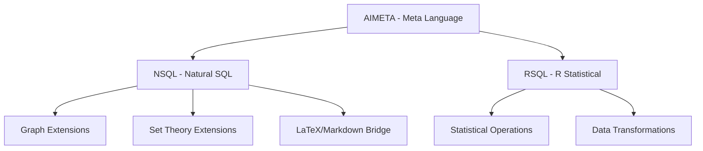

## Overview

This chapter defines the formal languages used throughout the MAMBA system. These languages provide structured ways to express queries, transformations, and communications between human operators, AI systems, and databases.

## Language Categories

### 1. Query Languages
- **NSQL (Natural SQL Language)**: Natural language to SQL translation framework
- **RSQL (R Statistical Query Language)**: Statistical operations in R syntax

### 2. Meta-Languages
- **AIMETA (AI Communication Meta Language)**: Structured communication protocol for AI systems

### 3. Language Extensions
- **Graph Theory Extensions**: Network and relationship modeling in NSQL
- **Set Theory Foundations**: Mathematical foundations for query operations
- **LaTeX/Markdown/Roxygen Integration**: Documentation language bridging

## Core Language Principles

The languages in this chapter follow these fundamental principles:

1. **Composability**: Languages can be combined and nested
2. **Extensibility**: New constructs can be added without breaking existing code
3. **Clarity**: Syntax must be unambiguous and human-readable
4. **Interoperability**: Languages must integrate seamlessly with existing tools

## Language Hierarchy

## Constitutional Significance

As defined in MP000 (Axiomatization System), these languages form part of the constitutional framework of the MAMBA system. They are:

- **Immutable in Core Syntax**: Changes require formal amendment process
- **Extensible in Application**: New use cases can be added via extensions
- **Version Controlled**: Each language maintains strict versioning
- **Documented in Multiple Forms**: Natural language, formal grammar, and examples

## Language Specifications

### Meta-Principles (Language Definitions)

- [MP024 - Natural SQL Language](MP024_natural_sql_language.qmd): Core NSQL framework
- [MP025 - AI Communication Meta Language](MP025_ai_communication_meta_language.qmd): AIMETA protocol
- [MP026 - R Statistical Query Language](MP026_r_statistical_query_language.qmd): RSQL specification
- [MP027 - Specialized Natural SQL Language](MP027_specialized_natural_sql_language.qmd): Domain-specific NSQL variants

### Detailed Specifications

- [MP062 - NSQL Detailed Specification](MP062_nsql_detailed_specification.qmd): Complete NSQL grammar and semantics
- [MP063 - Graph Theory in NSQL](MP063_graph_theory_in_nsql.qmd): Network analysis extensions
- [MP064 - NSQL Set Theory Foundations](MP064_nsql_set_theory_foundations.qmd): Mathematical foundations
- [MP065 - Radical Translation in NSQL](MP065_radical_translation_in_nsql.qmd): Advanced translation patterns

### Extensions

- [NSQL_EXT01 - Graph Theory Extension](NSQL_EXT01_graph_theory.qmd): Graph operations and algorithms
- [NSQL_EXT02 - LaTeX/Markdown/Roxygen Bridge](NSQL_EXT02_latex_markdown_roxygen.qmd): Documentation language integration

### Implementation Rules

- [TS_R003 - NSQL Language Specification](TS_R003_nsql_language_specification.qmd): Implementation requirements and patterns

## Usage Guidelines

### For Developers
1. Always reference the specific language version being used
2. Document any language extensions in the appropriate extension file
3. Follow the formal grammar specifications exactly
4. Test language constructs against the reference implementation

### For AI Systems
1. Parse languages according to their formal grammars
2. Maintain context awareness when switching between languages
3. Generate outputs that conform to language specifications
4. Validate all generated code against language rules

### For Documentation
1. Use language constructs consistently across all documentation
2. Provide examples for each language feature
3. Maintain language dictionaries and glossaries
4. Cross-reference between natural and formal language descriptions

## Relationship to Other Chapters

- **CH00.01 General Principles**: Languages implement the axiomatization system
- **CH00.03 Development Methodology**: Languages support development patterns
- **CH00.04 Data Management**: Languages enable data operations
- **CH00.05 Terminology Standards**: Languages use consistent terminology

## Evolution and Governance

Language changes follow the constitutional amendment process:

1. **Proposal**: Document the proposed change with rationale
2. **Review**: Technical and architectural review
3. **Testing**: Backward compatibility verification
4. **Approval**: Formal approval per MP000
5. **Implementation**: Staged rollout with version control
6. **Documentation**: Update all affected specifications

## Version History

- **v1.0**: Initial language definitions (MP024-MP027)
- **v1.1**: Added NSQL extensions (MP062-MP065)
- **v1.2**: Graph theory and documentation bridges (NSQL_EXT01-02)
- **v2.0**: Separated from terminology standards (current)