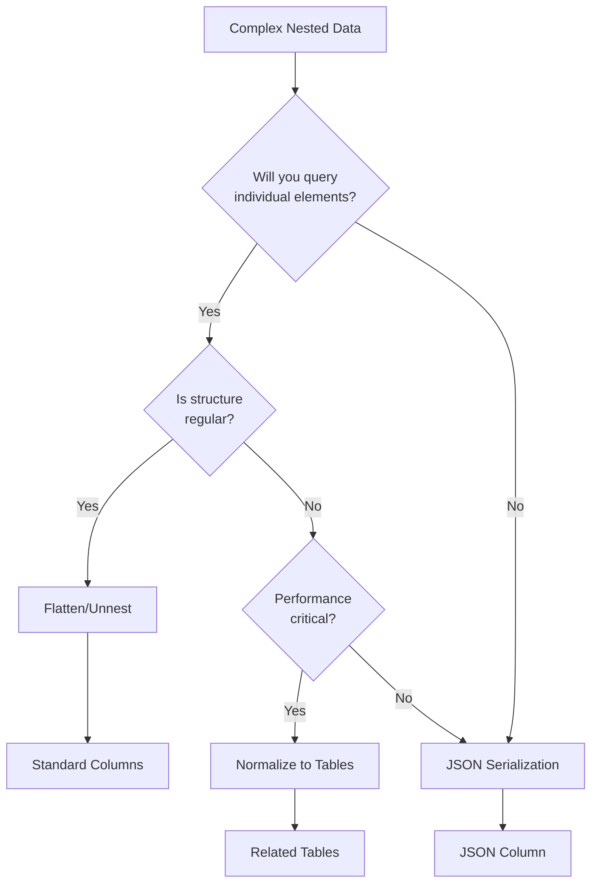

# Article 26: JSON Serialization Strategy {#overview}

**Data Management Law Article 26 (JSON Serialization Strategy)**

This rule establishes decision criteria for when to serialize complex data as JSON versus alternative strategies like normalization or flattening.

:::{.callout-important}
## Core Rule
Use JSON serialization for complex nested structures ONLY when:
1. The structure must be preserved intact for later use
2. The data won't be queried directly in SQL
3. The alternative would create excessive table complexity

Otherwise, prefer flattening (unnest) or normalization.
:::

# Section 1: Decision Framework {#decision-framework}

## Subsection 1: Decision Tree {#decision-tree}



## Subsection 2: Strategy Selection Criteria {#selection-criteria}

| Strategy | When to Use | Pros | Cons |
|----------|-------------|------|------|
| **Flatten/Unnest** | Regular structure, need SQL access | Direct SQL queries, best performance | Loses hierarchical structure |
| **Normalize** | Complex relationships, frequent queries | Referential integrity, query flexibility | Complex schema, join overhead |
| **JSON Serialize** | Preserve structure, rare queries | Simple schema, preserves complexity | No direct SQL access, storage overhead |

# Section 2: Implementation Strategies {#implementation}

## Subsection 1: Flattening Strategy {#flattening}

Best for regular nested structures like line items:

```r
# Example: Order with line items
# Original structure:
# order_id | customer | line_items
# 1        | "John"   | [{product: "A", qty: 2}, {product: "B", qty: 1}]

# Flattening approach:
df_flattened <- df_orders %>%
  tidyr::unnest(line_items, keep_empty = TRUE) %>%
  mutate(
    # Preserve order-level data
    order_id = order_id,
    customer = customer,
    # Line item data now in columns
    product = product,
    quantity = quantity
  )

# Result: order_id | customer | product | quantity
#         1        | "John"   | "A"     | 2
#         1        | "John"   | "B"     | 1

dbWriteTable(conn, "order_lines", df_flattened, overwrite = TRUE)

# Now queryable with SQL:
# SELECT product, SUM(quantity) FROM order_lines GROUP BY product
```

## Subsection 2: Normalization Strategy {#normalization}

Best for complex relationships:

```r
# Example: Orders with customers and products
# Split into normalized tables

# Orders table
df_orders_normalized <- df_orders %>%
  select(order_id, customer_id, order_date, total)
dbWriteTable(conn, "orders", df_orders_normalized, overwrite = TRUE)

# Order lines table
df_lines_normalized <- df_orders %>%
  select(order_id, line_items) %>%
  tidyr::unnest(line_items) %>%
  mutate(line_id = row_number())
dbWriteTable(conn, "order_lines", df_lines_normalized, overwrite = TRUE)

# Now can join:
# SELECT o.*, l.* FROM orders o 
# JOIN order_lines l ON o.order_id = l.order_id
```

## Subsection 3: JSON Serialization Strategy {#json-serialization}

Best for preserving complex, irregular structures:

```r
# Example: API response with varying nested fields
# Each record has different optional nested data

# Serialize complex fields
df_with_json <- df_api_response %>%
  mutate(
    # Serialize entire nested structure
    metadata_json = sapply(metadata, jsonlite::toJSON, auto_unbox = TRUE),
    # Remove original list column
    metadata = NULL
  )

dbWriteTable(conn, "api_responses", df_with_json, overwrite = TRUE)

# In DuckDB, can still extract with JSON functions:
# SELECT json_extract(metadata_json, '$.category') as category
# FROM api_responses
```

# Section 3: JSON Handling in DuckDB {#json-in-duckdb}

## Subsection 1: Writing JSON Data {#writing-json}

```r
#' Serialize complex columns as JSON for DuckDB storage
#' @param df Data frame with potentially complex columns
#' @param columns Specific columns to serialize (NULL = auto-detect)
#' @param preserve_structure Keep original structure for round-trip
serialize_for_storage <- function(df, columns = NULL, preserve_structure = FALSE) {
  df_result <- df
  
  if (is.null(columns)) {
    # Auto-detect complex columns
    columns <- names(df)[sapply(df, function(x) is.list(x) && !is.data.frame(x))]
  }
  
  for (col in columns) {
    if (col %in% names(df_result)) {
      # Create JSON version
      json_col_name <- paste0(col, "_json")
      
      if (preserve_structure) {
        # Include type information for reconstruction
        df_result[[json_col_name]] <- sapply(df_result[[col]], function(x) {
          jsonlite::toJSON(list(
            type = class(x),
            data = x
          ), auto_unbox = TRUE)
        })
      } else {
        # Simple serialization
        df_result[[json_col_name]] <- sapply(df_result[[col]], 
                                              jsonlite::toJSON, 
                                              auto_unbox = TRUE)
      }
      
      # Remove original column
      df_result[[col]] <- NULL
    }
  }
  
  return(df_result)
}
```

## Subsection 2: Reading JSON Data {#reading-json}

```r
#' Deserialize JSON columns from DuckDB
#' @param df Data frame with JSON columns
#' @param columns JSON columns to deserialize (NULL = auto-detect by _json suffix)
deserialize_from_storage <- function(df, columns = NULL) {
  df_result <- df
  
  if (is.null(columns)) {
    # Auto-detect JSON columns by suffix
    columns <- names(df)[grepl("_json$", names(df))]
  }
  
  for (json_col in columns) {
    if (json_col %in% names(df_result)) {
      # Determine original column name
      orig_col <- sub("_json$", "", json_col)
      
      # Deserialize
      df_result[[orig_col]] <- lapply(df_result[[json_col]], function(x) {
        if (is.na(x) || is.null(x) || x == "null") {
          return(NULL)
        }
        tryCatch(
          jsonlite::fromJSON(x),
          error = function(e) {
            warning(sprintf("Failed to parse JSON: %s", e$message))
            return(NULL)
          }
        )
      })
      
      # Remove JSON column
      df_result[[json_col]] <- NULL
    }
  }
  
  return(df_result)
}
```

## Subsection 3: Querying JSON in DuckDB {#querying-json}

DuckDB provides JSON functions for querying:

```sql
-- Extract single value
SELECT json_extract(metadata_json, '$.category') as category
FROM api_responses;

-- Extract array element
SELECT json_extract(line_items_json, '$[0].product') as first_product
FROM orders;

-- Extract and cast
SELECT CAST(json_extract(config_json, '$.timeout') AS INTEGER) as timeout
FROM settings;

-- Filter by JSON content
SELECT * FROM api_responses
WHERE json_extract_string(metadata_json, '$.status') = 'active';

-- Unnest JSON array in SQL
SELECT id, unnest(json_extract(items_json, '$')) as item
FROM orders;
```

# Section 4: Performance Considerations {#performance}

## Subsection 1: Storage Overhead {#storage-overhead}

JSON strings have significant overhead:

```r
# Benchmark storage methods
benchmark_storage <- function(data) {
  # Original nested structure
  size_nested <- object.size(data)
  
  # Flattened structure
  data_flat <- tidyr::unnest(data, nested_col, keep_empty = TRUE)
  size_flat <- object.size(data_flat)
  
  # JSON serialized
  data_json <- data
  data_json$nested_col_json <- sapply(data$nested_col, 
                                       jsonlite::toJSON, 
                                       auto_unbox = TRUE)
  data_json$nested_col <- NULL
  size_json <- object.size(data_json)
  
  list(
    nested = format(size_nested, units = "MB"),
    flattened = format(size_flat, units = "MB"),
    json = format(size_json, units = "MB"),
    json_overhead = size_json / size_nested
  )
}
```

## Subsection 2: Query Performance {#query-performance}

| Operation | Flattened | Normalized | JSON |
|-----------|-----------|------------|------|
| Direct column access | ⚡ Fastest | ⚡ Fast | ❌ Not possible |
| Aggregation | ⚡ Fastest | 🔄 Join required | ❌ Not possible |
| Filtering | ⚡ Fastest | ⚡ Fast | 🐢 JSON extraction |
| Complex queries | ✅ Possible | ✅ Possible | ⚠️ Limited |
| Storage size | 📊 Larger | 📊 Moderate | 📊 Largest |

# Section 5: ETL Integration {#etl-integration}

## Subsection 1: ETL Decision Points {#etl-decisions}

In ETL pipelines, make serialization decisions at import:

```r
# ETL01_0IM.R - Import phase
process_api_response <- function(response) {
  df <- jsonlite::fromJSON(response, flatten = TRUE)
  
  # Decision point: What to do with nested fields?
  
  # Option 1: Flatten if regular structure (e.g., line items)
  if ("line_items" %in% names(df) && is_regular_structure(df$line_items)) {
    df <- tidyr::unnest(df, line_items, keep_empty = TRUE)
    storage_method <- "flattened"
  }
  
  # Option 2: Serialize if complex/irregular
  else if (has_complex_nested_fields(df)) {
    df <- serialize_for_storage(df)
    storage_method <- "json"
  }
  
  # Document the decision
  attr(df, "storage_method") <- storage_method
  
  return(df)
}
```

## Subsection 2: Documentation Requirements {#documentation}

Document JSON columns in schema:

```yaml
# schema.yaml
tables:
  api_responses:
    columns:
      id: INTEGER
      timestamp: TIMESTAMP
      status: VARCHAR
      metadata_json:
        type: VARCHAR
        format: JSON
        schema:
          category: STRING
          tags: ARRAY[STRING]
          settings: OBJECT
        note: "Serialized from API metadata field"
```

# Section 6: Best Practices {#best-practices}

## Subsection 1: Do's {#dos}

1. ✅ **Flatten when possible** - Best for performance and SQL access
2. ✅ **Document JSON schemas** - Critical for maintenance
3. ✅ **Use DuckDB's JSON functions** - When JSON is necessary
4. ✅ **Consider hybrid approaches** - Extract key fields, serialize rest
5. ✅ **Test query patterns** - Before committing to strategy

## Subsection 2: Don'ts {#donts}

1. ❌ **Don't default to JSON** - Consider alternatives first
2. ❌ **Don't nest deeply** - Harder to query and maintain
3. ❌ **Don't mix strategies** - Be consistent within a table
4. ❌ **Don't forget indices** - Can't index JSON content directly
5. ❌ **Don't ignore size limits** - JSON strings have VARCHAR limits

# Section 7: Implementation Checklist {#checklist}

When handling complex nested data:

1. ☐ Analyze structure regularity
2. ☐ Identify query requirements
3. ☐ Choose strategy (flatten/normalize/serialize)
4. ☐ Implement conversion functions
5. ☐ Test with sample data
6. ☐ Document JSON schemas if used
7. ☐ Verify query performance
8. ☐ Monitor storage usage
9. ☐ Create retrieval functions if needed
10. ☐ Update ETL documentation

---

*Based on: DuckDB JSON documentation and performance testing*
*Critical for: API integrations, complex data structures, ETL pipelines*