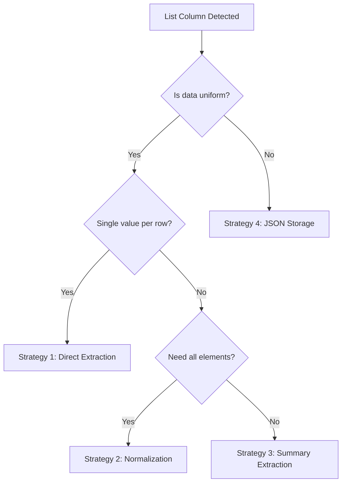

# List Column Handling Strategies

## Problem Statement

When working with modern APIs (like Cyberbiz, Shopify, or other e-commerce platforms), responses often contain nested data structures that manifest as list columns when imported into R or DuckDB. These list columns cannot be directly written to DuckDB tables and require strategic handling.

## Real-World Example: Cyberbiz API

The issue was discovered when processing Cyberbiz API responses:

```r
# API response structure
api_response <- list(
  product = list(
    id = 123,
    name = "Product A",
    categories = list("Electronics", "Gadgets"),  # LIST
    attributes = list(                             # NESTED LIST
      color = c("Red", "Blue"),
      size = c("S", "M", "L")
    ),
    price_tiers = list(                           # LIST OF STRUCTS
      list(min_qty = 1, price = 100),
      list(min_qty = 10, price = 90)
    )
  )
)
```

## Strategy Decision Tree



## Strategy 1: Direct Extraction

For lists with single values or when only specific elements are needed.

```r
# Extract first element (common for single-value lists)
extract_first_element <- function(df, list_cols) {
  for (col in list_cols) {
    if (col %in% names(df)) {
      df[[paste0(col, "_first")]] <- sapply(
        df[[col]], 
        function(x) if(length(x) > 0) x[[1]] else NA
      )
      df[[col]] <- NULL  # Remove original list column
    }
  }
  return(df)
}

# Example usage
products_df <- api_response %>%
  extract_first_element(c("category_ids", "tag_ids"))
```

## Strategy 2: Normalization (Separate Table)

For lists containing multiple important values that need individual access.

```r
# Normalize list column to separate table
normalize_list_column <- function(df, id_col, list_col, con) {
  # Create main table without list column
  main_table <- df %>%
    select(-all_of(list_col))
  
  # Create normalized table for list values
  list_table <- df %>%
    select(all_of(c(id_col, list_col))) %>%
    tidyr::unnest(cols = all_of(list_col)) %>%
    rename(value = all_of(list_col)) %>%
    mutate(
      sequence = row_number(),
      .by = all_of(id_col)
    )
  
  # Write to database
  dbWriteTable(con, paste0("main_", list_col), main_table, overwrite = TRUE)
  dbWriteTable(con, paste0("list_", list_col), list_table, overwrite = TRUE)
  
  return(list(
    main = main_table,
    list = list_table
  ))
}

# Example: Normalize product categories
normalized <- normalize_list_column(
  products_df, 
  id_col = "product_id",
  list_col = "categories",
  con = con
)
```

## Strategy 3: Summary Extraction

When you need aggregate information about the list.

```r
# Extract summary statistics from lists
summarize_list_column <- function(df, list_col) {
  df %>%
    mutate(
      # Count of elements
      !!paste0(list_col, "_count") := sapply(
        .data[[list_col]], length
      ),
      
      # Concatenated string (for display)
      !!paste0(list_col, "_text") := sapply(
        .data[[list_col]], 
        function(x) paste(x, collapse = ", ")
      ),
      
      # Min/Max for numeric lists
      !!paste0(list_col, "_min") := sapply(
        .data[[list_col]], 
        function(x) {
          if(length(x) > 0 && is.numeric(x)) min(x) else NA
        }
      ),
      
      !!paste0(list_col, "_max") := sapply(
        .data[[list_col]], 
        function(x) {
          if(length(x) > 0 && is.numeric(x)) max(x) else NA
        }
      )
    ) %>%
    select(-all_of(list_col))
}
```

## Strategy 4: JSON Storage

For complex nested structures that need to be preserved as-is.

```r
# Convert list columns to JSON strings
lists_to_json <- function(df) {
  list_cols <- names(df)[sapply(df, is.list)]
  
  for (col in list_cols) {
    df[[col]] <- sapply(
      df[[col]], 
      function(x) jsonlite::toJSON(x, auto_unbox = TRUE, null = "null"),
      USE.NAMES = FALSE
    )
  }
  
  return(df)
}

# Store and retrieve JSON data
store_with_json <- function(df, table_name, con) {
  # Convert lists to JSON
  df_json <- lists_to_json(df)
  
  # Write to database
  dbWriteTable(con, table_name, df_json, overwrite = TRUE)
  
  # Create view for easy JSON extraction
  view_query <- glue::glue("
    CREATE OR REPLACE VIEW v_{table_name} AS
    SELECT 
      *,
      json_extract(categories, '$') AS categories_array,
      json_array_length(categories) AS category_count
    FROM {table_name}
  ")
  
  dbExecute(con, view_query)
}
```

## Complete ETL Pipeline Example

Comprehensive example showing all strategies in action:

```r
# Complete ETL pipeline for API data with list columns
process_api_response <- function(api_endpoint, con) {
  # Step 1: Fetch data
  response <- httr::GET(api_endpoint) %>%
    httr::content(as = "text") %>%
    jsonlite::fromJSON(flatten = TRUE)
  
  # Step 2: Identify list columns
  list_cols <- names(response)[sapply(response, is.list)]
  cat("Found list columns:", paste(list_cols, collapse = ", "), "\n")
  
  # Step 3: Apply appropriate strategy for each column
  processed_df <- response
  
  for (col in list_cols) {
    col_data <- processed_df[[col]]
    
    # Analyze structure
    is_simple <- all(sapply(col_data, length) <= 1)
    is_uniform <- length(unique(sapply(col_data, class))) == 1
    avg_length <- mean(sapply(col_data, length))
    
    if (is_simple) {
      # Strategy 1: Direct extraction
      cat(col, "-> Direct extraction\n")
      processed_df[[col]] <- sapply(
        col_data, 
        function(x) if(length(x) > 0) x[[1]] else NA
      )
      
    } else if (is_uniform && avg_length < 10) {
      # Strategy 3: Summary extraction
      cat(col, "-> Summary extraction\n")
      processed_df <- summarize_list_column(processed_df, col)
      
    } else {
      # Strategy 4: JSON storage
      cat(col, "-> JSON storage\n")
      processed_df[[col]] <- sapply(
        col_data,
        function(x) jsonlite::toJSON(x, auto_unbox = TRUE),
        USE.NAMES = FALSE
      )
    }
  }
  
  # Step 4: Write to database
  dbWriteTable(con, "processed_api_data", processed_df, overwrite = TRUE)
  
  # Step 5: Create indexes for JSON columns
  json_cols <- list_cols[sapply(list_cols, function(x) {
    any(grepl("json", class(processed_df[[x]]), ignore.case = TRUE))
  })]
  
  for (col in json_cols) {
    index_query <- glue::glue("
      CREATE INDEX IF NOT EXISTS idx_{col}_length 
      ON processed_api_data((json_array_length({col})))
    ")
    try(dbExecute(con, index_query), silent = TRUE)
  }
  
  return(processed_df)
}
```

## DuckDB-Specific Solutions

### Using DuckDB's Native Functions

```sql
-- Create table with proper handling of nested data
CREATE TABLE products_clean AS
SELECT 
  product_id,
  product_name,
  
  -- Handle simple lists
  list_extract(categories, 1) AS primary_category,
  list_aggregate(categories, 'string_agg', ', ') AS all_categories,
  len(categories) AS category_count,
  
  -- Handle nested structures
  json(attributes) AS attributes_json,
  
  -- Unnest price tiers (creates multiple rows)
  unnest(price_tiers) AS price_tier
FROM products_raw;

-- Alternative: Create separate tables
CREATE TABLE product_categories AS
SELECT 
  product_id,
  unnest(categories) AS category,
  row_number() OVER (PARTITION BY product_id) AS position
FROM products_raw;
```

### Query Patterns for List Data

```sql
-- Find products with specific category
SELECT * FROM products
WHERE list_contains(categories, 'Electronics');

-- Extract all unique categories
SELECT DISTINCT unnest(categories) AS category
FROM products
ORDER BY category;

-- Aggregate list data
SELECT 
  product_id,
  list_aggregate(categories, 'count') AS num_categories,
  list_aggregate(categories, 'string_agg', '|') AS category_list
FROM products
GROUP BY product_id;
```

## Performance Considerations

### Storage Impact

| Strategy | Storage Size | Query Performance | Flexibility |
|----------|--------------|-------------------|-------------|
| Direct Extraction | Smallest | Fastest | Lowest |
| Normalization | Medium | Fast (with indexes) | High |
| Summary | Small-Medium | Fast | Medium |
| JSON | Largest | Slowest | Highest |

### Optimization Tips

```r
# Batch processing for large datasets
process_in_batches <- function(df, batch_size = 1000) {
  n_batches <- ceiling(nrow(df) / batch_size)
  
  for (i in seq_len(n_batches)) {
    start_idx <- (i - 1) * batch_size + 1
    end_idx <- min(i * batch_size, nrow(df))
    
    batch <- df[start_idx:end_idx, ]
    batch_processed <- process_list_columns(batch)
    
    if (i == 1) {
      dbWriteTable(con, "target_table", batch_processed, overwrite = TRUE)
    } else {
      dbAppendTable(con, "target_table", batch_processed)
    }
  }
}
```

## Testing and Validation

```r
# Validate list column handling
validate_list_processing <- function(original_df, processed_df) {
  tests <- list()
  
  # Test 1: No data loss
  tests$row_count <- nrow(processed_df) >= nrow(original_df)
  
  # Test 2: No list columns remain
  tests$no_lists <- !any(sapply(processed_df, is.list))
  
  # Test 3: JSON columns are valid
  json_cols <- names(processed_df)[grepl("_json$", names(processed_df))]
  tests$valid_json <- all(sapply(json_cols, function(col) {
    all(sapply(processed_df[[col]], jsonlite::validate))
  }))
  
  # Test 4: Can write to DuckDB
  tests$writable <- tryCatch({
    dbWriteTable(con, "test_table", processed_df, overwrite = TRUE)
    dbRemoveTable(con, "test_table")
    TRUE
  }, error = function(e) FALSE)
  
  return(tests)
}
```

## Recommendations by Use Case

### E-commerce Product Data
- Categories → Normalization (separate table)
- Attributes → JSON storage
- Price tiers → Normalization
- Tags → Summary extraction

### Time Series Data
- Measurements → Direct extraction (latest value)
- Historical values → JSON storage
- Aggregations → Summary extraction

### User Activity Data
- Page views → Normalization
- Preferences → JSON storage
- Actions → Summary extraction

## Conclusion

List column handling requires careful consideration of:
1. Data structure and uniformity
2. Query requirements
3. Storage constraints
4. Performance needs

The key is choosing the right strategy for each specific use case and implementing robust error handling to deal with edge cases.