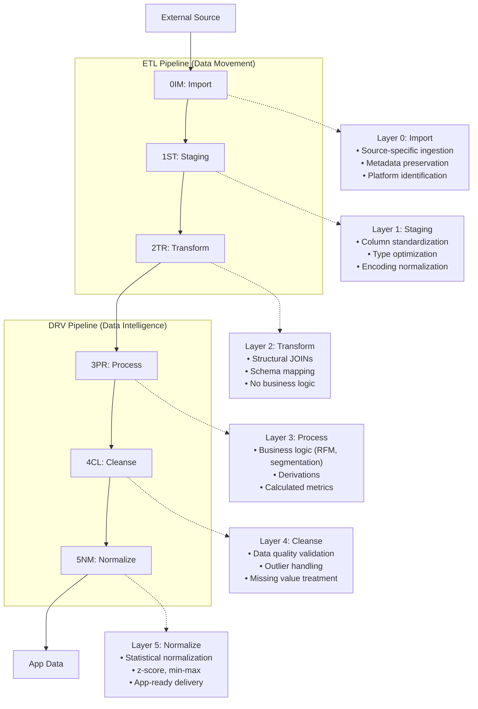

# DF00: Data Pipeline Architecture - 6-Layer Symmetric

## Core Principle

The data processing architecture follows a **6-Layer Symmetric Pipeline** model with two parallel 3-phase pipelines:

- **ETL Pipeline** (Data Movement): 0IM → 1ST → 2TR
- **DRV Pipeline** (Data Intelligence): 3PR → 4CL → 5NM

Each pipeline has exactly 3 phases, providing a clean, symmetric structure that is easy to understand and maintain.

## 6-Layer Symmetric Architecture (Revised 2025-12-24)

The architecture was simplified from the original 7-layer model by:
1. **Removing 5DN (DB Normalize)**: This is a design-time schema decision, not a runtime data flow phase
2. **Renumbering 6NM to 5NM**: The final DRV phase that writes to app_data



## 6-Layer Architecture Definitions

### ETL Pipeline (Data Movement)

#### **0IM: Import Layer**
- **Purpose**: Raw data ingestion from external sources
- **Database**: `raw_data.duckdb`
- **Pipeline**: ETL
- **Responsibility**:
  - Platform-specific data import
  - Metadata preservation
  - Source identification and tracking
  - **No transformations allowed**

#### **1ST: Staging Layer**
- **Purpose**: Technical data preparation and format standardization
- **Database**: `staged_data.duckdb`
- **Pipeline**: ETL
- **Responsibility**:
  - Data type detection and optimization
  - Column name standardization
  - Encoding consistency (UTF-8)
  - **No JOINs or business logic allowed**

#### **2TR: Transform Layer**
- **Purpose**: Structural transformations and schema mapping
- **Database**: `transformed_data.duckdb`
- **Pipeline**: ETL
- **Responsibility**:
  - **Structural JOINs** (combining related tables)
  - Schema mapping and type conversion
  - Cross-table relationships
  - **No business logic allowed** (that's for DRV)

### DRV Pipeline (Data Intelligence)

#### **3PR: Process Layer**
- **Purpose**: Business logic and derivation calculations
- **Database**: `processed_data.duckdb`
- **Pipeline**: DRV
- **Responsibility**:
  - **Business logic** (RFM scores, segmentation)
  - Derived field calculations
  - Metric computations
  - Business rule application

#### **4CL: Cleanse Layer**
- **Purpose**: Data quality validation and cleaning
- **Database**: `cleansed_data.duckdb`
- **Pipeline**: DRV
- **Responsibility**:
  - Outlier detection and treatment
  - Missing value handling
  - Duplicate record removal
  - **Must come after 3PR** (cleaning rules often depend on business context)

#### **5NM: Normalize Layer** *(Renumbered from 6NM)*
- **Purpose**: Statistical normalization and app delivery
- **Database**: `app_data.duckdb`
- **Pipeline**: DRV
- **Responsibility**:
  - **Statistical normalization** (Z-score, Min-Max scaling)
  - Feature scaling for visualization
  - App-ready data formatting
  - **Must come after 4CL** (normalization sensitive to outliers)

### Removed: 5DN (DB Normalize)

**5DN was removed** from the runtime pipeline because database normalization (1NF, 2NF, 3NF) is a **design-time decision**, not a runtime data flow phase:
- Schema structure is decided when tables are created
- It doesn't belong in the data flow sequence
- Product master tables and mappings are schema design concerns

## Data Flow and Branch Points

### Primary Flow (6-Layer)
```
External Data → 0IM → 1ST → 2TR → 3PR → 4CL → 5NM → App Data
                 \_____ETL_____/   \______DRV______/
```

### Pipeline Handoff Point

The **handoff from ETL to DRV** occurs after 2TR:
```
ETL Output:  transformed_data.duckdb
                    ↓
DRV Input:   Read from transformed_data, write to processed_data
```

### Business Branch Points

#### **From Processed Layer (3PR)**
```
3PR (Processed) ┬→ Business Reports (Direct use)
                ├→ Ad-hoc Analysis (Analyst access)
                ├→ External Exports (Third-party systems)
                └→ 4CL → 5NM → App Data (Full pipeline)
```

#### **Entry Points by Data Type**
```
External Raw Data     → 0IM (Full ETL + DRV pipeline)
Pre-transformed Data  → 3PR (Skip ETL, start DRV)
Pre-cleaned Data      → 5NM (Skip to normalization)
```

## Updated Phase-Based Naming Convention

**Naming Pattern**: Pipeline operations follow this phase-based structure:

```
{platform}_ETL_{datatype}_{Phase}.R     # For ETL operations
{platform}_D{nn}_{description}.R        # For DRV operations

Where:
- platform: amz, eby, cbz (Amazon, eBay, Cyberbiz)
- datatype: sales, customers, products, etc.
- Phase: 0IM, 1ST, 2TR (ETL phases)
- nn: 01, 02, 03... (DRV sequence number)
```

### Updated Phase Mapping (6-Layer)

| Phase | Code | Pipeline | Purpose | Database |
|-------|------|----------|---------|----------|
| 0 | 0IM | ETL | Data ingestion from external sources | raw_data.duckdb |
| 1 | 1ST | ETL | Format standardization | staged_data.duckdb |
| 2 | 2TR | ETL | Structural transformation | transformed_data.duckdb |
| 3 | 3PR | DRV | Business logic processing | processed_data.duckdb |
| 4 | 4CL | DRV | Data quality cleansing | cleansed_data.duckdb |
| 5 | 5NM | DRV | Normalization + delivery | app_data.duckdb |

### Example Implementation (6-Layer)

```
# ETL Pipeline (Data Movement)
cbz_ETL_sales_0IM.R      (Import - raw sales data)
cbz_ETL_sales_1ST.R      (Staging - standardize format)
cbz_ETL_sales_2TR.R      (Transform - structural JOINs)

# DRV Pipeline (Data Intelligence)
cbz_D01_rfm_analysis.R   (Process - RFM calculation)
cbz_D02_customer_seg.R   (Process - segmentation)
cbz_D03_data_quality.R   (Cleanse - outlier handling)
cbz_D04_app_prep.R       (Normalize - app delivery)
```

## Database Architecture

### Database Organization (6 Databases)
```
data/
├── raw_data.duckdb           # 0IM: External source data (ETL)
├── staged_data.duckdb        # 1ST: Format standardized (ETL)
├── transformed_data.duckdb   # 2TR: Structural transformation (ETL)
├── processed_data.duckdb     # 3PR: Business logic applied (DRV)
├── cleansed_data.duckdb      # 4CL: Quality assured (DRV)
└── app_data.duckdb           # 5NM+APP: Normalized & delivered (DRV)
```

### Removed Databases (from 7-layer model)
- ~~normalized_data.duckdb~~ (5DN removed - design-time concern)
- ~~datanorm_data.duckdb~~ (6NM merged into app_data.duckdb)

### Database Flow Diagram
```
ETL Pipeline:
  raw_data → staged_data → transformed_data
                                  ↓
DRV Pipeline:
                           processed_data → cleansed_data → app_data
```

### Specialized Databases (Beyond 6-Layer)

In addition to the standard 6-Layer databases, certain derivation analyses require **specialized databases** that exist as "sidecars" to the main pipeline.

#### Directory Structure

Specialized databases use a nested `{Layer}/scd_type{N}/` structure:

```
data/local_data/
├── [Standard 6-Layer databases]
│
├── 3PR/                        # 3PR layer specialized databases
│   ├── scd_type1/              # Rebuildable (overwrite update)
│   └── scd_type2/              # Cannot delete (historical preservation)
│       └── {database}.duckdb
│
└── 4CL/                        # 4CL layer specialized databases
    └── scd_type{N}/
```

#### Design Rationale

| Level | Purpose | Example |
|-------|---------|---------|
| First level (Layer) | Indicates data flow stage | `3PR/` = processed layer |
| Second level (SCD Type) | Fool-proofing: indicates deletability | `scd_type2/` = cannot delete |

#### Current Specialized Databases

| Database | Location | SCD Type | Purpose |
|----------|----------|----------|---------|
| `comment_property_rating.duckdb` | `3PR/scd_type2/` | Type 2 | Review transformation intermediate storage |
| `comment_property_rating_results.duckdb` | `3PR/scd_type2/` | Type 2 | AI API results history |

See [DF08: Extensible Patterns](DF08_extensible_patterns.qmd#specialized-databases) for detailed patterns.

## Enhanced ETL Implementation Patterns

### Pattern 1: Multi-Source Import with Unified Processing

```r
#' Enhanced Multi-Source Import Pattern
#' 
#' Handles multiple external sources with unified downstream processing
#'
execute_enhanced_import_phase <- function(config) {
  
  import_results <- list()
  
  # Multiple import operations (0IM_00, 0IM_01, 0IM_02...)
  for (import_config in config$import_operations) {
    
    # Source-specific import
    imported_data <- switch(import_config$source_type,
      "google_sheets" = import_from_google_sheets(import_config),
      "csv" = import_from_csv(import_config),
      "api" = import_from_api(import_config),
      "database" = import_from_database(import_config)
    )
    
    # Enhanced metadata
    imported_data <- imported_data %>%
      mutate(
        etl_import_timestamp = Sys.time(),
        etl_import_id = import_config$operation_id,
        etl_source_type = import_config$source_type,
        etl_platform_id = import_config$platform_id,
        etl_data_lineage = paste0("import_", import_config$operation_id)
      )
    
    # Write to raw_data with enhanced naming
    table_name <- sprintf("df_%s_%s___imported", 
                         import_config$data_type, 
                         import_config$operation_id)
    dbWriteTable(raw_data, table_name, imported_data, overwrite = TRUE)
    
    import_results[[import_config$operation_id]] <- list(
      table_name = table_name,
      row_count = nrow(imported_data),
      data_type = import_config$data_type,
      platform_id = import_config$platform_id
    )
  }
  
  return(import_results)
}
```

### Pattern 2: Business Validation Checkpoint (3PR)

```r
#' Business Processing Validation Pattern
#' 
#' Creates stable business data checkpoint with comprehensive validation
#'
execute_processed_phase <- function(config) {
  
  # Connect to databases
  dbConnect_from_list(c("transformed_data", "processed_data"))
  
  validation_results <- list()
  
  # Get all transformed tables
  transformed_tables <- dbListTables(transformed_data)
  target_tables <- transformed_tables[grepl("___transformed$", transformed_tables)]
  
  for (table_name in target_tables) {
    
    # Load transformed data
    transformed_df <- dbGetQuery(transformed_data, paste("SELECT * FROM", table_name))
    
    # Business validation checks
    validation_result <- validate_business_data(
      data = transformed_df,
      validation_rules = config$business_validation_rules,
      table_name = table_name
    )
    
    if (validation_result$passed) {
      
      # Add processing metadata
      transformed_df$etl_processed_timestamp <- Sys.time()
      transformed_df$etl_business_validated <- TRUE
      transformed_df$etl_validation_score <- validation_result$score
      transformed_df$etl_data_lineage <- paste0(
        transformed_df$etl_data_lineage, " → processed"
      )
      
      # Create processed table
      processed_table_name <- gsub("___transformed$", "___processed", table_name)
      dbWriteTable(processed_data, processed_table_name, transformed_df, overwrite = TRUE)
      
      validation_results[[table_name]] <- list(
        processed_table = processed_table_name,
        validation_passed = TRUE,
        validation_score = validation_result$score,
        row_count = nrow(transformed_df)
      )
      
      message("✅ Business validation passed: ", table_name)
      
    } else {
      
      validation_results[[table_name]] <- list(
        processed_table = NULL,
        validation_passed = FALSE,
        validation_errors = validation_result$errors,
        row_count = nrow(transformed_df)
      )
      
      warning("❌ Business validation failed: ", table_name)
    }
  }
  
  return(validation_results)
}

#' Business Data Validation
#' 
#' Validates business logic and data completeness
#'
validate_business_data <- function(data, validation_rules, table_name) {
  
  validation_errors <- c()
  validation_score <- 1.0
  
  # Check required business fields
  required_fields <- validation_rules$required_fields[[table_name]]
  if (!is.null(required_fields)) {
    missing_fields <- setdiff(required_fields, names(data))
    if (length(missing_fields) > 0) {
      validation_errors <- c(validation_errors, 
                           paste("Missing required fields:", paste(missing_fields, collapse = ", ")))
      validation_score <- validation_score * 0.8
    }
  }
  
  # Check business constraints
  if ("business_constraints" %in% names(validation_rules)) {
    for (constraint in validation_rules$business_constraints[[table_name]]) {
      constraint_result <- eval(parse(text = constraint), envir = data)
      if (!all(constraint_result, na.rm = TRUE)) {
        validation_errors <- c(validation_errors, 
                             paste("Business constraint failed:", constraint))
        validation_score <- validation_score * 0.9
      }
    }
  }
  
  # Check data completeness
  if (validation_rules$completeness_threshold > 0) {
    completeness_rate <- 1 - (sum(is.na(data)) / (nrow(data) * ncol(data)))
    if (completeness_rate < validation_rules$completeness_threshold) {
      validation_errors <- c(validation_errors, 
                           paste("Data completeness below threshold:", 
                                round(completeness_rate, 3)))
      validation_score <- validation_score * completeness_rate
    }
  }
  
  return(list(
    passed = length(validation_errors) == 0,
    score = validation_score,
    errors = validation_errors
  ))
}
```

## Integration with Existing Systems

> **Note**: Patterns for 5DN (Database Normalization) and 6NM (Data Normalization for ML)
> have been archived. See `_archive/deprecated_5DN_6NM_patterns.qmd` for historical reference.
> These patterns were removed in the 6-layer revision (2025-12-24) because:
> - 5DN: Schema normalization is a design-time decision, not a runtime phase
> - 6NM: Merged into 5NM which now writes directly to app_data.duckdb

### Configuration Updates

Enhanced `app_config.yaml` structure to support 6-layer symmetric architecture:

```yaml
etl_config:
  etl_name: "product_profiles_pipeline"
  etl_version: "2.0"
  
  # Data source entry points
  data_sources:
    primary:
      - type: "google_sheets"
        entry_point: "import"
        platform_id: "amz"
    derived:
      - type: "calculated_metrics"
        entry_point: "transform"
      - type: "ml_predictions"
        entry_point: "data_normalize"
  
  # Phase configurations
  phases:
    import:
      operations:
        - operation_id: "00"
          source_type: "google_sheets"
          data_type: "product_profile"
          platform_id: "amz"
    
    staging:
      encoding_target: "UTF-8"
      type_optimization: true
      validation_rules: []
    
    transform:
      business_calculations:
        - "price_tier_classification"
        - "competitor_positioning"
        - "market_share_estimation"
      derived_fields:
        - "relative_price_position"
        - "feature_completeness_score"
    
    processed:
      business_validation_rules:
        required_fields:
          df_product_profile_amz: ["product_id", "brand", "price"]
        business_constraints:
          df_product_profile_amz: ["price > 0", "!is.na(brand)"]
        completeness_threshold: 0.85
    
    cleanse:
      duplicate_strategy: "keep_latest"
      missing_value_strategy: "domain_specific"
      outlier_method: "iqr"

    normalize:
      statistical_normalization:
        numerical_method: "z_score"
        categorical_method: "one_hot"
        exclude_columns: ["product_id", "etl_.*", "created_at"]
```

### Directory Structure (6-Layer)

```
05_etl_utils/
├── all/
│   ├── import/          # 0IM
│   ├── stage/           # 1ST
│   ├── transform/       # 2TR
│   ├── process/         # 3PR
│   ├── cleanse/         # 4CL
│   └── normalize/       # 5NM (writes to app_data.duckdb)
├── common/
│   ├── validation/
│   └── normalization/
└── platform_specific/
    ├── amz/
    ├── eby/
    └── cbz/
```

## Benefits of 6-Layer Symmetric Architecture

### 1. **Clear Pipeline Separation**
- ETL (Layers 0-2): Data Movement (Import → Stage → Transform)
- DRV (Layers 3-5): Data Intelligence (Process → Cleanse → Normalize)
- Each pipeline has exactly 3 phases, providing a symmetric structure

### 2. **Optimal Data Branch Points**
- **Processed (3PR)**: Business users can access validated business data
- **Cleansed (4CL)**: Quality-assured data for analytics
- **Normalized (5NM)**: App-ready data with statistical normalization

### 3. **Enhanced Recovery and Debugging**
- Clear checkpoints for rollback
- Business vs. technical issue isolation
- Granular processing control

### 4. **Scalable Data Strategy**
- Support for both business and analytical use cases
- Clear data quality progression
- Flexible entry points for different data sources

## Conclusion

The **6-Layer Symmetric Pipeline Architecture** provides a comprehensive, scalable foundation for data processing. By organizing data flow into two parallel 3-phase pipelines (ETL and DRV), this architecture creates a clean, symmetric structure that is easy to understand and maintain.

This architecture enables:
- **ETL focus**: Data movement without business logic (Import → Stage → Transform)
- **DRV focus**: Data intelligence with business logic (Process → Cleanse → Normalize)
- **Clear handoff**: Transformed data flows from ETL to DRV at a well-defined boundary
- **Symmetric simplicity**: Both pipelines have exactly 3 phases

Each layer maintains its specific purpose while contributing to a unified, end-to-end data processing workflow that scales from simple business reports to complex analytics applications.