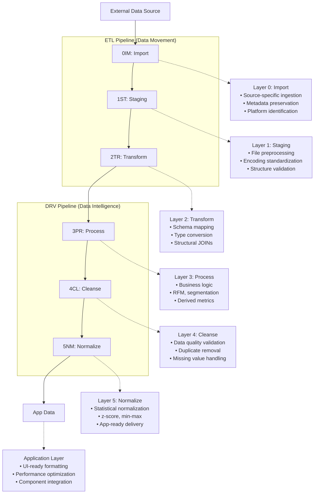
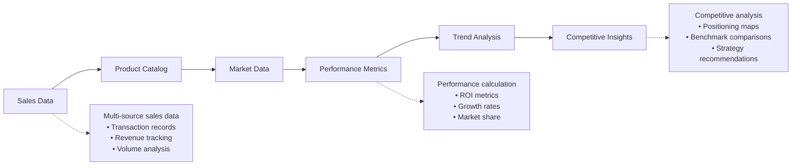
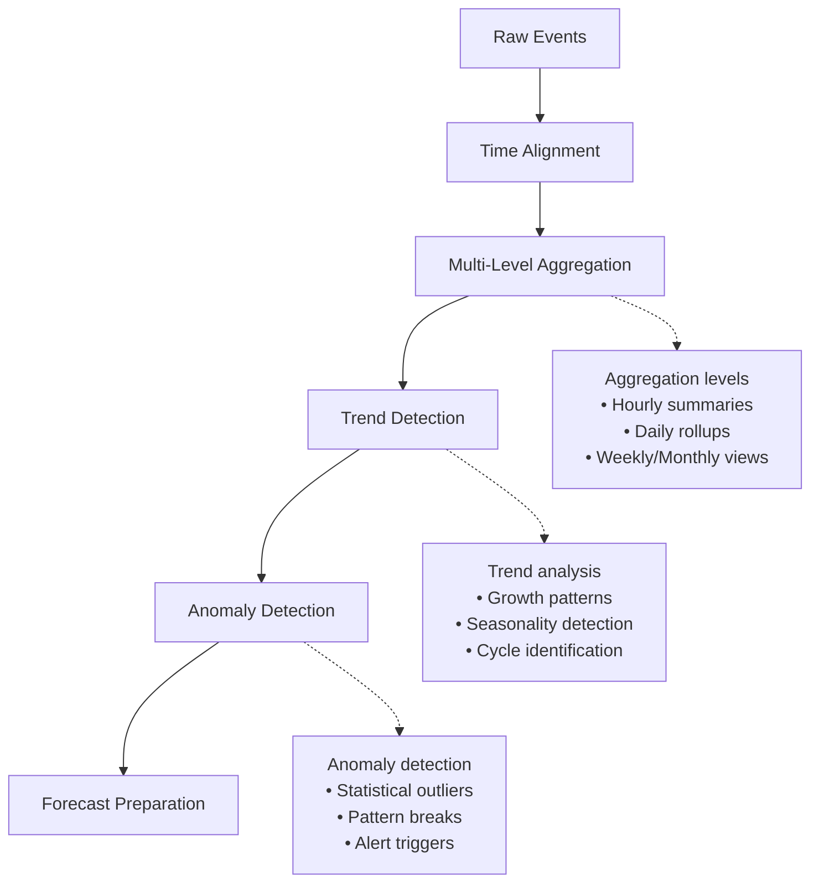
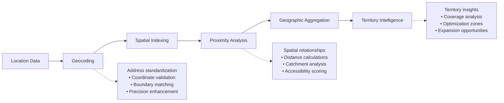
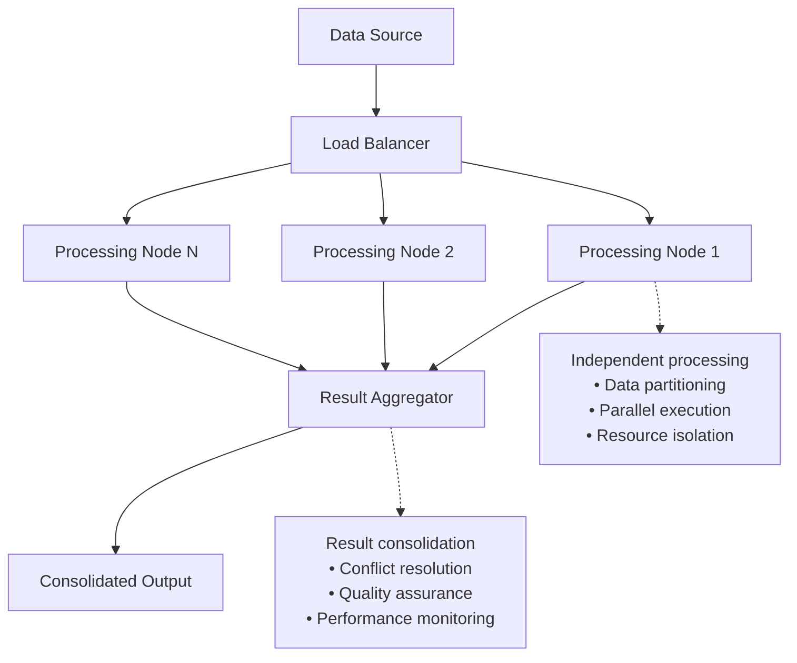
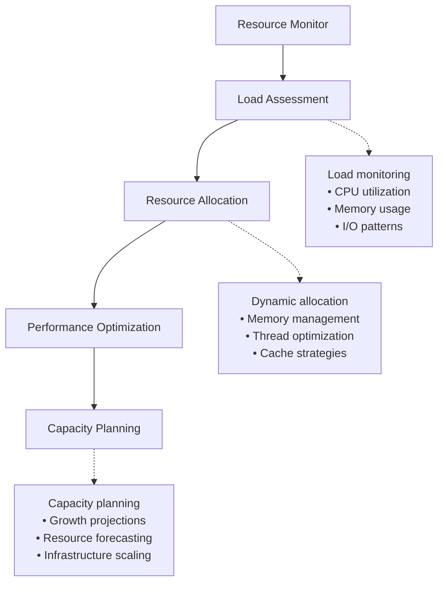
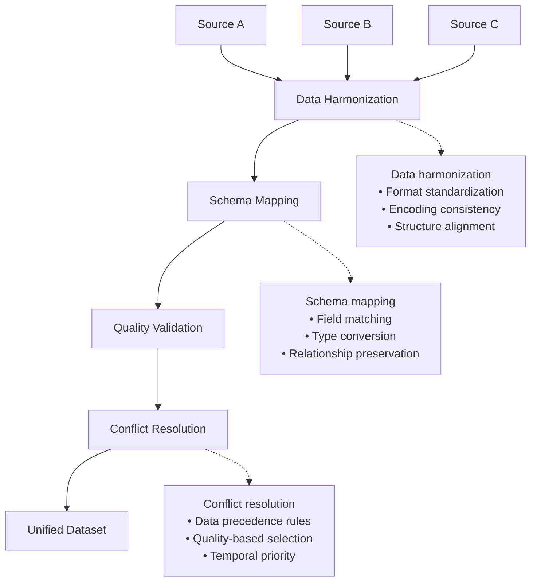
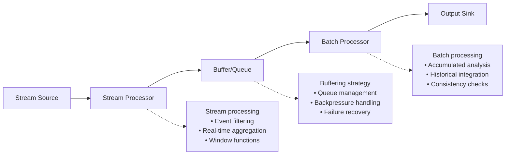
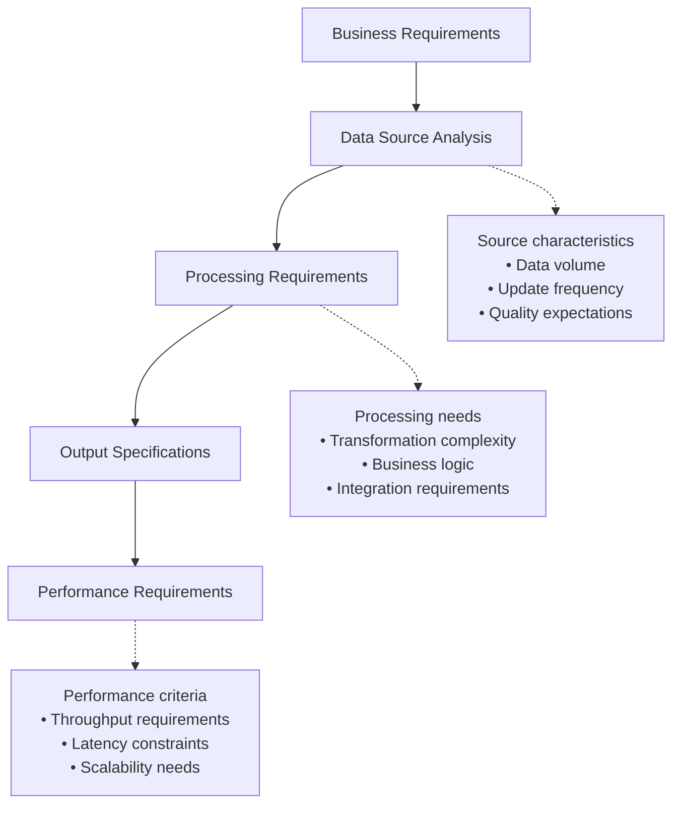
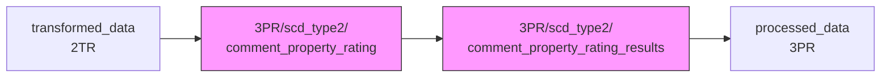

# DF08: Extensible Data Pipeline Patterns

## Core Purpose

Extensible Data Pipeline Patterns provide **template frameworks and design patterns** for implementing additional complete end-to-end data pipelines beyond the core implementations. This framework establishes theoretical patterns for extending the data flow architecture to handle new business requirements and data processing scenarios.

## Purpose and Scope

### What Extensible Patterns Define
- **Template architectures**: Reusable patterns for new data processing requirements
- **Scalability patterns**: Approaches for handling increased data volume and complexity
- **Integration patterns**: Methods for connecting new data sources and destinations
- **Extensibility guidelines**: Best practices for extending existing pipeline architectures

### What Extensible Patterns Do NOT Define
- **Specific implementations**: Concrete ETL operations are defined in individual ETL series
- **Business logic**: Domain-specific processing logic is handled by individual implementations
- **Performance optimization**: Specific optimizations are handled by individual ETL implementations

## Extensible Pipeline Architecture Template

### Standard Extension Framework

Building on DF000 and DF007, extensible patterns provide a template for new pipeline types.
The 6-layer symmetric architecture was revised in 2025-12-24 from the original 7-layer model.



## Extensible Pipeline Pattern Examples

### Pattern A: Product Performance Analysis Pipeline

**Purpose**: Transform raw sales and product data into comprehensive product performance metrics and analytics.

**Theoretical Framework**:
- **Data Sources**: Sales transactions, product catalogs, market data
- **Key Transformations**: Performance scoring, trend analysis, competitive positioning
- **Output Structures**: Product scorecards, performance dashboards, recommendation engines

**Layer Specializations**:


### Pattern B: Time Series Aggregation Pipeline

**Purpose**: Process time-based data into various aggregation levels for temporal analysis and forecasting.

**Theoretical Framework**:
- **Data Sources**: Event logs, sensor data, activity streams
- **Key Transformations**: Temporal aggregation, trend calculation, anomaly detection
- **Output Structures**: Time series cubes, trend dashboards, forecast models

**Temporal Processing Patterns**:


### Pattern C: Geospatial Analysis Pipeline

**Purpose**: Transform location-based data into geographic insights and spatial analytics.

**Theoretical Framework**:
- **Data Sources**: GPS coordinates, address data, geographic boundaries
- **Key Transformations**: Geocoding, spatial aggregation, proximity analysis
- **Output Structures**: Heat maps, territory analysis, location intelligence

**Spatial Processing Patterns**:


## Scalability Pattern Framework

### Horizontal Scaling Patterns

**Pattern**: Distributed Processing Architecture



**Key Principles**:
- **Data Partitioning**: Logical division of data for parallel processing
- **Stateless Processing**: Each node operates independently
- **Result Aggregation**: Systematic combination of parallel results
- **Error Isolation**: Failures in one node don't affect others

### Vertical Scaling Patterns

**Pattern**: Resource Optimization Architecture



**Key Principles**:
- **Dynamic Resource Allocation**: Adjust resources based on processing demands
- **Performance Monitoring**: Continuous assessment of system performance
- **Bottleneck Identification**: Systematic identification and resolution of constraints
- **Predictive Scaling**: Proactive resource management based on trends

## Integration Pattern Framework

### Multi-Source Integration Patterns

**Pattern**: Unified Data Ingestion Architecture



**Key Principles**:
- **Source Agnostic Processing**: Uniform handling regardless of data source
- **Schema Flexibility**: Adaptable to varying data structures
- **Quality Prioritization**: Systematic preference for higher quality data
- **Conflict Resolution**: Systematic handling of data conflicts

### Real-time Integration Patterns

**Pattern**: Streaming Data Pipeline Architecture



**Key Principles**:
- **Stream Processing**: Real-time data processing as events arrive
- **Buffering Strategy**: Systematic handling of data flow variations
- **Hybrid Architecture**: Combination of real-time and batch processing
- **Fault Tolerance**: Robust handling of processing failures

## Extensibility Guidelines

### Extension Development Framework

**Step 1: Requirements Analysis**


**Step 2: Pattern Selection**
- **Identify applicable patterns**: Choose from existing extensible patterns
- **Assess pattern fit**: Evaluate alignment with requirements
- **Plan customizations**: Define necessary modifications
- **Validate approach**: Confirm pattern suitability

**Step 3: Implementation Planning**
- **Define layer responsibilities**: Specify what each layer will handle
- **Plan configuration structure**: Design extensible configuration
- **Identify reusable components**: Leverage existing implementations
- **Plan testing strategy**: Define validation approach

### Pattern Customization Framework

**Configuration-Driven Customization**:
```r
# Extension Configuration Template
extension_config_template <- list(
  # Extension identification
  pattern_name = "custom_extension",
  pattern_version = "1.0",
  base_pattern = "product_performance",
  
  # Data source customization
  data_sources = list(
    primary = list(
      type = "api",
      endpoint = "https://api.example.com/data",
      authentication = "oauth2"
    ),
    secondary = list(
      type = "file",
      path = "data/supplement.csv",
      format = "csv"
    )
  ),
  
  # Processing customization
  processing = list(
    custom_transformations = list(
      "calculate_performance_score" = "weighted_average(metrics, weights)",
      "apply_business_rules" = "filter_by_criteria(data, rules)"
    ),
    aggregation_levels = c("daily", "weekly", "monthly"),
    output_formats = c("dashboard", "report", "api")
  ),
  
  # Integration customization
  integration = list(
    upstream_dependencies = c("etl01", "etl02"),
    downstream_consumers = c("dashboard", "reporting"),
    notification_rules = list(
      success = "email_admin",
      failure = "alert_on_call"
    )
  )
)
```

**Pattern Inheritance Framework**:
```r
# Pattern Inheritance Structure
inherit_pattern <- function(base_pattern, customizations) {
  # Load base pattern configuration
  base_config <- load_pattern_config(base_pattern)
  
  # Apply customizations
  extended_config <- merge_configurations(base_config, customizations)
  
  # Validate extended configuration
  validate_pattern_extension(extended_config)
  
  # Return customized pattern
  return(extended_config)
}
```

## Best Practices for Extension Development

### 1. Pattern Reuse Strategy
- **Evaluate existing patterns**: Always check if existing patterns meet requirements
- **Prefer composition over creation**: Combine existing patterns rather than creating new ones
- **Document pattern decisions**: Maintain clear rationale for pattern selection

### 2. Configuration Management
- **Use hierarchical configuration**: Enable pattern inheritance and customization
- **Externalize business logic**: Keep business rules in configuration files
- **Version control patterns**: Track pattern evolution and changes

### 3. Testing and Validation
- **Pattern validation**: Systematic testing of pattern implementations
- **Performance testing**: Validate scalability and performance characteristics
- **Integration testing**: Ensure proper interaction with existing systems

### 4. Documentation and Maintenance
- **Pattern documentation**: Comprehensive documentation of pattern characteristics
- **Usage examples**: Provide clear examples of pattern implementation
- **Maintenance guidelines**: Establish procedures for pattern updates and evolution

## Future Pattern Development

### Emerging Pattern Areas

1. **Machine Learning Integration Patterns**
   - Automated feature engineering pipelines
   - Model training and validation frameworks
   - Prediction and inference pipelines

2. **Real-time Analytics Patterns**
   - Streaming analytics frameworks
   - Event-driven processing patterns
   - Real-time dashboard architectures

3. **Advanced Data Quality Patterns**
   - Automated data profiling
   - Intelligent data cleansing
   - Quality score calculation frameworks

4. **Multi-tenant Architecture Patterns**
   - Tenant isolation strategies
   - Shared resource optimization
   - Security and compliance frameworks

### Pattern Evolution Strategy

- **Continuous evaluation**: Regular assessment of pattern effectiveness
- **Community feedback**: Incorporation of user feedback and requirements
- **Technology adaptation**: Evolution to leverage new technologies and capabilities
- **Performance optimization**: Ongoing improvement of pattern performance characteristics

## Specialized Database Patterns {#specialized-databases}

Beyond the standard 6-Layer databases, certain derivation analyses require **specialized databases** that exist as "sidecars" to the main pipeline. This section documents when and how to use them.

### When to Use Specialized Databases

The standard 6-Layer databases are suitable for most scenarios, but specialized databases are needed when:

1. **AI Processing Intermediate Results**: Need to cache API call results to avoid repeated expensive computations
2. **SCD Type 2 Historical Tracking**: Need to preserve history of every change
3. **Cross-Derivation Sharing**: Multiple DRV scripts need to share computed results
4. **DuckDB Write Lock**: Single database cannot support parallel writes

### Directory Structure: {Layer}/scd_type{N}/

Specialized databases use a nested directory structure that combines data flow layer with SCD type:

```
data/local_data/
├── [Standard 6-Layer databases]
│   ├── raw_data.duckdb         (0IM)
│   ├── staged_data.duckdb      (1ST)
│   ├── transformed_data.duckdb (2TR)
│   ├── processed_data.duckdb   (3PR)
│   ├── cleansed_data.duckdb    (4CL)
│   └── app_data.duckdb         (5NM)
│
├── 3PR/                        # First level: Data flow layer
│   ├── scd_type0/              # Second level: SCD Type
│   ├── scd_type1/              #   - Type 0: Static, never changes
│   └── scd_type2/              #   - Type 1: Overwrite (rebuildable)
│       └── {database}.duckdb   #   - Type 2: Historical (fool-proofing)
│
└── 4CL/                        # 4CL layer specialized databases
    └── scd_type{N}/
```

### Design Rationale

| Level | Purpose | Example |
|-------|---------|---------|
| First level (Layer) | Indicates data flow stage | `3PR/` = processed layer |
| Second level (SCD Type) | Fool-proofing: indicates deletability | `scd_type2/` = cannot delete |

This nested structure provides:
- **Data flow clarity**: First level explicitly shows which pipeline layer the database belongs to
- **Fool-proofing**: `scd_type2/` naming warns users that the data cannot be deleted (historical data cannot be rebuilt)
- **Dual classification**: Combines layer logic with SCD type

### SCD (Slowly Changing Dimension) Patterns

| Type | Update Strategy | Can Delete? | Example |
|------|-----------------|-------------|---------|
| Type 0 | Never updates | Yes (rebuild) | Static reference data |
| Type 1 | Overwrite | Yes (rebuild) | Current state data |
| Type 2 | Add new version | **No** | AI scoring history (cannot rebuild) |

### Data Flow Diagram

Specialized databases are "sidecars" to the main pipeline. Results eventually write back to the main pipeline:



### Implementation Example: Comment Property Rating

```
data/local_data/
├── 3PR/
│   └── scd_type2/
│       ├── comment_property_rating.duckdb         # Review transformation intermediate storage
│       └── comment_property_rating_results.duckdb # AI API results history
```

**Data Flow**:
1. **D03_08**: Read from `transformed_data` → Write to `comment_property_rating` (wide-to-long conversion)
2. **D03_06**: Read from `comment_property_rating` → AI scoring → Write to `comment_property_rating_results`
3. **D03_07/D03_09**: Read from specialized DBs → Aggregate → Write to `processed_data`

**Consumers**: D03_06, D03_07, D03_08, D03_09 (Positioning Analysis)

### Naming Conventions

**Specialized Database Path**:
- Location: `data/local_data/{Layer}/scd_type{N}/`
- Filename: `{domain}_{purpose}.duckdb`
- Example: `3PR/scd_type2/comment_property_rating.duckdb`

**Table Naming (within specialized databases)**:
- Still follows standard pattern: `df_{prefix}_{datatype}___{suffix}`
- Common suffixes: `___raw`, `___sampled`, `___sampled_long`, `___append_long`

### Path Configuration

Specialized database paths should be defined in `fn_get_default_db_paths.R`:

```r
get_default_db_paths <- function() {
  return(list(
    # Standard 6-Layer databases
    raw_data = file.path(COMPANY_DIR, "raw_data.duckdb"),
    staged_data = file.path(COMPANY_DIR, "staged_data.duckdb"),
    # ... other standard databases ...

    # Specialized databases (Layer/SCD Type structure)
    comment_property_rating = file.path(
      COMPANY_DIR, "3PR", "scd_type2", "comment_property_rating.duckdb"
    ),
    comment_property_rating_results = file.path(
      COMPANY_DIR, "3PR", "scd_type2", "comment_property_rating_results.duckdb"
    )
  ))
}
```

## Conclusion

Extensible Data Pipeline Patterns provide a theoretical foundation for extending the data flow architecture to meet evolving business requirements. By defining reusable patterns, scalability frameworks, and integration approaches, this framework enables systematic extension of data processing capabilities while maintaining consistency and reliability.

These patterns serve as blueprints for creating new ETL implementations, ensuring that extensions follow established architectural principles while providing the flexibility needed to address diverse business scenarios.