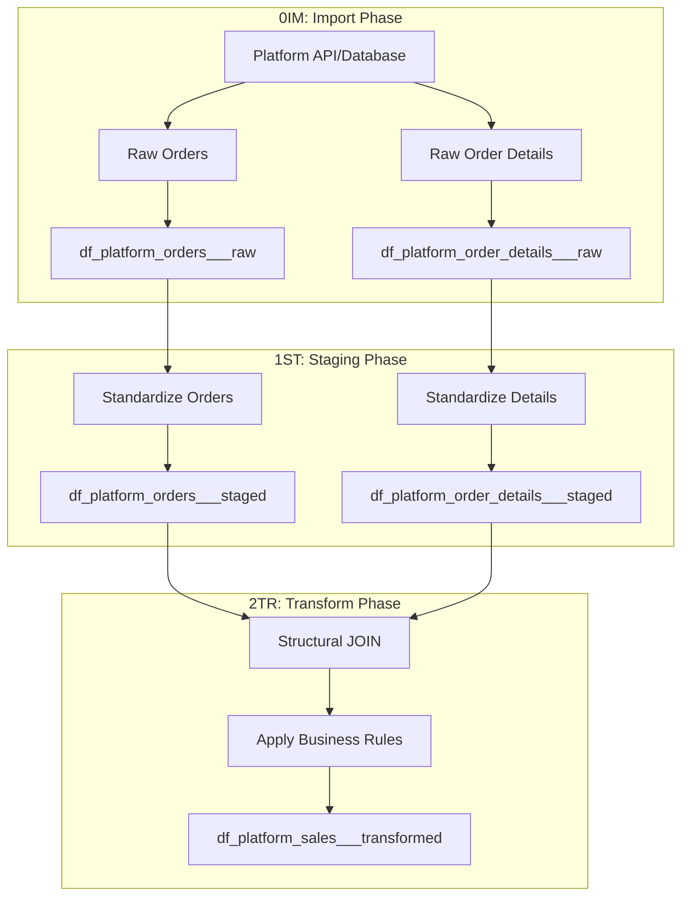

---

title: "Sales Pipeline Patterns"
subtitle: "ETL Patterns for Transaction and Order Data"
category: "ETL Pipelines - Sales"
level: "CH11.01"
status: "Active"
created: "2025-08-29"
modified: "2025-12-24"
version: "2.0"
principle_refs:
  - "MP104: ETL Data Flow Separation"
  - "MP102: ETL Output Standardization"
  - "DM_R040: Structural JOIN Pattern"
---

# Sales Pipeline Patterns

## Overview

The sales pipeline handles transaction-level data across platforms. This is often the most complex ETL as it may involve joining order headers with order details to create denormalized sales records.

## Pipeline Architecture



## Data Flow Patterns

### Pattern 1: Separate Tables → Joined Sales

**When to use**: Source has normalized order headers and details

```r
# 0IM: Import separately
eby_ETL_orders_0IM.R        # Imports order headers
eby_ETL_order_details_0IM.R # Imports order line items

# 1ST: Stage separately
eby_ETL_orders_1ST.R        # Standardizes headers
eby_ETL_order_details_1ST.R # Standardizes details

# 2TR: Join to create sales
eby_ETL_sales_2TR.R         # JOINs and transforms to sales
```

**Platform note (MAMBA eBay)**:
- Sales is a derived entity; run **orders 0IM/1ST + order_details 0IM/1ST + sales 2TR** only.
- Join uses a **composite key**: `orders.order_id + orders.seller_ebay_email` ↔ `details.order_id + details.batch_key` (ORE013 seller-email copy). Order ID alone is not unique.
- Ensure `product_sku` is standardized in order_details 1ST (prefer ERP product no, then application data).
- BAYORE has no order date; apply any date filter in orders 0IM (optional env var), not in order_details 0IM.

### Pattern 2: Pre-Joined Sales Data

**When to use**: Source already provides denormalized sales

```r
# 0IM: Import sales directly
cbz_ETL_sales_0IM.R  # Imports complete sales records

# 1ST: Stage sales
cbz_ETL_sales_1ST.R  # Standardizes columns/types

# 2TR: Transform sales
cbz_ETL_sales_2TR.R  # Applies business rules
```

### Pattern 3: Mixed Data Requiring Split

**When to use**: API returns all data types together

```r
# 0IM: Shared import then split
cbz_ETL_shared_0IM.R  # Fetches all, splits by type
  → Outputs to: df_cbz_sales___raw
  → Outputs to: df_cbz_customers___raw
  → Outputs to: df_cbz_orders___raw

# 1ST & 2TR: Process separately
cbz_ETL_sales_1ST.R
cbz_ETL_sales_2TR.R
```

## Standard Output Schema

All sales pipelines must output these standardized columns:

```yaml
df_{platform}_sales___transformed:
  # Identifiers
  - transaction_id: STRING      # Unique transaction ID
  - order_id: STRING            # Parent order ID
  - product_id: STRING          # Standardized SKU
  - customer_id: STRING         # Unique customer identifier

  # Metrics
  - quantity: DOUBLE            # Units sold
  - unit_price: DOUBLE          # Price per unit
  - total_amount: DOUBLE        # quantity * unit_price
  - discount_amount: DOUBLE     # Any discounts applied
  - tax_amount: DOUBLE          # Tax collected
  - net_revenue: DOUBLE         # Final revenue

  # Dimensions
  - sale_date: DATE             # Transaction date
  - platform_id: STRING(3)    # eby, cbz, amz
  - currency_code: STRING(3)    # USD, TWD, etc.

  # Metadata
  - transform_timestamp: TIMESTAMP
```

## 0IM Phase Pattern

```r
# {platform}_ETL_sales_0IM.R
autoinit()

tryCatch({
  # Import from source - preserve raw structure
  orders_raw <- fetch_from_source(config)

  # Write to raw layer (NO transformations)
  dbWriteTable(raw_data, "df_{platform}_orders___raw", orders_raw)

  # ❌ NEVER JOIN in 0IM
  # ❌ NEVER rename columns in 0IM

}, error = function(e) {
  stop("0IM failed: ", e$message)
})

autodeinit()
```

## 1ST Phase Pattern

```r
# {platform}_ETL_sales_1ST.R
autoinit()

tryCatch({
  # Read from raw layer
  orders_raw <- dbReadTable(raw_data, "df_{platform}_orders___raw")

  # Standardize formats
  orders_staged <- orders_raw %>%
    mutate(
      order_date = parse_date_time(order_date, orders = c("ymd", "mdy")),
      customer_name = iconv(customer_name, to = "UTF-8"),
      staged_timestamp = Sys.time()
    )

  # Write to staged layer (NO JOINs)
  dbWriteTable(staged_data, "df_{platform}_orders___staged", orders_staged)

  # ❌ NEVER JOIN in 1ST

}, error = function(e) {
  stop("1ST failed: ", e$message)
})

autodeinit()
```

## 2TR Phase Pattern (with Structural JOIN)

```r
# {platform}_ETL_sales_2TR.R
autoinit()

tryCatch({
  # Read staged tables
  orders_staged <- dbReadTable(staged_data, "df_{platform}_orders___staged")
  details_staged <- dbReadTable(staged_data, "df_{platform}_order_details___staged")

  # ✅ STRUCTURAL JOIN happens here
  sales_transformed <- orders_staged %>%
    inner_join(details_staged, by = "order_id") %>%
    mutate(
      transaction_id = paste0(order_id, "_", line_number),
      total_amount = quantity * unit_price,
      platform_id = "{platform}",
      transform_timestamp = Sys.time()
    )

  # Write to transformed layer
  dbWriteTable(transformed_data, "df_{platform}_sales___transformed", sales_transformed)

}, error = function(e) {
  stop("2TR failed: ", e$message)
})

autodeinit()
```

## Common Challenges & Solutions

### Challenge 1: Order vs. Order Details

**Problem**: Source has separate order headers and line items
**Solution**: Keep separate until 2TR, then perform structural JOIN

### Challenge 2: Currency Conversion

**Problem**: Sales in multiple currencies
**Solution**: Standardize to base currency in 2TR phase

```r
# In 2TR
sales_transformed <- sales_staged %>%
  left_join(exchange_rates, by = c("currency_code", "sale_date")) %>%
  mutate(unit_price_base = unit_price * exchange_rate)
```

### Challenge 3: Missing Customer IDs

**Problem**: Some platforms don't provide consistent customer IDs
**Solution**: Create synthetic IDs in 1ST phase

```r
# In 1ST
sales_staged <- sales_raw %>%
  mutate(
    customer_id = coalesce(
      buyer_id,
      digest::digest(email, algo = "md5"),
      paste0("GUEST_", order_id)
    )
  )
```

## Validation Requirements

| Phase | Validation | Action on Failure |
|-------|-----------|-------------------|
| **0IM** | Row count > 0, required columns present | Stop pipeline |
| **1ST** | Data types correct, no invalid dates | Log warning, continue |
| **2TR** | No negative quantities, totals calculate correctly | Quarantine rows |

## Related Documentation

- [index.qmd](index.qmd) - CH11 Overview
- [04_special_patterns.qmd](04_special_patterns.qmd) - Structural JOIN details
- [05_etl_independence.qmd](05_etl_independence.qmd) - Independence requirements

---

*Consolidated from `01_sales_pipeline/` directory on 2025-12-24*
