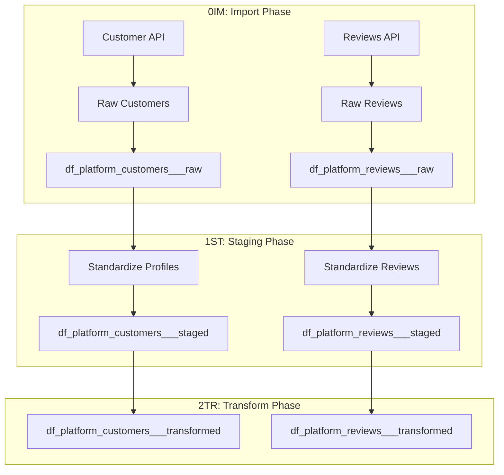

---

title: "Customers Pipeline Patterns"
subtitle: "ETL Patterns for Customer Profiles and Reviews"
category: "ETL Pipelines - Customers"
level: "CH11.02"
status: "Active"
created: "2025-08-29"
modified: "2025-12-24"
version: "2.0"
principle_refs:
  - "MP104: ETL Data Flow Separation"
  - "MP102: ETL Output Standardization"
  - "MP107: ETL Pipeline Independence"
---

# Customers Pipeline Patterns

## Overview

The customers pipeline handles customer profile data and reviews. This includes customer master data, preferences, and user-generated content like product reviews.

## Pipeline Architecture



## Customer Profile Pattern

### 0IM: Import Customer Profiles

```r
# {platform}_ETL_customers_0IM.R
autoinit()

tryCatch({
  # Import customer profiles from source
  customers_raw <- fetch_customers_from_api(config)

  # Preserve raw structure
  customers_raw$import_timestamp <- Sys.time()
  customers_raw$import_source <- config$platform_id

  # Write to raw layer
  dbWriteTable(raw_data, "df_{platform}_customers___raw", customers_raw)

  message("Imported ", nrow(customers_raw), " customer records")

}, error = function(e) {
  stop("0IM failed: ", e$message)
})

autodeinit()
```

### 1ST: Stage Customer Profiles

```r
# {platform}_ETL_customers_1ST.R
autoinit()

tryCatch({
  # Read raw customers
  customers_raw <- dbReadTable(raw_data, "df_{platform}_customers___raw")

  # Standardize formats
  customers_staged <- customers_raw %>%
    mutate(
      # Normalize email
      email = tolower(trimws(email)),

      # Parse registration date
      registration_date = parse_date_time(registration_date, orders = c("ymd", "mdy")),

      # Fix encoding
      customer_name = iconv(customer_name, to = "UTF-8"),

      # Add staging metadata
      staged_timestamp = Sys.time()
    )

  # Write to staged layer
  dbWriteTable(staged_data, "df_{platform}_customers___staged", customers_staged)

}, error = function(e) {
  stop("1ST failed: ", e$message)
})

autodeinit()
```

### 2TR: Transform Customer Profiles

```r
# {platform}_ETL_customers_2TR.R
autoinit()

tryCatch({
  # Read staged customers
  customers_staged <- dbReadTable(staged_data, "df_{platform}_customers___staged")

  # Apply business transformations
  customers_transformed <- customers_staged %>%
    mutate(
      # Standardize customer ID
      customer_id = as.character(customer_id),

      # Calculate account age
      account_age_days = as.integer(Sys.Date() - as.Date(registration_date)),

      # Add platform identifier
      platform_id = "{platform}",

      # Transformation metadata
      transform_timestamp = Sys.time()
    ) %>%
    select(
      customer_id, email, customer_name,
      registration_date, account_age_days,
      platform_id, transform_timestamp
    )

  # Write to transformed layer
  dbWriteTable(transformed_data, "df_{platform}_customers___transformed", customers_transformed)

}, error = function(e) {
  stop("2TR failed: ", e$message)
})

autodeinit()
```

## Reviews Import Pattern

### 0IM: Import Reviews

```r
# {platform}_ETL_reviews_0IM.R
autoinit()

tryCatch({
  # Import reviews from source
  reviews_raw <- fetch_reviews_from_api(config)

  # Preserve raw structure
  reviews_raw$import_timestamp <- Sys.time()

  # Write to raw layer
  dbWriteTable(raw_data, "df_{platform}_reviews___raw", reviews_raw)

  message("Imported ", nrow(reviews_raw), " reviews")

}, error = function(e) {
  stop("0IM failed: ", e$message)
})

autodeinit()
```

### 1ST: Stage Reviews

```r
# {platform}_ETL_reviews_1ST.R
autoinit()

tryCatch({
  # Read raw reviews
  reviews_raw <- dbReadTable(raw_data, "df_{platform}_reviews___raw")

  # Standardize formats
  reviews_staged <- reviews_raw %>%
    mutate(
      # Parse review date
      review_date = parse_date_time(review_date, orders = c("ymd", "mdy")),

      # Normalize rating to 1-5 scale
      rating_normalized = case_when(
        rating <= 1 ~ 1,
        rating >= 5 ~ 5,
        TRUE ~ as.integer(rating)
      ),

      # Clean review text
      review_text = iconv(review_text, to = "UTF-8"),
      review_text = trimws(review_text),

      # Staging metadata
      staged_timestamp = Sys.time()
    )

  # Write to staged layer
  dbWriteTable(staged_data, "df_{platform}_reviews___staged", reviews_staged)

}, error = function(e) {
  stop("1ST failed: ", e$message)
})

autodeinit()
```

### 2TR: Transform Reviews

```r
# {platform}_ETL_reviews_2TR.R
autoinit()

tryCatch({
  # Read staged reviews
  reviews_staged <- dbReadTable(staged_data, "df_{platform}_reviews___staged")

  # Apply business transformations
  reviews_transformed <- reviews_staged %>%
    mutate(
      # Create unique review ID
      review_id = paste0(platform_id, "_", row_number()),

      # Calculate review length
      review_length = nchar(review_text),

      # Flag verified purchases
      is_verified = coalesce(verified_purchase, FALSE),

      # Platform ID
      platform_id = "{platform}",

      # Transformation metadata
      transform_timestamp = Sys.time()
    )

  # Write to transformed layer
  dbWriteTable(transformed_data, "df_{platform}_reviews___transformed", reviews_transformed)

}, error = function(e) {
  stop("2TR failed: ", e$message)
})

autodeinit()
```

## Standard Output Schemas

### Customer Profile Schema

```yaml
df_{platform}_customers___transformed:
  - customer_id: STRING         # Unique customer identifier
  - email: STRING               # Normalized email
  - customer_name: STRING       # UTF-8 encoded name
  - registration_date: DATE     # Account creation date
  - account_age_days: INTEGER   # Days since registration
  - platform_id: STRING(3)    # Platform identifier
  - transform_timestamp: TIMESTAMP
```

### Reviews Schema

```yaml
df_{platform}_reviews___transformed:
  - review_id: STRING           # Unique review identifier
  - product_id: STRING          # Associated product
  - customer_id: STRING         # Reviewer ID (if available)
  - rating_normalized: INTEGER  # 1-5 scale
  - review_text: STRING         # UTF-8 review content
  - review_date: DATE           # When review was posted
  - review_length: INTEGER      # Character count
  - is_verified: BOOLEAN        # Verified purchase flag
  - platform_id: STRING(3)    # Platform identifier
  - transform_timestamp: TIMESTAMP
```

## Special Considerations

### Customer ID Resolution

When customer IDs are inconsistent across platforms:

```r
# Create unified customer ID
customer_id = case_when(
  !is.na(platform_customer_id) ~ paste0(platform_id, "_", platform_customer_id),
  !is.na(email) ~ digest::digest(tolower(email), algo = "md5"),
  TRUE ~ paste0("ANON_", row_number())
)
```

### Multilingual Review Handling

For reviews in multiple languages:

```r
# Detect and tag language in 1ST phase
reviews_staged <- reviews_raw %>%
  mutate(
    detected_language = detect_language(review_text),
    review_text = iconv(review_text, to = "UTF-8")
  )
```

### Privacy Considerations

```r
# In 2TR phase, remove PII if needed
customers_transformed <- customers_staged %>%
  mutate(
    # Hash email for privacy
    email_hash = digest::digest(email, algo = "sha256"),
    # Remove raw email if required
    email = NULL
  )
```

## Validation Requirements

| Phase | Validation | Action |
|-------|-----------|--------|
| **0IM** | Records imported > 0 | Stop if empty |
| **1ST** | Email format valid, dates parseable | Log warnings |
| **2TR** | No duplicate customer_ids | Deduplicate |

## Related Documentation

- [index.qmd](index.qmd) - CH11 Overview
- [01_sales_pipeline.qmd](01_sales_pipeline.qmd) - Sales patterns
- [05_etl_independence.qmd](05_etl_independence.qmd) - Independence requirements

---

*Consolidated from `02_customers_pipeline/` directory on 2025-12-24*
