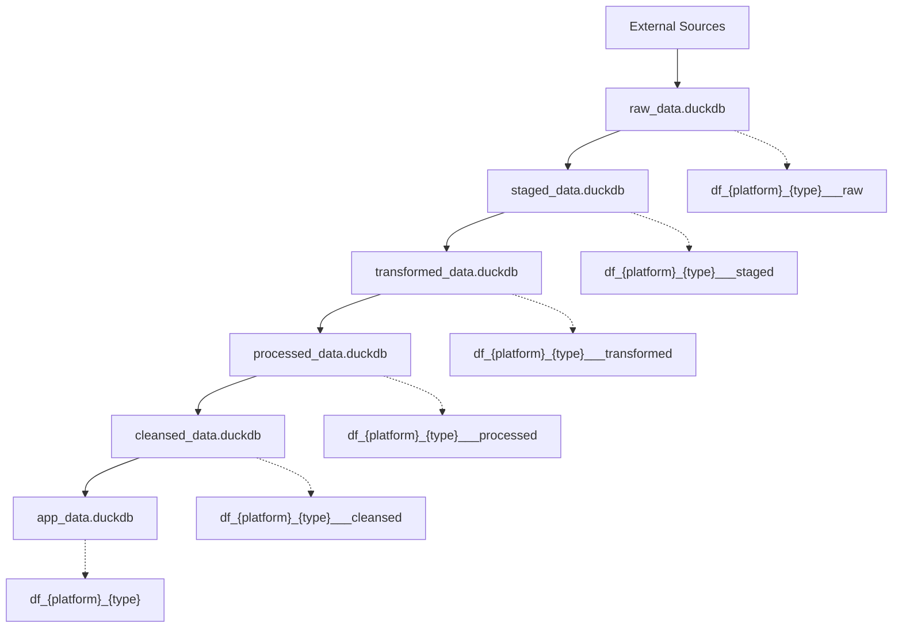

---

title: "CH11: ETL Pipeline Patterns"
subtitle: "Architecture, Naming, and Decision Guide for ETL Implementations"
category: "ETL Pipelines"
level: "CH11"
status: "Active"
created: "2025-08-29"
modified: "2025-12-24"
version: "3.0"
principle_refs:
  - "MP144: Unique Identity Principle"
  - "MP107: ETL Pipeline Independence"
  - "MP108: ETL Phase Sequence"
  - "MP064: ETL-Derivation Separation"
  - "MP104: ETL Data Flow Separation"
  - "DM_R037: Company-Specific ETL Naming"
---

# CH11: ETL Pipeline Patterns

## Overview

This chapter documents **pure patterns** for ETL pipeline implementations. Each pipeline follows the three-phase model (0IM → 1ST → 2TR) with strict independence requirements.

## Core Architecture

### The Three-Phase Model


| Phase | Purpose | Operations Allowed | Operations Forbidden |
|-------|---------|-------------------|---------------------|
| **0IM (Import)** | Raw data preservation | Data extraction, encoding, validation | JOINs, business logic, column renaming |
| **1ST (Staging)** | Format standardization | Column renaming, type conversion | JOINs, calculations, aggregations |
| **2TR (Transform)** | Business transformation | Structural JOINs, schema mapping | Analytical JOINs, ML processing |

### Key Principles

| Principle | ID | Summary |
|-----------|-----|---------|
| **ETL Independence** | MP107 | Every ETL is self-contained and parallel-ready |
| **Phase Sequence** | MP108 | 0IM → 1ST → 2TR within each pipeline |
| **ETL-Derivation Separation** | MP064 | ETL prepares data, Derivations analyze |
| **Data Type Separation** | MP104 | Each data type has its own pipeline |

## Pipeline Types

| Pipeline | Documentation | Purpose |
|----------|--------------|---------|
| **Sales** | [01_sales_pipeline.qmd](01_sales_pipeline.qmd) | Transaction and order data |
| **Customers** | [02_customers_pipeline.qmd](02_customers_pipeline.qmd) | Customer profiles and reviews |
| **Products** | [03_products_pipeline.qmd](03_products_pipeline.qmd) | Product catalog data |
| **Special Patterns** | [04_special_patterns.qmd](04_special_patterns.qmd) | Structural JOINs, extensible patterns |
| **Independence Guide** | [05_etl_independence.qmd](05_etl_independence.qmd) | MP107 implementation details |

## Quick Decision Tree

```
START: Need to build ETL?
  │
  ├─ What data type?
  │   ├─ Sales transactions → 01_sales_pipeline
  │   ├─ Customer profiles → 02_customers_pipeline
  │   ├─ Product catalog → 03_products_pipeline
  │   └─ Multiple types → Separate pipelines per MP104
  │
  ├─ Company-specific logic needed?
  │   ├─ Yes → Add ___COMPANY suffix (e.g., ___MAMBA)
  │   └─ No → Use standard naming
  │
  └─ Need to JOIN tables?
      ├─ In 0IM/1ST → ❌ NEVER
      └─ In 2TR → ✅ Only structural JOINs
```

## Naming Conventions

### File Naming Pattern

```
Standard:  {platform}_ETL_{datatype}_{phase}.R
Company:   {platform}_ETL_{datatype}_{phase}___{COMPANY}.R

Examples:
  eby_ETL_sales_0IM.R              # Standard eBay import
  eby_ETL_sales_0IM___MAMBA.R      # MAMBA-specific import
  cbz_ETL_customers_2TR.R          # Cyberbiz customer transform
```

### Table Naming Pattern

```
Raw:         df_{platform}_{datatype}___raw
Staged:      df_{platform}_{datatype}___staged
Transformed: df_{platform}_{datatype}___transformed

Examples:
  df_eby_orders___raw
  df_eby_orders___staged
  df_eby_sales___transformed
```

### Common Platform IDs

| Code | Platform |
|------|----------|
| `eby` | eBay |
| `cbz` | Cyberbiz |
| `amz` | Amazon |

### Complete 6-Layer Table Naming Convention

> **Principle Reference**: The `___` suffix naming convention is derived from **MP144: Unique Identity Principle** - different entities (data at different stages) must have different names to be uniquely identifiable.

| Layer | Phase | Code | Suffix | Database | Example |
|-------|-------|------|--------|----------|---------|
| 0 | Import | 0IM | `___raw` | raw_data.duckdb | `df_cbz_orders___raw` |
| 1 | Staging | 1ST | `___staged` | staged_data.duckdb | `df_cbz_orders___staged` |
| 2 | Transform | 2TR | `___transformed` | transformed_data.duckdb | `df_cbz_orders___transformed` |
| 3 | Process | 3PR | `___processed` | processed_data.duckdb | `df_cbz_orders___processed` |
| 4 | Cleanse | 4CL | `___cleansed` | cleansed_data.duckdb | `df_cbz_orders___cleansed` |
| 5 | Normalize | 5NM | *(no suffix)* | app_data.duckdb | `df_cbz_orders` |

**Note**: Layers 0-2 are ETL phases, Layers 3-5 are DRV (Derivation) phases. The `app_data` layer (5NM) does not use a suffix to indicate it is the final, application-ready product.

## Database Layer Architecture



**Layer Boundaries:**
- **ETL Layers (0-2)**: Data movement and standardization
- **DRV Layers (3-5)**: Business logic and derivations

## ETL Template Structure

Every ETL script follows this five-part structure:

```r
# {platform}_ETL_{datatype}_{phase}.R

# ==============================================================================
# PART 1: INITIALIZE
# ==============================================================================
autoinit(verbose = TRUE)

# ==============================================================================
# PART 2: MAIN
# ==============================================================================
tryCatch({
  # Phase-specific logic here
  # 0IM: Import from source
  # 1ST: Standardize and validate
  # 2TR: Transform and JOIN (if applicable)

}, error = function(e) {
  stop("ETL failed: ", e$message)
})

# ==============================================================================
# PART 3: TEST
# ==============================================================================
# Validate outputs exist and have expected structure

# ==============================================================================
# PART 4: SUMMARIZE
# ==============================================================================
message("ETL complete: ", nrow(result), " rows processed")

# ==============================================================================
# PART 5: DEINITIALIZE
# ==============================================================================
autodeinit()  # MUST be final statement
```

## Independence Requirements (MP107)

**The Golden Rule Test:**
> "Can I run this ETL right now, by itself, without running anything else first?"

Every ETL MUST be:
- **Self-Initializing**: Contains its own `autoinit()`
- **Self-Contained**: All resources obtained internally
- **Standalone Executable**: Can run without other ETLs
- **Parallel-Ready**: Can run simultaneously with all other ETLs
- **Selectively Runnable**: Can be skipped without breaking anything

See [05_etl_independence.qmd](05_etl_independence.qmd) for detailed implementation patterns.

## Related Principles

- **MP144**: Unique Identity Principle (foundation for `___` suffix naming)
- **MP107**: ETL Pipeline Independence
- **MP108**: ETL Phase Sequence
- **MP064**: ETL-Derivation Separation
- **MP104**: ETL Data Flow Separation
- **DM_R037**: Company-Specific ETL Naming
- **DM_R040**: Structural JOIN Pattern

## See Also

- **[CH10: Data Flow Architecture](../CH11_data_flow_architecture/index.qmd)** - Conceptual 6-layer symmetric architecture

**Relationship:**
- CH10 defines the **conceptual architecture** (6 layers: ETL 3 + DRV 3)
- CH11 provides **implementation patterns** (actual ETL scripts, naming conventions)

---

*Simplified from complex directory structure on 2025-12-24*
*Previous version archived in `_archive/2025-08-29_original/`*
