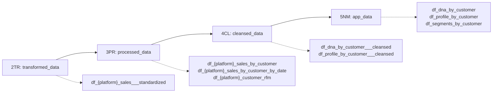

---

title: "D01: Customer DNA Analysis Derivation"
subtitle: "Business logic for customer DNA analysis using ETL-prepared sales data"
chapter: "CH12"
category: "derivation"
number: "D01"
article-number: "Derivation 1"
date-created: "2024-04-07"
date-modified: "2026-02-08"
author: "Claude"
type: "derivation"
law: "Derivation Workflows"
derives_from:
  - "MP064": "ETL-Derivation Separation Principle"
  - "MP144": "Unique Identity Principle (___suffix naming)"
consumes:
  - "ETL01": "Sales Data Preparation Pipeline"
  - "D00_app_data_init": "App data schema with primary keys"
related_to:
  - "MP092_platform_id_standard"
  - "DM_R022_platform_id_convention"
  - "R039_derivation_platform_independence"
  - "R041_derivation_folder_structure"
  - "R120_filter_variable_naming_convention"
  - "S03_product_line_mapping_sequence"
implementation_scripts:
  cbz:
    - "cbz_D01_00.R"
    - "cbz_D01_01.R"
    - "cbz_D01_02.R"
    - "cbz_D01_03.R"
    - "cbz_D01_04.R"
    - "cbz_D01_05.R"
    - "cbz_D01_06.R"
  amz:
    - "amz_D01_00.R"
    - "amz_D01_01.R"
    - "amz_D01_02.R"
    - "amz_D01_03.R"
    - "amz_D01_04.R"
    - "amz_D01_05.R"
    - "amz_D01_06.R"
  eby:
    - "eby_D01_00.R"
    - "eby_D01_01.R"
    - "eby_D01_02.R"
    - "eby_D01_03.R"
    - "eby_D01_04.R"
    - "eby_D01_05.R"
    - "eby_D01_06.R"
  all:
    - "all_D01_06.R"
format:
  html:
    toc: true
    toc-depth: 3
    code-fold: false
    code-tools: true
    number-sections: true
---

# D01: Customer DNA Analysis Overview {#overview}

D01 is the customer-behavior derivation pipeline. It consumes ETL-standardized sales data, computes customer behavioral features and DNA, and publishes app-ready tables.

## Task Files

| Task | File | Description | DRV Scripts |
|------|------|-------------|-------------|
| D01_00 | [D01_00_consume_etl_output.qmd](D01_00_consume_etl_output.qmd) | Consume ETL01 Output | `{platform}_D01_00.R` |
| D01_01 | [D01_01_customer_aggregation.qmd](D01_01_customer_aggregation.qmd) | Customer Aggregation | `{platform}_D01_01.R` |
| D01_02 | [D01_02_rfm_calculation.qmd](D01_02_rfm_calculation.qmd) | Customer Features + DNA Computation | `{platform}_D01_02.R` |
| D01_03 | [D01_03_dna_analysis.qmd](D01_03_dna_analysis.qmd) | Customer Profile Creation | `{platform}_D01_03.R` |
| D01_04 | [D01_04_customer_profile.qmd](D01_04_customer_profile.qmd) | Application Views Generation | `{platform}_D01_04.R` |
| D01_05 | [D01_05_app_views.qmd](D01_05_app_views.qmd) | Final Validation | `{platform}_D01_05.R` |
| D01_06 | [D01_06_execution.qmd](D01_06_execution.qmd) | Master Execution Flow | `{platform}_D01_06.R` |
| D01_07 | [D01_07_module_consumers.qmd](D01_07_module_consumers.qmd) | Application Module Consumers | (documentation) |

## Data Dimensions {#dimensions}

D01 operates across three key dimensions:

1. **Platform** (`platform_id`)
2. **Product Line Filter** (`product_line_id_filter`)
3. **Customer** (`customer_id`)

## Derivation Process {#process}

```
ETL01 OUTPUT (2TR) -> AGGREGATION (3PR) -> FEATURES+DNA (3PR+4CL) -> PROFILE (4CL) -> APP VIEWS (5NM) -> VALIDATION
```

### Database Layer Flow {#layer-flow}



## Complete D01 Flow (NSQL) {#complete-flow-nsql}

```nsql
FLOW D01_customer_dna_analysis:
  STEP D01_00: Consume ETL output
  STEP D01_01: Build customer aggregations
  STEP D01_02: Compute customer features and run analysis_dna()
  STEP D01_03: Create customer profiles
  STEP D01_04: Normalize cleansed outputs into app_data
  STEP D01_05: Validate app_data outputs
```

## Key Principle

- D01_02 is the only computational owner for customer behavioral DNA metrics.
- D01_03 to D01_05 are downstream consumption, normalization, and validation steps.
