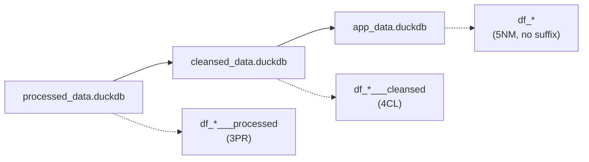

---

title: "D02: Customer View Filtering Derivation"
subtitle: "Dynamic view layer for multi-dimensional customer filtering"
chapter: "CH12"
category: "derivation"
number: "D02"
date-created: "2025-05-19"
date-modified: "2025-12-24"
author: "Claude"
type: "derivation-index"
law: "Derivation Workflows"
article-number: "Derivation 2"
structure: "directory"
task_files:
  - "D02_00_grid_initialization.qmd"
  - "D02_01_condition_grid.qmd"
  - "D02_02_filtered_sales_views.qmd"
  - "D02_03_customer_views.qmd"
  - "D02_04_dna_integration.qmd"
  - "D02_05_execution.qmd"
  - "D02_06_module_consumers.qmd"
derives_from:
  - "MP064": "ETL-Derivation Separation Principle"
  - "DM_R044": "Derivation Implementation Standard"
  - "DM_R049": "Derivation Consumer Documentation"
  - "MP144": "Unique Identity Principle"
consumes:
  - "ETL (all platforms)": "Transformed sales data (df_{source}_sales___transformed___MAMBA)"
  - "D01": "Customer DNA Analysis (df_dna_by_customer)"
related_to:
  - "D01_dna_analysis"
  - "R039_derivation_platform_independence"
  - "R040_derivation_implementation_naming"
  - "R116_enhanced_data_access_tbl2"
  - "MP027_integrated_natural_sql_language"
  - "MP058_global_parameter_organization"
format:
  html:
    toc: true
    toc-depth: 3
    code-fold: false
    code-tools: true
    number-sections: true
---

# D02: Customer View Filtering Overview {#overview}

This derivation extends D01 (DNA Analysis) to create filtered customer views based on multiple filter condition combinations. It transforms sales data into filtered views that can be accessed by micro-components to display personalized content for specific filter combinations.

## Complete D02 Flow (NSQL)

```nsql
# D02 Complete Customer View Filtering Flow
FLOW D02_customer_view_filtering:
  PREREQUISITE: D01.success = TRUE

  STEP D02_00: "Create Filtered Schema" [Layer: 3PR]
    CREATE SCHEMA processed_data.filtered

  STEP D02_01: "Create Condition Grid" [Layer: 3PR]
    GENERATE grid_components FROM configuration
    CREATE condition_grids AS CARTESIAN_PRODUCT(grid_components)

  STEP D02_02: "Create Filtered Sales Views" [Layer: 4CL]
    FOR EACH condition IN condition_grids:
      FILTER processed_data.df_{source}_sales___processed BY condition
      TO cleansed_data.filtered.df_sales_{condition_key}___cleansed

  STEP D02_03: "Create Customer Aggregation Views" [Layer: 4CL]
    FOR EACH condition IN condition_grids:
      AGGREGATE cleansed_data.filtered.df_sales___cleansed BY customer_id
      TO cleansed_data.filtered.df_sales_by_customer_{condition_key}___cleansed

  STEP D02_04: "Integrate with DNA Profiles" [Layer: 5NM]
    FOR EACH condition IN condition_grids:
      JOIN df_sales_by_customer_{key}___cleansed WITH app_data.df_dna_by_customer
      TO app_data.df_customer_complete_{condition_key}   # Final: no suffix
```

## Database Layer Flow



## Flow Diagram

```
ETL OUTPUTS → FILTERED SCHEMA → CONDITION GRID → SALES VIEWS → CUSTOMER VIEWS → APP DATA
   (3PR)          (3PR)            (3PR)          (4CL)          (4CL)         (5NM)
```

## Task Files

| Task | File | Description |
|------|------|-------------|
| D02_00 | [Grid Initialization](D02_00_grid_initialization.qmd) | Create filtered schema |
| D02_01 | [Condition Grid](D02_01_condition_grid.qmd) | Generate condition grid |
| D02_02 | [Filtered Sales Views](D02_02_filtered_sales_views.qmd) | Create sales views |
| D02_03 | [Customer Views](D02_03_customer_views.qmd) | Customer aggregation views |
| D02_04 | [DNA Integration](D02_04_dna_integration.qmd) | Integrate with D01 DNA profiles |
| D02_05 | [Execution](D02_05_execution.qmd) | Master execution flow |
| D02_06 | [Module Consumers](D02_06_module_consumers.qmd) | UI modules consuming D02 outputs |

## Filter Dimensions

The filtering system is built on four key dimensions:

| Dimension | Values | Description |
|-----------|--------|-------------|
| **Time Condition** | `now`, `m1year`, `m1quarter`, `m1month`, `m2year`, `ytd` | Time range filter |
| **Product Line** | `0` (all), `1, 2, 3, ...` | Product line filter |
| **Geographic Region** | `ALL` (all), `CA, NY, TX, ...` | Geographic filter |
| **Data Source** | `amazon`, `ebay`, `retail`, `cbz` | Platform/channel filter |

## Dependency Graph

```
┌─────────────────────┐
│ D01 DNA Analysis    │
│    (prerequisite)   │
└──────────┬──────────┘
           │
           ▼
┌─────────────────────┐     ┌─────────────────────┐
│     D02_00          │     │ ETL Platform        │
│ Grid Initialization │     │ Outputs             │
└──────────┬──────────┘     └──────────┬──────────┘
           │                           │
           └───────────┬───────────────┘
                       │
                       ▼
              ┌─────────────────────┐
              │      D02_01         │
              │  Condition Grid     │
              └──────────┬──────────┘
                         │
                         ▼
              ┌─────────────────────┐
              │      D02_02         │
              │ Filtered Sales Views│
              └──────────┬──────────┘
                         │
                         ▼
              ┌─────────────────────┐
              │      D02_03         │
              │  Customer Views     │
              └──────────┬──────────┘
                         │
                         ▼
              ┌─────────────────────┐
              │      D02_04         │
              │  DNA Integration    │
              └──────────┬──────────┘
                         │
                         ▼
              ┌─────────────────────┐
              │      D02_05         │
              │   Execution Flow    │
              └──────────┬──────────┘
                         │
                         ▼
              ┌─────────────────────┐
              │      D02_06         │
              │  Module Consumers   │
              └─────────────────────┘
```

## Prerequisites

1. **D01 completed**: Customer DNA profiles must exist
2. **ETL platform outputs**: Transformed sales data from all platforms
3. **Grid configuration**: `app_data/parameters/list_grid_components.R`
4. **Platform identifiers**: `amazon`, `ebay`, `retail`, `cbz`

## View Naming Convention

```nsql
# D02 View Naming Convention
PATTERN: "df_sales_{source}_{time}_{product}_{state}"
CUSTOMER_PATTERN: "df_sales_by_customer_{source}_{time}_{product}_{state}"

EXAMPLES:
  - "df_sales_amazon_now_0_all"     # Amazon, all time, all products, all states
  - "df_sales_ebay_m1quarter_2_ca"  # eBay, past quarter, product 2, California
  - "df_sales_by_customer_cbz_m1month_1_ny"  # Cyberbiz customer view
```

## Key Principle

This derivation exemplifies the **ETL-Derivation Separation Principle (MP064)** by:

1. **Consuming clean data**: All data preparation handled by ETL pipelines
2. **Focusing on business logic**: Only view creation and filtering
3. **Clear boundaries**: No data cleansing within derivation steps
4. **Reusability**: Virtual views enable efficient multi-dimensional filtering
