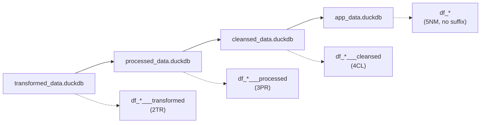

---

title: "D03: Positioning Analysis Derivation"
subtitle: "Competitive positioning analysis using ETL-prepared data"
chapter: "CH12"
category: "derivation"
number: "D03"
article-number: "Derivation 3"
date-created: "2025-05-16"
date-modified: "2026-02-13"
author: "Claude"
type: "derivation-index"
law: "Derivation Workflows"
structure: "directory"
derives_from:
  - "MP064": "ETL-Derivation Separation Principle"
  - "DM_R044": "Derivation Implementation Standard"
  - "DM_R049": "Derivation Consumer Documentation"
  - "MP144": "Unique Identity Principle"
  - "MP150": "Dataflow Tracking and Execution Telemetry"
consumes:
  - "ETL03": "Product Profiles Pipeline"
  - "ETL04": "Competitor Analysis Pipeline"
  - "ETL05": "Comment Properties Pipeline"
  - "ETL06": "Reviews Preparation Pipeline"
  - "ETL07": "Competitor Sales Pipeline"
task_files:
  - "D03_00_consume_etl_output.qmd"
  - "D03_01_comment_property_rating.qmd"
  - "D03_02_rate_reviews.qmd"
  - "D03_03_process_reviews.qmd"
  - "D03_04_query_by_asin.qmd"
  - "D03_05_position_table.qmd"
  - "D03_06_execution.qmd"
  - "D03_07_module_consumers.qmd"
related_to:
  - "R038": "Platform Numbering Convention"
  - "MP058": "Database Table Creation Strategy"
  - "MP043": "Database Documentation"
  - "MP073": "Interactive Visualization Preference"
  - "MP047": "Functional Programming"
  - "R021": "One Function One File"
  - "R069": "Function File Naming"
implementation_scripts:
  amz:
    - "amz_D03_08.R"
    - "amz_D03_06.R"
    - "amz_D03_09.R"
    - "amz_D03_07.R"
    - "amz_D03_10.R"
    - "amz_D03_11.R"
format:
  html:
    toc: true
    toc-depth: 3
    code-fold: false
    code-tools: true
    number-sections: true
---

# D03: Positioning Analysis Overview {#overview}

This document provides an overview of the **Positioning Analysis Derivation** (D03). D03 is the core business logic layer for competitive positioning analysis, consuming standardized product and review data from ETL03-07 and applying comment property rating, AI-powered review analysis, and position table generation.

## Task Files

D03 is organized into the following task files:

| Task | File | Description | DRV Scripts |
|------|------|-------------|-------------|
| D03_00 | [D03_00_consume_etl_output.qmd](D03_00_consume_etl_output.qmd) | Consume ETL03-07 Output | (conceptual) |
| D03_01 | [D03_01_comment_property_rating.qmd](D03_01_comment_property_rating.qmd) | Comment Property Rating | `{platform}_D03_08.R` |
| D03_02 | [D03_02_rate_reviews.qmd](D03_02_rate_reviews.qmd) | Rate Reviews (AI) | `{platform}_D03_06.R` |
| D03_03 | [D03_03_process_reviews.qmd](D03_03_process_reviews.qmd) | Process Reviews | `{platform}_D03_09.R` |
| D03_04 | [D03_04_query_by_asin.qmd](D03_04_query_by_asin.qmd) | Query by ASIN | `{platform}_D03_07.R` |
| D03_05 | [D03_05_position_table.qmd](D03_05_position_table.qmd) | Position Table Creation | `{platform}_D03_10.R`, `{platform}_D03_11.R` |
| D03_06 | [D03_06_execution.qmd](D03_06_execution.qmd) | Master Execution Flow | (documentation) |
| D03_07 | [D03_07_module_consumers.qmd](D03_07_module_consumers.qmd) | Application Module Consumers | (documentation) |

## ETL Migration History {#migration}

D03 has undergone significant refactoring, with data preparation steps migrated to ETL pipelines:

| Original Step | Migrated To | Description |
|---------------|-------------|-------------|
| D03_00 | ETL03 | Import Product Properties |
| Old D03_01 | ETL04 | Competitor Analysis |
| Old D03_02 | ETL05 | Comment Properties |
| Old D03_03-05 | ETL06 | Reviews Preparation |
| Old D03_10 | ETL07 | Competitor Sales |

**Current D03 focuses on business logic only**, consuming clean data from ETL pipelines.

## Derivation Process {#process}

```
ETL03-07 OUTPUT -> COMMENT RATING -> AI REVIEW ANALYSIS -> AGGREGATION -> POSITION TABLE -> APP VIEWS
```

**Key Principle**: D03 contains NO data preparation logic. All data cleansing, standardization, and transformation is handled by ETL03-07.

### Complete D03 Flow (NSQL) {#complete-flow-nsql}

```nsql
# D03 Complete Positioning Analysis Flow
FLOW D03_positioning_analysis:
  PREREQUISITE:
    ETL03.success = TRUE  # Product profiles
    ETL04.success = TRUE  # Competitor analysis
    ETL05.success = TRUE  # Comment properties
    ETL06.success = TRUE  # Reviews preparation
    ETL07.success = TRUE  # Competitor sales

  STEP D03_00: "Consume ETL Output" [Layer: 2TR→3PR]
    CONSUME transformed_data FROM ETL03-07
    VALIDATE required_tables: [df_product_profile, df_comment_property, df_review_data]

  STEP D03_01: "Comment Property Rating Analysis" [Layer: 3PR]
    FROM transformed_data.df_review_data___transformed
    SAMPLE latest N reviews per product_id
    TRANSFORM wide_to_long BY property_columns
    OUTPUT TO processed_data.df_sampled_long___processed

  STEP D03_02: "Rate Reviews (AI)" [Layer: 3PR]
    FROM processed_data.df_sampled_long___processed
    APPLY OpenAI_API rating per (review, property) pair
    OUTPUT TO processed_data.df_rating_results___processed

  STEP D03_03: "Process Reviews" [Layer: 4CL]
    FROM processed_data.df_rating_results___processed
    TRANSFORM long_to_wide BY property_columns
    OUTPUT TO cleansed_data.df_comment_property_ratingonly_{product_line_id}___cleansed

  STEP D03_04: "Query by ASIN" [Layer: 4CL]
    FROM cleansed_data.df_comment_property_ratingonly_{product_line_id}___cleansed
    AGGREGATE BY product_id (ASIN)
    OPTIONAL impute_missing WITH mice
    OUTPUT TO cleansed_data.df_comment_property_ratingonly_by_asin_{product_line_id}___cleansed

  STEP D03_05: "Create Position Table" [Layer: 5NM]
    JOIN all product line data from cleansed_data
    MERGE WITH competitor_sales, product_profiles
    OUTPUT TO app_data.df_position    # Final: no suffix
```

## Database Layer Flow



## Flow Diagram

```
ETL03-07 OUTPUT -> PROPERTY RATING -> AI ANALYSIS -> AGGREGATION -> POSITION TABLE -> APP DATA
    (2TR)            (3PR)             (3PR)          (4CL)           (5NM)
```

## Dependency Graph

```
┌─────────────────────┐
│ ETL03-07 Outputs    │
│    (prerequisite)   │
└──────────┬──────────┘
           │
           ▼
┌─────────────────────┐
│     D03_00          │
│ Consume ETL Output  │
└──────────┬──────────┘
           │
           ▼
┌─────────────────────┐
│     D03_01          │
│ Comment Property    │
│ Rating Analysis     │
└──────────┬──────────┘
           │
           ▼
┌─────────────────────┐
│     D03_02          │
│ Rate Reviews (AI)   │
└──────────┬──────────┘
           │
           ▼
┌─────────────────────┐
│     D03_03          │
│ Process Reviews     │
└──────────┬──────────┘
           │
           ▼
┌─────────────────────┐
│     D03_04          │
│ Query by ASIN       │
└──────────┬──────────┘
           │
           ▼
┌─────────────────────┐
│     D03_05          │
│ Position Table      │
└──────────┬──────────┘
           │
           ▼
┌─────────────────────┐
│     D03_06          │
│ Execution Flow      │
└──────────┬──────────┘
           │
           ▼
┌─────────────────────┐
│     D03_07          │
│ Module Consumers    │
└─────────────────────┘
```

## Implementation Scripts Location

All D03 implementation scripts are located in `/update_scripts/DRV/`:

```
update_scripts/DRV/
├── amz/
│   ├── amz_D03_08.R    # Comment Property Rating Analysis
│   ├── amz_D03_06.R    # Rate Reviews (AI)
│   ├── amz_D03_09.R    # Process Reviews
│   ├── amz_D03_07.R    # Query by ASIN
│   ├── amz_D03_10.R  # Position table preparation
│   └── amz_D03_11.R  # Position table finalization
└── cbz/
    └── (platform-specific implementations)
```

## ETL-Derivation Integration Pattern

### Clean Separation of Concerns

**ETL03-07 Responsibilities (Data Preparation)**:
- Import product profiles, competitor data, reviews
- Standardize formats and encoding
- Map schema and convert types
- Output: Clean, validated data

**D03 Responsibilities (Business Logic)**:
- Comment property rating analysis
- AI-powered review analysis
- Property aggregation by product
- Position table generation
- Application views

## Use Cases

1. **Competitive Positioning**: Compare brand attributes against competitors
2. **Review Analysis**: Extract product strengths/weaknesses from reviews
3. **Market Intelligence**: Understand competitive landscape through data

## Key Principle

This derivation exemplifies the **ETL-Derivation Separation Principle (MP064)** and **Dataflow Tracking and Execution Telemetry (MP150)** by:

1. **Consuming clean data**: All data preparation is handled by ETL03-07
2. **Focusing on business logic**: Only positioning analysis and AI processing
3. **Clear boundaries**: No data cleansing within derivation steps
4. **Reusability**: Multiple platforms can use the same derivation logic
5. **Execution observability**: optional-folder skips and empty-data paths are visible as durable metadata, not silent pass

## Related Documentation

- [DERIVATION_STANDARDS.qmd](../DERIVATION_STANDARDS.qmd) - Derivation coding standards
- [D00_app_data_init.qmd](../D00_app_data_init.qmd) - App data table definitions
- [MP064 ETL-Derivation Separation](../../part1_principles/CH00_fundamental_principles/04_data_management/MP064_etl_derivation_separation.qmd)
- [MP150 Dataflow Tracking and Execution Telemetry](../../part1_principles/CH00_fundamental_principles/04_data_management/MP150_dataflow_tracking_and_execution_telemetry.qmd)
