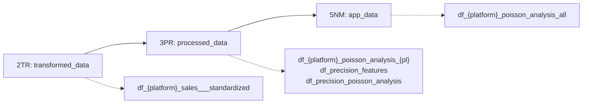

---

title: "D04: Poisson Precision Marketing"
subtitle: "Poisson analysis data preparation for app modules (visualization handled in app)"
chapter: "CH12"
category: "derivation"
number: "D04"
date-created: "2025-06-06"
date-modified: "2026-01-01"
author: "Claude"
type: "derivation-index"
law: "Derivation Workflows"
article-number: "Derivation 4"
structure: "directory"
task_files:
  - "D04_00_product_dictionary.qmd"
  - "D04_01_time_label_enrichment.qmd"
  - "D04_02_poisson_analysis.qmd"
  - "D04_03_r120_metadata.qmd"
  - "D04_04_time_series.qmd"
  - "D04_05_poisson_wrappers.qmd"
  - "D04_06_app_data_publishing.qmd"
  - "D04_07_precision_time_series.qmd"
  - "D04_08_precision_poisson_analysis.qmd"
  - "D04_09_feature_preparation.qmd"
  - "D04_10_module_consumers.qmd"
derives_from:
  - "MP064": "ETL-Derivation Separation Principle"
  - "MP144": "Unique Identity Principle (___suffix naming)"
  - "DM_R044": "Derivation Implementation Standard"
  - "DM_R049": "Derivation Consumer Documentation"
  - "MP135": "Type B Analytics (inferential statistics)"
consumes:
  - "D03": "Product Positioning Analysis (for product profiles)"
  - "ETL01": "Transformed sales data"
related_to:
  - "R038_platform_numbering_convention"
  - "MP058_database_table_creation_strategy"
  - "MP043_database_documentation"
  - "MP047_functional_programming"
  - "R021_one_function_one_file"
  - "R069_function_file_naming"
  - "MP081_explicit_parameter_specification"
  - "R049_apply_over_loops"
  - "D03_positioning_analysis"
  - "DM_R043_predictor_data_classification"
  - "R118_statistical_significance_documentation"
  - "R120_variable_range_metadata"
implementation_scripts:
  cbz:
    - "cbz_D04_01.R"
    - "cbz_D04_02.R"
    - "cbz_D04_03.R"
    - "cbz_D04_04.R"
    - "cbz_D04_05.R"
    - "cbz_D04_06.R"
  eby:
    - "eby_D04_02.R"
    - "eby_D04_04.R"
  all:
    - "all_D04_04.R"
    - "all_D04_05.R"
    - "all_D04_06.R"
    - "all_D04_07.R"
    - "all_D04_08.R"
    - "all_D04_09.R"
format:
  html:
    toc: true
    toc-depth: 3
    code-fold: false
    code-tools: true
    number-sections: true
---

# D04: Poisson Precision Marketing {#overview}

This derivation prepares app-ready Poisson analysis tables and supporting
precision marketing outputs. DRV publishes data only; visualization and
rendering are handled in the app layer.

## Database Layer Flow {#layer-flow}

Per **MP144 (Unique Identity Principle)**, each processing stage uses distinct table names:



| Layer | Code | Database | Purpose in D04 |
|-------|------|----------|----------------|
| 2TR | Transform | transformed_data | ETL output (input to D04) |
| 3PR | Process | processed_data | Poisson analysis per product line |
| 5NM | Normalize | app_data | Merged UI-ready tables |

## ETL Dependencies and Run Order {#etl-deps}

D04 is downstream of ETL. Run the ETL steps that create the required input tables
before any D04 flow.

### Required ETL Outputs

CBZ Poisson (D04_04 -> D04_02, optional D04_01/D04_03):
- `app_data.df_cbz_sales_complete_time_series_{product_line}`
  - Produced by `scripts/update_scripts/ETL/cbz/cbz_ETL_sales_time_series_2TR.R`
    (via the `cbz_D04_04.R` wrapper).
  - Inputs: `transformed_data.df_cbz_sales___transformed`,
    `raw_data.df_all_item_profile_{product_line}`, and
    `app_data.df_product_line` (preferred) or
    `data/app_data/parameters/scd_type1/df_product_line.csv` (fallback).

EBY Poisson (D04_04 -> D04_02):
- `transformed_data.df_eby_sales___transformed___MAMBA`
  - Produced by `scripts/update_scripts/ETL/eby/eby_ETL_sales_2TR___MAMBA.R`.
- `raw_data.df_all_item_profile_{product_line}`
  - Produced by `scripts/update_scripts/ETL/all/all_ETL_item_profile_0IM.R`.
- `scripts/update_scripts/ETL/eby/eby_ETL_sales_time_series_2TR___MAMBA.R`
  builds `app_data.df_eby_sales_complete_time_series_{product_line}` from these.

Precision (ALL) (D04_09 -> D04_08, optional D04_07):
- `transformed_data.transformed_precision_{product_line}`
  - Produced by `scripts/update_scripts/ETL/precision/precision_ETL_product_profiles_2TR.R`.
- `transformed_data` sales tables are optional inputs for D04_07 (empty schema if missing).

### Recommended Run Order

CBZ:
1. Run `cbz_ETL_sales_time_series_2TR.R` (or `cbz_D04_04.R`) to build
   `app_data.df_cbz_sales_complete_time_series_{product_line}`.
2. Run `make d04-cbz` (D04_04, then D04_02, then optional D04_01/D04_03 wrappers).

EBY:
1. Run `eby_ETL_sales_2TR___MAMBA.R` and `all_ETL_item_profile_0IM.R`.
2. Run `make d04-eby` (D04_04 wrapper calls `eby_ETL_sales_time_series_2TR___MAMBA.R`, then D04_02).

ALL:
1. Run `precision_ETL_product_profiles_2TR.R` (and its 0IM/1ST prerequisites).
2. Run `make d04-all` (optional D04_07, then D04_09 -> D04_08).

## Implementation Scripts Location

All D04 implementation scripts are located in `/update_scripts/DRV/`:

```
update_scripts/DRV/
├── cbz/
│   ├── cbz_D04_01.R    # Time label enrichment
│   ├── cbz_D04_02.R    # Poisson analysis core
│   ├── cbz_D04_03.R    # R120 metadata enrichment
│   ├── cbz_D04_04.R    # Time series (ETL wrapper)
│   ├── cbz_D04_05.R    # Wrapper entry point
│   └── cbz_D04_06.R    # App data publishing
├── eby/
│   ├── eby_D04_02.R    # Poisson analysis core
│   └── eby_D04_04.R    # Wrapper to EBY time series ETL
└── all/
    ├── all_D04_04.R    # Cross-platform time series
    ├── all_D04_05.R    # Wrapper entry point
    ├── all_D04_06.R    # App data publishing
    ├── all_D04_07.R    # Precision time series
    ├── all_D04_08.R    # Precision Poisson analysis
    └── all_D04_09.R    # Feature preparation
```

## Implementation Scripts

| Task | Platform | Script | Location |
|------|----------|--------|----------|
| D04_01 | CBZ | `cbz_D04_01.R` | `update_scripts/DRV/cbz/` |
| D04_02 | CBZ | `cbz_D04_02.R` | `update_scripts/DRV/cbz/` |
| D04_02 | EBY | `eby_D04_02.R` | `update_scripts/DRV/eby/` |
| D04_03 | CBZ | `cbz_D04_03.R` | `update_scripts/DRV/cbz/` |
| D04_04 | CBZ | `cbz_D04_04.R` | `update_scripts/DRV/cbz/` |
| D04_04 | EBY | `eby_D04_04.R` | `update_scripts/DRV/eby/` |
| D04_04 | ALL | `all_D04_04.R` | `update_scripts/DRV/all/` |
| D04_05 | CBZ | `cbz_D04_05.R` | `update_scripts/DRV/cbz/` |
| D04_05 | ALL | `all_D04_05.R` | `update_scripts/DRV/all/` |
| D04_06 | CBZ | `cbz_D04_06.R` | `update_scripts/DRV/cbz/` |
| D04_06 | ALL | `all_D04_06.R` | `update_scripts/DRV/all/` |
| D04_07 | ALL | `all_D04_07.R` | `update_scripts/DRV/all/` |
| D04_08 | ALL | `all_D04_08.R` | `update_scripts/DRV/all/` |
| D04_09 | ALL | `all_D04_09.R` | `update_scripts/DRV/all/` |

## D04 Execution Flows (NSQL)

### Flow A: Platform Poisson Analysis (CBZ/EBY)

```nsql
FLOW D04_platform_poisson_cbz:
  STEP D04_04: Run time series ETL (CBZ wrapper)
  STEP D04_02: Poisson analysis core (CBZ)
  OPTIONAL D04_01: Time label enrichment (CBZ)
  OPTIONAL D04_03: R120 metadata enrichment (CBZ)

FLOW D04_platform_poisson_eby:
  STEP D04_04: Run time series ETL (EBY wrapper)
  STEP D04_02: Poisson analysis core (EBY)
```

**Note**: `D04_04`/`D04_05`/`D04_06` are wrapper entry points for CBZ and EBY.
CBZ wrappers delegate to `D04_02`, while EBY `D04_04` delegates to the ETL
time series script.

### Flow B: Precision Marketing (ALL)

```nsql
FLOW D04_precision_marketing:
  STEP D04_09: Feature preparation (df_precision_features)
  STEP D04_08: Poisson analysis (df_precision_poisson_analysis)
  OPTIONAL D04_07: Precision time series scaffold
```

**Note**: `all_D04_04`/`all_D04_05`/`all_D04_06` are wrapper entry points that
delegate to `D04_07`/`D04_08`/`D04_09` respectively.

## Output Tables (Summary)

Platform outputs:
- `app_data.df_{platform}_poisson_analysis_all`
- `processed_data.df_{platform}_poisson_analysis_{product_line}`
- `app_data.df_cbz_poisson_analysis_all` (CBZ time labels)

Precision outputs (ALL):
- `processed_data.df_precision_features`
- `processed_data.df_precision_poisson_analysis`
- `processed_data.df_precision_time_series`

## Task Files

| Task | File | Description |
|------|------|-------------|
| D04_00 | [Product Dictionary](D04_00_product_dictionary.qmd) | Conceptual product dictionary step |
| D04_01 | [Time Label Enrichment](D04_01_time_label_enrichment.qmd) | CBZ time label enrichment |
| D04_02 | [Poisson Analysis Core](D04_02_poisson_analysis.qmd) | CBZ/EBY Poisson analysis |
| D04_03 | [R120 Metadata](D04_03_r120_metadata.qmd) | CBZ R120 enrichment |
| D04_04 | [Time Series](D04_04_time_series.qmd) | EBY time series wrapper (ETL) / wrappers |
| D04_05 | [Poisson Wrappers](D04_05_poisson_wrappers.qmd) | Wrapper entry points |
| D04_06 | [App Data Publishing](D04_06_app_data_publishing.qmd) | Publish app-ready tables |
| D04_07 | [Precision Time Series](D04_07_precision_time_series.qmd) | ALL time series scaffold |
| D04_08 | [Precision Poisson](D04_08_precision_poisson_analysis.qmd) | ALL Poisson analysis |
| D04_09 | [Feature Preparation](D04_09_feature_preparation.qmd) | ALL feature aggregation |
| D04_10 | [Module Consumers](D04_10_module_consumers.qmd) | UI module mapping |

## Prerequisites

1. **ETL 2TR outputs** available for transformed sales/precision tables.
2. **EBY raw product profiles** available in `raw_data.df_all_item_profile_{product_line}`.
3. **CBZ time series** already present in `app_data` (or generated upstream).
4. Platform identifiers defined in configuration.

## Key Principle

This derivation follows **MP064 (ETL-Derivation Separation)**:

1. DRV consumes ETL outputs only.
2. DRV prepares analysis tables; app renders visualizations.
3. Intermediate outputs live in `processed_data`; UI tables live in `app_data`.
