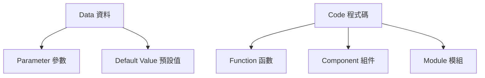

# 核心概念 {#core-concept}

本文件建立了精準行銷系統的基本詞彙。它定義了所有其他原則和結構建立其上的原始術語，確保整個程式碼庫的一致理解和使用。

## 原始術語的目的 {#purpose}

在公理化系統中，原始術語是無法用更簡單概念定義的基本概念。它們形成了所有其他定義、原則和結構建立的基礎。

本文件的功能：

1. 定義系統的核心詞彙
2. 為基本概念建立精確含義
3. 防止循環定義
4. 在整個系統中創建共享理解

# 核心原始術語 {#primitive-terms}

## 系統結構術語 {#system-structure}

:::{.callout-note}
## 關鍵概念
這些術語定義了系統的基本組織單元和它們之間的關係。
:::

### Company（公司）
使用精準行銷系統的商業實體。每個公司根據業務需求、資料來源和流程，有其特定的模組、序列和衍生實作。

### Component（組件）
系統中模組化功能的基本單元。組件是執行特定功能並提供定義介面進行互動的自包含程式碼片段。

### Module（模組）M
相關組件的集合，共同為最小目的提供一組連貫的功能。模組定義**什麼**功能屬於一起，專注於組織結構而非實作細節。

- 識別碼：前綴 "M" 後接兩位數字（例如 M70）
- 實作：作為可能包含多個檔案的資料夾

### Sequence（序列）S
代表工作流程的有序過程，使用多個模組來完成特定業務目的。序列定義將多個最小目的組合成連貫業務流程的步驟。

- 識別碼：前綴 "S" 後接序列號（例如 S1_1）
- 實作：作為可能包含多個檔案的資料夾

### Derivation（衍生）D
追蹤從原始資料到 Shiny 應用程式完整轉換的完整序列。類似於數學證明，衍生記錄了如何從初始輸入衍生最終應用程式的逐步過程。

- 識別碼：前綴 "D" 後接數字（例如 D1）
- 實作：作為可能包含多個檔案的資料夾

### 其他結構術語

- **Interface（介面）**：組件相互通訊和互動的定義方法、屬性或契約
- **Implementation（實作）**：履行介面定義契約的特定程式碼
- **Library（函式庫）**：服務共同目的的相關函數集合
- **Script（腳本）**：執行特定任務的可執行操作序列

## 函數相關術語 {#function-terms}

### Function（函數）
執行特定任務、接受定義輸入並產生定義輸出的可重用程式碼單元。

:::{.panel-tabset}
### 主函數
檔案中提供核心功能並作為主要進入點的主要函數。主函數通常：
- 由外部程式碼呼叫
- 是公共 API 的一部分
- 賦予檔案其名稱
- 每個檔案通常包含一個主函數

### 輔助函數
支援主函數、實作子任務或實用操作的輔助函數。輔助函數通常：
- 僅由同一檔案中的主函數或其他輔助函數呼叫
- 不是公共 API 的一部分
- 一個檔案可能包含多個支援其主函數的輔助函數

### 函數檔案名稱
包含函數定義的檔案名稱。必須根據 R19 使用 "fn_" 前綴（例如 `fn_detect_advanced_metrics_availability.R`）

### 函數物件名稱
函數在程式碼中出現的實際名稱。根據 R19 不得使用 "fn_" 前綴（例如 `detect_advanced_metrics_availability`）
:::

## 概念術語 {#conceptual-terms}

### 原則框架術語 {#principle-framework}

:::{.callout-important}
## 分類系統
原則分類系統定義了系統中指導的層次結構。
:::

| 術語 | 代碼 | 性質 | 功能 |
|------|------|------|------|
| **Meta-Principle（元原則）** | MP | 抽象、概念性、基礎性 | 管理原則本身的結構、組織和關係 |
| **Principle（原則）** | P | 抽象概念但實務導向 | 提供系統設計和實作決策的一般規則 |
| **Rule（規則）** | R | 具體、特定、直接適用 | 實作原則的具體指導方針 |
| **Instance（實例）** | - | 具體、特定上下文 | 特定上下文中原則或規則的具體實作 |

### 公理化系統術語 {#axiomatic-terms}

術語與 MP/P/R 框架的對應關係：

| 術語 | MP/P/R 對應 | 描述 |
|------|------------|------|
| **Axiom（公理）** | MP | 不需證明即接受為真的陳述 |
| **Inference Rule（推理規則）** | MP | 允許從現有原則衍生新原則的邏輯規則 |
| **Theorem（定理）** | P | 通過推理規則從公理邏輯推導的衍生原則 |
| **Corollary（推論）** | R | 以最少額外證明直接從另一原則推導的原則 |

## 資料術語 {#data-terms}

### 資料處理階段 {#data-stages}

:::{.callout-tip}
## 資料生命週期
資料在系統中存在不同的處理狀態。
:::

- **Data（資料）**：系統中使用的基本資訊
- **Raw Data（原始資料）**：直接從平台收集的未處理資訊
- **Processed Data（處理資料）**：經過轉換、清理和整合的資料

### 資料存取術語 {#data-access}

- **Data Source（資料來源）**：應用程式組件使用的特定資料集的命名引用
- **Database Connection（資料庫連接）**：啟用讀寫資料的資料庫配置連結
- **Schema（綱要）**：資料庫內分組相關表格的命名空間或組織容器
- **Data Table（資料表）**：可作為單元查詢、過濾和操作的結構化記錄集合
- **Data Frame (df)（資料框）**：R 中的記憶體表格資料結構
- **View（檢視）**：由查詢定義的虛擬資料表

## 應用程式術語 {#application-terms}

- **Application（應用程式）**：為終端使用者提供功能的完整軟體系統
- **Parameter（參數）**：控制組件行為的配置值
- **Default Value（預設值）**：未指定參數時使用的後備值
- **Role（角色）**：資料來源和組件之間的特定關係

# 術語關係 {#term-relationships}

## 類型-標記區別 {#type-token}

精準行銷系統納入了哲學上的類型-標記區別：

:::{.callout-note}
## 關鍵區別
- **類型（Type）**：一般類別或抽象概念（例如「資料庫」）
- **標記（Token）**：類型的特定實例或具體實現（例如特定的處理資料表）
:::

### 應用於程式碼 {#type-token-code}

```r
# Data Frame 是類型；df.amazon.sales_data 是該類型的標記
# Component 是類型；comp.ui.customer_profile 是該類型的標記
# Function 是類型；calc.revenue 是該類型的標記
```

## 術語關係（物件導向）{#oo-relationships}

### 類型層次結構 {#type-hierarchy}

術語存在於層次「is-a」關係中：



### 組合關係 {#composition}

術語存在於「has-a」關係中：

- **Component** 有 **UI**、**Server** 和 **Defaults** 部分
- **Module** 有多個 **Components**
- **Application** 有多個 **Modules**
- **Sequence** 有有序的多個 **Modules**

## 實作關係 {#implementation-relationships}

1. **Functions** 組合創建 **Components**
2. **Components** 組織成 **Modules**
3. **Modules** 排序成 **Sequences**
4. **Sequences** 記錄為 **Derivations**（當追蹤完整轉換時）
5. **Modules**、**Sequences** 和 **Derivations** 整合形成 **Application**

## 跨框架關係 {#cross-framework}

:::{.callout-important}
## 基本區別
- **MP/P/R**：告訴我們**如何**實作功能（方法論、指導方針、標準）
- **M/S/D**：告訴我們**什麼**要實作（功能組織）
:::

這種區別分離了實作指導（MP/P/R）和功能組織（M/S/D），確保我們的系統在以下之間保持清晰分離：

1. 事情應該如何做（原則）
2. 需要做什麼（組織）

# 範例使用 {#examples}

## 程式碼結構 {#code-examples}

```r
# Function - 可重用的程式碼單元
calculate_customer_value <- function(customer_id, transaction_history) {
  # 實作細節
}

# Component - 自包含的功能片段
customerProfileUI <- function(id) {
  # UI 實作
}

# Module (M) - 為最小目的相關組件的集合
# File: M70_testing/M70_fn_test_app.R
test_app <- function() {
  # 測試應用程式功能
}

# Sequence (S) 在更新腳本中的實作
# File: 0100_1_1_0_execute_customer_dna.R - 實作 S1_1 (Customer DNA)
source("../13_modules/M01_data_loading/M01_fn_load_customer_data.R")
source("../13_modules/M02_preprocessing/M02_fn_preprocess_customer.R")
# ... 使用模組的操作序列
```

## 配置結構 {#config-examples}

```yaml
# Data Source - 資料集的命名引用
components:
  micro:
    customer_profile: sales_by_customer_dta

# Parameters - 配置值
components:
  trends:
    data_source: sales_trends
    parameters:
      show_kpi: true
      refresh_interval: 300

# Roles - 資料來源和組件之間的特定關係
components:
  advanced_profile:
    primary: customer_details
    history: customer_history
```

# 術語使用規則 {#usage-rules}

1. **一致性**：這些術語必須在整個系統中一致使用
2. **精確性**：使用與所引用概念完全匹配的術語
3. **特異性**：當有精確術語可用時避免模糊術語
4. **文檔**：引入新概念時引用這些定義

# 與其他原則的關係 {#relationships}

本原始術語和定義文件作為以下的基礎：

1. **結構藍圖** (P02): 使用這些原始術語定義系統結構
2. **術語公理化原則** (MP029): 擴展和形式化這些術語之間的關係
3. **所有其他原則**: 建立在這個基本詞彙之上

# 結論 {#conclusion}

通過為這些原始術語建立清晰的定義，我們為整個公理化系統創建了堅實的基礎。這個共享詞彙確保了所有原則、藍圖和實作中的一致理解和使用，減少歧義並實現關於系統設計和功能的精確溝通。