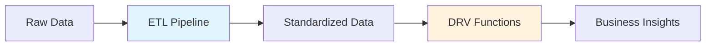

# DERIVATION_STANDARDS：衍生實作標準 {#overview}

本文定義 MAMBA 架構中 DRV（衍生）腳本的實作標準。  
所有衍生實作都必須符合本文件，確保資料管線跨平台、可維運與可追溯。

## 執行摘要 {#executive-summary}

衍生層負責將標準化 ETL 輸出轉為業務分析結果。標準要點如下：

- 強制五段式結構：INITIALIZE → MAIN → TEST → SUMMARIZE → DEINITIALIZE  
- 完整的檔頭與文件化要求  
- 明確輸入/輸出與欄位規格  
- 平台特定考量與 `product_line_id` 政策  
- 規格優先治理：先改規格再改程式

## 架構背景 {#architecture}

### ETL-DRV 職責分離



| 項目 | ETL | DRV |
|---|---|---|
| 目的 | 資料準備 | 商務邏輯 |
| 輸入 | 外部原始資料 | ETL 標準化資料 |
| 輸出 | 明細資料 | 聚合/指標 |
| 主要責任 | 清洗、標準化 | 聚合、計算 |

### 目錄組織

```yaml
update_scripts/
├── ETL/            # ETL 腳本
│   ├── cbz/
│   ├── amz/
│   └── eby/
├── DRV/            # 衍生腳本
│   ├── cbz/
│   ├── amz/
│   └── eby/
└── orchestration/   # 管線編排
    ├── run_full_pipeline.R
    └── run_cbz_pipeline.R
```

## 檔名命名規則 {#naming}

### 必要格式

```text
{platform}_D{group}_{sequence}.R
```

- `platform`：`cbz` / `amz` / `eby` / `all`
- `D{group}`：衍生組別，例如 `D01`
- `sequence`：兩位數順序，例如 `03`

### 範例

```r
cbz_D01_03.R   # CBZ, group01, seq03
cbz_D01_04.R   # CBZ, group01, seq04
amz_D02_15.R   # AMZ, group02, seq15
```

### 命名驗證（建議）

```r
get_group_from_filename <- function(file_path) {
  x <- basename(file_path)
  m <- regexpr("^([a-z]{3})_D(\\d{2})_(\\d{2})\\.R$", x)
  if (m == -1) stop("Invalid DRV filename")
  list(platform = sub("^([a-z]{3})_.*$", "\\1", x),
       group = sub("^[a-z]{3}_D(\\d{2})_.*$", "\\1", x),
       sequence = sub("^([a-z]{3}_D\\d{2}_(\\d{2}))\\.R$", "\\2", x))
}
```

## DRV 變更治理（規格優先）{#spec-first-governance}

在 DRV 改行為前，必須先完成：

1. 更新任務 `_implementation_rules.yaml`
2. 更新任務文件（例如 `D01_03_execution.qmd`）
3. 更新或補齊對應 MP/P/R 映射
4. 取得治理核准（如需）

### 合規規則

- 文件與規格未先更新不得先改程式行為
- 例外需求必須先寫入規格（原則/規則）再實作
- 每一筆程式變更都需可回溯到治理更新

### DRV 治理檢核清單

- [ ] `_implementation_rules.yaml` 已更新
- [ ] 任務文件更新了 scope / 邊界 / 優先順序
- [ ] MP/P/R 對應完整
- [ ] 程式變更僅為實作更新

## 標準檔案結構 {#structure}

### 檔案模板總覽

```text
{platform}_D{group}_{sequence}.R
┌─ 標頭區塊（DERIVATION metadata）
├─ 文件區塊（roxygen2）
├─ PART 1 INITIALIZE
├─ PART 2 MAIN
├─ PART 3 TEST
├─ PART 4 SUMMARIZE
└─ PART 5 DEINITIALIZE
```

### 標頭區塊（必要）

```r
#####
# DERIVATION: Customer DNA Analysis
# VERSION: 1.2
# PLATFORM: cbz
# GROUP: D01
# SEQUENCE: 03
# PURPOSE: Calculate customer behavioral profiles
# CONSUMES: df_cbz_sales___standardized, df_customer_standardized
# PRODUCES: df_dna_by_customer
# PRINCIPLE: MP064, DM_R042, DM_R044
#####
#P07_D01_03
```

### 文件區塊（roxygen2）

```r
#' @title D01_03 Customer DNA
#' @description Build aggregated DNA style signals from standardized sales
#' @param platform_id Platform id (cbz/amz/eby/all)
#' @return data.frame
#' @input_tables processed_data.df_cbz_sales___standardized
#' @output_tables app_data.df_dna_by_customer
```

## 五段實作規範 {#five-part}

### Part 1：INITIALIZE

責任：初始化環境、連線、依賴與追蹤變數。  
不得在這裡放業務邏輯。

```r
autoinit()
connection_created_app <- FALSE
if (!exists("app_data") || !inherits(app_data, "DBIConnection")) {
  app_data <- dbConnectDuckdb(db_path_list$app_data, read_only = FALSE)
  connection_created_app <- TRUE
}
```

### Part 2：MAIN

責任：衍生核心邏輯。使用 `tryCatch` 包住主流程，捕捉非預期錯誤並標記失敗。

```r
tryCatch({
  # read input
  df_input <- tbl(processed_data, "df_cbz_sales___standardized") %>% collect()

  # transform
  df_derived <- df_input %>% dplyr::summarize(total = sum(lineproduct_price, na.rm = TRUE))

  # write output
  dbWriteTable(app_data, "df_dna_by_customer", df_derived, overwrite = TRUE)
}, error = function(e) {
  error_occurred <- TRUE
  message(sprintf("MAIN ERROR: %s", e$message))
})
```

### Part 3：TEST

責任：驗證輸出存在性、欄位、規則與品質邊界。

```r
if (!dbExistsTable(app_data, "df_dna_by_customer")) {
  stop("Output table does not exist")
}
output_rows <- tbl(app_data, "df_dna_by_customer") %>% tally() %>% pull(n)
if (output_rows == 0) warning("Output table is empty")
```

### Part 4：SUMMARIZE

責任：產生執行指標、彙總訊息並回傳結果。

```r
end_time <- Sys.time()
summary_report <- list(
  platform = platform_id,
  rows_processed = nrow(df_input),
  status = ifelse(!error_occurred, "SUCCESS", "FAILED"),
  start_time = start_time,
  end_time = end_time
)
return_value <- summary_report
```

### Part 5：DEINITIALIZE

責任：只允許資源回收與最後回傳，且 `autodeinit()` 僅能最後一個可執行語句（務必是最後）。

```r
if (exists("connection_created_app") && connection_created_app) {
  dbDisconnect(app_data)
}
if (exists("return_value")) final_status <- return_value else final_status <- list(status = "INCOMPLETE")
autodeinit()
final_status
```

## 錯誤處理樣式 {#errors}

### 非關鍵可降級

```r
tryCatch({
  optional <- enrich_optional(df_core)
}, error = function(e) {
  warning(sprintf("Optional enrichment skipped: %s", e$message))
})
```

### 關鍵錯誤

```r
tryCatch({
  required <- load_required()
}, error = function(e) {
  error_occurred <<- TRUE
  message(sprintf("CRITICAL: %s", e$message))
})
```

## 輸入/輸出文件規格 {#io}

### 表格依賴宣告

```yaml
INPUT_TABLES:
  processed_data:
    - df_cbz_sales___standardized
    - df_customer_standardized
OUTPUT_TABLES:
  app_data:
    - df_dna_by_customer
    - df_segments_by_customer
```

### 欄位規格

```yaml
EXPECTED_COLUMNS:
  df_cbz_sales___standardized:
    required:
      - customer_id (INTEGER)
      - platform_id (TEXT)
      - lineproduct_price (NUMERIC)
      - payment_time (TIMESTAMP)
```

## 平台考量 {#platforms}

### 平台識別

從檔名解析平台時，若非 `cbz/amz/eby/all` 需直接失敗並終止。

### 跨平台處理

多平台腳本可分別處理後再合併：

```r
platforms <- c("cbz", "amz", "eby")
result <- lapply(platforms, function(p) process_platform(p))
combined <- do.call(rbind, Filter(Negate(is.null), result))
```

## 日誌與監控 {#logging}

### 訊息格式

```r
message(sprintf("[%s] Starting derivation: %s", format(Sys.time(), "%Y-%m-%d %H:%M:%S"), "D01_03"))
warning(sprintf("DM_R044 WARNING: %s", "Missing optional field"))
message(sprintf("DM_R044 ERROR: %s", "Required table not found"))
```

### 執行指標

```r
metrics <- list(
  start_time = Sys.time(),
  rows_read = 0,
  rows_written = 0,
  warnings = 0,
  errors = 0
)
```

## 核心共用函式（建議）

### 查核 DRV 命名與順序

```r
validate_derivation_naming <- function(file_path) {
  pattern <- "^[a-z]{3}_D\\d{2}_\\d{2}\\.R$"
  if (!grepl(pattern, basename(file_path))) stop("Invalid DRV filename")
  TRUE
}
```

### 驗證主流程

```r
check_derivation_output <- function(db_conn, table_name) {
  if (!dbExistsTable(db_conn, table_name)) stop(sprintf("Missing table: %s", table_name))
}
```

## 遷移（legacy）建議

### 未遵循規格的腳本

1. 列舉無標頭、無五段或無 `autodeinit()` 的衍生檔
2. 依 DM_R044 逐步補齊 header、docs、MAIN/TEST/SUMMARIZE/DEINITIALIZE
3. 將行為移入對應 step，移除編排腳本中的重複計算

## 檢查清單

### DRV 契約檢核

- [ ] 檔名符合 `{platform}_D{group}_{seq}.R`
- [ ] 標頭完整且與檔名對應
- [ ] roxygen2 欄位完整
- [ ] MAIN 以 `tryCatch` 包覆
- [ ] PART 3 有輸入/輸出與欄位驗證
- [ ] PART 4 回傳 `status`、時間與筆數
- [ ] DEINITIALIZE 僅資源清理並在末行 `autodeinit()`
- [ ] 所有行為變更都先更新治理文件

## 結論

`DERIVATION_STANDARDS` 將 DRV 實作從「可跑動」提升為「可稽核、可維護、可追溯」。  
它與 `DM_R044` 對應後形成完整契約體系：  
編排與執行分離、文件與程式一致、每個衍生步驟有明確責任邊界。
