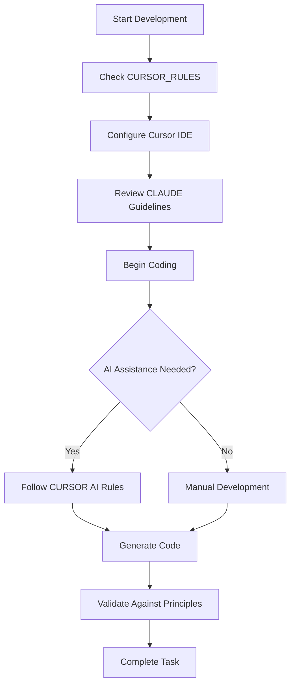

# Cursor Development Rules Overview {#overview}

This directory contains configuration and guidelines for working with the Cursor IDE in the MAMBA/WISER codebase.

## Purpose {#purpose}

The Cursor Rules provide:

1. **IDE Configuration**: Settings and preferences for optimal development
2. **Code Generation Rules**: Guidelines for AI-assisted coding
3. **Integration Patterns**: How Cursor integrates with the MAMBA architecture
4. **Best Practices**: Cursor-specific development workflows

## Directory Contents {#contents}

### Primary Documentation

- **[CURSOR_RULES.md](./CURSOR_RULES.md)**: Main configuration rules for Cursor IDE
  - Code generation patterns
  - IDE settings recommendations
  - AI interaction guidelines
  - Project-specific configurations

## Relationship with CLAUDE Guidelines {#relationship}

While CLAUDE provides comprehensive AI assistant guidelines for the entire codebase, CURSOR_RULES focuses specifically on:

1. **IDE Integration**: Cursor-specific settings and workflows
2. **Code Generation**: How Cursor should generate code following MAMBA principles
3. **AI Features**: Utilizing Cursor's AI capabilities effectively
4. **Development Shortcuts**: Cursor-specific productivity features

## Key Configuration Areas {#configuration}

### 1. Code Generation

- Follow MAMBA principles (R021, R069, MP044, MP047)
- Use functional programming patterns
- Maintain one-function-one-file structure
- Apply proper naming conventions

### 2. Project Settings

- Working directory configuration
- Language preferences (R, Python)
- Database connection patterns
- Environment variable management

### 3. AI Assistance

- When to use AI suggestions
- How to provide context to Cursor
- Integration with existing modules
- Avoiding redundant code generation

## Usage Guidelines {#usage}

### For New Development

1. Review CURSOR_RULES.md before starting
2. Configure Cursor with project-specific settings
3. Enable appropriate AI features
4. Follow the established patterns

### For Maintenance

1. Ensure Cursor settings match project standards
2. Use AI features for consistency checking
3. Leverage code generation for repetitive tasks
4. Maintain alignment with MAMBA principles

## Integration with Development Workflow {#workflow}

## Best Practices {#best-practices}

1. **Always Review Generated Code**: Ensure it follows MAMBA principles
2. **Use Context Files**: Provide Cursor with relevant principle files
3. **Leverage Templates**: Use existing patterns from global_scripts
4. **Maintain Consistency**: Generated code should match existing style
5. **Document AI Usage**: Note when significant code is AI-generated

## Comparison with Other Tools {#comparison}

| Aspect | CURSOR | CLAUDE | VSCode |
|--------|--------|--------|--------|
| **Focus** | IDE Integration | AI Guidelines | General Development |
| **Scope** | Cursor-specific | Universal | Editor-specific |
| **AI Features** | Built-in | External | Extensions |
| **Configuration** | CURSOR_RULES.md | CLAUDE.md | .vscode/settings.json |

## Updates and Maintenance {#maintenance}

- Rules are updated as Cursor evolves
- Aligned with MAMBA principle changes
- Synchronized with CLAUDE guidelines
- Reviewed during major refactoring

---

*For comprehensive AI assistant guidelines across all tools, see [CLAUDE Guidelines](../CLAUDE/index.qmd)*
*For general development principles, see [00_principles README](../../README.md)*