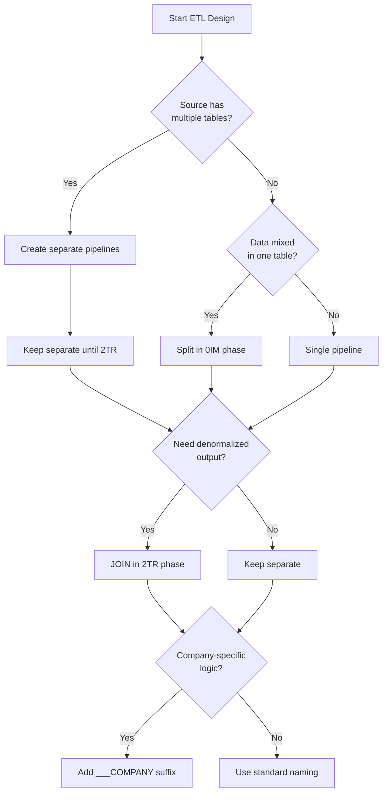

# ETL Pipeline Implementation Overview

## Executive Summary

The MAMBA ETL system implements a strict three-phase architecture with clear separation of concerns. This guide provides the complete framework for implementing production-ready ETL pipelines that comply with all MAMBA principles.

## Core Architecture

### The Three-Phase Model


| Phase | Purpose | Operations Allowed | Operations Forbidden |
|-------|---------|-------------------|---------------------|
| **0IM (Import)** | Raw data preservation | • Data extraction<br>• Character encoding<br>• Basic validation | • JOINs<br>• Business logic<br>• Column renaming |
| **1ST (Staging)** | Format standardization | • Column renaming<br>• Type conversion<br>• Encoding fixes | • JOINs<br>• Business calculations<br>• Aggregations |
| **2TR (Transform)** | Business transformation | • Structural JOINs<br>• Schema mapping<br>• Business rules | • Analytical JOINs<br>• Complex derivations<br>• ML processing |

## Key Principles

### 1. ETL Pipeline Independence (MP107) - CRITICAL
**Every ETL must be completely independent and self-contained:**
- No ETL depends on another ETL's execution
- All ETLs can run in parallel within their phase
- Each ETL has its own `autoinit()` and `autodeinit()`
- ETLs can be run in any order or selectively
- The flat directory structure (no numbering) is INTENTIONAL

### 2. Data Type Separation (MP104)
Each data type must have its own dedicated ETL pipeline:
- Orders → `{platform}_ETL_orders_*`
- Order Details → `{platform}_ETL_order_details_*`
- Sales → Created by JOINing orders + details in 2TR

### 3. Structural JOINs in 2TR
Denormalization happens ONLY in the transform phase:
- **Structural JOIN**: Combining normalized tables into complete records (ETL responsibility)
- **Analytical JOIN**: Combining data for analysis (Derivation responsibility)

### 4. Company-Specific Naming (DM_R037)
Use triple underscores for company-specific implementations:
- Standard: `df_eby_sales___transformed`
- Company-specific: `df_eby_sales___transformed___MAMBA`

## Quick Decision Tree



## Implementation Pattern

### Correct: Separated Pipelines with 2TR JOIN

```r
# Phase 0IM - Import raw tables separately
eby_ETL_orders_0IM___MAMBA.R         # Import BAYORD only
eby_ETL_order_details_0IM___MAMBA.R  # Import BAYORE only

# Phase 1ST - Stage both separately  
eby_ETL_orders_1ST___MAMBA.R         # Standardize orders
eby_ETL_order_details_1ST___MAMBA.R  # Standardize details

# Phase 2TR - JOIN to create denormalized records
eby_ETL_sales_2TR___MAMBA.R          # Structural JOIN here
```

### Incorrect: Mixed Pipeline with Early JOIN

```r
# WRONG - JOIN in import phase
eby_ETL_sales_0IM___MAMBA.R  # ❌ Imports and JOINs

# WRONG - Mixed data types
eby_ETL_all_data_0IM.R       # ❌ Everything together
```

## File Organization

Each ETL pipeline follows this structure:
```
scripts/update_scripts/
├── {platform}_ETL_{datatype}_0IM.R          # Standard import
├── {platform}_ETL_{datatype}_0IM___MAMBA.R  # Company-specific
├── {platform}_ETL_{datatype}_1ST.R          # Standard staging
├── {platform}_ETL_{datatype}_1ST___MAMBA.R  # Company-specific
├── {platform}_ETL_{datatype}_2TR.R          # Standard transform
└── {platform}_ETL_{datatype}_2TR___MAMBA.R  # Company-specific
```

## Database Layer Mapping

| Phase | Database | Table Pattern | Example |
|-------|----------|---------------|---------|
| 0IM | raw_data.duckdb | `df_{platform}_{type}___raw` | `df_eby_orders___raw___MAMBA` |
| 1ST | staged_data.duckdb | `df_{platform}_{type}___staged` | `df_eby_orders___staged___MAMBA` |
| 2TR | transformed_data.duckdb | `df_{platform}_{type}___transformed` | `df_eby_sales___transformed___MAMBA` |

## Common Patterns

### Pattern 1: Normalized Source → Denormalized Output
**Use Case**: eBay with separate BAYORD and BAYORE tables
**Solution**: Separate pipelines, JOIN in 2TR

### Pattern 2: Single Mixed Source → Multiple Outputs
**Use Case**: CSV with orders and details in same file
**Solution**: Split in 0IM, process separately

### Pattern 3: Multiple Sources → Single Output
**Use Case**: Orders from multiple platforms
**Solution**: Separate platform pipelines, combine in Derivation

## Testing Strategy

Each phase must validate:

### 0IM Tests
- ✅ Table exists in raw_data
- ✅ Row count matches source
- ✅ No transformations applied
- ✅ Original column names preserved

### 1ST Tests
- ✅ Table exists in staged_data
- ✅ Columns renamed correctly
- ✅ Data types converted
- ✅ No JOINs performed

### 2TR Tests
- ✅ Table exists in transformed_data
- ✅ JOINs successful (if applicable)
- ✅ Business rules applied
- ✅ No analytical logic included

## Next Steps

1. **[Data Type Separation Guide](02_ETL_data_type_separation.qmd)** - Learn when and how to separate data types
2. **[Phase Implementation Guides](03_ETL_phase_0IM_import.qmd)** - Detailed phase-by-phase implementation
3. **[Structural JOIN Patterns](06_ETL_structural_joins.qmd)** - Master the 2TR JOIN pattern
4. **[Case Studies](09_ETL_case_studies/)** - Real-world implementations
5. **[Migration Guide](08_ETL_migration_guide.qmd)** - Upgrade existing ETLs

## Quick Reference

### Do's ✅
- Separate data types into individual pipelines
- Perform structural JOINs in 2TR phase
- Use company-specific suffixes when needed
- Test each phase independently

### Don'ts ❌
- Never JOIN in 0IM or 1ST phases
- Don't mix business logic in ETL
- Avoid combining unrelated data types
- Don't skip phase testing

## Support

For questions about ETL implementation:
1. Check the [principle references](#principle-references)
2. Review [case studies](09_ETL_case_studies/)
3. Consult the [migration guide](08_ETL_migration_guide.qmd)
4. Use principle-explorer agent for guidance