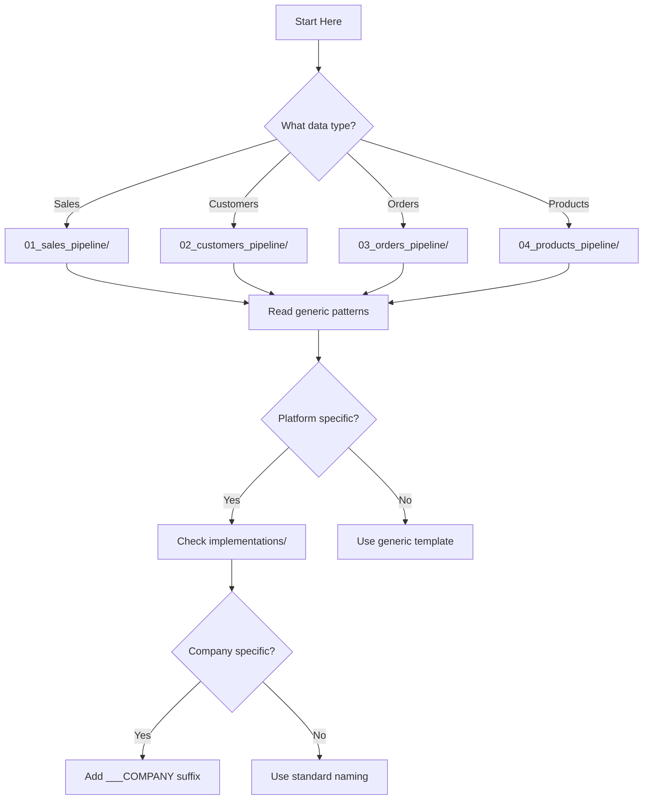

# ETL Pipeline Documentation Navigation Guide

## Quick Navigation

This documentation is organized following **MP104 (ETL Data Flow Separation Principle)**: Each data type has its own dedicated ETL pipeline folder.

### Core Data Pipelines

| Data Type | Folder | Purpose | Key Files |
|-----------|--------|---------|-----------|
| **Sales** | [01_sales_pipeline/](../01_sales_pipeline/) | Transaction-level sales data | • Generic patterns<br>• Platform implementations<br>• MAMBA custom setup |
| **Customers** | [02_customers_pipeline/](../02_customers_pipeline/) | Customer profile data | • Import patterns<br>• Review integration<br>• Profile standardization |
| **Orders** | [03_orders_pipeline/](../03_orders_pipeline/) | Order header data | • Order processing<br>• Status tracking<br>• Platform variations |
| **Products** | [04_products_pipeline/](../04_products_pipeline/) | Product catalog data | • Catalog import<br>• SKU mapping<br>• Category standardization |

### Special Patterns & Case Studies

| Category | Folder | Purpose | Key Topics |
|----------|--------|---------|------------|
| **Special Patterns** | [05_special_patterns/](../05_special_patterns/) | Advanced ETL techniques | • Structural JOINs<br>• SSH tunnels<br>• Shared imports |
| **Case Studies** | [06_case_studies/](../06_case_studies/) | Real implementations | • MAMBA complete setup<br>• Migration stories<br>• Lessons learned |

## How to Use This Documentation

### 1. For New ETL Development



### 2. For Understanding Architecture

Start with these key documents:
1. [ETL_architecture.qmd](./ETL_architecture.qmd) - Three-phase model overview
2. [naming_conventions.qmd](./naming_conventions.qmd) - File naming standards
3. [decision_tree.qmd](./decision_tree.qmd) - Quick decision guide

### 3. For Specific Patterns

Navigate to [05_special_patterns/](../05_special_patterns/) for:
- **Structural JOINs**: How to denormalize in 2TR phase
- **SSH Tunnels**: Connecting to private databases
- **Shared Imports**: Optimizing API calls
- **Extensible Patterns**: Building flexible ETLs

### 4. For Real Examples

Check [06_case_studies/](../06_case_studies/) for:
- **MAMBA Implementation**: Complete company-specific setup
- **Migration Stories**: How we separated mixed ETLs
- **Lessons Learned**: Common pitfalls and solutions

## Folder Structure Overview

```
CH11_etl_pipelines/
├── 00_overview/                      # You are here
│   ├── README.qmd                    # This file
│   ├── ETL_architecture.qmd          # Core architecture
│   ├── naming_conventions.qmd        # Naming standards
│   └── decision_tree.qmd             # Decision guide
│
├── 01_sales_pipeline/                # Sales data ETLs
│   ├── generic/                      # Reusable patterns
│   └── implementations/              # Platform-specific
│       ├── eby_sales/
│       │   ├── standard/            # Generic eBay
│       │   └── MAMBA/               # MAMBA's custom
│       ├── cbz_sales/
│       └── amz_sales/
│
├── 02_customers_pipeline/            # Customer data ETLs
│   ├── generic/
│   └── implementations/
│
├── 03_orders_pipeline/               # Order data ETLs
│   ├── generic/
│   └── implementations/
│
├── 04_products_pipeline/             # Product data ETLs
│   ├── generic/
│   └── implementations/
│
├── 05_special_patterns/              # Advanced techniques
│   ├── structural_join/
│   ├── shared_import/
│   └── ssh_tunnel/
│
└── 06_case_studies/                  # Real examples
    ├── MAMBA_complete_implementation/
    └── migration_stories/
```

## Key Principles Applied

### MP104: ETL Data Flow Separation
Each data type (sales, customers, orders, products) has its own dedicated folder and pipeline series (0IM→1ST→2TR).

### DM_R037: Company-Specific ETL Naming
Company-specific implementations use triple underscores: `eby_ETL_sales_0IM___MAMBA.R`

### MP097: Principle Implementation Separation
- **Generic patterns** in `generic/` folders contain principles and patterns
- **Implementations** in `implementations/` folders contain actual code examples

## Finding What You Need

### By Task

| If you need to... | Go to... |
|-------------------|----------|
| Create a new sales ETL | [01_sales_pipeline/generic/](../01_sales_pipeline/generic/) |
| Understand 3-phase model | [ETL_architecture.qmd](./ETL_architecture.qmd) |
| Implement SSH tunnel | [05_special_patterns/ssh_tunnel/](../05_special_patterns/ssh_tunnel/) |
| See MAMBA's setup | [06_case_studies/MAMBA_complete_implementation/](../06_case_studies/MAMBA_complete_implementation/) |
| Learn naming rules | [naming_conventions.qmd](./naming_conventions.qmd) |
| Optimize API calls | [05_special_patterns/shared_import/](../05_special_patterns/shared_import/) |
| Perform structural JOIN | [05_special_patterns/structural_join/](../05_special_patterns/structural_join/) |

### By Platform

| Platform | Sales | Customers | Orders | Products |
|----------|-------|-----------|--------|----------|
| **eBay** | [eby_sales/](../01_sales_pipeline/implementations/eby_sales/) | [eby_customers/](../02_customers_pipeline/implementations/eby_customers/) | [eby_orders/](../03_orders_pipeline/implementations/eby_orders/) | [eby_products/](../04_products_pipeline/implementations/eby_products/) |
| **Cyberbiz** | [cbz_sales/](../01_sales_pipeline/implementations/cbz_sales/) | [cbz_customers/](../02_customers_pipeline/implementations/cbz_customers/) | [cbz_orders/](../03_orders_pipeline/implementations/cbz_orders/) | [cbz_products/](../04_products_pipeline/implementations/cbz_products/) |
| **Amazon** | [amz_sales/](../01_sales_pipeline/implementations/amz_sales/) | [amz_customers/](../02_customers_pipeline/implementations/amz_customers/) | [amz_orders/](../03_orders_pipeline/implementations/amz_orders/) | [amz_products/](../04_products_pipeline/implementations/amz_products/) |

### By Phase

| Phase | Purpose | Key Patterns |
|-------|---------|--------------|
| **0IM (Import)** | Raw data preservation | • API connections<br>• SSH tunnels<br>• Character encoding |
| **1ST (Staging)** | Format standardization | • Column renaming<br>• Type conversion<br>• Schema alignment |
| **2TR (Transform)** | Business transformation | • Structural JOINs<br>• Business rules<br>• Denormalization |

## Contributing Guidelines

When adding new documentation:

1. **Place in correct data type folder** based on primary data concern
2. **Follow naming convention**: `{platform}_{datatype}_{pattern}.qmd`
3. **Include principle references** in frontmatter
4. **Add to this navigation guide** for discoverability
5. **Link related documents** for complete understanding

## Quick Reference

### File Naming Pattern
```
Standard: {platform}_ETL_{datatype}_{phase}.R
Company:  {platform}_ETL_{datatype}_{phase}___{COMPANY}.R
```

### Table Naming Pattern
```
Raw:        df_{platform}_{datatype}___raw
Staged:     df_{platform}_{datatype}___staged
Transformed: df_{platform}_{datatype}___transformed
```

### Common Platforms
- `eby` = eBay
- `cbz` = Cyberbiz
- `amz` = Amazon

### Common Data Types
- `sales` = Transaction data
- `customers` = Customer profiles
- `orders` = Order headers
- `products` = Product catalog

---

**Navigation Tip**: Use the folder structure on the left to browse, or use the quick links above to jump directly to what you need.