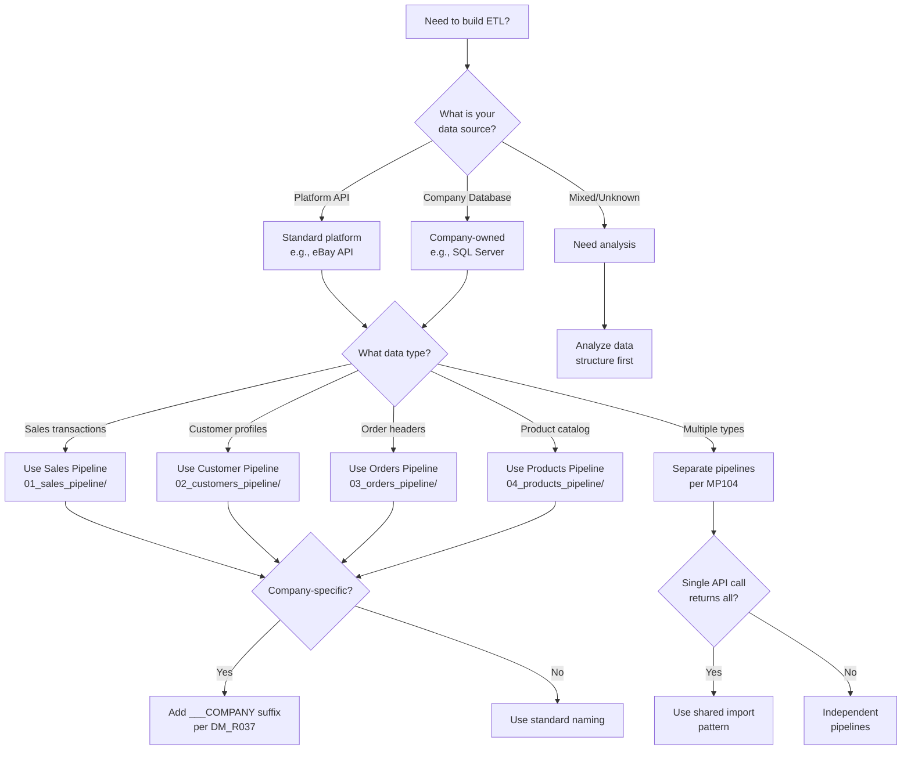
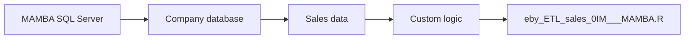
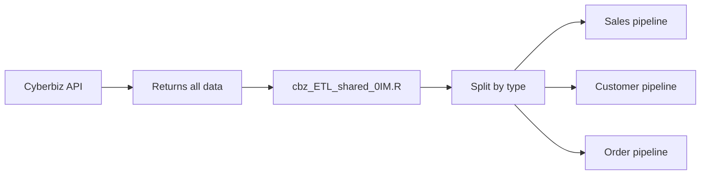
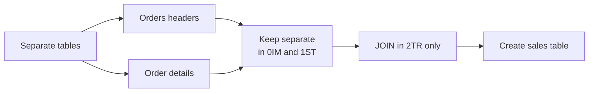
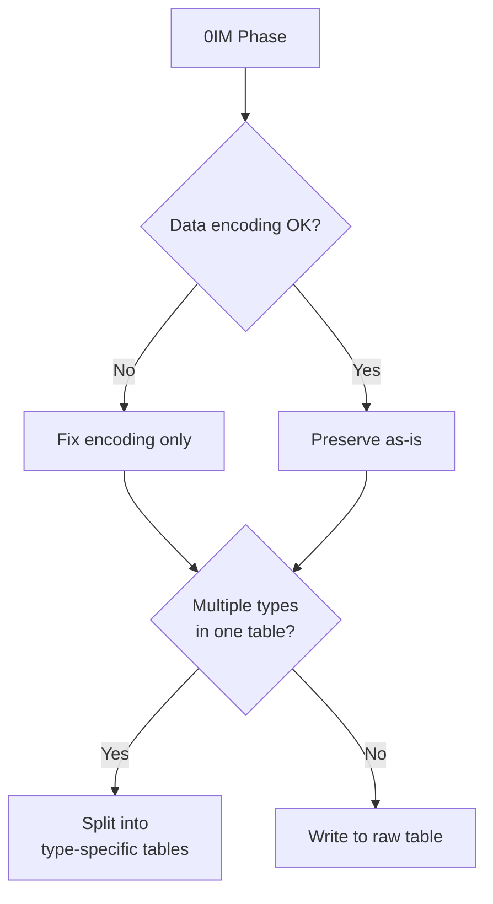
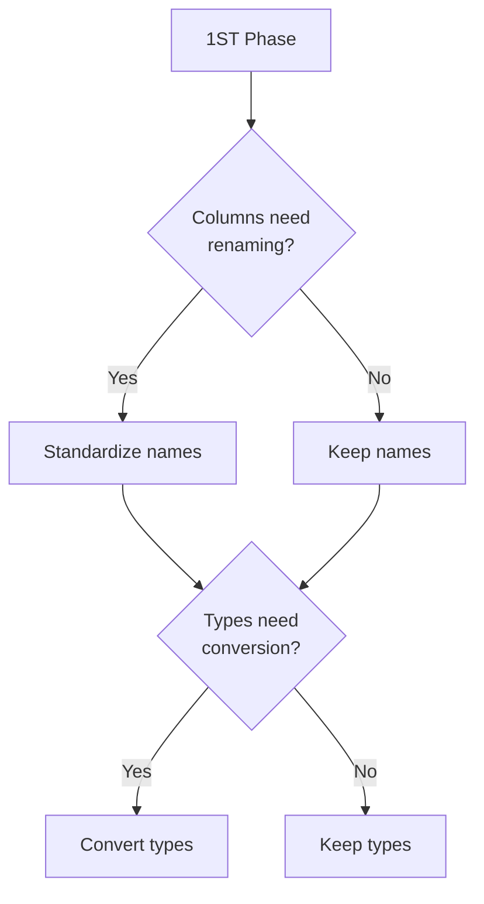
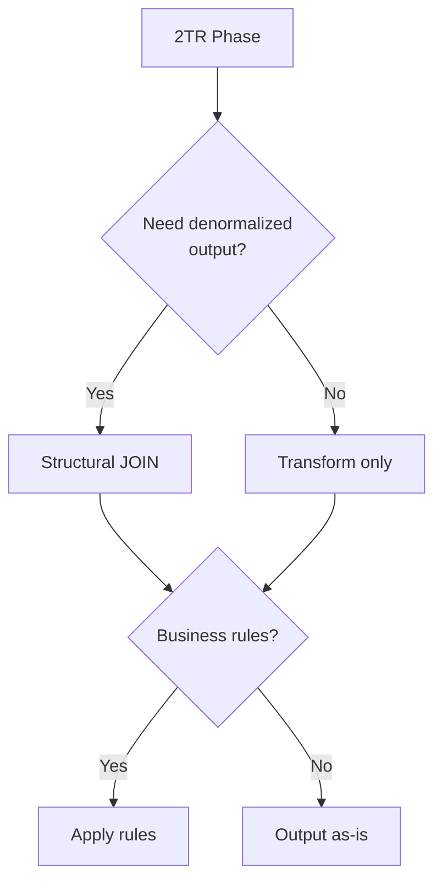

# ETL Design Decision Tree

## Start Here: What Are You Building?



## Decision Points Explained

### 1. Data Source Type

| Source Type | Characteristics | ETL Approach | Example |
|-------------|----------------|--------------|---------|
| **Platform API** | • Public/standard API<br>• Generic authentication<br>• Standard data format | Use standard ETL patterns | `eby_ETL_sales_0IM.R` |
| **Company Database** | • Company owns server<br>• Custom schema<br>• Private access | Add company suffix | `eby_ETL_sales_0IM___MAMBA.R` |
| **Mixed Source** | • Multiple data origins<br>• Complex requirements | Analyze first, may need multiple ETLs | Various patterns |

### 2. Data Type Selection

| Data Type | Key Identifiers | Pipeline Location | Output Tables |
|-----------|-----------------|-------------------|---------------|
| **Sales** | • Transactions<br>• Revenue<br>• Line items | `01_sales_pipeline/` | `df_{platform}_sales___*` |
| **Customers** | • User profiles<br>• Contact info<br>• Preferences | `02_customers_pipeline/` | `df_{platform}_customers___*` |
| **Orders** | • Order headers<br>• Order status<br>• Shipping info | `03_orders_pipeline/` | `df_{platform}_orders___*` |
| **Products** | • SKUs<br>• Descriptions<br>• Categories | `04_products_pipeline/` | `df_{platform}_products___*` |

### 3. Company-Specific Indicators

**Requires Company Suffix (___COMPANY) When:**

```yaml
indicators:
  infrastructure:
    - "Company owns the database server"
    - "Uses SSH tunnel to private network"
    - "Connects via VPN"
    
  business_logic:
    - "Custom SKU mapping rules"
    - "Proprietary calculations"
    - "Company-specific filters"
    
  examples:
    MAMBA:
      - "SSH to 220.128.138.146"
      - "SQL Server at 125.227.84.85"
      - "MAMBA product categories"
```

## Common Scenarios

### Scenario 1: Standard eBay Sales Import


**Result**: Use standard naming, follow generic pattern in `01_sales_pipeline/generic/`

### Scenario 2: MAMBA's Custom eBay Database



**Result**: Add ___MAMBA suffix, document in `01_sales_pipeline/implementations/eby_sales/MAMBA/`

### Scenario 3: Mixed Data in Single API Response



**Result**: Use shared import pattern from `05_special_patterns/shared_import/`

### Scenario 4: Denormalizing Orders and Details



**Result**: Use structural JOIN pattern from `05_special_patterns/structural_join/`

## Quick Decision Matrix

| Question | Yes → | No → |
|----------|-------|------|
| **Multiple data types in source?** | Create separate pipelines | Single pipeline OK |
| **Company owns the infrastructure?** | Add ___COMPANY suffix | Use standard naming |
| **Need to JOIN tables?** | Only in 2TR phase | Keep separate |
| **Custom business logic?** | Company-specific ETL | Generic pattern |
| **SSH tunnel required?** | See `05_special_patterns/ssh_tunnel/` | Standard connection |
| **API returns everything?** | Consider shared import | Independent imports |

## ETL Phase Decisions

### Phase 0IM (Import)



**Allowed**: Character encoding, basic validation
**Forbidden**: JOINs, business logic, column renaming

### Phase 1ST (Staging)



**Allowed**: Column renaming, type conversion
**Forbidden**: JOINs, calculations, aggregations

### Phase 2TR (Transform)



**Allowed**: Structural JOINs, business rules, schema mapping
**Forbidden**: Analytical JOINs, ML processing (those go in Derivations)

## Need More Help?

### Pattern Documentation
- **Generic patterns**: Check `{datatype}_pipeline/generic/`
- **Special techniques**: See `05_special_patterns/`
- **Real examples**: Browse `06_case_studies/`

### Principle References
- **MP104**: ETL Data Flow Separation - [View](../../part1_principles/CH00_fundamental_principles/04_data_management/MP104_etl_data_flow_separation.qmd)
- **DM_R037**: Company-Specific Naming - [View](../../part1_principles/CH02_data_management/rules/DM_R037_company_specific_etl_naming.qmd)
- **DM_R040**: Structural JOIN Pattern - [View](../../part1_principles/CH02_data_management/rules/DM_R040_structural_join_pattern.qmd)

### Still Unsure?

1. Start with the generic pattern for your data type
2. Check if similar implementations exist
3. Review case studies for comparable scenarios
4. Follow the strictest interpretation of principles

---

**Remember**: When in doubt, separate! It's easier to combine later than to untangle mixed concerns.