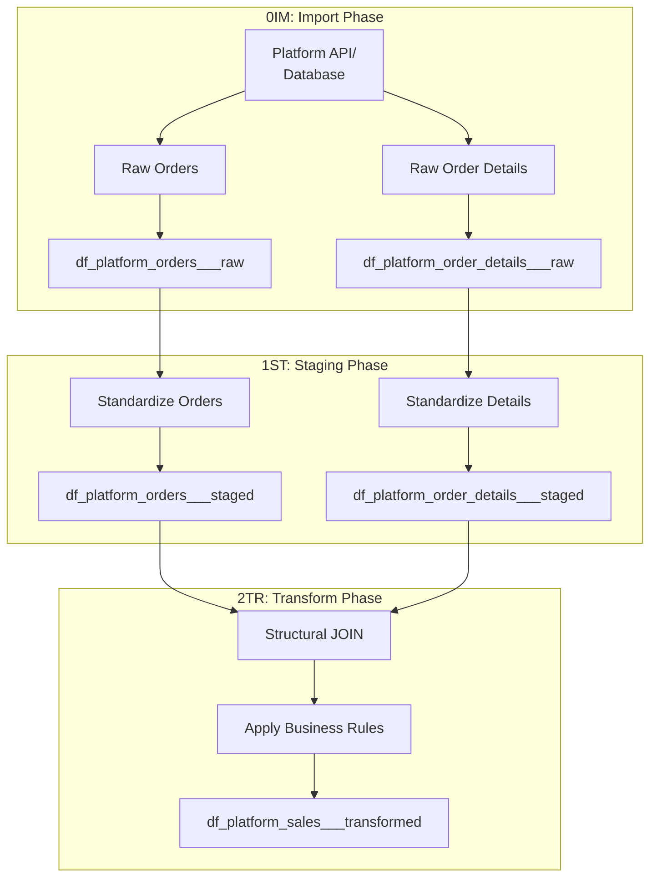

# Sales Pipeline Documentation

## Overview

The sales pipeline handles all transaction-level data across platforms. This is often the most complex ETL as it may involve joining order headers with order details to create denormalized sales records.

## Pipeline Architecture



## Data Flow Patterns

### Pattern 1: Separate Tables → Joined Sales

**When to use**: Source has normalized order headers and details
**Example**: eBay (BAYORD + BAYORE tables)

```r
# 0IM: Import separately
eby_ETL_orders_0IM.R        # Imports order headers
eby_ETL_order_details_0IM.R # Imports order line items

# 1ST: Stage separately
eby_ETL_orders_1ST.R        # Standardizes headers
eby_ETL_order_details_1ST.R # Standardizes details

# 2TR: Join to create sales
eby_ETL_sales_2TR.R         # JOINs and transforms to sales
```

### Pattern 2: Pre-Joined Sales Data

**When to use**: Source already provides denormalized sales
**Example**: Some APIs return complete transaction records

```r
# 0IM: Import sales directly
cbz_ETL_sales_0IM.R  # Imports complete sales records

# 1ST: Stage sales
cbz_ETL_sales_1ST.R  # Standardizes columns/types

# 2TR: Transform sales
cbz_ETL_sales_2TR.R  # Applies business rules
```

### Pattern 3: Mixed Data Requiring Split

**When to use**: API returns all data types together
**Example**: Cyberbiz complete export

```r
# 0IM: Shared import then split
cbz_ETL_shared_0IM.R  # Fetches all, splits by type
  → Outputs to: df_cbz_sales___raw
  → Outputs to: df_cbz_customers___raw
  → Outputs to: df_cbz_orders___raw

# 1ST & 2TR: Process separately
cbz_ETL_sales_1ST.R
cbz_ETL_sales_2TR.R
```

## Standard Schema

### Input Requirements

Sales ETL expects these minimum fields (actual names vary by platform):

| Logical Field | Common Names | Type | Required |
|--------------|--------------|------|----------|
| Transaction ID | transaction_id, sale_id, order_line_id | String | Yes |
| Order ID | order_id, order_number | String | Yes |
| Product ID | sku, product_id, item_id | String | Yes |
| Customer ID | customer_id, buyer_id, email | String | Yes |
| Quantity | qty, quantity, units | Numeric | Yes |
| Unit Price | price, unit_price, amount | Numeric | Yes |
| Sale Date | date, transaction_date, created_at | Date | Yes |
| Platform | platform_code | String (3 char) | Yes |

### Output Schema (Transformed)

All sales pipelines must output these standardized columns:

```yaml
df_{platform}_sales___transformed:
  # Identifiers
  - transaction_id: STRING      # Unique transaction ID
  - order_id: STRING            # Parent order ID
  - product_id: STRING          # Standardized SKU
  - customer_id: STRING         # Unique customer identifier
  
  # Metrics
  - quantity: DOUBLE            # Units sold
  - unit_price: DOUBLE          # Price per unit (USD)
  - total_amount: DOUBLE        # quantity * unit_price
  - discount_amount: DOUBLE     # Any discounts applied
  - tax_amount: DOUBLE          # Tax collected
  - shipping_amount: DOUBLE     # Shipping charges
  - net_revenue: DOUBLE         # Final revenue after all adjustments
  
  # Dimensions
  - sale_date: DATE             # Transaction date
  - sale_datetime: TIMESTAMP    # Full timestamp if available
  - platform_code: STRING(3)    # eby, cbz, amz
  - currency_code: STRING(3)    # USD, TWD, etc.
  - sales_channel: STRING       # web, mobile, api
  
  # Metadata
  - import_timestamp: TIMESTAMP # When imported (0IM)
  - staging_timestamp: TIMESTAMP # When staged (1ST)
  - transform_timestamp: TIMESTAMP # When transformed (2TR)
```

## Implementation Examples

### Generic Pattern

For standard implementations, use templates in `generic/`:

- [sales_0IM_pattern.qmd](generic/sales_0IM_pattern.qmd) - Import patterns
- [sales_1ST_pattern.qmd](generic/sales_1ST_pattern.qmd) - Staging patterns
- [sales_2TR_pattern.qmd](generic/sales_2TR_pattern.qmd) - Transform patterns

### Platform Implementations

| Platform | Standard | Company-Specific | Key Differences |
|----------|----------|------------------|-----------------|
| **eBay** | [eby_sales/standard/](implementations/eby_sales/standard/) | [eby_sales/MAMBA/](implementations/eby_sales/MAMBA/) | MAMBA uses SQL Server via SSH |
| **Cyberbiz** | [cbz_sales/standard/](implementations/cbz_sales/standard/) | - | API returns mixed data |
| **Amazon** | [amz_sales/standard/](implementations/amz_sales/standard/) | - | MWS/SP-API variations |

## Common Challenges & Solutions

### Challenge 1: Order vs. Order Details

**Problem**: Source has separate order headers and line items
**Solution**: Keep separate until 2TR, then perform structural JOIN

```r
# 2TR Phase - Structural JOIN
sales_data <- orders_staged %>%
  inner_join(order_details_staged, by = "order_id") %>%
  mutate(
    transaction_id = paste0(order_id, "_", line_number),
    total_amount = quantity * unit_price
  )
```

### Challenge 2: Currency Conversion

**Problem**: Sales in multiple currencies
**Solution**: Standardize to USD in 2TR phase

```r
# 2TR Phase - Currency standardization
sales_data <- sales_staged %>%
  left_join(exchange_rates, by = c("currency_code", "sale_date")) %>%
  mutate(
    unit_price_usd = unit_price * exchange_rate,
    total_amount_usd = total_amount * exchange_rate
  )
```

### Challenge 3: Missing Customer IDs

**Problem**: Some platforms don't provide consistent customer IDs
**Solution**: Create synthetic IDs from email or other identifiers

```r
# 1ST Phase - Create customer ID
sales_staged <- sales_raw %>%
  mutate(
    customer_id = coalesce(
      buyer_id,
      digest::digest(email, algo = "md5"),
      paste0("GUEST_", order_id)
    )
  )
```

## Validation Requirements

### Phase Validations

| Phase | Validation | Action on Failure |
|-------|-----------|-------------------|
| **0IM** | • Row count > 0<br>• Required columns present | Stop pipeline |
| **1ST** | • Data types correct<br>• No invalid dates<br>• Platform IDs valid | Log warning, continue |
| **2TR** | • No negative quantities<br>• Prices reasonable<br>• Totals calculate correctly | Log error, quarantine rows |

### Business Rule Validations

```r
# Example validation function
validate_sales_transform <- function(df) {
  validations <- list(
    positive_quantities = all(df$quantity > 0),
    reasonable_prices = all(df$unit_price between(0.01, 100000)),
    totals_match = all(abs(df$total_amount - 
                          (df$quantity * df$unit_price)) < 0.01),
    valid_platforms = all(df$platform_code %in% c("eby", "cbz", "amz")),
    future_dates = all(df$sale_date <= Sys.Date())
  )
  
  failed <- names(validations)[!unlist(validations)]
  if (length(failed) > 0) {
    warning(sprintf("Validation failed: %s", paste(failed, collapse = ", ")))
  }
  
  return(validations)
}
```

## Performance Considerations

### Large Dataset Handling

For high-volume sales data:

1. **Chunked Processing**: Process in date ranges
2. **Parallel Execution**: Use future/furrr for parallel processing
3. **Incremental Updates**: Only process new/changed records
4. **Database Optimization**: Create appropriate indexes

### Memory Management

```r
# Process in chunks to manage memory
process_sales_in_chunks <- function(start_date, end_date, chunk_days = 7) {
  dates <- seq(start_date, end_date, by = chunk_days)
  
  results <- map_dfr(dates, function(chunk_start) {
    chunk_end <- min(chunk_start + chunk_days - 1, end_date)
    
    chunk_data <- fetch_sales_data(chunk_start, chunk_end)
    processed <- process_sales_chunk(chunk_data)
    
    # Write chunk immediately to free memory
    append_to_database(processed, "df_sales_transformed")
    
    return(nrow(processed))
  })
}
```

## Testing Guidelines

### Unit Tests

Each phase should have tests:

```r
# Test 0IM import
test_that("Sales import handles all product types", {
  result <- eby_sales_import_test()
  expect_true(all(required_columns %in% names(result)))
  expect_gt(nrow(result), 0)
})

# Test 2TR transform
test_that("Structural JOIN produces correct sales records", {
  orders <- test_orders_staged()
  details <- test_order_details_staged()
  
  result <- perform_structural_join(orders, details)
  
  expect_equal(nrow(result), nrow(details))
  expect_true(all(!is.na(result$transaction_id)))
})
```

## Migration Path

### From Mixed ETL to Separated

If migrating from a mixed-type ETL (e.g., old cbz_ETL01 series):

1. **Identify** all data types in existing ETL
2. **Extract** sales-specific logic
3. **Create** new sales-only pipeline
4. **Test** parallel running
5. **Validate** outputs match
6. **Switch** to new pipeline
7. **Archive** old mixed ETL

## Related Documentation

- **Parent**: [CH09 ETL Pipelines Overview](../00_overview/README.qmd)
- **Patterns**: [05_special_patterns/](../05_special_patterns/)
- **Case Studies**: [06_case_studies/](../06_case_studies/)
- **Principles**: [MP104](../../part1_principles/CH00_fundamental_principles/04_data_management/MP104_etl_data_flow_separation.qmd)

---

**Next Steps**: Choose your implementation path:
- Review [generic patterns](generic/) for standard approach
- Check [platform implementations](implementations/) for specific examples
- See [special patterns](../05_special_patterns/) for advanced techniques