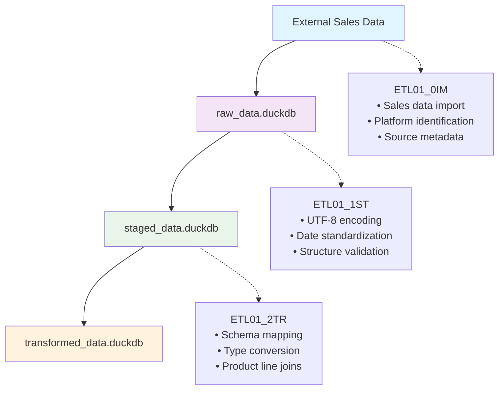

# ETL01: Sales Data Preparation Pipeline (0IM→1ST→2TR)

## Core Purpose

ETL01 implements a **three-phase data preparation pipeline** for sales transaction data, focusing purely on Extract-Transform-Load operations without business logic. This pipeline prepares clean, standardized sales data at the transaction level for subsequent analysis by Derivation functions (D01 for DNA analysis, etc.).

## Pipeline Architecture



**Input**: Raw sales transaction files (CSV, Excel, JSON)  
**Output**: Clean, standardized sales transactions in `transformed_data.duckdb`  
**Consumers**: D01 (DNA Analysis), D02 (Customer Views), other derivations

## ETL vs Derivation Separation

### What ETL01 Handles (Data Preparation Only)
- **Extract**: Import sales transactions from external sources
- **Transform**: Standardize columns, convert types, join product lines
- **Load**: Store clean transaction-level data

### What D01 Handles (Business Logic)
- Customer aggregation and profiling
- RFM calculation and scoring
- DNA analysis and segmentation
- Business metrics and insights

## Phase 0IM: Import Raw Data

### Purpose
Import raw sales data from external sources into the raw data layer, preserving original structure and adding import metadata.

### NSQL Operations

```nsql
-- Import sales transactions from external sources
IMPORT sales_transactions FROM external_sources
WHERE format IN (csv, excel, json)
  AND source_path = configured_path
INTO raw_data.raw_[platform]_sales_[timestamp]
WITH METADATA (
  import_timestamp = CURRENT_TIMESTAMP,
  source_path = file_path,
  platform_code = identified_platform_code,  -- three-letter code (eby, cbz, etc.)
  source_type = file_format,
  row_number = sequential_id
)

-- Validation
VALIDATE import_result
ENSURE row_count > 0
  AND columns_detected > 0
  AND no_corruption_detected
```

### Key Operations
1. **Source Detection**: Identify file format (CSV/Excel/JSON)
2. **Platform Identification**: Tag data with three-letter platform_id (amz, eby, cbz, etc.)
3. **Metadata Addition**: Add import tracking fields
4. **Structure Preservation**: Maintain original column names and types

### Output
- Table: `raw_[platform]_sales_[timestamp]` in `raw_data.duckdb`
- Includes: Original data + ETL metadata columns

## Phase 1ST: Stage Data

### Purpose
Standardize file encoding, normalize date formats, and perform initial validation while preserving data lineage.

### NSQL Operations

```nsql
-- Stage raw sales data with standardization
TRANSFORM raw_sales_table
APPLY encoding_normalization TO UTF8
STANDARDIZE date_columns USING parse_date_time
PRESERVE all_original_columns
ADD staging_metadata (
  staging_timestamp = CURRENT_TIMESTAMP,
  encoding_validated = TRUE,
  staging_version = "1.0"
)
INTO staged_data.staged_[platform]_sales_[timestamp]

-- Quality validation
VALIDATE staged_data
CHECK encoding = UTF8 FOR ALL text_columns
CHECK date_formats ARE consistent
CHECK row_count = original_row_count
```

### Key Operations
1. **Encoding Normalization**: Convert all text to UTF-8
2. **Date Standardization**: Parse and standardize date/time formats
3. **Line Ending Normalization**: Ensure consistent line endings
4. **Validation Checks**: Verify data integrity post-staging

### Output
- Table: `staged_[platform]_sales_[timestamp]` in `staged_data.duckdb`
- Ensures: Clean encoding, standardized dates, preserved row count

## Phase 2TR: Transform Data

### Purpose
Map columns to standard schema, convert data types, enrich with product line information, and apply business rules.

### NSQL Operations

```nsql
-- Transform staged data to standard schema
TRANSFORM staged_sales_table
MAP COLUMNS (
  ship_postal_code -> customer_id,
  time -> payment_time,
  product_price -> lineproduct_price,
  asin -> product_id,
  order_id -> transaction_id
)
CONVERT TYPES (
  customer_id TO character,
  payment_time TO datetime,
  lineproduct_price TO numeric,
  product_id TO character,
  transaction_id TO character
)
ASSIGN platform_id = configured_platform
JOIN WITH product_line_dictionary
  ON product_id = asin
  ADD COLUMNS (product_line_id)
VALIDATE (
  lineproduct_price BETWEEN 0 AND 10000,
  payment_time AFTER "2020-01-01"
)
ADD transformation_metadata (
  transformation_timestamp = CURRENT_TIMESTAMP,
  schema_version = "sales_v1.0"
)
INTO transformed_data.transformed_[platform]_sales_[timestamp]

-- Create indexes for performance
CREATE INDEX ON (customer_id, payment_time, platform_id)
```

### Key Operations
1. **Column Mapping**: Map source columns to standard names
2. **Type Conversion**: Convert to appropriate data types
3. **Platform Assignment**: Add platform identification
4. **Product Line Enrichment**: Join with product line dictionary
5. **Data Validation**: Apply business rule validations
6. **Index Creation**: Optimize for common query patterns

### Output
- Table: `transformed_[platform]_sales_[timestamp]` in `transformed_data.duckdb`
- Schema: Standardized transaction-level sales data

## Configuration Structure

The ETL01 pipeline is driven by a configuration structure that defines source mappings, transformations, and validation rules:

### Configuration Elements

```yaml
etl01_config:
  etl_name: "sales_data_preparation"
  etl_version: "1.0"
  
  source:
    type: [csv|excel|json]
    path: "data/source_file"
    platform_id: "platform_name"
    encoding: "UTF-8"
    date_format: "%Y-%m-%d %H:%M:%S"
  
  staging:
    encoding_target: "UTF-8"
    validation_required: true
    preserve_raw_structure: true
  
  transformation:
    column_mapping:
      # source_column: standard_column
    type_conversions:
      # column: target_type
    platform_assignment:
      platform_id: "value"
    product_line_join:
      join_table: "dictionary_table"
      join_key: "key_column"
      add_columns: ["columns_to_add"]
    validation_rules:
      # column: {min: value, max: value}
  
  output:
    table_name: "df_sales_standardized"
    database: "transformed_data"
    columns: [list_of_output_columns]
    optimization:
      create_indexes: true
      index_columns: ["key_columns"]
```

## Integration with Derivation Functions

ETL01 provides clean, standardized sales transaction data that derivation functions consume:

### Data Flow to D01 (DNA Analysis)

```nsql
-- D01: Customer DNA Analysis consumes ETL01 output
FROM transformed_data.sales_transactions
AGGREGATE BY customer_id, platform_id, product_line_id
CALCULATE (
  total_spent = SUM(lineproduct_price),
  transaction_count = COUNT(*),
  first_purchase = MIN(payment_time),
  last_purchase = MAX(payment_time)
)
DERIVE rfm_scores
ANALYZE customer_dna_patterns
GENERATE business_insights
```

## Implementation Scripts

The ETL01 pipeline is implemented through three sequential scripts:

1. **`amz_ETL01_0IM.R`** - Import phase implementation
2. **`amz_ETL01_1ST.R`** - Staging phase implementation  
3. **`amz_ETL01_2TR.R`** - Transform phase implementation

Each script can be executed independently for debugging or as part of the complete pipeline using the master execution function.

## Execution Workflow

### Complete Pipeline Execution

```bash
# Execute the full ETL01 pipeline
Rscript scripts/update_scripts/amz_ETL01_0IM.R
Rscript scripts/update_scripts/amz_ETL01_1ST.R
Rscript scripts/update_scripts/amz_ETL01_2TR.R
```

### Debugging with S02 Data Export

Per **MP093: Data Visualization Debugging**, use the S02 sequence to inspect data at each phase:

```bash
# Debug ETL pipeline by exporting data after each phase
Rscript scripts/update_scripts/amz_ETL01_0IM.R
Rscript scripts/update_scripts/all_S02_00.R  # Inspect raw import

Rscript scripts/update_scripts/amz_ETL01_1ST.R
Rscript scripts/update_scripts/all_S02_00.R  # Inspect staging results

Rscript scripts/update_scripts/amz_ETL01_2TR.R
Rscript scripts/update_scripts/all_S02_00.R  # Inspect final transformation

# View exported data
ls -la data/database_to_csv/raw_data/
ls -la data/database_to_csv/staged_data/
ls -la data/database_to_csv/transformed_data/
```

This allows you to:
- Verify data was imported correctly (0IM)
- Check encoding and date standardization (1ST)
- Validate schema mapping and transformations (2TR)
- Compare data across phases to identify issues

### Master Function Execution

```nsql
EXECUTE etl01_complete_pipeline
WITH configuration = etl01_config
PHASES (0IM -> 1ST -> 2TR)
RETURN (
  success_status,
  transaction_count,
  output_table_name,
  execution_time
)
```

## Data Quality Assurance

### Import Phase Quality Checks
- Source file existence and readability
- Format detection accuracy
- Row count validation
- Column structure preservation

### Staging Phase Quality Checks
- Encoding consistency verification
- Date format standardization success
- Data corruption detection
- Row count preservation

### Transform Phase Quality Checks
- Schema mapping completeness
- Type conversion success rates
- Business rule compliance
- Referential integrity (product lines)

## Performance Considerations

### Optimization Strategies
1. **Batch Processing**: Process large files in configurable chunks
2. **Index Creation**: Create indexes on frequently queried columns
3. **Connection Pooling**: Reuse database connections across phases
4. **Memory Management**: Clear intermediate objects after use

### Scalability Patterns
- **Horizontal**: Process multiple source files in parallel
- **Vertical**: Increase resources for large file processing
- **Incremental**: Support delta updates for ongoing imports

## Error Handling and Recovery

### Error Categories
1. **Source Errors**: File not found, corrupt data, invalid format
2. **Staging Errors**: Encoding failures, date parsing issues
3. **Transform Errors**: Schema mismatches, validation failures

### Recovery Mechanisms
- **Checkpointing**: Save progress at each phase
- **Rollback**: Revert to previous successful state
- **Retry Logic**: Automatic retry with exponential backoff
- **Error Logging**: Comprehensive error tracking and reporting

## Monitoring and Observability

### Key Metrics
- **Row Counts**: Track data volume through each phase
- **Processing Time**: Monitor phase and total execution times
- **Quality Scores**: Track data quality improvements
- **Error Rates**: Monitor failure patterns and frequencies

### Logging Strategy
```nsql
LOG etl_execution
CAPTURE (
  phase_name,
  start_time,
  end_time,
  row_count,
  error_count,
  quality_score
)
TO etl_monitoring.execution_log
```

## Conclusion

ETL01 provides a robust, three-phase data preparation pipeline that transforms raw sales transaction data into standardized, analysis-ready format. By separating data preparation (ETL) from business logic (Derivations), the system maintains clear boundaries and enables modular, maintainable data processing.

The pipeline outputs transaction-level data that serves as the foundation for various business analyses including customer DNA profiling, RFM analysis, and market segmentation - all handled by separate Derivation functions that consume ETL01's clean output.