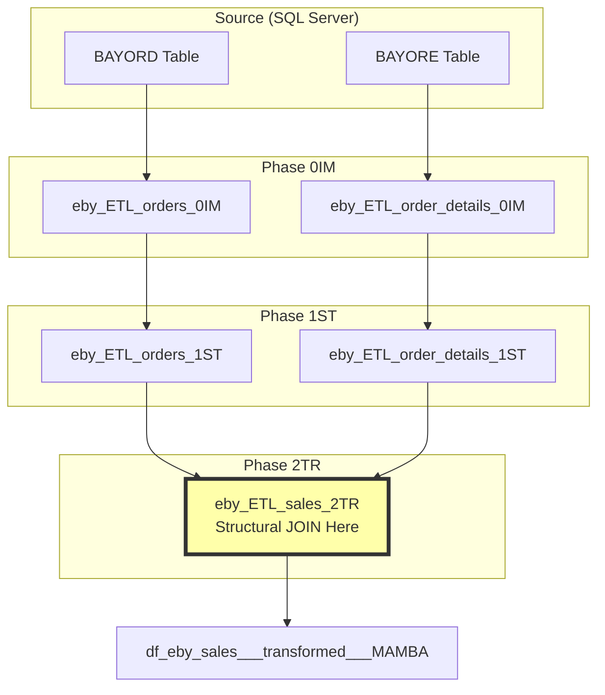

# eBay ETL Pipeline: Complete Implementation Case Study

## Executive Summary

This case study documents the complete refactoring of MAMBA's eBay ETL pipeline from a monolithic, principle-violating implementation to a clean, separated architecture that fully complies with MAMBA principles. The transformation demonstrates how to properly handle normalized source data (BAYORD and BAYORE tables) through the three-phase ETL architecture.

## The Challenge

### Original Implementation (Violated Principles)
The original `eby_ETL_sales_0IM___MAMBA.R` performed a JOIN between BAYORD (order headers) and BAYORE (order details) directly in the import phase:

```r
# ❌ WRONG: JOIN in 0IM phase
query <- "
  SELECT * FROM BAYORE
  INNER JOIN BAYORD
    ON BAYORE.ORE001 = BAYORD.ORD001
    AND CAST(BAYORE.ORE013 AS VARBINARY(50)) = CAST(BAYORD.ORD009 AS VARBINARY(50))
"
```

**Problems:**
- Violated MP064: ETL-Derivation Separation (JOIN in wrong phase)
- Violated MP104: ETL Data Flow Separation (mixed data types)
- Made reuse impossible (couldn't analyze orders without details)
- Hidden business logic in import phase

## The Solution

### New Architecture: Separated Pipelines with 2TR JOIN



## Implementation Details

### Phase 0IM: Import Raw Data Separately

#### `eby_ETL_orders_0IM___MAMBA.R`
**Purpose**: Import BAYORD (order headers) only
**Key Implementation**:
```r
# No JOIN - just import raw BAYORD
query <- "
  SELECT 
    ORD001, ORD002, ORD003, ... ORD050
  FROM BAYORD
  WHERE ORD003 >= '2024-01-01'
"
bayord_data <- dbGetQuery(sql_conn, query)

# Store with original column names
dbWriteTable(raw_data, "df_eby_orders___raw___MAMBA", bayord_data)
```

#### `eby_ETL_order_details_0IM___MAMBA.R`
**Purpose**: Import BAYORE (order details) only
**Key Implementation**:
```r
# No JOIN - just import raw BAYORE
query <- "
  SELECT 
    ORE001, ORE002, ORE003, ... ORE050
  FROM BAYORE
  WHERE ORE004 >= '2024-01-01'
"
bayore_data <- dbGetQuery(sql_conn, query)

# Store with original column names
dbWriteTable(raw_data, "df_eby_order_details___raw___MAMBA", bayore_data)
```

### Phase 1ST: Standardize Column Names

#### `eby_ETL_orders_1ST___MAMBA.R`
**Purpose**: Rename columns and handle encoding
**Key Transformations**:
```r
staged_orders <- raw_orders %>%
  rename(
    order_id = ORD001,
    order_date = ORD003,
    batch_key = ORD009,  # Critical for JOIN
    recipient_name = ORD010,
    country_name = ORD016
  ) %>%
  mutate(
    # Handle encoding for JOIN key
    batch_key = iconv(batch_key, from = "latin1", to = "UTF-8"),
    order_date = as.POSIXct(order_date, tz = "UTC")
  )
```

#### `eby_ETL_order_details_1ST___MAMBA.R`
**Purpose**: Rename columns and handle encoding
**Key Transformations**:
```r
staged_details <- raw_details %>%
  rename(
    order_id = ORE001,
    line_item_number = ORE002,
    product_sku = ORE006,
    batch_key = ORE013,  # Critical for JOIN
    quantity = ORE009,
    unit_price = ORE010
  ) %>%
  mutate(
    # Handle encoding for JOIN key
    batch_key = iconv(batch_key, from = "latin1", to = "UTF-8"),
    quantity = as.integer(quantity)
  )
```

### Phase 2TR: Structural JOIN and Transform

#### `eby_ETL_sales_2TR___MAMBA.R`
**Purpose**: JOIN orders and details to create denormalized sales records
**Critical Implementation**:
```r
# THIS is where the structural JOIN happens
sales_data <- staged_orders %>%
  inner_join(
    staged_details,
    by = c(
      "order_id" = "order_id",        # BAYORD.ORD001 = BAYORE.ORE001
      "batch_key" = "batch_key"        # BAYORD.ORD009 = BAYORE.ORE013
    ),
    suffix = c("_order", "_detail")
  )

# Transform to final schema
dt_sales <- as.data.table(sales_data)
dt_sales[, `:=`(
  # Consolidate fields
  order_date = order_date_order,
  customer_name = recipient_name,
  ship_to_country = country_name,
  
  # Use detail-level product info
  product_sku = product_sku,
  quantity = quantity,
  gross_revenue = line_total,
  
  # Add calculated fields
  customer_id = paste0("EBY_", ebay_user_id)
)]

# Store denormalized result
dbWriteTable(transformed_data, 
             "df_eby_sales___transformed___MAMBA", 
             dt_sales)
```

## Data Flow Example

### Sample Data Through Pipeline

**Raw BAYORD (0IM)**:
```
ORD001 | ORD003      | ORD009 | ORD010    | ORD016
-------|-------------|--------|-----------|--------
12345  | 2024-01-15  | ABC123 | John Doe  | USA
```

**Raw BAYORE (0IM)**:
```
ORE001 | ORE002 | ORE006 | ORE013 | ORE009 | ORE010
-------|--------|--------|--------|--------|--------
12345  | 1      | SKU001 | ABC123 | 2      | 99.99
12345  | 2      | SKU002 | ABC123 | 1      | 149.99
```

**Staged Orders (1ST)**:
```
order_id | order_date  | batch_key | recipient_name | country_name
---------|-------------|-----------|----------------|-------------
12345    | 2024-01-15  | ABC123    | John Doe       | USA
```

**Staged Order Details (1ST)**:
```
order_id | line_item_number | product_sku | batch_key | quantity | unit_price
---------|------------------|-------------|-----------|----------|------------
12345    | 1                | SKU001      | ABC123    | 2        | 99.99
12345    | 2                | SKU002      | ABC123    | 1        | 149.99
```

**Transformed Sales (2TR - After JOIN)**:
```
order_id | order_date  | customer_name | country | product_sku | quantity | gross_revenue
---------|-------------|---------------|---------|-------------|----------|---------------
12345    | 2024-01-15  | John Doe      | USA     | SKU001      | 2        | 199.98
12345    | 2024-01-15  | John Doe      | USA     | SKU002      | 1        | 149.99
```

## Key Benefits of Separated Architecture

### 1. Reusability
- Can analyze orders without details
- Can analyze product performance independently
- Each pipeline can be rerun independently

### 2. Maintainability
- Clear separation of concerns
- Easy to debug phase-by-phase
- Changes to one table don't affect the other

### 3. Performance
- Can optimize each pipeline independently
- Parallel execution possible
- Incremental updates easier

### 4. Compliance
- Fully compliant with MP064 and MP104
- Clear audit trail
- Testable at each phase

## Validation and Testing

### Phase Testing Strategy

```r
# 0IM Tests
test_0IM <- function() {
  # Verify no JOINs
  assertthat::assert_that(
    !any(grepl("ORE", colnames(orders_raw))),
    msg = "Orders table contains detail columns - JOIN violation!"
  )
  
  # Verify raw structure preserved
  assertthat::assert_that(
    all(grepl("^ORD", colnames(orders_raw))),
    msg = "Column names transformed in 0IM - violation!"
  )
}

# 2TR Tests  
test_2TR <- function() {
  # Verify JOIN successful
  orders_in <- length(unique(staged_orders$order_id))
  orders_out <- length(unique(sales_transformed$order_id))
  
  assertthat::assert_that(
    orders_out > 0,
    msg = "JOIN produced no results"
  )
  
  # Verify denormalization
  assertthat::assert_that(
    nrow(sales_transformed) >= orders_out,
    msg = "Expected denormalized records"
  )
}
```

## Lessons Learned

### 1. JOIN Placement is Critical
The structural JOIN between normalized tables MUST happen in 2TR phase, not earlier. This preserves flexibility and reusability.

### 2. Encoding Issues Need Early Handling
The VARBINARY casting issue from SQL Server is handled in 1ST phase, making the JOIN in 2TR clean and simple.

### 3. Separation Enables Evolution
With separated pipelines, we can now:
- Add customer ETL without touching orders
- Enhance product details independently
- Create alternative transformations

## Migration Path for Similar Cases

If you have similar monolithic ETLs:

1. **Analyze the JOIN**:
   - What tables are being joined?
   - Is it structural (creating records) or analytical?

2. **Create Separate 0IM Scripts**:
   - One per source table
   - No transformations

3. **Standardize in 1ST**:
   - Handle encoding
   - Rename columns
   - Fix data types

4. **JOIN in 2TR**:
   - Combine tables here
   - Apply business rules
   - Create final schema

## Conclusion

This refactoring demonstrates that proper separation of concerns in ETL pipelines leads to more maintainable, testable, and reusable code. The eBay implementation now serves as a reference model for handling normalized source data in the MAMBA framework.

## Related Documentation

- [ETL Overview](../00_ETL_overview.qmd)
- [Data Type Separation Guide](../02_ETL_data_type_separation.qmd)
- [Structural JOIN Patterns](../06_ETL_structural_joins.qmd)
- [Migration Guide](../08_ETL_migration_guide.qmd)