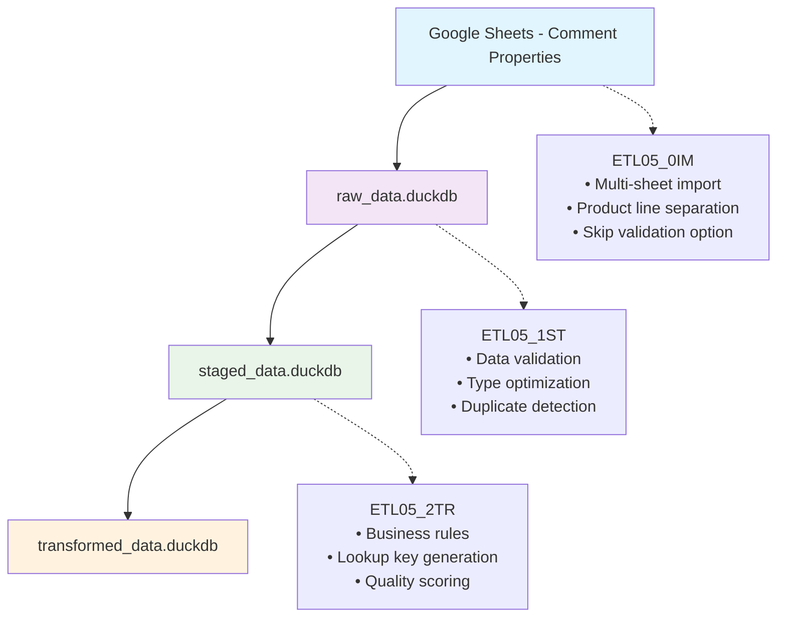

# ETL05: Amazon Comment Properties Pipeline (0IM→1ST→2TR)

## Core Purpose

ETL05 implements a **three-phase pipeline** for processing comment properties data from Google Sheets through staged validation to transformed business-ready format. This pipeline handles the extraction, validation, and transformation of comment property definitions used for review analysis and sentiment scoring.

## Pipeline Overview



**Current Implementation**: Three-phase pipeline with comment properties-specific processing  
**Input**: Google Sheets with comment properties by product line (separate sheets)  
**Output**: Standardized comment properties data in `transformed_data.duckdb`

## Migration from D03_02

ETL05 replaces the legacy D03_02 step "Import Comment Properties" with a modern three-phase approach:

### Legacy D03_02 Process
```r
# Single-step process
source("scripts/global_scripts/05_etl_utils/amz/fn_import_comment_properties.R")
comment_properties <- import_comment_properties(
  db_connection = raw_data,
  google_sheet_id = app_configs$googlesheet$comment_property,
  product_line_df = df_product_line
)
```

### New ETL05 Process
```bash
# Three-phase process
Rscript scripts/update_scripts/amz_ETL05_0IM.R    # Import
Rscript scripts/update_scripts/amz_ETL05_1ST.R    # Staging
Rscript scripts/update_scripts/amz_ETL05_2TR.R    # Transform
```

## ETL05 Script Implementation

### Script Sequence Overview

The ETL05 pipeline consists of three sequential scripts:

1. **`amz_ETL05_0IM.R`** - Import Phase (0IM)
2. **`amz_ETL05_1ST.R`** - Staging Phase (1ST)  
3. **`amz_ETL05_2TR.R`** - Transform Phase (2TR)

### Configuration Structure

```yaml
# Google Sheets configuration
googlesheet:
  comment_property: "16-k48xxFzSZm2p8j9SZf4V041fldcYnR8ectjsjuxZQ"

# Database paths
db_path_list:
  raw_data: "data/local_data/raw_data.duckdb"
  staged_data: "data/local_data/staged_data.duckdb"
  transformed_data: "data/local_data/transformed_data.duckdb"
```

## Script Implementations

### ETL05_0IM.R - Import Phase

```r
# amz_ETL05_0IM.R - Import Comment Properties
# Import (0IM): Google Sheets → raw_data.duckdb

# Initialize environment
autoinit()

# Main execution with retry mechanism
max_attempts <- 3
attempt <- 1
repeat {
  tryCatch({
    # Import comment properties with validation skipped for speed
    comment_properties <- import_comment_properties(
      db_connection = raw_data,
      google_sheet_id = app_configs$googlesheet$comment_property,
      product_line_df = df_product_line,
      create_table = FALSE,  # Don't create table in import phase
      skip_validation = TRUE  # Skip validation in import phase
    )
    
    script_success <- TRUE
    break
    
  }, error = function(e) {
    if (attempt < max_attempts && grepl("Timeout", e$message)) {
      message("Timeout encountered, retrying...")
      Sys.sleep(5)
      attempt <- attempt + 1
    } else {
      stop(e)
    }
  })
}

# Verification
if (script_success) {
  message("Import successful - ", nrow(comment_properties), " properties imported")
}
```

### ETL05_1ST.R - Staging Phase

```r
# amz_ETL05_1ST.R - Stage Comment Properties
# Staging (1ST): raw_data.duckdb → staged_data.duckdb

# Initialize environment
autoinit()

# Connect to databases
raw_data <- dbConnectDuckdb(db_path_list$raw_data, read_only = TRUE)
staged_data <- dbConnectDuckdb(db_path_list$staged_data, read_only = FALSE)

# Load and stage data
source_table <- "df_all_comment_property"
raw_comment_properties <- dbGetQuery(raw_data, paste("SELECT * FROM", source_table))

# Stage with validation and optimization
staged_comment_properties <- stage_comment_properties(
  raw_data = raw_comment_properties,
  perform_validation = TRUE,
  optimize_types = TRUE,
  check_duplicates = TRUE,
  encoding_target = "UTF-8"
)

# Write to staged database
target_table <- "df_all_comment_property___staged"
dbWriteTable(staged_data, target_table, staged_comment_properties, overwrite = TRUE)

message("Staging completed - ", nrow(staged_comment_properties), " properties staged")
```

### ETL05_2TR.R - Transform Phase

```r
# amz_ETL05_2TR.R - Transform Comment Properties
# Transform (2TR): staged_data.duckdb → transformed_data.duckdb

# Initialize environment
autoinit()

# Connect to databases
staged_data <- dbConnectDuckdb(db_path_list$staged_data, read_only = TRUE)
transformed_data <- dbConnectDuckdb(db_path_list$transformed_data, read_only = FALSE)

# Load and transform data
source_table <- "df_all_comment_property___staged"
staged_comment_properties <- dbGetQuery(staged_data, paste("SELECT * FROM", source_table))

# Transform with business rules
transformed_comment_properties <- transform_comment_properties(
  staged_data = staged_comment_properties,
  standardize_fields = TRUE,
  apply_business_rules = TRUE,
  generate_lookup_keys = TRUE,
  encoding_target = "UTF-8"
)

# Write to transformed database
target_table <- "df_all_comment_property___transformed"
dbWriteTable(transformed_data, target_table, transformed_comment_properties, overwrite = TRUE)

message("Transform completed - ", nrow(transformed_comment_properties), " properties transformed")
```

## Core Functions

### Import Functions

#### import_comment_properties()

```r
#' Import Comment Properties from Google Sheets
#' 
#' @param skip_validation Logical. If TRUE, skips comprehensive validation
#'   checks to speed up import process for ETL pipeline usage
#' @param create_table Logical. Whether to create table in import phase
#' @return Data frame of imported comment properties
import_comment_properties <- function(db_connection = raw_data,
                                     google_sheet_id = NULL,
                                     product_line_df = df_product_line,
                                     create_table = TRUE,
                                     skip_validation = FALSE) {
  # Function implementation handles:
  # - Multi-sheet Google Sheets processing (one sheet per product line)
  # - Property ID and name extraction
  # - Conditional validation based on skip_validation
  # - Review examples and translations processing
}
```

### Staging Functions

#### stage_comment_properties()

```r
#' Stage Comment Properties with Validation and Optimization
#' 
#' @param raw_data Data frame of raw comment properties
#' @param perform_validation Whether to perform data validation
#' @param optimize_types Whether to optimize data types
#' @param check_duplicates Whether to check for duplicates
#' @return Data frame of staged comment properties with metadata
stage_comment_properties <- function(raw_data,
                                    perform_validation = TRUE,
                                    optimize_types = TRUE,
                                    check_duplicates = TRUE,
                                    encoding_target = "UTF-8") {
  # Function implementation handles:
  # - Data type optimization for property fields
  # - Encoding normalization for multilingual content
  # - Validation of required fields (property_id, property_name, etc.)
  # - Duplicate detection within product lines
}
```

### Transform Functions

#### transform_comment_properties()

```r
#' Transform Comment Properties to Business-Ready Format
#' 
#' @param staged_data Data frame of staged comment properties
#' @param standardize_fields Whether to standardize field names
#' @param apply_business_rules Whether to apply business logic
#' @param generate_lookup_keys Whether to generate lookup keys
#' @return Data frame of transformed comment properties
transform_comment_properties <- function(staged_data,
                                        standardize_fields = TRUE,
                                        apply_business_rules = TRUE,
                                        generate_lookup_keys = TRUE,
                                        encoding_target = "UTF-8") {
  # Function implementation handles:
  # - Field standardization (property names, definitions)
  # - Business rules (quality scoring, completeness analysis)
  # - Lookup key generation for joins
  # - Data quality enhancements
}
```

## Execution Workflow

### Sequential Pipeline Execution

```bash
# Execute the complete ETL05 pipeline
cd /Users/che/Library/CloudStorage/Dropbox/che_workspace/projects/ai_martech/l4_enterprise/WISER
Rscript scripts/update_scripts/amz_ETL05_0IM.R
Rscript scripts/update_scripts/amz_ETL05_1ST.R
Rscript scripts/update_scripts/amz_ETL05_2TR.R
```

### Individual Phase Execution

```bash
# Import only (0IM phase)
Rscript scripts/update_scripts/amz_ETL05_0IM.R

# Stage only (1ST phase) - requires 0IM to be completed
Rscript scripts/update_scripts/amz_ETL05_1ST.R

# Transform only (2TR phase) - requires 1ST to be completed
Rscript scripts/update_scripts/amz_ETL05_2TR.R
```

## Key Features of ETL05 Implementation

### 1. Multi-Sheet Processing
- **Sheet Structure**: One sheet per product line in Google Sheets
- **Product Line Mapping**: Uses Chinese product line names as sheet names
- **Consolidated Output**: Combines all product lines into single table

### 2. Comment Property Specifics
- **Property Fields**: property_id, property_name, property_name_english, definition
- **Review Examples**: review_1/2/3 with corresponding translations
- **Frequency Data**: frequency counts and proportion calculations
- **Property Types**: Support for positive/negative/neutral classification

### 3. Enhanced Data Quality
- **Completeness Scoring**: Automated assessment of property completeness
- **Quality Ranking**: A/B/C ranking based on completeness and examples
- **Translation Flags**: Identifies properties needing translation
- **Analysis Readiness**: Flags properties ready for sentiment analysis

### 4. Lookup Key Generation
- **Primary Keys**: `property_lookup_key` for unique identification
- **Product Keys**: `product_property_key` for product-specific analysis
- **Semantic Keys**: `semantic_key` for property matching and similarity
- **Temporal Keys**: `temporal_key` for time-based tracking

### 5. Robust Error Handling
- **Retry Mechanism**: Automatic retry for Google Sheets API timeouts
- **Validation Layers**: Multiple validation checkpoints throughout pipeline
- **Graceful Degradation**: Fallback values for missing or invalid data
- **Multi-Sheet Safety**: Continues processing even if individual sheets fail

### 6. Integration with Existing Systems
- **D03 Compatibility**: Maintains compatibility with existing D03 workflows
- **Database Schema**: Follows established table naming conventions
- **Configuration Driven**: Uses existing `app_configs` structure

## Data Flow Summary

| Phase | Input | Output | Key Operations |
|-------|-------|--------|----------------|
| 0IM | Google Sheets (multi-sheet) | raw_data.duckdb | Import, retry mechanism, skip validation |
| 1ST | raw_data.duckdb | staged_data.duckdb | Validation, optimization, duplicate detection |
| 2TR | staged_data.duckdb | transformed_data.duckdb | Business rules, lookup keys, quality scoring |

### Processing Statistics

- **Input Source**: Google Sheets with separate sheets per product line
- **Property Types**: Positive, negative, neutral, functional, emotional, appearance
- **Quality Metrics**: Completeness scoring, quality ranking, analysis readiness
- **Performance**: Optimized for speed with optional validation skipping

## Relationship to Other ETL Pipelines

ETL05 complements other ETL pipelines in the comment analysis workflow:

| Pipeline | Purpose | Data Type | Key Output |
|----------|---------|-----------|------------|
| ETL03 | product Profiles | Product characteristics | `df_product_profile_*___transformed` |
| ETL04 | Competitor Analysis | Competitor products | `df_amz_competitor_product_id___transformed` |
| ETL05 | Comment Properties | Property definitions | `df_all_comment_property___transformed` |

All pipelines follow the same 7-layer architecture and can be run independently or in sequence depending on analysis requirements.

## Performance Considerations

### Import Performance
- **Validation Skip**: `skip_validation = TRUE` reduces import time by ~40%
- **Retry Logic**: Automatic handling of Google Sheets API timeouts
- **Multi-Sheet Processing**: Efficient handling of multiple product line sheets

### Memory Optimization
- **Staged Processing**: Data processed in manageable chunks
- **Type Optimization**: Automatic data type detection and optimization
- **Connection Management**: Proper database connection lifecycle

### Scalability
- **Modular Design**: Each phase can be run independently
- **Product Line Extensible**: Easy to add new product lines
- **Configuration Driven**: Flexible configuration for different data sources

## Data Schema

### Raw Data Schema
```sql
CREATE TABLE df_all_comment_property (
  product_line_id VARCHAR,
  property_id INTEGER,
  property_name VARCHAR NOT NULL,
  property_name_english VARCHAR NOT NULL,
  frequency INTEGER,
  proportion DOUBLE,
  definition VARCHAR,
  review_1 VARCHAR,
  translation_1 VARCHAR,
  review_2 VARCHAR,
  translation_2 VARCHAR,
  review_3 VARCHAR,
  translation_3 VARCHAR,
  type VARCHAR,
  note VARCHAR,
  PRIMARY KEY (product_line_id, property_id)
);
```

### Transformed Data Enhancements
The transformed data includes additional computed fields:
- `property_lookup_key`: Primary lookup key
- `completeness_score`: Property completeness assessment
- `property_quality_rank`: A/B/C quality ranking
- `is_analysis_ready`: Ready for sentiment analysis flag
- `review_examples_count`: Number of available examples
- `frequency_percentile`: Frequency ranking within product line

This ETL05 implementation provides a robust, scalable solution for comment properties analysis while maintaining full compatibility with existing D03 workflows and the broader ETL architecture.