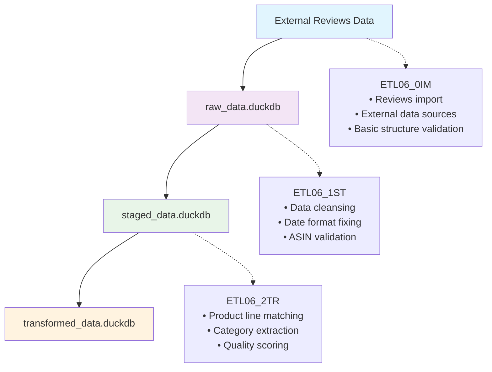

# ETL06: Amazon Reviews Data Preparation Pipeline (0IM→1ST→2TR)

## Core Purpose

ETL06 implements a **three-phase data preparation pipeline** for Amazon reviews data, focusing purely on Extract-Transform-Load operations without business logic analysis. This pipeline prepares clean, standardized reviews data for subsequent analysis functions while maintaining the separation between data preparation and analytical operations.

## Pipeline Overview



**Current Implementation**: Pure data preparation pipeline (no business logic)  
**Input**: External Amazon reviews data sources  
**Output**: Clean, standardized reviews data ready for analysis

## Migration from D03_03~D03_05

ETL06 consolidates the pure data preparation aspects of D03_03, D03_04, and D03_05 into a unified pipeline:

### Legacy D03 Process
```bash
# Three separate steps
Rscript scripts/update_scripts/amz_D03_03.R    # Import Reviews
Rscript scripts/update_scripts/amz_D03_04.R    # Cleanse Reviews  
Rscript scripts/update_scripts/amz_D03_05.R    # Process Reviews
```

### New ETL06 Process
```bash
# Three-phase unified pipeline
Rscript scripts/update_scripts/amz_ETL06_0IM.R    # Import
Rscript scripts/update_scripts/amz_ETL06_1ST.R    # Staging
Rscript scripts/update_scripts/amz_ETL06_2TR.R    # Transform
```

## ETL06 vs D03 Separation

### What ETL06 Handles (Data Preparation)
- **Extract**: Import reviews from external sources
- **Transform**: Clean dates, standardize formats, validate ASINs
- **Load**: Store in standardized database layers

### What Remains in D03 (Business Logic)
- **D03_06**: Wide to Long transformation (analysis-specific)
- **D03_07**: Rate Reviews (analysis function)
- **D03_08-D03_11**: Analysis and reporting functions

## ETL06 Script Implementation

### Script Sequence Overview

The ETL06 pipeline consists of three sequential scripts:

1. **`amz_ETL06_0IM.R`** - Import Phase (0IM)
2. **`amz_ETL06_1ST.R`** - Staging Phase (1ST)  
3. **`amz_ETL06_2TR.R`** - Transform Phase (2TR)

### Configuration Structure

```yaml
# Database paths
db_path_list:
  raw_data: "data/local_data/raw_data.duckdb"
  staged_data: "data/local_data/staged_data.duckdb"
  transformed_data: "data/local_data/transformed_data.duckdb"

# Data source configuration
RAW_DATA_DIR: "data/external_sources"
```

## Script Implementations

### ETL06_0IM.R - Import Phase

```r
# amz_ETL06_0IM.R - Amazon 商品評論資料匯入
# ETL06 階段 0 匯入：從本地檔案匯入商品評論資料

# Initialize environment
autoinit()

# Connect to raw data database
raw_data <- dbConnectDuckdb(db_path_list$raw_data, read_only = FALSE)

# Import Amazon reviews from CSV/Excel files
reviews_dir <- file.path(RAW_DATA_DIR, "amazon_reviews")
message("MAIN: Importing reviews from: ", reviews_dir)

# Check if directory exists, create if needed
if (!dir.exists(reviews_dir)) {
  dir.create(reviews_dir, recursive = TRUE, showWarnings = FALSE)
  # Create README with expected structure
} else {
  # Check for files and import using import_csvxlsx
  files <- list.files(reviews_dir, pattern = "\\.(csv|xlsx?)$", 
                     recursive = TRUE, full.names = TRUE, ignore.case = TRUE)
  
  if (length(files) > 0) {
    # Import all CSV and Excel files from the directory
    df_amz_review <- import_csvxlsx(reviews_dir)
    
    # Write to database
    dbWriteTable(raw_data, "df_amz_review", df_amz_review, overwrite = TRUE)
    message("MAIN: Writing ", nrow(df_amz_review), " reviews to raw_data")
  }
}
```

### ETL06_1ST.R - Staging Phase

```r
# amz_ETL06_1ST.R - Amazon Reviews 資料清理階段處理
# ETL06 階段 1 清理：清理和標準化 Amazon reviews 資料

# Initialize environment
autoinit()

# Connect to databases
raw_data <- dbConnectDuckdb(db_path_list$raw_data, read_only = TRUE)
staged_data <- dbConnectDuckdb(db_path_list$staged_data, read_only = FALSE)

# Load raw reviews data
df_amazon_reviews <- dbGetQuery(raw_data, "SELECT * FROM df_amz_review")
initial_rows <- nrow(df_amazon_reviews)

# Apply cleansing logic based on D03_04 fn_cleanse_amazon_reviews
# 1. Fix date format using parse_date_time3
# 2. Rename 'variation' to 'asin' if exists
# 3. Filter for valid ASIN format (10 alphanumeric characters)

# Check if 'variation' column exists and rename to 'asin'
if ("variation" %in% names(df_amazon_reviews)) {
  df_amazon_reviews <- df_amazon_reviews %>%
    dplyr::rename(asin = variation)
}

# Apply cleansing transformations
staged_reviews <- df_amazon_reviews %>%
  dplyr::mutate(
    # Fix date format using parse_date_time3
    date = parse_date_time3(date)
  ) %>%
  # Filter for valid ASIN format (10 alphanumeric characters)
  dplyr::filter(
    !is.na(asin) & stringr::str_detect(asin, "^[A-Z0-9]{10}$")
  ) %>%
  # Add ETL staging metadata
  dplyr::mutate(
    etl_phase = "staged",
    etl_staging_timestamp = Sys.time(),
    etl_data_quality_score = dplyr::case_when(
      !is.na(date) & !is.na(asin) & !is.na(rating) & !is.na(review_text) ~ 100,
      !is.na(date) & !is.na(asin) & !is.na(rating) ~ 85,
      !is.na(asin) & !is.na(rating) ~ 70,
      !is.na(asin) ~ 50,
      TRUE ~ 30
    )
  )

# Write to staged database
dbWriteTable(staged_data, "df_amz_review___staged", staged_reviews, overwrite = TRUE)
message("Staging completed - ", nrow(staged_reviews), " reviews staged")
```

### ETL06_2TR.R - Transform Phase

```r
# amz_ETL06_2TR.R - Amazon Reviews 資料轉換
# ETL06 階段 2 轉換：處理和豐富 Amazon reviews 資料

# Initialize environment
autoinit()

# Connect to databases
raw_data <- dbConnectDuckdb(db_path_list$raw_data, read_only = TRUE)
staged_data <- dbConnectDuckdb(db_path_list$staged_data, read_only = TRUE)
transformed_data <- dbConnectDuckdb(db_path_list$transformed_data, read_only = FALSE)

# Load staged reviews data
staged_reviews <- dbGetQuery(staged_data, "SELECT * FROM df_amz_review___staged")

# Apply transformation logic based on D03_05 fn_process_amz_reviews
# 1. Extract product line information from paths
# 2. Add product line IDs via joining with product_line_df
# 3. Add competitor flags based on existing competitor data

# Normalize product line data for matching
product_line_df_norm <- df_product_line %>% 
  dplyr::mutate(cat_name = make.names(product_line_name_english))

# Process reviews with product line information
transformed_reviews <- staged_reviews %>% 
  dplyr::mutate(
    # Extract category from path
    raw_cat = stringr::str_extract(path, "(?<=amazon_reviews/)[^/]+"),
    # Clean category name for joining
    cat_name = raw_cat %>% 
      stringr::str_remove("^\\d+_") %>% 
      make.names()
  ) %>% 
  # Join with product line data
  dplyr::left_join(product_line_df_norm, by = "cat_name") %>% 
  dplyr::select(-raw_cat, -cat_name)

# Add competitor flags if competitor table exists
if ("df_competiter_product_id" %in% dbListTables(raw_data)) {
  df_competitor_product_id_with_flag <- dbGetQuery(raw_data, "SELECT * FROM df_competiter_product_id") %>% 
    dplyr::mutate(included_competiter = TRUE)
  
  transformed_reviews <- transformed_reviews %>% 
    dplyr::left_join(df_competitor_product_id_with_flag, by = c("asin", "product_line_id")) %>% 
    dplyr::mutate(included_competiter = dplyr::coalesce(included_competiter, FALSE))
} else {
  transformed_reviews <- transformed_reviews %>% 
    dplyr::mutate(included_competiter = FALSE)
}

# Final data preparation and metadata
transformed_reviews <- transformed_reviews %>%
  dplyr::distinct_all() %>% 
  dplyr::relocate(date, asin, product_line_id) %>% 
  dplyr::arrange(asin, date) %>%
  dplyr::mutate(
    etl_phase = "transformed",
    etl_transform_timestamp = Sys.time(),
    final_quality_score = dplyr::case_when(
      !is.na(date) & !is.na(asin) & !is.na(rating) & !is.na(review_text) & !is.na(product_line_id) ~ 100,
      !is.na(date) & !is.na(asin) & !is.na(rating) & !is.na(product_line_id) ~ 85,
      !is.na(asin) & !is.na(rating) & !is.na(product_line_id) ~ 70,
      !is.na(asin) & !is.na(product_line_id) ~ 50,
      TRUE ~ 30
    )
  )

# Write to transformed database
dbWriteTable(transformed_data, "df_amz_review___transformed", transformed_reviews, overwrite = TRUE)
message("Transform completed - ", nrow(transformed_reviews), " reviews transformed")
```

## Core Functions

### Import Functions

#### import_csvxlsx() - Core Import Function

```r
#' Recursively import CSV / Excel files and bind into a single tibble
#'
#' 從指定資料夾（含子資料夾）遞迴尋找 *.csv*、*.xls*、*.xlsx* 檔案，
#' 以 `read_csvxlsx()` 讀入後，新增欄位 `path` 紀錄來源路徑，
#' 最終將所有資料 **直向 bind_rows() 為一張 tibble**。
#'
#' @param dir_path  要掃描的資料夾路徑
#' @param pattern   檔案篩選正規式；預設 `\\.(csv|xlsx?)$`
#' @param recursive 是否遞迴搜尋子目錄；預設 `TRUE`
#' @return 一張已去除重複列的 tibble
import_csvxlsx <- function(dir_path, pattern = "\\.(csv|xlsx?)$", recursive = TRUE, ...) {
  # Function handles:
  # - Recursive file scanning in subdirectories
  # - Support for CSV and Excel files
  # - Automatic deduplication
  # - Path information preservation
  # - UTF-8 encoding normalization
}
```

#### Directory Structure Expected

```
data/external_sources/amazon_reviews/
├── 001_product_line_1/
│   ├── reviews_batch1.csv
│   └── reviews_batch2.xlsx
├── 002_product_line_2/
│   └── reviews_data.csv
└── README.txt
```

### Staging Functions

#### Built-in Cleansing Logic (ETL06_1ST)

The staging phase implements cleansing logic directly based on the original `fn_cleanse_amazon_reviews()` function:

```r
# Key cleansing operations:
# 1. Date format standardization using parse_date_time3()
# 2. Column renaming (variation → asin if needed)
# 3. ASIN validation (10 alphanumeric characters)
# 4. Data quality scoring
# 5. ETL metadata addition

# Date format fixing
staged_reviews <- df_amazon_reviews %>%
  dplyr::mutate(
    date = parse_date_time3(date)  # Handle various date formats
  ) %>%
  # Filter for valid ASIN format
  dplyr::filter(
    !is.na(asin) & stringr::str_detect(asin, "^[A-Z0-9]{10}$")
  ) %>%
  # Add quality scoring
  dplyr::mutate(
    etl_data_quality_score = dplyr::case_when(
      !is.na(date) & !is.na(asin) & !is.na(rating) & !is.na(review_text) ~ 100,
      !is.na(date) & !is.na(asin) & !is.na(rating) ~ 85,
      !is.na(asin) & !is.na(rating) ~ 70,
      !is.na(asin) ~ 50,
      TRUE ~ 30
    )
  )
```

### Transform Functions

#### Built-in Transform Logic (ETL06_2TR)

The transform phase implements processing logic directly based on the original `fn_process_amz_reviews()` function:

```r
# Key transformation operations:
# 1. Extract product line information from file paths
# 2. Join with product line master data
# 3. Add competitor flags from existing data
# 4. Calculate final quality scores
# 5. Add transformation metadata

# Product line extraction and matching
product_line_df_norm <- df_product_line %>% 
  dplyr::mutate(cat_name = make.names(product_line_name_english))

transformed_reviews <- staged_reviews %>% 
  dplyr::mutate(
    # Extract category from path
    raw_cat = stringr::str_extract(path, "(?<=amazon_reviews/)[^/]+"),
    # Clean category name for joining
    cat_name = raw_cat %>% 
      stringr::str_remove("^\\d+_") %>% 
      make.names()
  ) %>% 
  # Join with product line data
  dplyr::left_join(product_line_df_norm, by = "cat_name")

# Add competitor flags if table exists
if ("df_competiter_product_id" %in% dbListTables(raw_data)) {
  df_competitor_product_id_with_flag <- dbGetQuery(raw_data, "SELECT * FROM df_competiter_product_id") %>% 
    dplyr::mutate(included_competiter = TRUE)
  
  transformed_reviews <- transformed_reviews %>% 
    dplyr::left_join(df_competitor_product_id_with_flag, by = c("asin", "product_line_id")) %>% 
    dplyr::mutate(included_competiter = dplyr::coalesce(included_competiter, FALSE))
}
```

## Execution Workflow

### Sequential Pipeline Execution

```bash
# Execute the complete ETL06 pipeline
cd /Users/che/Library/CloudStorage/Dropbox/che_workspace/projects/ai_martech/l4_enterprise/WISER
Rscript scripts/update_scripts/amz_ETL06_0IM.R
Rscript scripts/update_scripts/amz_ETL06_1ST.R
Rscript scripts/update_scripts/amz_ETL06_2TR.R
```

### Individual Phase Execution

```bash
# Import only (0IM phase)
Rscript scripts/update_scripts/amz_ETL06_0IM.R

# Stage only (1ST phase) - requires 0IM to be completed
Rscript scripts/update_scripts/amz_ETL06_1ST.R

# Transform only (2TR phase) - requires 1ST to be completed
Rscript scripts/update_scripts/amz_ETL06_2TR.R
```

## Key Features of ETL06 Implementation

### 1. Pure Data Preparation Focus
- **No Business Logic**: Only data preparation operations
- **No Analysis**: Business analysis remains in D03 series
- **Standard ETL**: Extract, Transform, Load operations only

### 2. Reviews-Specific Processing
- **Date Standardization**: Convert various date formats to standard
- **ASIN Validation**: Filter for valid Amazon Standard Identification Numbers
- **Text Normalization**: UTF-8 encoding and text cleaning
- **Quality Scoring**: Automated data quality assessment

### 3. Enhanced Data Quality
- **Validation Layers**: Multiple validation checkpoints
- **Error Handling**: Robust error handling and recovery
- **Quality Metrics**: Comprehensive quality scoring
- **Metadata Addition**: Processing timestamps and lineage

### 4. Product Line Integration
- **Category Extraction**: Extract product categories from file paths
- **Product Line Matching**: Match reviews to product lines
- **Competitor Flags**: Basic competitor identification
- **Category Normalization**: Standardize category names

### 5. Scalable Architecture
- **Modular Design**: Each phase can be run independently
- **Database Optimization**: Efficient database operations
- **Memory Management**: Proper resource cleanup
- **Connection Management**: Proper database connection lifecycle

## Data Flow Summary

| Phase | Input | Output | Key Operations |
|-------|-------|--------|----------------|
| 0IM | External Reviews | raw_data.duckdb | Import, structure validation |
| 1ST | raw_data.duckdb | staged_data.duckdb | Cleansing, date fixing, ASIN validation |
| 2TR | staged_data.duckdb | transformed_data.duckdb | Product line matching, category extraction |

### Processing Statistics

- **Data Sources**: External Amazon review sources
- **Validation**: ASIN format validation, date format fixing
- **Quality Metrics**: Automated quality scoring and completeness
- **Product Lines**: Automatic product line categorization

## Relationship to Analysis Functions

ETL06 prepares data for subsequent analysis functions:

| Component | Purpose | Data Type | Key Output |
|-----------|---------|-----------|------------|
| ETL06 | Data Preparation | Clean reviews | `df_amz_review___transformed` |
| D03_06 | Data Transformation | Wide to Long | Analysis-ready format |
| D03_07 | Analysis Function | Rating Analysis | Review ratings |
| D03_08-D03_11 | Analysis Pipeline | Business Analysis | Final insights |

## Performance Considerations

### Import Performance
- **Source Optimization**: Efficient external data source handling
- **Batch Processing**: Process large datasets in manageable chunks
- **Error Recovery**: Retry mechanisms for failed imports

### Staging Performance
- **Date Processing**: Optimized date parsing and validation
- **ASIN Filtering**: Efficient pattern matching for ASIN validation
- **Memory Usage**: Proper memory management for large datasets

### Transform Performance
- **Join Operations**: Efficient product line matching
- **Category Extraction**: Optimized path parsing
- **Quality Scoring**: Fast quality metric calculation

## Data Schema

### Raw Data Schema
```sql
CREATE TABLE df_amz_review (
  asin VARCHAR,
  review_date VARCHAR,
  review_text TEXT,
  rating NUMERIC,
  reviewer_id VARCHAR,
  path VARCHAR
);
```

### Staged Data Enhancements
```sql
-- Additional columns added in staging
etl_phase VARCHAR,
etl_staging_timestamp TIMESTAMP,
etl_data_quality_score NUMERIC,
review_year INTEGER,
review_month INTEGER,
review_text_length INTEGER
```

### Transformed Data Enhancements
```sql
-- Additional columns added in transform
product_line_id VARCHAR,
product_line_name_chinese VARCHAR,
product_line_name_english VARCHAR,
has_product_line_info BOOLEAN,
is_competitor BOOLEAN,
final_quality_score NUMERIC,
completeness_score NUMERIC,
etl_transform_timestamp TIMESTAMP
```

This ETL06 implementation provides a clean separation between data preparation and analysis functions, ensuring that the ETL pipeline focuses purely on preparing high-quality, standardized data for subsequent analytical operations.