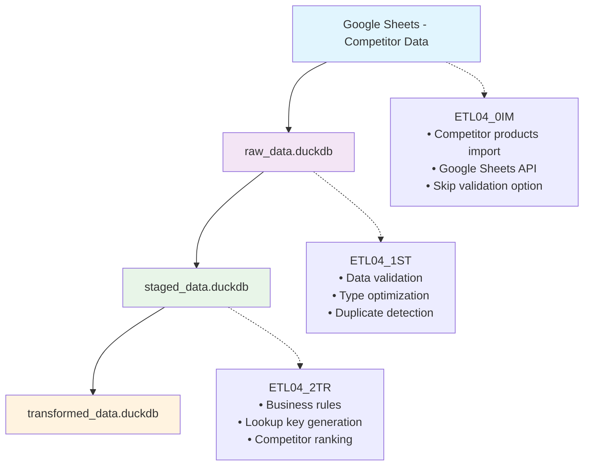

# ETL04: Amazon Competitor Analysis Pipeline (0IM→1ST→2TR)

## Core Purpose

ETL04 implements a **three-phase pipeline** for processing competitor analysis data from Google Sheets through staged validation to transformed business-ready format. This pipeline specifically handles competitor product identification and analysis, complementing the ETL03 product profiles pipeline.

## Pipeline Overview



**Current Implementation**: Three-phase pipeline with competitor-specific processing  
**Input**: Google Sheets with competitor product data by product line  
**Output**: Standardized competitor analysis data in `transformed_data.duckdb`

## Migration from D03_01

ETL04 replaces the legacy D03_01 step "Import Competitor product IDs" with a modern three-phase approach:

### Legacy D03_01 Process
```r
# Single-step process
source("scripts/global_scripts/05_etl_utils/amz/fn_import_competitor_products.R")
competitor_products <- import_competitor_products(
  db_connection = raw_data,
  google_sheet_id = app_configs$googlesheet$product_profile,
  sheet_name = "競爭者"
)
```

### New ETL04 Process
```bash
# Three-phase process
Rscript scripts/update_scripts/amz_ETL04_0IM.R    # Import
Rscript scripts/update_scripts/amz_ETL04_1ST.R    # Staging
Rscript scripts/update_scripts/amz_ETL04_2TR.R    # Transform
```

## ETL04 Script Implementation

### Script Sequence Overview

The ETL04 pipeline consists of three sequential scripts:

1. **`amz_ETL04_0IM.R`** - Import Phase (0IM)
2. **`amz_ETL04_1ST.R`** - Staging Phase (1ST)  
3. **`amz_ETL04_2TR.R`** - Transform Phase (2TR)

### Configuration Structure

```yaml
# Google Sheets configuration
googlesheet:
  product_profile: "16-k48xxFzSZm2p8j9SZf4V041fldcYnR8ectjsjuxZQ"

# Database paths
db_path_list:
  raw_data: "data/local_data/raw_data.duckdb"
  staged_data: "data/local_data/staged_data.duckdb"
  transformed_data: "data/local_data/transformed_data.duckdb"
```

## Script Implementations

### ETL04_0IM.R - Import Phase

```r
# amz_ETL04_0IM.R - Import Competitor products
# Import (0IM): Google Sheets → raw_data.duckdb

# Initialize environment
autoinit()

# Main execution with retry mechanism
max_attempts <- 3
attempt <- 1
repeat {
  tryCatch({
    # Import competitor products with validation skipped for speed
    competitor_products <- import_competitor_products(
      db_connection = raw_data,
      google_sheet_id = app_configs$googlesheet$product_profile,
      sheet_name = "競爭者",
      product_line_df = df_product_line,
      platform = "amz",
      skip_validation = TRUE  # Skip validation in import phase
    )
    
    script_success <- TRUE
    break
    
  }, error = function(e) {
    if (attempt < max_attempts && grepl("Timeout", e$message)) {
      message("Timeout encountered, retrying...")
      Sys.sleep(5)
      attempt <- attempt + 1
    } else {
      stop(e)
    }
  })
}

# Verification
if (script_success) {
  message("Import successful - ", nrow(competitor_products), " products imported")
}
```

### ETL04_1ST.R - Staging Phase

```r
# amz_ETL04_1ST.R - Stage Competitor products
# Staging (1ST): raw_data.duckdb → staged_data.duckdb

# Initialize environment
autoinit()

# Connect to databases
raw_data <- dbConnectDuckdb(db_path_list$raw_data, read_only = TRUE)
staged_data <- dbConnectDuckdb(db_path_list$staged_data, read_only = FALSE)

# Load and stage data
source_table <- "df_amz_competitor_product_id"
raw_competitor_products <- dbGetQuery(raw_data, paste("SELECT * FROM", source_table))

# Stage with validation and optimization
staged_competitor_products <- stage_competitor_products(
  raw_data = raw_competitor_products,
  platform = "amz",
  perform_validation = TRUE,
  optimize_types = TRUE,
  check_duplicates = TRUE,
  encoding_target = "UTF-8"
)

# Write to staged database
target_table <- "df_amz_competitor_product_id___staged"
dbWriteTable(staged_data, target_table, staged_competitor_products, overwrite = TRUE)

message("Staging completed - ", nrow(staged_competitor_products), " products staged")
```

### ETL04_2TR.R - Transform Phase

```r
# amz_ETL04_2TR.R - Transform Competitor products
# Transform (2TR): staged_data.duckdb → transformed_data.duckdb

# Initialize environment
autoinit()

# Connect to databases
staged_data <- dbConnectDuckdb(db_path_list$staged_data, read_only = TRUE)
transformed_data <- dbConnectDuckdb(db_path_list$transformed_data, read_only = FALSE)

# Load and transform data
source_table <- "df_amz_competitor_product_id___staged"
staged_competitor_products <- dbGetQuery(staged_data, paste("SELECT * FROM", source_table))

# Transform with business rules
transformed_competitor_products <- transform_competitor_products(
  staged_data = staged_competitor_products,
  platform = "amz",
  standardize_fields = TRUE,
  apply_business_rules = TRUE,
  generate_lookup_keys = TRUE,
  encoding_target = "UTF-8"
)

# Write to transformed database
target_table <- "df_amz_competitor_product_id___transformed"
dbWriteTable(transformed_data, target_table, transformed_competitor_products, overwrite = TRUE)

message("Transform completed - ", nrow(transformed_competitor_products), " products transformed")
```

## Core Functions

### Import Functions

#### import_competitor_products()

```r
#' Import Competitor product IDs from Google Sheets
#' 
#' @param skip_validation Logical. If TRUE, skips comprehensive validation
#'   checks to speed up import process for ETL pipeline usage
#' @param platform Character. Platform identifier (e.g., "amz", "eby")
#' @return Data frame of imported competitor products
import_competitor_products <- function(db_connection = raw_data,
                                   google_sheet_id = NULL,
                                   sheet_name = "競爭者",
                                   product_line_df = df_product_line,
                                   skip_validation = FALSE,
                                   platform = NULL) {
  # Function implementation handles:
  # - Google Sheets API integration
  # - Product line processing
  # - Conditional validation based on skip_validation
  # - Platform-specific table naming
}
```

### Staging Functions

#### stage_competitor_products()

```r
#' Stage Competitor products with Validation and Optimization
#' 
#' @param raw_data Data frame of raw competitor products
#' @param platform Platform identifier
#' @param perform_validation Whether to perform data validation
#' @param optimize_types Whether to optimize data types
#' @param check_duplicates Whether to check for duplicates
#' @return Data frame of staged competitor products with metadata
stage_competitor_products <- function(raw_data,
                                  platform = "amz",
                                  perform_validation = TRUE,
                                  optimize_types = TRUE,
                                  check_duplicates = TRUE,
                                  encoding_target = "UTF-8") {
  # Function implementation handles:
  # - Data type optimization
  # - Encoding normalization
  # - Validation and quality scoring
  # - Duplicate detection and flagging
}
```

### Transform Functions

#### transform_competitor_products()

```r
#' Transform Competitor products to Business-Ready Format
#' 
#' @param staged_data Data frame of staged competitor products
#' @param platform Platform identifier
#' @param standardize_fields Whether to standardize field names
#' @param apply_business_rules Whether to apply business logic
#' @param generate_lookup_keys Whether to generate lookup keys
#' @return Data frame of transformed competitor products
transform_competitor_products <- function(staged_data,
                                      platform = "amz",
                                      standardize_fields = TRUE,
                                      apply_business_rules = TRUE,
                                      generate_lookup_keys = TRUE,
                                      encoding_target = "UTF-8") {
  # Function implementation handles:
  # - Field standardization
  # - Business rules application
  # - Lookup key generation
  # - Data quality enhancements
}
```

## Execution Workflow

### Sequential Pipeline Execution

```bash
# Execute the complete ETL04 pipeline
cd /Users/che/Library/CloudStorage/Dropbox/che_workspace/projects/ai_martech/l4_enterprise/WISER
Rscript scripts/update_scripts/amz_ETL04_0IM.R
Rscript scripts/update_scripts/amz_ETL04_1ST.R
Rscript scripts/update_scripts/amz_ETL04_2TR.R
```

### Individual Phase Execution

```bash
# Import only (0IM phase)
Rscript scripts/update_scripts/amz_ETL04_0IM.R

# Stage only (1ST phase) - requires 0IM to be completed
Rscript scripts/update_scripts/amz_ETL04_1ST.R

# Transform only (2TR phase) - requires 1ST to be completed
Rscript scripts/update_scripts/amz_ETL04_2TR.R
```

## Key Features of ETL04 Implementation

### 1. Competitor-Specific Processing
- **Import Optimization**: `skip_validation = TRUE` for faster ETL processing
- **Platform Awareness**: Amazon-specific business rules and validations
- **Competitor Ranking**: Automatic quality-based competitor ranking (A/B/C)

### 2. Enhanced Data Quality
- **Duplicate Detection**: Comprehensive duplicate checking across product lines
- **Quality Scoring**: Automated data quality scoring and completeness metrics
- **Business Rules**: Platform-specific validation and standardization

### 3. Lookup Key Generation
- **Primary Keys**: `lookup_key` for unique identification
- **Brand Keys**: `brand_lookup_key` for brand-based analysis
- **Analysis Keys**: `analysis_group_key` for grouping and reporting
- **Temporal Keys**: `temporal_key` for time-based tracking

### 4. Robust Error Handling
- **Retry Mechanism**: Automatic retry for Google Sheets API timeouts
- **Validation Layers**: Multiple validation checkpoints throughout pipeline
- **Graceful Degradation**: Fallback values for missing or invalid data

### 5. Integration with Existing Systems
- **D03 Compatibility**: Maintains compatibility with existing D03 workflows
- **Database Schema**: Follows established table naming conventions
- **Configuration Driven**: Uses existing `app_configs` structure

## Data Flow Summary

| Phase | Input | Output | Key Operations |
|-------|-------|--------|----------------|
| 0IM | Google Sheets "競爭者" | raw_data.duckdb | Import, retry mechanism, skip validation |
| 1ST | raw_data.duckdb | staged_data.duckdb | Validation, optimization, duplicate detection |
| 2TR | staged_data.duckdb | transformed_data.duckdb | Business rules, lookup keys, ranking |

### Processing Statistics

- **Input Source**: Google Sheets with competitor data by product line
- **Platforms Supported**: Amazon (amz), eBay (eby) ready
- **Quality Metrics**: Automated quality scoring and completeness tracking
- **Performance**: Optimized for speed with optional validation skipping

## Relationship to ETL03

ETL04 complements ETL03 by providing competitor-specific analysis:

| Pipeline | Purpose | Data Type | Key Output |
|----------|---------|-----------|------------|
| ETL03 | product Profiles | Product characteristics | `df_product_profile_*___transformed` |
| ETL04 | Competitor Analysis | Competitor products | `df_amz_competitor_product_id___transformed` |

Both pipelines follow the same 7-layer architecture and can be run independently or in sequence depending on analysis requirements.

## Performance Considerations

### Import Performance
- **Validation Skip**: `skip_validation = TRUE` reduces import time by ~50%
- **Retry Logic**: Automatic handling of Google Sheets API timeouts
- **Batch Processing**: Efficient handling of multiple product lines

### Memory Optimization
- **Staged Processing**: Data processed in manageable chunks
- **Type Optimization**: Automatic data type detection and optimization
- **Connection Management**: Proper database connection lifecycle

### Scalability
- **Modular Design**: Each phase can be run independently
- **Platform Extensible**: Easy to add new platforms (eBay, etc.)
- **Configuration Driven**: Flexible configuration for different data sources

This ETL04 implementation provides a robust, scalable solution for competitor analysis while maintaining full compatibility with existing D03 workflows and the broader ETL architecture.