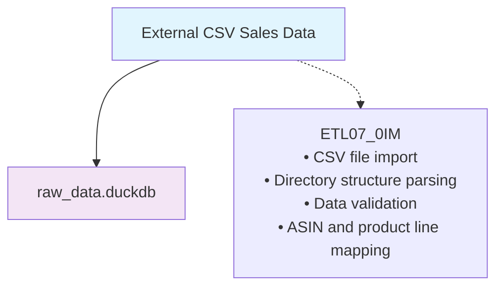

# ETL07: Amazon Competitor Sales Data Preparation Pipeline (0IM)

## Core Purpose

ETL07 implements a **single-phase data import pipeline** for Amazon competitor sales data, handling the Extract operation for CSV-based sales data from external sources. This pipeline is designed specifically for importing competitor sales data and represents a simplified ETL process focused purely on data ingestion with structure validation.

## Pipeline Overview



**Current Implementation**: Single-phase import pipeline (0IM only)  
**Input**: CSV files organized by product line in directory structure  
**Output**: Standardized competitor sales data in raw_data.duckdb

## Migration from D03_10

ETL07 consolidates and modernizes the competitor sales import process from D03_10:

### Legacy D03_10 Process
```bash
# Single import step
Rscript scripts/update_scripts/amz_D03_10.R    # Import Competitor Sales
```

### New ETL07 Process
```bash
# Single-phase import pipeline
Rscript scripts/update_scripts/amz_ETL07_0IM.R    # Import
```

## ETL07 Architecture Decision

### Why Single-Phase (0IM Only)?

Unlike other ETL pipelines (ETL03-ETL06) that use three phases, ETL07 uses only the import phase because:

1. **Data Simplicity**: CSV sales data is already structured and standardized
2. **No Complex Transformations**: Sales data requires minimal processing
3. **Direct Usage**: Sales data can be used directly after import
4. **Performance**: Single-phase reduces overhead for simple data

### What ETL07 Handles (Data Import)
- **Extract**: Import CSV files from directory structure
- **Parse**: Extract product line information from folder names
- **Validate**: Ensure data structure and required columns
- **Load**: Store in raw_data.duckdb with proper schema

## ETL07 Script Implementation

### Script Overview

The ETL07 pipeline consists of a single script:

1. **`amz_ETL07_0IM.R`** - Import Phase (0IM)

### Configuration Structure

```yaml
# Database paths
db_path_list:
  raw_data: "data/local_data/raw_data.duckdb"

# Data source configuration
RAW_DATA_DIR: "data/external_sources"
```

### Directory Structure Expected

```
data/external_sources/competitor_sales/
├── 000_product_line_1/
│   ├── B07ABC123.csv
│   ├── B07DEF456.csv
│   └── B07GHI789.csv
├── 001_product_line_2/
│   ├── B08JKL012.csv
│   └── B08MNO345.csv
└── 002_product_line_3/
    └── B09PQR678.csv
```

## Script Implementation

### ETL07_0IM.R - Import Phase

```r
# amz_ETL07_0IM.R - Amazon Competitor Sales Data Import
# ETL07 Phase 0 Import: Import competitor sales data from CSV files
# Following R113: Four-part update script structure

# ==============================================================================
# 1. INITIALIZE
# ==============================================================================

# Initialize script execution tracking
script_success <- FALSE
test_passed <- FALSE
main_error <- NULL

# Initialize environment using autoinit system
needgoogledrive <- TRUE
autoinit()

# Establish database connections
raw_data <- dbConnectDuckdb(db_path_list$raw_data, read_only = FALSE)

# Define source directory for competitor sales data
competitor_sales_dir <- file.path(RAW_DATA_DIR %||% "data", "competitor_sales")

message("INITIALIZE: Amazon competitor sales import (ETL07 0IM) script initialized")

# ==============================================================================
# 2. MAIN
# ==============================================================================

tryCatch({
  message("MAIN: Starting ETL07 Import Phase - Amazon competitor sales...")
  
  # Check if source directory exists
  if (!dir.exists(competitor_sales_dir)) {
    warning("Competitor sales directory does not exist: ", competitor_sales_dir)
    message("MAIN: Creating placeholder directory structure...")
    dir.create(competitor_sales_dir, recursive = TRUE, showWarnings = FALSE)
    
    # Create placeholder to show expected structure
    placeholder_path <- file.path(competitor_sales_dir, "README.txt")
    writeLines(c(
      "This directory should contain competitor sales CSV files",
      "organized in subdirectories by product line.",
      "",
      "Expected structure:",
      "competitor_sales/",
      "├── 000_product_line_1/",
      "│   ├── B07ABC123.csv",
      "│   └── B07DEF456.csv",
      "└── 001_product_line_2/",
      "    └── B08JKL012.csv"
    ), placeholder_path)
    
    message("MAIN: Created placeholder directory with README")
  }
  
  # Import competitor sales data using existing function
  import_df_amz_competitor_sales(
    main_folder = competitor_sales_dir,
    db_connection = raw_data
  )
  
  script_success <- TRUE
  message("MAIN: ETL07 Import Phase completed successfully")

}, error = function(e) {
  main_error <<- e
  script_success <<- FALSE
  message("MAIN ERROR: ", e$message)
})

# ==============================================================================
# 3. TEST
# ==============================================================================

if (script_success) {
  tryCatch({
    message("TEST: Verifying ETL07 Import Phase results...")
    
    # Check if competitor sales table exists
    table_name <- "df_amz_competitor_sales"
    
    if (table_name %in% dbListTables(raw_data)) {
      # Check row count
      sales_count <- dbGetQuery(raw_data, paste0("SELECT COUNT(*) as count FROM ", table_name))$count
      test_passed <- TRUE
      message("TEST: Verification successful - ", sales_count, " competitor sales records imported")
      
      if (sales_count > 0) {
        # Show basic data structure
        sample_data <- dbGetQuery(raw_data, paste0("SELECT * FROM ", table_name, " LIMIT 3"))
        message("TEST: Sample raw data structure:")
        print(sample_data)
        
        # Check for required columns
        required_cols <- c("asin", "date", "product_line_id", "sales")
        actual_cols <- names(sample_data)
        missing_cols <- setdiff(required_cols, actual_cols)
        
        if (length(missing_cols) > 0) {
          message("TEST WARNING: Missing expected columns: ", paste(missing_cols, collapse = ", "))
        } else {
          message("TEST: All required columns present")
        }
        
        # Check data statistics
        asin_count <- dbGetQuery(raw_data, paste0("SELECT COUNT(DISTINCT asin) as count FROM ", table_name))$count
        product_line_count <- dbGetQuery(raw_data, paste0("SELECT COUNT(DISTINCT product_line_id) as count FROM ", table_name))$count
        
        message("TEST: Unique ASINs: ", asin_count)
        message("TEST: Product lines: ", product_line_count)
        
        # Check date range
        date_range <- dbGetQuery(raw_data, paste0("SELECT MIN(date) as min_date, MAX(date) as max_date FROM ", table_name))
        message("TEST: Date range: ", date_range$min_date, " to ", date_range$max_date)
        
      } else {
        message("TEST: Table exists but is empty (no CSV files found)")
      }
      
    } else {
      test_passed <- FALSE
      message("TEST: Verification failed - table ", table_name, " not found")
    }

  }, error = function(e) {
    test_passed <<- FALSE
    message("TEST ERROR: ", e$message)
  })
} else {
  message("TEST: Skipped due to main script failure")
}

# ==============================================================================
# 4. DEINITIALIZE
# ==============================================================================

# Determine final status before tearing down
if (script_success && test_passed) {
  message("DEINITIALIZE: ETL07 Import Phase completed successfully with verification")
  return_status <- TRUE
} else if (script_success && !test_passed) {
  message("DEINITIALIZE: ETL07 Import Phase completed but verification failed")
  return_status <- FALSE
} else {
  message("DEINITIALIZE: ETL07 Import Phase failed during execution")
  if (!is.null(main_error)) {
    message("DEINITIALIZE: Error details - ", main_error$message)
  }
  return_status <- FALSE
}

# Clean up database connections
DBI::dbDisconnect(raw_data)
autodeinit()

message("DEINITIALIZE: ETL07 Import Phase (amz_ETL07_0IM.R) completed")
```

## Core Functions

### Import Functions

#### import_df_amz_competitor_sales()

```r
#' Import Amazon Competitor Sales Data
#'
#' Imports Amazon competitor sales data from CSV files in subfolders and writes
#' it to a database table.
#'
#' @param main_folder The main folder containing subfolders with competitor sales data files
#' @param db_connection A database connection object
#' @return None. The function writes data directly to the database.
#' @export
import_df_amz_competitor_sales <- function(main_folder, db_connection) {
  # Function handles:
  # - Table initialization with proper schema
  # - Directory structure parsing
  # - CSV file reading and validation
  # - Data transformation and standardization
  # - Database insertion with conflict handling
}
```

#### Key Function Features

1. **Table Schema Management**:
   - Creates `df_amz_competitor_sales` table with proper schema
   - Handles table replacement for fresh imports
   - Defines primary key constraints

2. **Directory Structure Parsing**:
   - Extracts product line information from folder names
   - Maps folder indices to product line IDs
   - Handles nested directory structures

3. **CSV File Processing**:
   - Validates CSV file structure
   - Handles missing files and sync issues
   - Processes expected columns: Time, Sales, Trend Line, 7-Day Moving Average

4. **Data Transformation**:
   - Converts Excel date formats to standard dates
   - Extracts ASIN from file names
   - Adds product line metadata
   - Standardizes column names

5. **Quality Assurance**:
   - Validates required columns presence
   - Handles data type conversions
   - Provides detailed import statistics

## Data Schema

### Target Table Schema

```sql
CREATE TABLE df_amz_competitor_sales (
  asin VARCHAR NOT NULL,
  date DATE NOT NULL,
  product_line_id VARCHAR NOT NULL,
  sales INTEGER,
  trend_line NUMERIC,
  seven_day_moving_average NUMERIC,
  PRIMARY KEY (asin, date)
);
```

### CSV File Expected Structure

```csv
Time,Sales,Trend Line,7-Day Moving Average
2024-01-01,150,145.5,148.2
2024-01-02,162,150.3,152.1
2024-01-03,145,152.8,155.7
```

## Execution Workflow

### Standard Execution

```bash
# Execute the ETL07 pipeline
cd /Users/che/Library/CloudStorage/Dropbox/che_workspace/projects/ai_martech/l4_enterprise/WISER
Rscript scripts/update_scripts/amz_ETL07_0IM.R
```

### Directory Setup

```bash
# Create directory structure if needed
mkdir -p data/external_sources/competitor_sales/000_product_line_1
mkdir -p data/external_sources/competitor_sales/001_product_line_2
mkdir -p data/external_sources/competitor_sales/002_product_line_3
```

## Key Features of ETL07 Implementation

### 1. Simplified Architecture
- **Single Phase**: Only import phase needed for CSV data
- **Direct Loading**: No staging or transformation phases required
- **Efficient**: Minimal overhead for simple data import

### 2. Directory-Based Organization
- **Product Line Mapping**: Folder names map to product lines
- **ASIN Extraction**: File names represent ASINs
- **Scalable Structure**: Easy to add new product lines

### 3. Robust CSV Processing
- **Format Validation**: Ensures expected CSV structure
- **Date Handling**: Converts Excel dates to standard format
- **Error Recovery**: Handles missing files and sync issues
- **Quality Reporting**: Provides detailed import statistics

### 4. Database Integration
- **Schema Management**: Automatic table creation and replacement
- **Conflict Resolution**: Primary key constraints prevent duplicates
- **Performance**: Efficient batch insertions

### 5. Comprehensive Testing
- **Structure Validation**: Verifies table creation and data loading
- **Data Quality**: Checks for required columns and data integrity
- **Statistics**: Reports record counts and data ranges
- **Error Handling**: Robust error capture and reporting

## Data Flow Summary

| Phase | Input | Output | Key Operations |
|-------|-------|--------|----------------|
| 0IM | CSV files in directory structure | raw_data.duckdb | Directory parsing, CSV reading, data validation, database insertion |

### Processing Statistics

- **Data Sources**: CSV files organized by product line
- **Validation**: Column presence, data type conversion, ASIN extraction
- **Quality Metrics**: Record counts, date ranges, product line distribution
- **Performance**: Batch processing for efficient database operations

## Performance Considerations

### Import Performance
- **Batch Processing**: Processes multiple files efficiently
- **Memory Management**: Handles large CSV files appropriately
- **Database Optimization**: Uses batch insertions for performance

### File System Optimization
- **Directory Scanning**: Efficient recursive directory processing
- **File Validation**: Quick file existence and format checks
- **Error Handling**: Graceful handling of missing or corrupted files

### Database Performance
- **Connection Management**: Proper connection lifecycle
- **Table Operations**: Efficient table creation and replacement
- **Index Usage**: Primary key constraints for fast lookups

## Integration with Analysis Pipeline

ETL07 prepares competitor sales data for subsequent analysis:

| Component | Purpose | Data Type | Key Output |
|-----------|---------|-----------|------------|
| ETL07 | Data Import | Raw CSV data | `df_amz_competitor_sales` |
| D03_11+ | Sales Analysis | Processed sales data | Analysis insights |
| Reporting | Dashboard | Aggregated data | Business intelligence |

## Error Handling and Recovery

### Common Issues and Solutions

1. **Missing Directory**: Automatically creates placeholder structure
2. **File Sync Issues**: Warns about missing files, continues processing
3. **Invalid CSV Structure**: Skips invalid files, reports issues
4. **Database Errors**: Provides detailed error messages and cleanup

### Debugging Support

- **Verbose Logging**: Detailed progress messages
- **Sample Data Display**: Shows imported data structure
- **Quality Metrics**: Reports data completeness and integrity
- **Error Details**: Comprehensive error reporting

This ETL07 implementation provides a streamlined, efficient approach to importing competitor sales data while maintaining data quality and providing comprehensive monitoring and error handling capabilities.