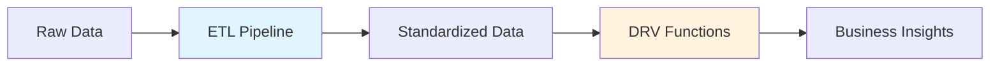

# Derivation Implementation Standards {#overview}

This document provides comprehensive standards and guidelines for implementing derivation (DRV) files in the MAMBA architecture. All derivation implementations MUST comply with these standards to ensure consistency, maintainability, and reliability across the data processing pipeline.

## Executive Summary {#executive-summary}

Derivations are the business logic layer in the ETL-DRV architecture, consuming standardized data from ETL pipelines and producing analytical insights. This guide establishes:

- **Standardized file structure** with five mandatory parts
- **Comprehensive documentation requirements** for maintainability
- **Robust error handling patterns** for reliability
- **Clear input/output specifications** for traceability
- **Platform-specific considerations** for multi-channel processing

## Architecture Context {#architecture}

### ETL-DRV Separation

According to **MP064** (ETL-Derivation Separation Principle):



**Key Distinctions**:

| Aspect | ETL | DRV |
|--------|-----|-----|
| **Purpose** | Data preparation | Business logic |
| **Location** | `ETL/` directory | `DRV/` directory |
| **Input** | Raw external data | ETL-standardized data |
| **Processing** | Cleansing, standardization | Aggregation, calculation |
| **Output** | Transaction-level data | Entity-level insights |

### Directory Organization

```
update_scripts/
├── ETL/                    # Extract-Transform-Load scripts
│   ├── cbz/               # Platform-specific ETL
│   ├── amz/
│   └── eby/
├── DRV/                    # Derivation scripts (THIS GUIDE)
│   ├── cbz/               # Platform-specific derivations
│   │   ├── cbz_D01_03.R  # Group 01, Sequence 03
│   │   ├── cbz_D01_04.R  # Group 01, Sequence 04
│   │   └── cbz_D02_01.R  # Group 02, Sequence 01
│   ├── amz/
│   └── eby/
└── orchestration/          # Pipeline control
```

## File Naming Convention {#naming}

### Required Pattern (DM_R042)

All derivation files MUST follow this naming pattern:

```
{platform}_D{group}_{sequence}.R
```

**Components**:
- `{platform}`: Three-letter platform_id (cbz, amz, eby) or 'all'
- `D`: Fixed literal indicating Derivation
- `{group}`: Two-digit group number (01, 02, etc.)
- `{sequence}`: Two-digit execution sequence (03, 04, 05, etc.)

### Valid Examples

```yaml
valid_filenames:
  - cbz_D01_03.R    # CBZ platform, Group 01, Sequence 03
  - amz_D02_15.R    # Amazon, Group 02, Sequence 15
  - eby_D01_07.R    # eBay, Group 01, Sequence 07
  - all_D01_99.R    # Cross-platform, Group 01, Sequence 99

invalid_filenames:
  - cbz_DRV01_customer.R     # ❌ Old pattern with descriptive suffix
  - cbz_D1_3.R              # ❌ Missing zero-padding
  - cbz_D01_customer.R      # ❌ Non-numeric sequence
  - cbz_DRV_03.R           # ❌ Using DRV instead of D
```

### Execution Order

Files are executed in strict numerical order within each group:

```r
# Group 01 execution
cbz_D01_03.R  → cbz_D01_04.R  → cbz_D01_05.R  → cbz_D01_07.R

# Group 02 execution (independent of Group 01)
cbz_D02_01.R  → cbz_D02_05.R  → cbz_D02_08.R
```

## Standard File Structure {#structure}

Every derivation file MUST contain exactly five parts in this order:

### File Template Overview

```r
#####
# [HEADER BLOCK]
#####
#P{number}

#' [DOCUMENTATION BLOCK]

# ==============================================================================
# PART 1: INITIALIZE
# ==============================================================================
[Setup code]

# ==============================================================================
# PART 2: MAIN
# ==============================================================================
[Core logic]

# ==============================================================================
# PART 3: TEST
# ==============================================================================
[Validation]

# ==============================================================================
# PART 4: SUMMARIZE
# ==============================================================================
[Reporting]

# ==============================================================================
# PART 5: DEINITIALIZE
# ==============================================================================
[Cleanup]
autodeinit()  # MUST be last
```

## Header Block Requirements {#header}

### Mandatory Format

The header MUST appear at the beginning of the file:

```r
#####
# DERIVATION: Customer DNA Analysis
# VERSION: 1.2
# PLATFORM: cbz
# GROUP: D01
# SEQUENCE: 03
# PURPOSE: Calculate customer behavioral profiles from sales data
# CONSUMES: df_sales_standardized, df_customer_standardized
# PRODUCES: df_customer_dna, df_customer_segments
# PRINCIPLE: MP064, DM_R042, DM_R044
#####
#P07_D01_03
```

### Header Field Specifications

| Field | Description | Example |
|-------|------------|---------|
| **DERIVATION** | Human-readable name | "Customer DNA Analysis" |
| **VERSION** | Semantic version (major.minor) | "1.2" |
| **PLATFORM** | Platform ID or 'all' | "cbz" |
| **GROUP** | Derivation group | "D01" |
| **SEQUENCE** | Execution order within group | "03" |
| **PURPOSE** | One-line description | "Calculate customer profiles" |
| **CONSUMES** | Input tables from ETL | "df_sales_standardized" |
| **PRODUCES** | Output tables created | "df_customer_dna" |
| **PRINCIPLE** | Governing principles | "MP064, DM_R042" |

### P-Number Line

Immediately after the header block, include the P-number identifier:

```r
#P{platform_number}_D{group}_{sequence}
```

This MUST match the filename components (see DM_R042).

## Documentation Block {#documentation}

### Roxygen2 Format

Following the P-number, include comprehensive documentation:

```r
#' @title Customer DNA Analysis Derivation
#' @description Calculates customer behavioral profiles including RFM metrics,
#'              purchase patterns, and segmentation based on standardized
#'              sales transaction data from ETL pipeline
#' @param platform_filter Optional platform_id to process (default: all)
#' @param date_range Date range for analysis (default: last 365 days)
#' @return List containing execution metrics and processing status
#' @requires DBI dplyr tidyr lubridate
#' @input_tables
#'   - processed_data.df_sales_standardized (from ETL01_2TR)
#'   - processed_data.df_customer_standardized (from ETL02_2TR)
#' @output_tables
#'   - app_data.df_customer_dna (customer profiles)
#'   - app_data.df_customer_segments (segmentation results)
#' @business_rules
#'   - RFM calculation uses 365-day window
#'   - Customers with < 2 transactions excluded from segmentation
#'   - Revenue calculations exclude returns and cancellations
#' @platform cbz
#' @author Original Developer
#' @modified_by Claude
#' @date 2025-09-29
#' @update_log
#'   2025-09-29: Migrated to DM_R044 standard
#'   2025-09-15: Added product line filtering
#'   2025-09-01: Initial implementation
```

### Required Documentation Fields

| Field | Purpose | Required |
|-------|---------|----------|
| `@title` | Brief descriptive title | ✅ Yes |
| `@description` | Detailed explanation | ✅ Yes |
| `@requires` | R packages needed | ✅ Yes |
| `@input_tables` | ETL outputs consumed | ✅ Yes |
| `@output_tables` | Tables produced | ✅ Yes |
| `@platform` | Platform ID | ✅ Yes |
| `@business_rules` | Logic documentation | ⭐ Recommended |
| `@author` | Original creator | ⭐ Recommended |
| `@date` | Creation date | ⭐ Recommended |

## Part 1: INITIALIZE {#part1}

### Purpose

Set up the execution environment, establish database connections, and prepare for processing.

### Standard Implementation

```r
# ==============================================================================
# PART 1: INITIALIZE
# ==============================================================================

# 1.1: Environment Setup
autoinit()  # Standard initialization from sc_initialization_update_mode.R

# 1.2: Database Connections
# Track which connections this script creates
connection_created_processed <- FALSE
connection_created_app <- FALSE

# Connect to required databases
if (!exists("processed_data") || !inherits(processed_data, "DBIConnection")) {
  processed_data <- dbConnectDuckdb(db_path_list$processed_data, read_only = TRUE)
  connection_created_processed <- TRUE
  message(sprintf("[%s] Connected to processed_data database",
                 format(Sys.time(), "%Y-%m-%d %H:%M:%S")))
}

if (!exists("app_data") || !inherits(app_data, "DBIConnection")) {
  app_data <- dbConnectDuckdb(db_path_list$app_data, read_only = FALSE)
  connection_created_app <- TRUE
  message(sprintf("[%s] Connected to app_data database",
                 format(Sys.time(), "%Y-%m-%d %H:%M:%S")))
}

# 1.3: Load Dependencies
library(dplyr, warn.conflicts = FALSE)
library(tidyr, warn.conflicts = FALSE)
library(lubridate, warn.conflicts = FALSE)

# Source utility functions if needed
# source("path/to/utility_functions.R")

# 1.4: Initialize Tracking Variables
error_occurred <- FALSE
test_passed <- FALSE
rows_processed <- 0
start_time <- Sys.time()
script_name <- basename(commandArgs()[4])

# Extract platform and derivation info
platform <- substr(script_name, 1, 3)
derivation_info <- sub("^[a-z]{3}_D([0-9]{2})_([0-9]{2})\\.R$",
                      "D\\1_\\2", script_name)
```

### Key Requirements

- **Always use `autoinit()`** for standard environment setup
- **Track connection creation** to ensure proper cleanup
- **Initialize error flags** for control flow
- **Capture start time** for performance metrics

## Part 2: MAIN {#part2}

### Purpose

Implement the core derivation logic with comprehensive error handling.

### Standard Implementation

```r
# ==============================================================================
# PART 2: MAIN
# ==============================================================================

tryCatch({
  # 2.1: Log Processing Start
  message(sprintf("[%s] Starting %s for platform %s",
                 format(start_time, "%Y-%m-%d %H:%M:%S"),
                 derivation_info,
                 toupper(platform)))

  # 2.2: Validate Input Tables
  required_tables <- c("df_sales_standardized", "df_customer_standardized")

  for (table in required_tables) {
    if (!dbExistsTable(processed_data, table)) {
      stop(sprintf("Required input table '%s' does not exist", table))
    }

    row_count <- tbl(processed_data, table) %>%
      summarize(n = n()) %>%
      pull(n)

    if (row_count == 0) {
      warning(sprintf("Input table '%s' is empty", table))
    } else {
      message(sprintf("  ✓ Found %d rows in %s", row_count, table))
    }
  }

  # 2.3: Load ETL Output Data
  df_sales <- tbl(processed_data, "df_sales_standardized") %>%
    filter(platform_id == !!platform) %>%
    collect()

  message(sprintf("Loaded %d sales records", nrow(df_sales)))

  # 2.4: Apply Business Logic
  df_customer_dna <- df_sales %>%
    group_by(customer_id) %>%
    summarize(
      # Recency
      last_purchase_date = max(payment_time, na.rm = TRUE),
      days_since_last = as.numeric(Sys.Date() - as.Date(last_purchase_date)),

      # Frequency
      transaction_count = n(),
      unique_products = n_distinct(product_id, na.rm = TRUE),

      # Monetary
      total_revenue = sum(lineproduct_price, na.rm = TRUE),
      avg_order_value = mean(lineproduct_price, na.rm = TRUE),

      # Additional metrics
      first_purchase_date = min(payment_time, na.rm = TRUE),
      customer_lifetime_days = as.numeric(
        as.Date(last_purchase_date) - as.Date(first_purchase_date)
      ),

      .groups = "drop"
    ) %>%
    mutate(
      # RFM Scoring
      r_score = ntile(desc(days_since_last), 5),
      f_score = ntile(transaction_count, 5),
      m_score = ntile(total_revenue, 5),
      rfm_score = paste0(r_score, f_score, m_score),

      # Segmentation
      customer_segment = case_when(
        rfm_score %in% c("555", "554", "545", "455") ~ "Champions",
        rfm_score %in% c("543", "544", "453", "454") ~ "Loyal Customers",
        rfm_score %in% c("553", "552", "551") ~ "Potential Loyalists",
        rfm_score %in% c("512", "511", "412", "411") ~ "New Customers",
        rfm_score %in% c("133", "134", "143", "144") ~ "At Risk",
        rfm_score %in% c("111", "112", "121", "122") ~ "Lost",
        TRUE ~ "Other"
      ),

      platform_id = platform,
      derivation_timestamp = Sys.time()
    )

  rows_processed <- nrow(df_customer_dna)

  # 2.5: Write Derived Output
  dbWriteTable(
    app_data,
    "df_customer_dna",
    df_customer_dna,
    append = FALSE,
    overwrite = TRUE
  )

  message(sprintf("Wrote %d customer profiles to df_customer_dna",
                 rows_processed))

  # 2.6: Create Summary Statistics
  segment_summary <- df_customer_dna %>%
    group_by(customer_segment) %>%
    summarize(
      customer_count = n(),
      avg_revenue = mean(total_revenue, na.rm = TRUE),
      total_revenue = sum(total_revenue, na.rm = TRUE),
      .groups = "drop"
    )

  dbWriteTable(
    app_data,
    "df_customer_segments",
    segment_summary,
    append = FALSE,
    overwrite = TRUE
  )

}, error = function(e) {
  message(sprintf("ERROR in MAIN: %s", e$message))
  error_occurred <- TRUE
})
```

### Business Logic Guidelines

- **Group operations logically** (load → transform → calculate → save)
- **Use descriptive variable names** (not abbreviations)
- **Include progress messages** for long-running operations
- **Handle NULL values explicitly**
- **Document complex calculations** with inline comments

## Part 3: TEST {#part3}

### Purpose

Validate that the derivation produced correct results and meets business requirements.

### Standard Implementation

```r
# ==============================================================================
# PART 3: TEST
# ==============================================================================

if (!error_occurred) {
  tryCatch({
    message("\nRunning validation tests...")

    # 3.1: Verify Output Tables Exist
    if (!dbExistsTable(app_data, "df_customer_dna")) {
      stop("Primary output table df_customer_dna was not created")
    }

    if (!dbExistsTable(app_data, "df_customer_segments")) {
      stop("Summary table df_customer_segments was not created")
    }

    # 3.2: Validate Output Structure
    dna_sample <- tbl(app_data, "df_customer_dna") %>%
      head(5) %>%
      collect()

    required_columns <- c(
      "customer_id", "days_since_last", "transaction_count",
      "total_revenue", "rfm_score", "customer_segment", "platform_id"
    )

    missing_columns <- setdiff(required_columns, colnames(dna_sample))
    if (length(missing_columns) > 0) {
      stop(sprintf("Missing required columns: %s",
                  paste(missing_columns, collapse = ", ")))
    }

    # 3.3: Validate Business Rules
    # Check RFM scores are valid
    invalid_rfm <- tbl(app_data, "df_customer_dna") %>%
      filter(!grepl("^[1-5]{3}$", rfm_score)) %>%
      summarize(count = n()) %>%
      pull(count)

    if (invalid_rfm > 0) {
      warning(sprintf("Found %d records with invalid RFM scores", invalid_rfm))
    }

    # Check for negative values
    negative_revenue <- tbl(app_data, "df_customer_dna") %>%
      filter(total_revenue < 0) %>%
      summarize(count = n()) %>%
      pull(count)

    if (negative_revenue > 0) {
      warning(sprintf("Found %d customers with negative revenue",
                     negative_revenue))
    }

    # 3.4: Validate Row Counts
    output_rows <- tbl(app_data, "df_customer_dna") %>%
      summarize(n = n()) %>%
      pull(n)

    if (output_rows != rows_processed) {
      warning(sprintf("Row count mismatch: processed %d, wrote %d",
                     rows_processed, output_rows))
    }

    # 3.5: Data Quality Metrics
    segment_distribution <- tbl(app_data, "df_customer_segments") %>%
      collect()

    if (nrow(segment_distribution) == 0) {
      warning("No customer segments generated")
    } else {
      message(sprintf("Generated %d customer segments",
                     nrow(segment_distribution)))

      # Check for reasonable segment distribution
      champions_pct <- segment_distribution %>%
        filter(customer_segment == "Champions") %>%
        pull(customer_count) %>%
        sum() / sum(segment_distribution$customer_count) * 100

      if (champions_pct > 50) {
        warning(sprintf("Unusually high Champions percentage: %.1f%%",
                       champions_pct))
      }
    }

    message("✅ All validation tests passed successfully")
    test_passed <- TRUE

  }, error = function(e) {
    message(sprintf("ERROR in TEST: %s", e$message))
    test_passed <- FALSE
  })
} else {
  message("Skipping tests due to error in MAIN section")
  test_passed <- FALSE
}
```

### Validation Categories

1. **Structural Validation**: Tables exist with required columns
2. **Business Rule Validation**: Data meets business constraints
3. **Data Quality Validation**: Reasonable distributions and values
4. **Referential Integrity**: Foreign key relationships maintained
5. **Completeness Checks**: No unexpected NULL values

## Part 4: SUMMARIZE {#part4}

### Purpose

Generate execution metrics, create reports, and prepare return values.

### Standard Implementation

```r
# ==============================================================================
# PART 4: SUMMARIZE
# ==============================================================================

# 4.1: Calculate Execution Metrics
end_time <- Sys.time()
execution_time <- difftime(end_time, start_time, units = "secs")

# 4.2: Generate Summary Report
summary_report <- list(
  script = script_name,
  platform = platform,
  derivation = derivation_info,
  start_time = start_time,
  end_time = end_time,
  execution_time_secs = as.numeric(execution_time),
  rows_processed = rows_processed,
  status = case_when(
    error_occurred ~ "ERROR",
    !test_passed ~ "TESTS_FAILED",
    TRUE ~ "SUCCESS"
  ),
  error_occurred = error_occurred,
  test_passed = test_passed
)

# 4.3: Generate Detailed Metrics (if successful)
if (test_passed && !error_occurred) {
  # Get segment distribution
  segments <- tbl(app_data, "df_customer_segments") %>% collect()

  summary_report$metrics <- list(
    total_customers = sum(segments$customer_count),
    total_revenue = sum(segments$total_revenue),
    segment_count = nrow(segments),
    top_segment = segments %>%
      arrange(desc(customer_count)) %>%
      slice(1) %>%
      pull(customer_segment)
  )
}

# 4.4: Log Summary
message("\n" %+% paste(rep("=", 70), collapse = ""))
message("DERIVATION EXECUTION SUMMARY")
message(paste(rep("=", 70), collapse = ""))
message(sprintf("Script:           %s", summary_report$script))
message(sprintf("Platform:         %s", toupper(summary_report$platform)))
message(sprintf("Derivation:       %s", summary_report$derivation))
message(sprintf("Status:           %s", summary_report$status))
message(sprintf("Rows Processed:   %s",
               format(summary_report$rows_processed, big.mark = ",")))
message(sprintf("Execution Time:   %.2f seconds",
               summary_report$execution_time_secs))

if (!is.null(summary_report$metrics)) {
  message(sprintf("Total Customers:  %s",
                 format(summary_report$metrics$total_customers, big.mark = ",")))
  message(sprintf("Total Revenue:    $%s",
                 format(round(summary_report$metrics$total_revenue, 2),
                       big.mark = ",")))
  message(sprintf("Top Segment:      %s", summary_report$metrics$top_segment))
}

message(sprintf("Start Time:       %s",
               format(summary_report$start_time, "%Y-%m-%d %H:%M:%S")))
message(sprintf("End Time:         %s",
               format(summary_report$end_time, "%Y-%m-%d %H:%M:%S")))
message(paste(rep("=", 70), collapse = ""))

# 4.5: Write Execution Log (optional)
if (exists("execution_log_path") && !is.null(execution_log_path)) {
  log_entry <- data.frame(
    timestamp = Sys.time(),
    script = summary_report$script,
    platform = summary_report$platform,
    status = summary_report$status,
    rows_processed = summary_report$rows_processed,
    execution_time_secs = summary_report$execution_time_secs,
    stringsAsFactors = FALSE
  )

  log_file <- file.path(execution_log_path, "derivation_execution_log.csv")

  tryCatch({
    # Append to existing log or create new
    if (file.exists(log_file)) {
      write.table(log_entry, log_file,
                 append = TRUE,
                 sep = ",",
                 row.names = FALSE,
                 col.names = FALSE)
    } else {
      write.csv(log_entry, log_file, row.names = FALSE)
    }
    message(sprintf("Execution logged to: %s", log_file))
  }, error = function(e) {
    warning(sprintf("Could not write execution log: %s", e$message))
  })
}

# 4.6: Prepare Return Value
return_value <- summary_report
```

### Summary Components

- **Execution Metrics**: Timing, row counts, status
- **Business Metrics**: Domain-specific measurements
- **Performance Indicators**: Processing rates, efficiency
- **Diagnostic Information**: Warnings, anomalies detected

## Part 5: DEINITIALIZE {#part5}

### Purpose

Clean up resources and ensure proper system state restoration.

### Standard Implementation

```r
# ==============================================================================
# PART 5: DEINITIALIZE
# ==============================================================================
# MANDATORY: Cleanup and resource deallocation ONLY

# 5.1: Close Database Connections (only those created by this script)
if (exists("connection_created_processed") && connection_created_processed) {
  if (exists("processed_data") && inherits(processed_data, "DBIConnection")) {
    tryCatch({
      dbDisconnect(processed_data)
      message("Disconnected from processed_data database")
    }, error = function(e) {
      warning(sprintf("Could not disconnect from processed_data: %s",
                     e$message))
    })
  }
}

if (exists("connection_created_app") && connection_created_app) {
  if (exists("app_data") && inherits(app_data, "DBIConnection")) {
    tryCatch({
      dbDisconnect(app_data)
      message("Disconnected from app_data database")
    }, error = function(e) {
      warning(sprintf("Could not disconnect from app_data: %s", e$message))
    })
  }
}

# 5.2: Clean up temporary files (if any were created)
if (exists("temp_files") && length(temp_files) > 0) {
  for (temp_file in temp_files) {
    if (file.exists(temp_file)) {
      tryCatch({
        file.remove(temp_file)
        message(sprintf("Removed temporary file: %s", temp_file))
      }, error = function(e) {
        warning(sprintf("Could not remove temp file %s: %s",
                       temp_file, e$message))
      })
    }
  }
}

# 5.3: Prepare Final Return Value
if (exists("return_value")) {
  final_status <- return_value
} else {
  final_status <- list(
    status = "INCOMPLETE",
    error = "No return value generated",
    script = ifelse(exists("script_name"), script_name, "unknown")
  )
}

# 5.4: Final Status Message
message(sprintf("\n[%s] Derivation %s completed with status: %s\n",
               format(Sys.time(), "%Y-%m-%d %H:%M:%S"),
               ifelse(exists("derivation_info"), derivation_info, "unknown"),
               final_status$status))

# 5.5: Autodeinit (MUST be last executable statement)
autodeinit()

# Return the final status (only statement allowed after autodeinit)
final_status
```

### Critical Requirements

- **Only cleanup operations allowed** in this section
- **Close only connections created by this script**
- **`autodeinit()` MUST be the last executable statement**
- **Only return statement allowed after `autodeinit()`**

## Error Handling Patterns {#errors}

### Graceful Degradation

For non-critical operations that can fail without stopping the derivation:

```r
# Pattern 1: Optional Enhancement
tryCatch({
  df_enhanced <- add_customer_demographics(df_base)
  message("Added demographic enrichment")
}, error = function(e) {
  warning(sprintf("Could not add demographics: %s", e$message))
  df_enhanced <- df_base  # Continue with base data
})

# Pattern 2: Partial Processing
failed_customers <- c()
for (customer_id in unique_customers) {
  tryCatch({
    process_customer(customer_id)
  }, error = function(e) {
    failed_customers <- c(failed_customers, customer_id)
    warning(sprintf("Failed to process customer %s: %s",
                   customer_id, e$message))
  })
}

if (length(failed_customers) > 0) {
  message(sprintf("Completed with %d failures out of %d",
                 length(failed_customers), length(unique_customers)))
}
```

### Critical Failures

For operations that must succeed:

```r
# Pattern 1: Fail Fast
tryCatch({
  required_data <- load_critical_reference_data()
}, error = function(e) {
  message(sprintf("CRITICAL ERROR: Cannot load reference data: %s",
                 e$message))
  error_occurred <- TRUE
  stop("Derivation cannot continue without reference data")
})

# Pattern 2: Validation Before Processing
if (!validate_input_data(df_input)) {
  error_occurred <- TRUE
  stop("Input data validation failed - cannot proceed")
}
```

## Input/Output Specifications {#io}

### Table Dependencies

Document all data dependencies clearly:

```yaml
# In header comments
INPUT_TABLES:
  processed_data:
    df_sales_standardized:
      source: ETL01_2TR
      required: true
      columns: [customer_id, platform_id, product_id, lineproduct_price, payment_time]

    df_customer_standardized:
      source: ETL02_2TR
      required: true
      columns: [customer_id, email, registration_date]

    df_product_standardized:
      source: ETL03_2TR
      required: false
      columns: [product_id, product_line_id, category]

OUTPUT_TABLES:
  app_data:
    df_customer_dna:
      type: full_refresh
      key: [customer_id, platform_id]
      columns: [customer_id, platform_id, rfm_score, customer_segment, ...]

    df_customer_segments:
      type: full_refresh
      key: [customer_segment, platform_id]
      columns: [customer_segment, customer_count, avg_revenue, ...]
```

### Data Type Specifications

```r
# Define expected data types
EXPECTED_TYPES <- list(
  df_sales_standardized = list(
    customer_id = "integer",
    platform_id = "character",
    lineproduct_price = "numeric",
    payment_time = "POSIXct"
  ),
  df_customer_dna = list(
    customer_id = "integer",
    rfm_score = "character",
    total_revenue = "numeric",
    days_since_last = "numeric"
  )
)

# Validate types
validate_data_types <- function(df, expected_types) {
  actual_types <- sapply(df, class)
  for (col in names(expected_types)) {
    if (col %in% names(actual_types)) {
      expected <- expected_types[[col]]
      actual <- actual_types[[col]][1]
      if (actual != expected) {
        warning(sprintf("Column %s: expected %s, got %s",
                       col, expected, actual))
      }
    }
  }
}
```

## Platform-Specific Considerations {#platforms}

### Platform IDs

```r
VALID_PLATFORMS <- list(
  cbz = list(name = "CBZ", id = 1, timezone = "America/New_York"),
  amz = list(name = "Amazon", id = 2, timezone = "America/Los_Angeles"),
  eby = list(name = "eBay", id = 3, timezone = "America/Chicago"),
  all = list(name = "All Platforms", id = 99, timezone = "UTC")
)

# Extract platform from filename
get_platform_info <- function(script_name = NULL) {
  if (is.null(script_name)) {
    script_name <- basename(commandArgs()[4])
  }

  platform_code <- substr(script_name, 1, 3)

  if (!platform_code %in% names(VALID_PLATFORMS)) {
    stop(sprintf("Invalid platform_id: %s", platform_code))
  }

  return(VALID_PLATFORMS[[platform_code]])
}
```

### Cross-Platform Processing

For derivations that aggregate across platforms:

```r
# Process each platform separately then combine
process_all_platforms <- function() {
  platforms <- c("cbz", "amz", "eby")
  results <- list()

  for (platform in platforms) {
    tryCatch({
      message(sprintf("Processing platform: %s", toupper(platform)))

      platform_data <- tbl(processed_data, "df_sales_standardized") %>%
        filter(platform_id == !!platform) %>%
        collect()

      if (nrow(platform_data) > 0) {
        results[[platform]] <- process_platform_data(platform_data, platform)
      } else {
        warning(sprintf("No data found for platform: %s", platform))
      }

    }, error = function(e) {
      warning(sprintf("Failed to process platform %s: %s",
                     platform, e$message))
    })
  }

  # Combine results
  if (length(results) > 0) {
    combined_results <- bind_rows(results, .id = "platform_source")
    return(combined_results)
  } else {
    stop("No platforms processed successfully")
  }
}
```

## Logging and Monitoring {#logging}

### Message Formatting Standards

```r
# Progress messages with timestamps
message(sprintf("[%s] %s",
               format(Sys.time(), "%Y-%m-%d %H:%M:%S"),
               "Starting derivation processing"))

# Success indicators
message("✅ Validation passed: all required columns present")

# Warning indicators
warning("⚠️  DM_R044 WARNING: Missing optional field 'discount_amount'")

# Error indicators
message("❌ DM_R044 ERROR: Required table 'df_sales_standardized' not found")

# Section separators for clarity
message(paste(rep("=", 70), collapse = ""))
message("SECTION: Data Validation")
message(paste(rep("-", 70), collapse = ""))
```

### Performance Tracking

```r
# Initialize performance metrics
perf_metrics <- list(
  start_time = Sys.time(),
  checkpoints = list()
)

# Track checkpoints
add_checkpoint <- function(name) {
  perf_metrics$checkpoints[[name]] <<- Sys.time()
  elapsed <- difftime(Sys.time(), perf_metrics$start_time, units = "secs")
  message(sprintf("  Checkpoint '%s' at %.2f seconds", name, elapsed))
}

# Usage
add_checkpoint("data_loaded")
# ... processing ...
add_checkpoint("transformation_complete")
# ... more processing ...
add_checkpoint("output_written")

# Generate performance report
generate_performance_report <- function() {
  report <- data.frame(
    checkpoint = names(perf_metrics$checkpoints),
    timestamp = sapply(perf_metrics$checkpoints, format, "%H:%M:%S"),
    elapsed_secs = sapply(perf_metrics$checkpoints, function(t) {
      as.numeric(difftime(t, perf_metrics$start_time, units = "secs"))
    }),
    stringsAsFactors = FALSE
  )

  # Add intervals
  report$interval_secs <- c(report$elapsed_secs[1],
                           diff(report$elapsed_secs))

  return(report)
}
```

## Validation Tools {#validation}

### Using the Validation Script

The repository includes `validate_derivation_format.R` for checking compliance:

```bash
# Validate all derivation files
Rscript validate_derivation_format.R ./DRV

# Validate specific platform
Rscript validate_derivation_format.R ./DRV 'cbz.*\.R$'

# Interactive validation
R
source("validate_derivation_format.R")
validate_derivation_file("DRV/cbz/cbz_D01_03.R")
```

### Self-Validation Pattern

Include self-validation in derivations:

```r
# At the end of PART 3: TEST
validate_dm_r044_compliance <- function() {
  compliance_checks <- list(
    has_header = exists("script_name"),
    has_p_number = TRUE,  # Checked during initialization
    has_five_parts = TRUE,  # By structure
    has_autodeinit = TRUE,  # Required in PART 5
    has_error_handling = exists("error_occurred"),
    has_test_validation = exists("test_passed"),
    has_return_value = exists("return_value")
  )

  all_compliant <- all(unlist(compliance_checks))

  if (all_compliant) {
    message("✅ DM_R044: This derivation is fully compliant")
  } else {
    failed_checks <- names(compliance_checks)[!unlist(compliance_checks)]
    warning(sprintf("DM_R044 compliance issues: %s",
                   paste(failed_checks, collapse = ", ")))
  }

  return(all_compliant)
}

# Call validation
dm_r044_compliant <- validate_dm_r044_compliance()
```

## Migration Guide {#migration}

### Converting Legacy Derivations

For existing derivation files that don't follow DM_R044:

1. **Backup Original Files**
```bash
cp cbz_DRV01_customer.R cbz_DRV01_customer.R.backup
```

2. **Rename to New Pattern**
```bash
# Old: cbz_DRV01_customer.R
# New: cbz_D01_03.R
mv cbz_DRV01_customer.R cbz_D01_03.R
```

3. **Add Standard Header**
```r
#####
# DERIVATION: Customer Profile Creation
# VERSION: 1.0
# PLATFORM: cbz
# GROUP: D01
# SEQUENCE: 03
# PURPOSE: Create customer profiles from sales data
# CONSUMES: df_amazon_sales
# PRODUCES: df_customer_profile
# PRINCIPLE: MP064, DM_R042, DM_R044
#####
#P07_D01_03
```

4. **Restructure to Five Parts**
- Move initialization code to PART 1
- Wrap main logic in PART 2 with tryCatch
- Add validation tests in PART 3
- Create summary reporting in PART 4
- Ensure proper cleanup in PART 5

5. **Add Documentation Block**
```r
#' @title Customer Profile Creation
#' @description Creates customer profiles from Amazon sales data
#' @requires DBI dplyr
#' @input_tables processed_data.df_amazon_sales
#' @output_tables app_data.df_customer_profile
#' @platform cbz
#' @date 2025-09-29
```

6. **Validate Compliance**
```bash
Rscript validate_derivation_format.R DRV/cbz/cbz_D01_03.R
```

## Best Practices {#best-practices}

### Do's ✅

1. **Always use the template** as starting point
2. **Document business logic** thoroughly
3. **Include progress messages** for transparency
4. **Validate inputs** before processing
5. **Test outputs** against business rules
6. **Track metrics** for performance monitoring
7. **Handle errors gracefully** with appropriate messages
8. **Clean up resources** properly in DEINITIALIZE

### Don'ts ❌

1. **Don't skip validation** tests
2. **Don't ignore warnings** from input data
3. **Don't use abbreviated** variable names
4. **Don't mix ETL and derivation** logic
5. **Don't forget autodeinit()** at the end
6. **Don't create connections** without tracking
7. **Don't suppress all warnings** blindly
8. **Don't hardcode** platform-specific values

## Troubleshooting {#troubleshooting}

### Common Issues and Solutions

| Issue | Symptom | Solution |
|-------|---------|----------|
| **Missing P-number** | Validation fails | Add `#P{n}_D{group}_{seq}` after header |
| **Wrong part order** | Execution errors | Restructure to 5-part format |
| **Connection leaks** | Database locks | Track and close connections properly |
| **No autodeinit** | Variables persist | Add `autodeinit()` at end of PART 5 |
| **Missing tests** | Unvalidated output | Add validation in PART 3 |
| **Poor performance** | Slow execution | Add checkpoints, optimize queries |

### Debugging Techniques

```r
# Enable verbose logging
options(verbose = TRUE)

# Add debug checkpoints
if (exists("DEBUG") && DEBUG) {
  browser()  # Interactive debugging
  print(str(df_intermediate))  # Inspect data structure
}

# Conditional debugging
if (nrow(df_result) != expected_rows) {
  save(df_result, file = "debug_output.RData")
  message("Debug data saved for inspection")
}

# Performance profiling
if (exists("PROFILE") && PROFILE) {
  Rprof("derivation_profile.out")
  # ... derivation code ...
  Rprof(NULL)
  summaryRprof("derivation_profile.out")
}
```

## Appendices {#appendices}

### A. Template File Location

The complete derivation template is available at:
```
00_principles/natural/en/part2_implementations/CH13_derivations/TEMPLATE_derivation.R
```

### B. Validation Script Location

The validation tool is available at:
```
00_principles/natural/en/part2_implementations/CH13_derivations/validate_derivation_format.R
```

### C. Related Principles

- **MP064**: ETL-Derivation Separation Principle
- **DM_R042**: DRV Sequential Numbering Rule
- **DM_R044**: Derivation Implementation Standard Rule
- **DEV_R032**: Script Structure Standard Rule
- **MP031**: Initialization First
- **MP033**: Deinitialization Final

### D. Change Log

| Date | Version | Changes |
|------|---------|---------|
| 2025-09-29 | 1.0 | Initial standard release |

---

*This document represents the authoritative standard for derivation implementation in the MAMBA architecture. All derivation files MUST comply with these standards.*