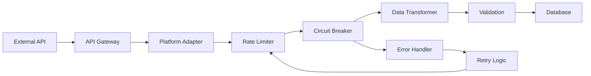

# API Architecture Overview

## System Architecture

The MAMBA system integrates with multiple e-commerce platforms through their respective APIs. This document outlines the architectural patterns and principles that govern these integrations.

## Core Components

### 1. API Gateway Layer

The API gateway provides a unified interface for all external API calls:

```r
# Location: scripts/global_scripts/26_platform_apis/
api_gateway/
├── router.R           # Routes requests to appropriate platform
├── authenticator.R    # Manages authentication across platforms
├── rate_limiter.R     # Implements rate limiting
└── error_handler.R    # Centralized error handling
```

### 2. Platform Adapters

Each platform has its own adapter that translates between MAMBA's internal format and the platform's API:

```r
platform_adapters/
├── cbz_adapter.R      # Cyberbiz adapter
├── eby_adapter.R      # eBay adapter
├── amz_adapter.R      # Amazon adapter
└── base_adapter.R     # Abstract base adapter
```

### 3. Data Transformation Layer

Standardizes data from different platforms into MAMBA's unified schema:

```r
transformers/
├── customer_transformer.R
├── order_transformer.R
├── product_transformer.R
└── inventory_transformer.R
```

## Architectural Patterns

### 1. Adapter Pattern

Each platform adapter implements a common interface:

```r
# Base adapter interface
BaseAdapter <- R6Class("BaseAdapter",
  public = list(
    initialize = function(config) {
      private$config <- config
      private$authenticate()
    },
    
    get_customers = function(params = list()) {
      stop("Must be implemented by platform adapter")
    },
    
    get_orders = function(params = list()) {
      stop("Must be implemented by platform adapter")
    },
    
    get_products = function(params = list()) {
      stop("Must be implemented by platform adapter")
    }
  ),
  
  private = list(
    config = NULL,
    auth_token = NULL,
    
    authenticate = function() {
      # Platform-specific authentication
    },
    
    make_request = function(endpoint, method = "GET", body = NULL) {
      # Common request logic with error handling
    }
  )
)
```

### 2. Circuit Breaker Pattern

Prevents cascading failures when APIs are unavailable:

```r
CircuitBreaker <- R6Class("CircuitBreaker",
  public = list(
    initialize = function(threshold = 5, timeout = 60) {
      private$failure_threshold <- threshold
      private$timeout_seconds <- timeout
      private$reset()
    },
    
    call = function(fn, ...) {
      if (private$state == "OPEN") {
        if (Sys.time() - private$last_failure_time > private$timeout_seconds) {
          private$state <- "HALF_OPEN"
        } else {
          stop("Circuit breaker is OPEN")
        }
      }
      
      tryCatch({
        result <- fn(...)
        private$on_success()
        return(result)
      }, error = function(e) {
        private$on_failure()
        stop(e)
      })
    }
  ),
  
  private = list(
    state = "CLOSED",
    failure_count = 0,
    failure_threshold = 5,
    timeout_seconds = 60,
    last_failure_time = NULL,
    
    on_success = function() {
      private$reset()
    },
    
    on_failure = function() {
      private$failure_count <- private$failure_count + 1
      private$last_failure_time <- Sys.time()
      
      if (private$failure_count >= private$failure_threshold) {
        private$state <- "OPEN"
      }
    },
    
    reset = function() {
      private$state <- "CLOSED"
      private$failure_count <- 0
      private$last_failure_time <- NULL
    }
  )
)
```

### 3. Retry Pattern

Implements exponential backoff for transient failures:

```r
retry_with_backoff <- function(fn, max_attempts = 3, base_delay = 1) {
  attempt <- 1
  
  while (attempt <= max_attempts) {
    tryCatch({
      return(fn())
    }, error = function(e) {
      if (attempt == max_attempts) {
        stop(e)
      }
      
      delay <- base_delay * (2 ^ (attempt - 1))
      message(sprintf("Attempt %d failed, retrying in %d seconds...", 
                     attempt, delay))
      Sys.sleep(delay)
      attempt <- attempt + 1
    })
  }
}
```

## Configuration Management

### Environment Variables

Each platform requires specific environment variables:

```bash
# Common
API_RATE_LIMIT_PER_SECOND=2
API_TIMEOUT_SECONDS=30
API_MAX_RETRIES=3

# Cyberbiz
CBZ_API_BASE_URL=https://api.cyberbiz.io
CBZ_API_KEY=your_api_key
CBZ_API_SECRET=your_api_secret

# eBay
EBY_API_BASE_URL=https://api.ebay.com
EBY_APP_ID=your_app_id
EBY_CERT_ID=your_cert_id
EBY_DEV_ID=your_dev_id

# Amazon
AMZ_API_BASE_URL=https://sellingpartnerapi-na.amazon.com
AMZ_CLIENT_ID=your_client_id
AMZ_CLIENT_SECRET=your_client_secret
AMZ_REFRESH_TOKEN=your_refresh_token
```

### Configuration Loading

```r
load_api_config <- function(platform_code) {
  config <- list(
    base_url = Sys.getenv(paste0(platform_code, "_API_BASE_URL")),
    rate_limit = as.numeric(Sys.getenv("API_RATE_LIMIT_PER_SECOND", "2")),
    timeout = as.numeric(Sys.getenv("API_TIMEOUT_SECONDS", "30")),
    max_retries = as.numeric(Sys.getenv("API_MAX_RETRIES", "3"))
  )
  
  # Platform-specific configuration
  if (platform_code == "CBZ") {
    config$api_key <- Sys.getenv("CBZ_API_KEY")
    config$api_secret <- Sys.getenv("CBZ_API_SECRET")
  } else if (platform_code == "EBY") {
    config$app_id <- Sys.getenv("EBY_APP_ID")
    config$cert_id <- Sys.getenv("EBY_CERT_ID")
    config$dev_id <- Sys.getenv("EBY_DEV_ID")
  }
  # ... additional platforms
  
  return(config)
}
```

## Data Flow

### API to Database Pipeline



### Request Lifecycle

1. **Request Initiation**: Application requests data from external platform
2. **Authentication**: Adapter ensures valid authentication tokens
3. **Rate Limiting**: Request queued if rate limit reached
4. **Circuit Breaking**: Request blocked if platform is down
5. **API Call**: Actual HTTP request to external API
6. **Error Handling**: Retry with backoff for transient errors
7. **Data Transformation**: Convert to MAMBA format
8. **Validation**: Ensure data integrity
9. **Storage**: Persist to database

## Performance Considerations

### Caching Strategy

```r
# In-memory cache for frequently accessed data
api_cache <- new.env(hash = TRUE)

get_with_cache <- function(key, fetch_fn, ttl_seconds = 300) {
  cached <- api_cache[[key]]
  
  if (!is.null(cached) && 
      (Sys.time() - cached$timestamp) < ttl_seconds) {
    return(cached$data)
  }
  
  data <- fetch_fn()
  api_cache[[key]] <- list(
    data = data,
    timestamp = Sys.time()
  )
  
  return(data)
}
```

### Batch Processing

```r
# Process API calls in batches to optimize rate limits
process_in_batches <- function(items, batch_size, process_fn) {
  results <- list()
  
  for (i in seq(1, length(items), by = batch_size)) {
    batch <- items[i:min(i + batch_size - 1, length(items))]
    batch_results <- process_fn(batch)
    results <- c(results, batch_results)
    
    # Respect rate limits between batches
    if (i + batch_size <= length(items)) {
      Sys.sleep(1)
    }
  }
  
  return(results)
}
```

## Monitoring and Logging

### API Call Logging

```r
log_api_call <- function(platform, endpoint, method, status, duration) {
  log_entry <- data.frame(
    timestamp = Sys.time(),
    platform = platform,
    endpoint = endpoint,
    method = method,
    status = status,
    duration_ms = duration * 1000,
    stringsAsFactors = FALSE
  )
  
  # Append to daily log file
  log_file <- sprintf("logs/api_%s.csv", format(Sys.Date(), "%Y%m%d"))
  write.table(log_entry, log_file, append = TRUE, 
              col.names = !file.exists(log_file), 
              row.names = FALSE, sep = ",")
}
```

### Metrics Collection

Key metrics to track:
- API response times
- Error rates by platform
- Rate limit utilization
- Circuit breaker activations
- Cache hit rates

## Security Considerations

1. **Token Storage**: Never store API credentials in code
2. **HTTPS Only**: All API calls must use HTTPS
3. **Token Rotation**: Implement automatic token refresh where supported
4. **Audit Logging**: Log all API access for security audits
5. **Data Encryption**: Encrypt sensitive data at rest

## Best Practices

1. **Use Platform Adapters**: Always go through the adapter layer
2. **Handle Errors Gracefully**: Implement comprehensive error handling
3. **Respect Rate Limits**: Use rate limiting to avoid API bans
4. **Cache Appropriately**: Cache stable data to reduce API calls
5. **Monitor Performance**: Track API performance metrics
6. **Document Changes**: Keep API documentation up to date
7. **Test Thoroughly**: Include API mocks in unit tests

## Related Documentation

- [Authentication Patterns](API01_authentication_patterns.qmd)
- [Rate Limiting](API02_rate_limiting.qmd)
- [Error Handling](API03_error_handling.qmd)
- [Platform-Specific APIs](platforms/)