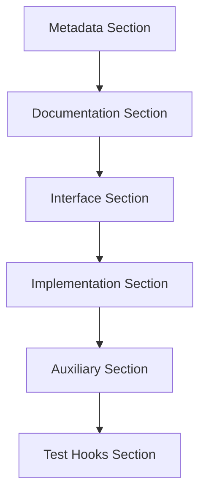

# Article 14: Template Organization Principle {#overview}

**Structure & Organization Law Article 14 (Template Organization Principle)**

Templates in the system should be organized as Rule Composites (RC) with distinct, sequentially-ordered sections that address different aspects of the implementation. Each template should aggregate multiple atomic rules into a coherent whole that can be consistently applied across the codebase.

:::{.callout-important}
## Core Concept
Establish templates as formal Rule Composites with a structured, sequential organization. By standardizing templates across the system, we ensure consistency, clarity, and maintainability while providing comprehensive guidance for implementation.
:::

# Section 1: Template Structure Requirements {#template-structure-requirements}

## Subsection 1: Rule Composite Classification {#rule-composite-classification}

**Template Classification Standards:**

All templates in the system must be formally documented as Rule Composites (RC). This classification acknowledges that templates have the following characteristics:

1. **Rule Aggregation**: Combine multiple atomic rules into coherent implementation patterns
2. **Comprehensive Guidance**: Provide a comprehensive guidance framework for a specific type of file or component
3. **Higher-level Abstraction**: Represent a higher-level abstraction formed from simpler rules
4. **Standardized Patterns**: Serve as standardized patterns for consistent implementation

**Rule Composite Characteristics:**

| Characteristic | Description | Implementation Requirement |
|----------------|-------------|---------------------------|
| Aggregative | Integrates multiple atomic rules | Explicitly list included rules |
| Coherent | Forms unified implementation pattern | Ensure no conflicts between rules |
| Complete | Covers all aspects of implementation | Provide complete guidance |
| Applicable | Can be consistently applied across codebase | Define clear application procedures |

## Subsection 2: Sequential Organization Structure {#sequential-organization}

**Required Section Order:**

Each template must be organized into sequential sections that follow a logical progression:

1. **Metadata Section**: Information about the file, author, purpose, and relationships
2. **Documentation Section**: Detailed description of purpose, usage, and examples
3. **Interface Section**: Definition of inputs, outputs, parameters, and contracts
4. **Implementation Section**: The actual code, organized by functionality
5. **Auxiliary Section**: Supporting functions, constants, and utilities
6. **Test Hooks Section**: Elements designed to facilitate testing when appropriate

**Inter-section Relationships:**



# Section 2: Section Independence Requirements {#section-independence}

## Subsection 1: Section Boundary Principles {#section-boundary-principles}

**Independence Requirements:**

Each section of a template should:

1. **Distinct Purpose**: Serve a distinct purpose with clear boundaries
2. **Independent Maintenance**: Be maintainable independently of other sections
3. **Specific Rules**: Follow its own specific formatting and documentation rules
4. **Clear Relationships**: Have clearly defined relationships with other sections

**Section Responsibility Definition:**

```r
# Template Section Responsibility Matrix
section_responsibilities <- list(
  "metadata" = list(
    primary = "Identification and relationship information",
    secondary = "Version control and tracking",
    format = "YAML or structured comments"
  ),
  "documentation" = list(
    primary = "Purpose and usage instructions",
    secondary = "Examples and best practices",
    format = "Standardized documentation format"
  ),
  "interface" = list(
    primary = "Function signatures and parameters",
    secondary = "Input/output specifications",
    format = "Type annotations and descriptions"
  ),
  "implementation" = list(
    primary = "Core functionality implementation",
    secondary = "Main business logic",
    format = "Structured code organization"
  ),
  "auxiliary" = list(
    primary = "Supporting functions",
    secondary = "Utilities and constants",
    format = "Modular organization"
  ),
  "test_hooks" = list(
    primary = "Testing support",
    secondary = "Validation mechanisms",
    format = "Optional implementation"
  )
)
```

# Section 3: Completeness and Visual Separation {#completeness-visual-separation}

## Subsection 1: Completeness Requirements {#completeness-requirements}

**Completeness Standards:**

Templates must be complete, addressing all aspects necessary for implementation:

1. **Comprehensive Guidance**: Provide all required guidance for the file or component
2. **Structure and Content**: Include both structural and content guidance
3. **Organization Methods**: Specify not just what to include but how to organize it
4. **Minimum and Recommended**: Define both minimum requirements and recommended extensions

**Completeness Checklist:**

```yaml
completeness_checklist:
  structure:
    - All required sections present
    - Sections in correct order
    - Clear boundaries between sections
  content:
    - Each section has appropriate content
    - Examples and explanations included
    - Usage guidance provided
  organization:
    - Logical flow maintained
    - Visual separation clear
    - Hierarchical structure appropriate
  requirements:
    - Minimum requirements clear
    - Recommended practices listed
    - Extension options explained
```

## Subsection 2: Visual Separation Standards {#visual-separation-standards}

**Separation Requirements:**

Templates must use clear visual separation between sections:

1. **Consistent Comment Blocks**: Consistent comment blocks to delineate sections
2. **Standard Spacing Patterns**: Standard spacing patterns between sections
3. **Sequential Ordering**: Sequential ordering that maintains a logical flow
4. **Hierarchical Organization**: Hierarchical organization within sections when appropriate

**Visual Separation Example:**

```r
# File metadata and relationship documentation
# ----------------------------------------------
# [Metadata section with standardized format]

# Detailed documentation
# ----------------------------------------------
# [Documentation section with purpose, examples, etc.]

# Interface definition
# ----------------------------------------------
# [Function signatures, parameter definitions, etc.]

# Implementation
# ----------------------------------------------
# [Main code implementation]

# Auxiliary functions
# ----------------------------------------------
# [Helper functions and utilities]

# Test hooks
# ----------------------------------------------
# [Elements to support testing]
```

# Section 4: Implementation Guidelines {#implementation-guidelines}

## Subsection 1: Template Documentation Format {#template-documentation-format}

**Standard Documentation Structure:**

```markdown
# Template Name

## Purpose
[Brief description of what this template is used for]

## Sections
1. [Section Name]: [Description of purpose and contents]
2. [Section Name]: [Description of purpose and contents]
   ...

## Rules Aggregated
- R##: [Rule Name] - [How it's applied in this template]
- R##: [Rule Name] - [How it's applied in this template]
   ...

## Usage Examples
[Example of the template in use]
```

## Subsection 2: Template Application Procedures {#template-application-procedures}

**Application Steps:**

When applying a template:

1. **Sequential Following**: Follow all sections in the specified order
2. **Visual Maintenance**: Maintain the visual separation between sections
3. **Element Inclusion**: Include all required elements from each section
4. **Deviation Documentation**: Document any deviations from the template with clear rationale

**Application Validation:**

```r
# Template Application Validation Function
validate_template_application <- function(file_path, template_spec) {
  # Read file content
  content <- readLines(file_path)
  
  # Check required sections
  required_sections <- template_spec$sections
  found_sections <- extract_sections(content)
  
  # Validate completeness
  missing_sections <- setdiff(required_sections, found_sections)
  
  # Check order
  section_order <- get_section_order(content)
  correct_order <- template_spec$order
  
  # Return validation results
  list(
    complete = length(missing_sections) == 0,
    missing = missing_sections,
    order_correct = identical(section_order, correct_order),
    recommendations = generate_recommendations(missing_sections, section_order)
  )
}
```

# Section 5: Template Versioning {#template-versioning}

## Subsection 1: Versioning System {#versioning-system}

**Version Numbering Rules:**

Templates should be versioned using:

1. **Major Version**: Significant structural changes
2. **Minor Version**: Content additions that don't change structure
3. **Patch Version**: Clarifications or minor adjustments

**Version Control Implementation:**

```yaml
template_version:
  major: 1        # Structural changes
  minor: 2        # Content additions
  patch: 3        # Minor corrections
  full: "1.2.3"   # Full version number
  
version_history:
  - version: "1.2.3"
    date: "2025-08-17"
    changes: "Clarified section responsibilities"
    type: "patch"
  - version: "1.2.0"
    date: "2025-08-15"
    changes: "Added test hooks section"
    type: "minor"
  - version: "1.0.0"
    date: "2025-08-01"
    changes: "Initial template structure"
    type: "major"
```

# Section 6: Complete Examples {#complete-examples}

## Subsection 1: Code File Template Structure {#code-file-template-structure}

**Standard Code File Template:**

```r
# File metadata and relationship documentation
# ==============================================
# File Name: [File Name]
# Author: [Author Name]
# Creation Date: [YYYY-MM-DD]
# Purpose: [Brief file purpose]
# Dependencies: [Related files list]

# Detailed documentation
# ==============================================
# Function Description: [Detailed function explanation]
# Usage: [How to use this file]
# Examples: [Usage examples]
# Notes: [Important considerations]

# Interface definition
# ==============================================
# Main function signatures
# Input parameter definitions
# Output format explanations
# Error handling specifications

# Implementation
# ==============================================
# [Main code implementation]
# Code blocks organized by functionality

# Auxiliary functions
# ==============================================
# [Helper functions and utilities]
# Secondary functions supporting main functionality

# Test hooks
# ==============================================
# [Elements to support testing]
# Testing-related auxiliary functionality
```

## Subsection 2: Document Template Structure {#document-template-structure}

**Standard Document Template:**

```yaml
---
# Metadata section in YAML format
id: "XX"
title: "Document Title"
type: "document-type"
date_created: "YYYY-MM-DD"
author: "Author Name"
relationships:
  - type: "relation-type"
    target: "target-id"
---

# Document Title

## Core Concept
[Brief explanation of central idea]

## [Main Content Sections]
[Detailed content organized sequentially]

## Examples
[Usage examples]

## Related Products
[Cross-references]
```

# Section 7: Benefits and Principle Relationships {#benefits-principle-relationships}

## Subsection 1: Implementation Benefits {#implementation-benefits}

**Primary Benefits:**

1. **Consistency**: Ensures all similar files follow the same structure
2. **Comprehensiveness**: Addresses all aspects required for implementation
3. **Clarity**: Makes it easy to find specific elements in any file
4. **Maintainability**: Enables focused changes to specific sections
5. **Learnability**: Reduces learning curve for new team members

## Subsection 2: Relationship to Other Principles {#relationship-to-other-principles}

This principle:

1. **Implements MP017 (Separation of Concerns)** by organizing templates into distinct sections
2. **Derives from MP000 (Axiomatization System)** by establishing templates as Rule Composites
3. **Influences RC01 (Template of Function Files)** as the first template implementation
4. **Relates to SO_R003 (Module Naming Convention)** by providing a structured way to implement it

---

*Based on: Structure & Organization Law Article 14*  
*Related to: [MP017 Separation of Concerns](../../CH00_fundamental_principles/meta_principles/MP017_separation_of_concerns.qmd), [SO_R003 Module Naming Convention](../rules/SO_R003_module_naming_convention.qmd)*