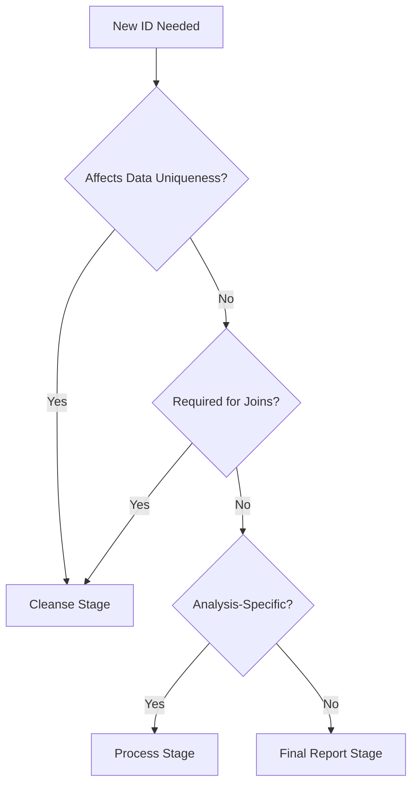

# Guide 2: ID Extraction in Data Pipeline {#overview}

::: {.callout-important}
## Core Conclusion
IDs related to **data uniqueness, deduplication, and foreign keys** should be determined in the **Cleanse** stage; derived IDs tied to analytical logic should be generated in the **Process** stage.
:::

## Section 1: Two Main Stage Purposes {#stage-purposes}

| Stage | Main Objective | Common Actions | Why Important? |
|-------|---------------|----------------|----------------|
| **Cleanse / Cleaning Layer** | Fix **data quality** to make data trustworthy | Deduplication, null handling, type standardization, anomaly detection | Prevent dirty data from contaminating downstream processes |
| **Process / Processing Layer** | Transform based on **business logic** to produce analysis-ready data | Aggregation, KPI calculation, feature engineering | Transform "correct" data into "useful" data |

## Section 2: Which Layer for IDs? {#id-placement}

### Subsection 1: ID Placement Guidelines {#placement-guidelines}

| ID Purpose | Recommended Layer | Reason |
|------------|------------------|---------|
| **Unique keys, foreign key relationships**<br>(`customer_id`, `order_id`, etc.) | **Cleanse** | Early establishment enables deduplication, routing, and maintains clear data lineage |
| **Analysis-derived keys**<br>(`week_id`, `cohort_id`, `session_id`, etc.) | **Process** | Varies with analysis granularity, more flexible in Process layer |
| **Pure report indices**<br>(Frontend sorting sequence numbers, etc.) | **Process/Final Report** | Unrelated to business logic, can be generated last |

### Subsection 2: Decision Tree {#decision-tree}



## Section 3: Standard Workflow {#workflow}

### Subsection 1: Stage Definitions {#stages}

1. **Staging (Raw Landing)**
   - Store raw files only
   - Add load timestamps
   - No transformations

2. **Cleanse**
   - Execute deduplication, null handling, validation
   - **If ID affects uniqueness/normalization, must generate or map here**
   - Establish primary and foreign keys

3. **Process / Transform**
   - Aggregate based on analysis needs
   - Generate derived fields
   - Create derived IDs (e.g., `session_id_v2`) for maximum flexibility

### Subsection 2: Implementation Example {#implementation}

```sql
-- Cleanse Stage: Establish core IDs
CREATE TABLE cleansed_orders AS
SELECT 
    COALESCE(order_id, MD5(CONCAT(customer_id, order_date, amount))) AS order_id,
    customer_id,
    product_id,
    -- Standardize and validate
    UPPER(TRIM(status)) AS status,
    CAST(amount AS DECIMAL(10,2)) AS amount
FROM staging_orders
WHERE customer_id IS NOT NULL  -- Remove invalid records
GROUP BY 1,2,3  -- Deduplicate

-- Process Stage: Generate analytical IDs
CREATE TABLE processed_orders AS
SELECT 
    order_id,
    customer_id,
    -- Derived analytical IDs
    DATE_TRUNC('week', order_date) AS week_id,
    CONCAT(customer_id, '_', DATE_TRUNC('month', first_order_date)) AS cohort_id,
    -- Business logic transformations
    CASE 
        WHEN amount > 1000 THEN 'high_value'
        ELSE 'standard'
    END AS order_segment
FROM cleansed_orders
```

## Section 4: Why Establish IDs Early? {#early-establishment}

### Subsection 1: Benefits {#benefits}

1. **Avoid Mismatches**: Having primary keys first prevents incorrect aggregations/joins
2. **Easy Traceability**: Fixed primary keys make Raw → Clean → Process lineage clear
3. **Convenient Debugging**: Issues can be traced back to original rows using consistent IDs

### Subsection 2: Risks of Late ID Generation {#risks}

- **Data Loss**: Deduplication without proper IDs may lose records
- **Inconsistent Joins**: Different stages may create different relationships
- **Audit Difficulties**: Cannot trace processed data back to source

## Section 5: Practical Techniques {#techniques}

### Subsection 1: Technique Catalog {#technique-catalog}

| Technique | Description |
|-----------|-------------|
| **Hash/UUID Temporary Keys** | Generate `raw_row_hash` in Cleanse when raw data lacks natural keys |
| **Encapsulate ID Logic** | Create UDF/SQL modules for ID generation - isolates logic, enables unit testing |
| **Version Derived Keys** | Use `session_id_v2` format to avoid breaking historical reports |
| **Update Data Dictionary** | Document IDs immediately in data catalog/ER diagrams for cross-team communication |

### Subsection 2: Code Examples {#code-examples}

#### Hash-based ID Generation {#hash-ids}

```python
import hashlib
import pandas as pd

def generate_row_id(row):
    """Generate deterministic ID from row content"""
    # Combine key fields
    key_fields = [
        str(row['customer_id']),
        str(row['transaction_date']),
        str(row['amount'])
    ]
    
    # Create hash
    row_string = '|'.join(key_fields)
    return hashlib.md5(row_string.encode()).hexdigest()

# Apply during cleanse stage
df['transaction_id'] = df.apply(generate_row_id, axis=1)
```

#### Versioned Analytical IDs {#versioned-ids}

```sql
-- Version 1: Simple session definition
CREATE VIEW sessions_v1 AS
SELECT 
    customer_id,
    visit_timestamp,
    LAG(visit_timestamp) OVER (PARTITION BY customer_id ORDER BY visit_timestamp) AS prev_visit,
    CASE 
        WHEN visit_timestamp - prev_visit > INTERVAL '30 minutes' 
        THEN 1 ELSE 0 
    END AS new_session
FROM page_views;

-- Version 2: Enhanced session with device consideration
CREATE VIEW sessions_v2 AS
SELECT 
    customer_id,
    device_id,
    visit_timestamp,
    MD5(CONCAT(customer_id, device_id, session_start)) AS session_id_v2
FROM (
    -- More complex logic here
)
```

## Section 6: Decision Framework {#framework}

### Subsection 1: Quick Reference {#quick-reference}

```yaml
ID_Decision_Framework:
  Questions:
    - Is_it_a_natural_key: 
        Yes: → Cleanse_Stage
        No: → Continue
    
    - Does_it_enable_deduplication:
        Yes: → Cleanse_Stage
        No: → Continue
    
    - Is_it_needed_for_joins:
        Yes: → Cleanse_Stage
        No: → Continue
    
    - Is_it_analysis_specific:
        Yes: → Process_Stage
        No: → Report_Stage
```

### Subsection 2: Stage Responsibility Matrix {#responsibility-matrix}

| Responsibility | Staging | Cleanse | Process | Report |
|---------------|---------|---------|---------|---------|
| Store raw data | ✓ | | | |
| Add system metadata | ✓ | | | |
| Establish primary keys | | ✓ | | |
| Deduplication | | ✓ | | |
| Generate derived IDs | | | ✓ | |
| Calculate metrics | | | ✓ | |
| Format for display | | | | ✓ |

## Section 7: Best Practices {#best-practices}

### Subsection 1: Do's {#dos}

1. **Document ID generation logic** in code comments and data dictionary
2. **Use deterministic methods** for ID generation when possible
3. **Version your derived IDs** to manage schema evolution
4. **Test ID uniqueness** after generation
5. **Maintain ID mapping tables** for audit trails

### Subsection 2: Don'ts {#donts}

1. **Don't generate critical IDs in Process** if they affect data integrity
2. **Don't use random IDs** for keys that need to be reproducible
3. **Don't change ID logic** without versioning
4. **Don't mix ID generation logic** across stages
5. **Don't forget to handle nulls** in composite key generation

## Section 8: Troubleshooting {#troubleshooting}

### Common Issues and Solutions {#issues-solutions}

| Issue | Symptom | Solution |
|-------|---------|----------|
| Duplicate IDs | Join explosions | Review deduplication logic in Cleanse |
| Missing IDs | NULL foreign keys | Add ID generation for edge cases |
| Inconsistent IDs | Different counts across stages | Centralize ID generation logic |
| ID collisions | Hash conflicts | Use longer hashes or composite keys |

---
*This guide provides comprehensive guidelines for managing ID extraction and generation across data pipeline stages.*