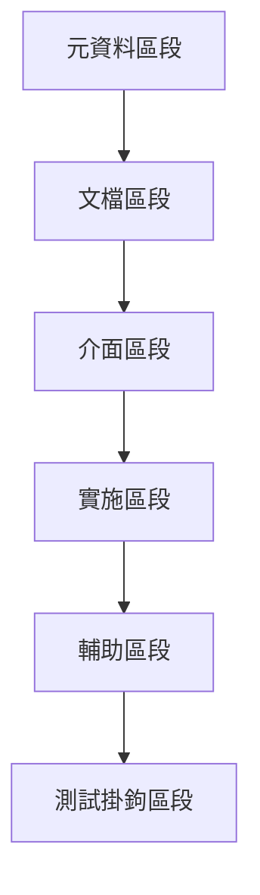

# 第十四條：模板組織原則 {#overview}

**結構組織法第十四條（模板組織原則）**

系統中的模板應組織為規則複合體(RC)，具有不同的順序化區段，處理實施的不同方面。每個模板應將多個原子規則聚合為可在程式庫中一致應用的連貫整體。

:::{.callout-important}
## 核心概念
建立模板作為正式的規則複合體，具有結構化、順序化的組織。透過在整個系統中標準化模板，確保一致性、清晰度和可維護性，同時為實施提供全面指導。
:::

# 第一項：模板結構要求 {#template-structure-requirements}

## 第一款：規則複合體分類 {#rule-composite-classification}

**模板分類標準：**

系統中的所有模板必須正式記錄為規則複合體(RC)。此分類承認模板具有以下特性：

1. **規則聚合**：將多個原子規則組合為連貫的實施模式
2. **全面指導**：為特定類型的檔案或組件提供全面指導框架
3. **高層抽象**：代表由簡單規則形成的更高層抽象
4. **標準化模式**：作為一致實施的標準化模式

**規則複合體特徵：**

| 特徵 | 說明 | 實施要求 |
|------|------|----------|
| 聚合性 | 整合多個原子規則 | 明確列出包含的規則 |
| 連貫性 | 形成統一的實施模式 | 確保規則間無衝突 |
| 完整性 | 涵蓋實施的所有方面 | 提供完整的指導 |
| 可應用性 | 可在程式庫中一致應用 | 定義明確的應用程序 |

## 第二款：順序組織結構 {#sequential-organization}

**必需區段順序：**

每個模板必須組織為遵循邏輯進展的順序區段：

1. **元資料區段**：檔案、作者、目的和關係的資訊
2. **文檔區段**：目的、使用方法和範例的詳細描述
3. **介面區段**：輸入、輸出、參數和契約的定義
4. **實施區段**：按功能組織的實際程式碼
5. **輔助區段**：支援函數、常數和工具
6. **測試掛鉤區段**：適當時設計用於促進測試的元素

**區段間關係：**



# 第二項：區段獨立性要求 {#section-independence}

## 第一款：區段界限原則 {#section-boundary-principles}

**獨立性要求：**

模板的每個區段應：

1. **明確目的**：服務於具有清楚界限的不同目的
2. **獨立維護**：可獨立於其他區段進行維護
3. **特定規則**：遵循其自己的特定格式和文檔規則
4. **明確關係**：與其他區段有清楚定義的關係

**區段職責定義：**

```r
# 模板區段職責矩陣
section_responsibilities <- list(
  "元資料" = list(
    primary = "識別和關係資訊",
    secondary = "版本控制和追蹤",
    format = "YAML或結構化註解"
  ),
  "文檔" = list(
    primary = "目的和使用說明",
    secondary = "範例和最佳實務",
    format = "標準化文檔格式"
  ),
  "介面" = list(
    primary = "函數簽名和參數",
    secondary = "輸入輸出規格",
    format = "型別註解和說明"
  ),
  "實施" = list(
    primary = "核心功能實作",
    secondary = "主要業務邏輯",
    format = "結構化程式碼組織"
  ),
  "輔助" = list(
    primary = "支援功能",
    secondary = "工具和常數",
    format = "模組化組織"
  ),
  "測試掛鉤" = list(
    primary = "測試支援",
    secondary = "驗證機制",
    format = "可選實施"
  )
)
```

# 第三項：完整性和視覺分離 {#completeness-visual-separation}

## 第一款：完整性要求 {#completeness-requirements}

**完整性標準：**

模板必須完整，處理實施所需的所有方面：

1. **全面指導**：為檔案或組件提供所有必需的指導
2. **結構和內容**：包括結構和內容指導
3. **組織方法**：指定不僅要包含什麼，還要如何組織
4. **最小和推薦**：定義最小要求和推薦擴展

**完整性檢查清單：**

```yaml
completeness_checklist:
  structure:
    - 所有必需區段存在
    - 區段按正確順序排列
    - 區段間有清楚分界
  content:
    - 每個區段有適當內容
    - 包含範例和說明
    - 提供使用指導
  organization:
    - 邏輯流程合理
    - 視覺分離清楚
    - 層次結構適當
  requirements:
    - 最小要求明確
    - 推薦實務列出
    - 擴展選項說明
```

## 第二款：視覺分離標準 {#visual-separation-standards}

**分離要求：**

模板必須在區段之間使用清楚的視覺分離：

1. **一致註解區塊**：用於劃分區段的一致註解區塊
2. **標準間距模式**：區段之間的標準間距模式
3. **順序流程**：維持邏輯流程的順序排序
4. **層次組織**：適當時區段內的層次組織

**視覺分離範例：**

```r
# 檔案元資料和關係文檔
# ----------------------------------------------
# [具有標準格式的元資料區段]

# 詳細文檔
# ----------------------------------------------
# [包含目的、範例等的文檔區段]

# 介面定義
# ----------------------------------------------
# [函數簽名、參數定義等]

# 實施
# ----------------------------------------------
# [主要程式碼實施]

# 輔助函數
# ----------------------------------------------
# [輔助函數和工具]

# 測試掛鉤
# ----------------------------------------------
# [支援測試的元素]
```

# 第四項：實施指導原則 {#implementation-guidelines}

## 第一款：模板文檔格式 {#template-documentation-format}

**標準文檔結構：**

```markdown
# 模板名稱

## 目的
[此模板用途的簡要描述]

## 區段
1. [區段名稱]: [目的和內容描述]
2. [區段名稱]: [目的和內容描述]
   ...

## 聚合規則
- R##: [規則名稱] - [在此模板中如何應用]
- R##: [規則名稱] - [在此模板中如何應用]
   ...

## 使用範例
[模板使用範例]
```

## 第二款：模板應用程序 {#template-application-procedures}

**應用步驟：**

應用模板時：

1. **順序遵循**：按指定順序遵循所有區段
2. **視覺維護**：維持區段間的視覺分離
3. **要素包含**：包含每個區段的所有必需要素
4. **偏差記錄**：記錄任何與模板的偏差及清楚理由

**應用驗證：**

```r
# 模板應用驗證函數
validate_template_application <- function(file_path, template_spec) {
  # 讀取檔案內容
  content <- readLines(file_path)
  
  # 檢查必需區段
  required_sections <- template_spec$sections
  found_sections <- extract_sections(content)
  
  # 驗證完整性
  missing_sections <- setdiff(required_sections, found_sections)
  
  # 檢查順序
  section_order <- get_section_order(content)
  correct_order <- template_spec$order
  
  # 回傳驗證結果
  list(
    complete = length(missing_sections) == 0,
    missing = missing_sections,
    order_correct = identical(section_order, correct_order),
    recommendations = generate_recommendations(missing_sections, section_order)
  )
}
```

# 第五項：模板版本控制 {#template-versioning}

## 第一款：版本控制系統 {#versioning-system}

**版本編號規則：**

模板應使用以下版本控制：

1. **主要版本**：重大結構變更
2. **次要版本**：不改變結構的內容增加
3. **修補版本**：澄清或小幅調整

**版本控制實施：**

```yaml
template_version:
  major: 1        # 結構變更
  minor: 2        # 內容增加
  patch: 3        # 小幅修正
  full: "1.2.3"   # 完整版本號
  
version_history:
  - version: "1.2.3"
    date: "2025-08-17"
    changes: "澄清區段職責"
    type: "patch"
  - version: "1.2.0"
    date: "2025-08-15"
    changes: "增加測試掛鉤區段"
    type: "minor"
  - version: "1.0.0"
    date: "2025-08-01"
    changes: "初始模板結構"
    type: "major"
```

# 第六項：完整範例 {#complete-examples}

## 第一款：程式碼檔案模板結構 {#code-file-template-structure}

**標準程式碼檔案模板：**

```r
# 檔案元資料和關係文檔
# ==============================================
# 檔案名稱: [檔案名稱]
# 作者: [作者名稱]
# 建立日期: [YYYY-MM-DD]
# 目的: [檔案目的簡述]
# 依賴: [相關檔案清單]

# 詳細文檔
# ==============================================
# 功能描述: [詳細功能說明]
# 使用方法: [如何使用此檔案]
# 範例: [使用範例]
# 注意事項: [重要注意事項]

# 介面定義
# ==============================================
# 主要函數簽名
# 輸入參數定義
# 輸出格式說明
# 錯誤處理規格

# 實施
# ==============================================
# [主要程式碼實施]
# 按功能組織的程式碼區塊

# 輔助函數
# ==============================================
# [輔助函數和工具]
# 支援主要功能的次要函數

# 測試掛鉤
# ==============================================
# [支援測試的元素]
# 測試相關的輔助功能
```

## 第二款：文檔模板結構 {#document-template-structure}

**標準文檔模板：**

```yaml
---
# YAML格式的元資料區段
id: "XX"
title: "文檔標題"
type: "文檔類型"
date_created: "YYYY-MM-DD"
author: "作者名稱"
relationships:
  - type: "關係類型"
    target: "目標ID"
---

# 文檔標題

## 核心概念
[中心思想的簡要說明]

## [主要內容區段]
[按順序組織的詳細內容]

## 範例
[使用範例]

## 相關產品
[交叉引用]
```

# 第七項：效益和原則關係 {#benefits-principle-relationships}

## 第一款：實施效益 {#implementation-benefits}

**主要效益：**

1. **一致性**：確保所有類似檔案遵循相同結構
2. **全面性**：處理實施所需的所有方面
3. **清晰度**：使在任何檔案中找到特定元素變得容易
4. **可維護性**：能夠對特定區段進行焦點變更
5. **可學習性**：減少新團隊成員的學習曲線

## 第二款：與其他原則的關係 {#relationship-to-other-principles}

此原則：

1. **實施 MP017（關注點分離）**：透過將模板組織為不同區段
2. **源自 MP000（公理化系統）**：透過建立模板作為規則複合體
3. **影響 RC01（函數檔案模板）**：作為第一個模板實施
4. **關聯 SO_R003（模組命名慣例）**：透過提供結構化的實施方法

---

*基於：結構組織法第十四條*  
*相關連結：[MP017 關注點分離](../../CH00_fundamental_principles/meta_principles/MP017_separation_of_concerns.qmd), [SO_R003 模組命名慣例](../rules/SO_R003_module_naming_convention.qmd)*