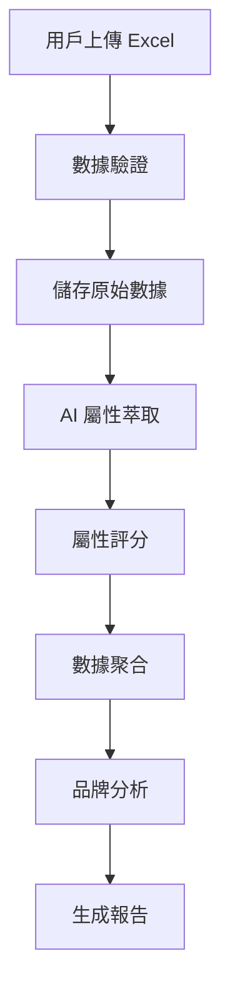

# BrandEdge 品牌印記引擎 - 完整系統文檔

## 目錄
1. [系統概述](#系統概述)
2. [技術架構](#技術架構)
3. [功能模組](#功能模組)
4. [數據流程](#數據流程)
5. [使用者介面](#使用者介面)
6. [資料庫設計](#資料庫設計)
7. [API 整合](#api-整合)
8. [安全機制](#安全機制)
9. [部署配置](#部署配置)
10. [開發指南](#開發指南)

---

## 系統概述

### 應用名稱
**BrandEdge 品牌印記引擎** (Version 2.0)

### 核心目的
透過 AI 技術分析客戶評論，自動萃取產品屬性並進行評分，協助企業進行品牌定位分析和策略制定。

### 主要特色
- 🤖 **AI 驅動**：使用 OpenAI GPT-4 模型自動分析評論
- 📊 **多維度分析**：品牌 DNA、理想點分析、定位策略建議
- 🎯 **精準定位**：基於客戶評論的真實數據進行品牌定位
- 🔐 **安全可靠**：完整的用戶認證和數據加密機制
- 📱 **響應式設計**：基於 bs4Dash 框架的現代化界面

### 目標用戶
- 品牌經理
- 市場分析師
- 產品經理
- 電商營運人員

---

## 技術架構

### 核心技術棧

#### 前端框架
- **Shiny**: R 語言的 Web 應用框架
- **bs4Dash**: Bootstrap 4 + AdminLTE 3 主題框架
- **shinyjs**: JavaScript 互動功能增強
- **plotly**: 互動式數據視覺化
- **DT**: 互動式數據表格

#### 後端技術
- **R 語言**: 核心開發語言 (R 4.0+)
- **tidyverse**: 數據處理和分析
- **future/furrr**: 並行處理框架
- **httr2**: HTTP API 調用

#### 資料庫
- **PostgreSQL**: 生產環境主要資料庫
- **SQLite**: 開發環境備選資料庫
- **DuckDB**: 分析型工作負載（可選）
- **DBI/RPostgres/RSQLite**: 資料庫連接層

#### API 整合
- **OpenAI API**: GPT-4o-mini 模型
- **RESTful API**: JSON 格式數據交換

### 系統架構圖
```
┌─────────────────────────────────────────────────────────┐
│                     使用者介面層                          │
│  ┌──────────┐  ┌──────────┐  ┌──────────┐  ┌──────────┐│
│  │  登入註冊 │  │ 資料上傳 │  │ 屬性評分 │  │ 定位分析 ││
│  └──────────┘  └──────────┘  └──────────┘  └──────────┘│
└─────────────────────────────────────────────────────────┘
                            │
┌─────────────────────────────────────────────────────────┐
│                     應用邏輯層                           │
│  ┌──────────┐  ┌──────────┐  ┌──────────┐  ┌──────────┐│
│  │ 用戶認證 │  │ 數據處理 │  │ AI 分析  │  │ 報告生成 ││
│  └──────────┘  └──────────┘  └──────────┘  └──────────┘│
└─────────────────────────────────────────────────────────┘
                            │
┌─────────────────────────────────────────────────────────┐
│                     數據存取層                           │
│  ┌──────────┐  ┌──────────┐  ┌──────────┐              │
│  │PostgreSQL│  │ OpenAI   │  │ 檔案系統 │              │
│  └──────────┘  └──────────┘  └──────────┘              │
└─────────────────────────────────────────────────────────┘
```

---

## 功能模組

### 1. 用戶管理模組

#### 登入功能
- **檔案位置**: `app.R` (行 325-343)
- **功能描述**:
  - 用戶名密碼驗證
  - bcrypt 密碼加密
  - 登入次數限制（非管理員限 5 次）
  - 自動導航至首頁

#### 註冊功能
- **檔案位置**: `app.R` (行 345-365)
- **功能描述**:
  - 新用戶註冊
  - 密碼強度檢查（至少 6 字元）
  - 用戶名重複檢查
  - 密碼確認驗證

### 2. 資料上傳模組

#### Excel 檔案處理
- **支援格式**: .xlsx, .xls, .csv
- **必要欄位**: 
  - Variation（產品變體/品牌）
  - Title（評論標題）
  - Body（評論內容）
- **欄位映射**: 自動處理大小寫差異
- **數據儲存**: 自動存入 rawdata 表

### 3. AI 屬性萃取模組

#### 屬性產生
- **檔案位置**: `app.R` (行 823-936)
- **核心功能**:
  1. 取前 50 筆評論作為樣本
  2. 調用 OpenAI API 分析評論
  3. 萃取 10 個最重要的產品屬性
  4. 屬性驗證和清理
  5. 速率限制處理（自動重試機制）

#### API 調用邏輯
```r
chat_api <- function(messages, max_retries = 5, retry_delay = 5, use_mock = FALSE)
```
- **重試機制**: 指數退避算法
- **錯誤處理**: 429 速率限制、401 認證失敗、403 權限拒絕
- **模擬模式**: 開發測試用途

### 4. 評分引擎模組

#### 批量評分處理
- **檔案位置**: `app.R` (行 940-1019)
- **處理流程**:
  1. 對每條評論的每個屬性進行評分（1-5 分）
  2. 並行處理提升效率
  3. 進度追蹤和顯示
  4. 結果儲存至 processed_data 表

### 5. 分析模組

#### 5.1 品牌分數分析
- **功能**: 計算各品牌在各屬性的平均分數
- **資料處理**: 
  - 按 Variation 分組
  - 計算屬性平均值
  - 生成理想點

#### 5.2 品牌 DNA 分析
- **模組檔案**: `module_wo_b.R`
- **功能**: 視覺化品牌特徵圖譜
- **技術**: 雷達圖展示多維度屬性

#### 5.3 理想點分析
- **功能**: 計算品牌與理想點的距離
- **關鍵指標**:
  - 關鍵因素識別
  - 理想點分數計算
  - 品牌排名

#### 5.4 定位策略建議
- **功能**: 基於分析結果提供策略建議
- **內容**: 
  - 優勢屬性強化
  - 劣勢屬性改善
  - 競爭定位建議

---

## 數據流程

### 完整數據處理流程



### 詳細步驟說明

1. **資料上傳階段**
   - 接收 Excel/CSV 檔案
   - 驗證必要欄位存在
   - 處理欄位名稱標準化
   - 儲存至 rawdata 表

2. **屬性萃取階段**
   - 選取評論樣本（前 50 筆）
   - 構建 AI 提示詞
   - 調用 OpenAI API
   - 解析和驗證屬性

3. **評分處理階段**
   - 逐條評論評分
   - 每個屬性獨立評分
   - 並行處理優化
   - 結果彙整儲存

4. **分析計算階段**
   - 品牌分數計算
   - 理想點生成
   - 關鍵因素識別
   - 策略指標計算

---

## 使用者介面

### UI 結構

#### 1. 登入頁面
- 應用圖標展示
- 用戶名/密碼輸入
- 登入/註冊切換
- 聯絡資訊顯示

#### 2. 主應用介面

##### 頁首 (Header)
- 應用標題和圖標
- 資料庫連接狀態
- 用戶資訊顯示

##### 側邊欄 (Sidebar)
- 歡迎訊息橫幅
- 步驟指示器（3 步驟流程）
- 導航選單
- 登出按鈕

##### 主內容區
- **步驟 1: 資料上傳**
  - 檔案選擇器
  - 預覽表格
  - 上傳狀態訊息
  
- **步驟 2: 屬性評分**
  - 屬性產生按鈕
  - 評論數量選擇器（1-100）
  - 評分進度顯示
  - 結果表格
  
- **步驟 3: 定位分析**
  - 多頁籤展示：
    - 原始資料
    - 品牌分數
    - 品牌 DNA
    - 關鍵因素與理想點
    - 策略建議

### UI 特色

#### 響應式設計
- Bootstrap 4 框架
- 移動設備適配
- 全螢幕模式支援

#### 視覺回饋
- 步驟指示器動態更新
- 載入動畫（spinners）
- 進度條顯示
- 通知提示

#### 互動增強
- shinyjs 動態控制
- 按鈕啟用/禁用邏輯
- 自動頁面導航
- 表格滾動優化

---

## 資料庫設計

### 資料表結構

#### 1. users 表
```sql
CREATE TABLE users (
    id           SERIAL PRIMARY KEY,
    username     TEXT UNIQUE,
    hash         TEXT,            -- bcrypt 加密密碼
    role         TEXT DEFAULT 'user',
    login_count  INTEGER DEFAULT 0
);
```

#### 2. rawdata 表
```sql
CREATE TABLE rawdata (
    id           SERIAL PRIMARY KEY,
    user_id      INTEGER REFERENCES users(id),
    uploaded_at  TIMESTAMPTZ DEFAULT now(),
    json         JSONB           -- 原始 Excel 數據
);
```

#### 3. processed_data 表
```sql
CREATE TABLE processed_data (
    id            SERIAL PRIMARY KEY,
    user_id       INTEGER REFERENCES users(id),
    processed_at  TIMESTAMPTZ DEFAULT now(),
    json          JSONB          -- 評分後的數據
);
```

### 資料庫連接配置

#### 環境變數
```bash
PGHOST=your_host
PGPORT=5432
PGUSER=your_user
PGPASSWORD=your_password
PGDATABASE=your_database
PGSSLMODE=require
```

#### 連接函數
```r
get_con <- function() {
    dbConnect(
        Postgres(),
        host     = Sys.getenv("PGHOST"),
        port     = as.integer(Sys.getenv("PGPORT", 5432)),
        user     = Sys.getenv("PGUSER"),
        password = Sys.getenv("PGPASSWORD"),
        dbname   = Sys.getenv("PGDATABASE"),
        sslmode  = Sys.getenv("PGSSLMODE", "require")
    )
}
```

---

## API 整合

### OpenAI API 配置

#### 環境設定
```bash
OPENAI_API_KEY=your_api_key_here
```

#### API 參數
- **模型**: gpt-4o-mini
- **溫度**: 0.7（屬性萃取）, 0.3（評分）
- **最大 tokens**: 500（屬性）, 1024（評分）
- **超時**: 60 秒

### API 調用策略

#### 速率限制處理
1. **自動重試**: 最多 5 次
2. **指數退避**: 延遲時間倍增
3. **錯誤回退**: 切換到模擬模式
4. **用戶提示**: 清晰的錯誤訊息

#### 成本優化
- 使用 gpt-4o-mini 降低成本
- 批量處理減少調用次數
- 樣本評論限制（前 50 筆）
- 可調整評分數量（1-100）

---

## 安全機制

### 1. 身份驗證
- **bcrypt 密碼加密**: 高強度單向加密
- **登入次數限制**: 防止暴力破解
- **會話管理**: Shiny 內建會話隔離

### 2. 資料保護
- **HTTPS 傳輸**: SSL/TLS 加密
- **資料庫加密**: PostgreSQL SSL 連接
- **敏感資訊**: 環境變數儲存

### 3. 輸入驗證
- **檔案類型檢查**: 只接受指定格式
- **欄位驗證**: 必要欄位檢查
- **XSS 防護**: HTML 內容過濾

### 4. 錯誤處理
- **優雅降級**: API 失敗時的備援
- **錯誤日誌**: 詳細的錯誤追蹤
- **用戶友好**: 清晰的錯誤提示

---

## 部署配置

### 開發環境

#### 必要套件安裝
```r
install.packages(c(
    "shiny", "bs4Dash", "shinyjs", "DBI", "RPostgres", "RSQLite",
    "bcrypt", "readxl", "jsonlite", "httr", "httr2", "DT",
    "dplyr", "tidyverse", "plotly", "future", "furrr",
    "dotenv", "shinycssloaders"
))
```

#### 環境檔案 (.env)
```bash
# 資料庫配置
PGHOST=localhost
PGPORT=5432
PGUSER=your_user
PGPASSWORD=your_password
PGDATABASE=brandedge
PGSSLMODE=prefer

# API 配置
OPENAI_API_KEY=sk-your-api-key
```

### 生產環境

#### Posit Connect 部署
```yaml
# app_config.yaml
app_info:
  name: "BrandEdge"
  version: "2.0"
  language: "zh_TW.UTF-8"

deployment:
  target: "connect"
  main_file: "app.R"
  
env_vars:
  - "PGHOST"
  - "PGPORT"
  - "PGUSER"
  - "PGPASSWORD"
  - "PGDATABASE"
  - "PGSSLMODE"
  - "OPENAI_API_KEY"
```

#### 系統需求
- **R 版本**: 4.0 或更高
- **記憶體**: 最少 2GB RAM
- **CPU**: 2 核心建議
- **儲存**: 10GB 可用空間

---

## 開發指南

### 專案結構
```
BrandEdge/
├── app.R                    # 主應用程式
├── module_wo_b.R           # 分析模組
├── app_config.yaml         # 應用配置
├── .env                    # 環境變數（不納入版控）
├── .env.example           # 環境變數範例
├── documents/             # 文檔目錄
├── scripts/               # 腳本目錄
│   └── global_scripts/    # 全域腳本
├── md/                    # Markdown 文檔
│   ├── about.md
│   ├── contacts.md
│   ├── notification.md
│   └── ...
├── www/                   # 靜態資源
│   └── icons/            # 圖標檔案
└── tests/                # 測試檔案
```

### 開發流程

#### 1. 環境設置
```bash
# 複製專案
git clone [repository_url]

# 設定環境變數
cp .env.example .env
# 編輯 .env 填入實際值

# 安裝套件
Rscript -e "source('install_packages.R')"
```

#### 2. 本地測試
```bash
# 啟動應用
Rscript app.R
```

#### 3. 程式碼規範
- 遵循 tidyverse 風格指南
- 使用有意義的變數名稱
- 添加必要的註解
- 模組化功能設計

### 擴展開發

#### 新增屬性分析
1. 修改 `chat_api` 提示詞
2. 調整屬性數量限制
3. 更新驗證邏輯

#### 新增視覺化
1. 在 `module_wo_b.R` 添加新模組
2. 在主 UI 添加新頁籤
3. 實現相應的 server 邏輯

#### 整合新 API
1. 添加環境變數配置
2. 實現 API 調用函數
3. 添加錯誤處理邏輯

---

## 故障排除

### 常見問題

#### 1. API 速率限制
**問題**: "API 速率限制，已達到最大重試次數"
**解決方案**:
- 等待幾分鐘後重試
- 升級 OpenAI API 計劃
- 使用模擬模式測試

#### 2. 資料庫連接失敗
**問題**: "連接失敗"
**解決方案**:
- 檢查環境變數設定
- 驗證資料庫服務狀態
- 確認網路連接

#### 3. 檔案上傳錯誤
**問題**: "檔案缺少必要欄位"
**解決方案**:
- 確認 Excel 包含 Variation, Title, Body 欄位
- 檢查欄位名稱大小寫
- 使用提供的範例檔案

### 效能優化

#### 1. 並行處理
- 調整 worker 數量
- 使用 future 套件配置

#### 2. 資料庫優化
- 添加適當索引
- 定期清理舊數據
- 使用連接池

#### 3. API 調用優化
- 批量處理請求
- 實施快取機制
- 調整 token 限制

---

## 版本歷史

### v2.0 (2025-06-28)
- 升級至 bs4Dash 框架
- 改進 UI/UX 設計
- 添加步驟指示器
- 優化錯誤處理
- 更名為「品牌印記引擎」

### v1.0 (2024-01-01)
- 初始版本發布
- 基本功能實現
- OpenAI 整合

---

## 聯絡資訊

聯絡資訊: partners@peakedges.com

---

## 授權資訊

© 2024 BrandEdge. All Rights Reserved.

---

*文檔更新日期: 2025-09-01*