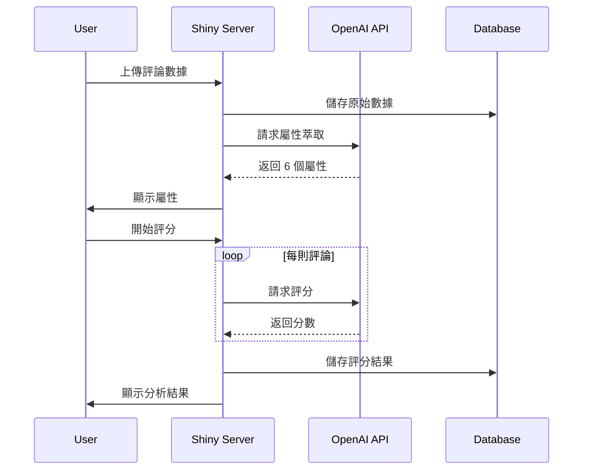

# BrandEdge 品牌印記引擎 - 技術架構詳解

## 系統架構總覽

### 三層式架構設計

```
┌────────────────────────────────────────────────────────────┐
│                    Presentation Layer                       │
│                     (展示層 - UI/UX)                        │
│  ┌──────────────────────────────────────────────────────┐ │
│  │  Shiny UI Components + bs4Dash Theme                 │ │
│  │  - Reactive UI elements                              │ │
│  │  - Dynamic visualizations (plotly)                   │ │
│  │  - Interactive tables (DT)                           │ │
│  └──────────────────────────────────────────────────────┘ │
└────────────────────────────────────────────────────────────┘
                              ↕
┌────────────────────────────────────────────────────────────┐
│                    Business Logic Layer                     │
│                     (業務邏輯層)                            │
│  ┌──────────────────────────────────────────────────────┐ │
│  │  Shiny Server Functions                              │ │
│  │  - User authentication (bcrypt)                      │ │
│  │  - Data processing (tidyverse)                       │ │
│  │  - AI integration (OpenAI API)                       │ │
│  │  - Analysis modules                                  │ │
│  └──────────────────────────────────────────────────────┘ │
└────────────────────────────────────────────────────────────┘
                              ↕
┌────────────────────────────────────────────────────────────┐
│                      Data Access Layer                      │
│                       (數據存取層)                          │
│  ┌──────────────────────────────────────────────────────┐ │
│  │  Database Abstraction (DBI)                          │ │
│  │  - PostgreSQL (production)                           │ │
│  │  - SQLite (development)                              │ │
│  │  - JSON storage for flexibility                      │ │
│  └──────────────────────────────────────────────────────┘ │
└────────────────────────────────────────────────────────────┘
```

---

## 核心技術組件

### 1. 前端框架 (UI Layer)

#### Shiny Framework
```r
# 核心 UI 結構
ui <- fluidPage(
    useShinyjs(),        # JavaScript 增強
    css_deps,            # 自定義 CSS
    conditionalPanel(    # 條件式渲染
        condition = "output.user_logged_in == false",
        login_ui
    ),
    conditionalPanel(
        condition = "output.user_logged_in == true",
        main_app_ui
    )
)
```

#### bs4Dash 主題系統
```r
bs4DashPage(
    title = "品牌定位分析平台",
    fullscreen = TRUE,
    header = bs4DashNavbar(...),
    sidebar = bs4DashSidebar(...),
    body = bs4DashBody(...),
    footer = bs4DashFooter(...)
)
```

**特色功能**：
- Material Design 風格
- 響應式佈局
- 深色/淺色主題切換
- 移動設備優化

### 2. 後端處理 (Server Layer)

#### 反應式編程模型
```r
# Reactive Values
user_info <- reactiveVal(NULL)
working_data <- reactiveVal(NULL)
facets_rv <- reactiveVal(NULL)

# Reactive Expressions
brand_data <- reactive({
    df <- working_data()
    attrs <- facets_rv()
    # 複雜的數據處理邏輯
    return(processed_data)
})

# Observers
observeEvent(input$load_btn, {
    # 事件驅動的邏輯處理
})
```

#### 並行處理架構
```r
# 智能並行配置
if (Sys.getenv("SHINY_PORT") != "") {
    plan(sequential)  # Shiny Server 環境
} else {
    plan(multisession, workers = min(2, parallel::detectCores() - 1))
}

# 並行評分處理
results <- future_map(data_chunks, function(chunk) {
    process_with_ai(chunk)
})
```

### 3. 數據層 (Data Layer)

#### 資料庫抽象層
```r
get_con <- function() {
    dbConnect(
        Postgres(),  # 或 SQLite(), MariaDB()
        host     = Sys.getenv("PGHOST"),
        port     = as.integer(Sys.getenv("PGPORT", 5432)),
        user     = Sys.getenv("PGUSER"),
        password = Sys.getenv("PGPASSWORD"),
        dbname   = Sys.getenv("PGDATABASE"),
        sslmode  = Sys.getenv("PGSSLMODE", "require")
    )
}
```

#### JSONB 數據存儲策略
```sql
-- 靈活的半結構化數據存儲
CREATE TABLE processed_data (
    id            SERIAL PRIMARY KEY,
    user_id       INTEGER REFERENCES users(id),
    processed_at  TIMESTAMPTZ DEFAULT now(),
    json          JSONB  -- 支援複雜查詢和索引
);

-- JSONB 查詢範例
SELECT 
    json->>'Variation' as brand,
    json->>'attribute1' as score
FROM processed_data
WHERE json->>'user_id' = '123';
```

---

## AI 整合架構

### OpenAI API 整合流程



### API 調用優化

#### 1. 智能重試機制
```r
chat_api <- function(messages, max_retries = 5, retry_delay = 5) {
    for (attempt in 1:max_retries) {
        tryCatch({
            # API 調用
            resp <- POST(...)
            
            if (status == 429) {  # 速率限制
                # 指數退避算法
                wait_time <- min(retry_delay * (2^(attempt-1)), 300)
                Sys.sleep(wait_time)
                next
            }
            # 處理其他狀態碼
        }, error = function(e) {
            # 錯誤處理
        })
    }
}
```

#### 2. 批次處理策略
```r
# 並行批次處理
process_batch <- function(reviews, attributes) {
    # 將評論分組
    batches <- split(reviews, ceiling(seq_along(reviews)/10))
    
    # 並行處理每個批次
    results <- future_map(batches, function(batch) {
        scores <- map(batch, function(review) {
            score_attributes(review, attributes)
        })
        return(scores)
    })
    
    # 合併結果
    do.call(rbind, results)
}
```

---

## 模組化設計

### 分析模組架構

#### 模組定義模式
```r
# UI 函數
moduleNameUI <- function(id) {
    ns <- NS(id)
    tagList(
        # UI 元素使用 ns() 包裝 ID
        plotlyOutput(ns("plot")),
        DTOutput(ns("table"))
    )
}

# Server 函數
moduleNameServer <- function(id, data_reactive) {
    moduleServer(id, function(input, output, session) {
        # 模組邏輯
        processed <- reactive({
            data_reactive() %>%
                process_data()
        })
        
        output$plot <- renderPlotly({
            # 繪圖邏輯
        })
    })
}
```

### 核心分析模組

#### 1. DNA 分析模組
```r
dnaModuleServer <- function(id, raw) {
    moduleServer(id, function(input, output, session) {
        # DNA 圖譜生成
        dna_plot <- reactive({
            create_radar_chart(raw())
        })
        
        output$dna_visual <- renderPlotly({
            dna_plot()
        })
    })
}
```

#### 2. 理想點分析模組
```r
idealModuleServer <- function(id, idealFull, idealRaw, indicator, key_vars) {
    moduleServer(id, function(input, output, session) {
        # 計算理想點距離
        ideal_distance <- reactive({
            calculate_ideal_distance(idealFull(), idealRaw())
        })
        
        # 識別關鍵因素
        output$key_factors <- renderText({
            paste("關鍵因素：", paste(key_vars(), collapse = ", "))
        })
    })
}
```

#### 3. 策略建議模組
```r
strategyModuleServer <- function(id, indicator, key_vars) {
    moduleServer(id, function(input, output, session) {
        # 生成策略建議
        strategy <- reactive({
            generate_strategy(indicator(), key_vars())
        })
        
        output$recommendations <- renderUI({
            format_strategy_output(strategy())
        })
    })
}
```

---

## 性能優化策略

### 1. 資料快取機制

```r
# 使用 memoise 套件實現快取
library(memoise)

# 快取 API 調用結果
cached_api_call <- memoise(chat_api, cache = cache_memory())

# 快取數據處理結果
cached_processing <- memoise(function(data) {
    # 耗時的數據處理
    expensive_computation(data)
}, cache = cache_disk())
```

### 2. 延遲載入策略

```r
# 使用 reactive 延遲計算
heavy_computation <- reactive({
    req(input$trigger)  # 只在需要時計算
    
    isolate({  # 避免不必要的重新計算
        perform_heavy_computation(working_data())
    })
})

# 條件式渲染
output$expensive_plot <- renderPlotly({
    req(input$show_plot)  # 只在顯示時渲染
    create_complex_visualization()
})
```

### 3. 資料庫查詢優化

```r
# 使用索引
dbExecute(con, "
    CREATE INDEX idx_user_id ON processed_data(user_id);
    CREATE INDEX idx_json_variation ON processed_data((json->>'Variation'));
")

# 批次插入
batch_insert <- function(con, data) {
    dbWriteTable(con, "temp_table", data, temporary = TRUE)
    dbExecute(con, "
        INSERT INTO processed_data (user_id, json)
        SELECT user_id, json FROM temp_table
    ")
}
```

---

## 安全架構

### 1. 身份驗證層

```r
# bcrypt 密碼加密
register_user <- function(username, password) {
    hash <- bcrypt::hashpw(password)
    dbExecute(con, 
        "INSERT INTO users (username, hash) VALUES ($1, $2)",
        params = list(username, hash)
    )
}

# 密碼驗證
verify_login <- function(username, password) {
    user <- dbGetQuery(con, 
        "SELECT * FROM users WHERE username = $1",
        params = list(username)
    )
    
    if (nrow(user) > 0) {
        return(bcrypt::checkpw(password, user$hash))
    }
    return(FALSE)
}
```

### 2. 輸入驗證與清理

```r
# SQL 注入防護
safe_query <- function(con, user_input) {
    # 使用參數化查詢
    dbGetQuery(con, 
        "SELECT * FROM data WHERE id = $1",
        params = list(user_input)
    )
}

# XSS 防護
sanitize_input <- function(text) {
    text %>%
        str_replace_all("<", "&lt;") %>%
        str_replace_all(">", "&gt;") %>%
        str_replace_all("\"", "&quot;") %>%
        str_replace_all("'", "&#x27;")
}
```

### 3. 會話管理

```r
# 會話超時設置
shinyServer(function(input, output, session) {
    # 設置 30 分鐘超時
    session$allowReconnect(TRUE)
    session$onSessionEnded(function() {
        # 清理會話數據
        cleanup_session()
    })
    
    # 活動監控
    last_activity <- reactiveVal(Sys.time())
    
    observe({
        invalidateLater(60000)  # 每分鐘檢查
        if (difftime(Sys.time(), last_activity(), units = "mins") > 30) {
            session$close()
        }
    })
})
```

---

## 錯誤處理架構

### 全域錯誤處理

```r
# 全域錯誤捕獲
options(shiny.error = function() {
    logging::logerror(geterrmessage())
    # 發送錯誤通知
    send_error_notification()
})

# 優雅的錯誤恢復
safe_operation <- function(operation) {
    tryCatch({
        result <- operation()
        return(list(success = TRUE, data = result))
    }, error = function(e) {
        logging::logwarn(paste("Operation failed:", e$message))
        return(list(success = FALSE, error = e$message))
    })
}
```

### API 錯誤處理

```r
handle_api_error <- function(status_code, response) {
    error_handlers <- list(
        "400" = function() "請求格式錯誤",
        "401" = function() "API 認證失敗",
        "403" = function() "API 存取被拒絕",
        "429" = function() "API 速率限制",
        "500" = function() "API 伺服器錯誤",
        "503" = function() "API 服務暫時無法使用"
    )
    
    handler <- error_handlers[[as.character(status_code)]]
    if (!is.null(handler)) {
        return(handler())
    }
    return(paste("未知錯誤，狀態碼:", status_code))
}
```

---

## 監控與日誌

### 應用監控

```r
# 性能監控
monitor_performance <- function() {
    reactiveTimer(60000)  # 每分鐘
    
    observe({
        metrics <- list(
            memory_used = pryr::mem_used(),
            active_sessions = length(session$clientData),
            db_connections = DBI::dbGetInfo(con)$connections,
            api_calls = get_api_usage()
        )
        
        log_metrics(metrics)
    })
}
```

### 日誌系統

```r
# 結構化日誌
library(logging)

basicConfig()
addHandler(writeToFile, 
    file = "logs/app.log",
    level = "INFO"
)

# 日誌記錄範例
log_user_action <- function(user_id, action, details) {
    loginfo(sprintf(
        "User: %s, Action: %s, Details: %s, Time: %s",
        user_id, action, details, Sys.time()
    ))
}
```

---

## 部署架構

### 容器化部署 (Docker)

```dockerfile
# Dockerfile
FROM rocker/shiny:4.3.0

# 安裝系統依賴
RUN apt-get update && apt-get install -y \
    libpq-dev \
    libssl-dev \
    libcurl4-openssl-dev

# 安裝 R 套件
RUN R -e "install.packages(c('shiny', 'bs4Dash', 'DBI', 'RPostgres', 'bcrypt'))"

# 複製應用
COPY . /srv/shiny-server/

# 設置權限
RUN chown -R shiny:shiny /srv/shiny-server

# 暴露端口
EXPOSE 3838

# 啟動 Shiny Server
CMD ["/usr/bin/shiny-server"]
```

### 負載平衡架構

```yaml
# docker-compose.yml
version: '3.8'

services:
  nginx:
    image: nginx:alpine
    ports:
      - "80:80"
    volumes:
      - ./nginx.conf:/etc/nginx/nginx.conf
    depends_on:
      - app1
      - app2
      
  app1:
    build: .
    environment:
      - SHINY_PORT=3838
      
  app2:
    build: .
    environment:
      - SHINY_PORT=3839
      
  postgres:
    image: postgres:15
    environment:
      - POSTGRES_DB=brandedge
      - POSTGRES_USER=admin
      - POSTGRES_PASSWORD=secret
    volumes:
      - postgres_data:/var/lib/postgresql/data

volumes:
  postgres_data:
```

---

## 擴展性設計

### 水平擴展策略

1. **無狀態設計**：將會話數據存儲在資料庫或 Redis
2. **負載均衡**：使用 Nginx 或 HAProxy
3. **資料庫連接池**：使用 pool 套件管理連接
4. **快取層**：Redis 或 Memcached

### 垂直擴展優化

1. **記憶體優化**：定期清理未使用的對象
2. **CPU 優化**：使用向量化操作
3. **I/O 優化**：異步處理和批次操作

---

## 技術債務管理

### 程式碼品質指標

- **程式碼覆蓋率**：目標 > 80%
- **技術債務比率**：< 5%
- **重複程式碼**：< 3%
- **圈複雜度**：< 10

### 持續改進策略

1. **定期重構**：每季度進行一次
2. **依賴更新**：每月檢查並更新
3. **性能審查**：每週監控關鍵指標
4. **安全審計**：每季度進行一次

---

*技術文檔版本：v2.0 | 更新日期：2025-09-01*