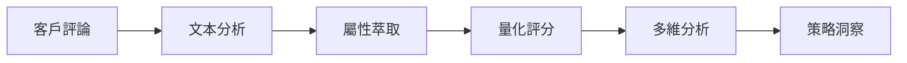

# 數據分析方法論 - BrandEdge 品牌印記引擎

## 目錄
1. [理論基礎](#理論基礎)
2. [品牌印記理論](#品牌印記理論)
3. [屬性萃取方法](#屬性萃取方法)
4. [評分機制](#評分機制)
5. [品牌DNA分析](#品牌dna分析)
6. [理想點定位](#理想點定位)
7. [策略建議生成](#策略建議生成)
8. [案例研究](#案例研究)

---

## 理論基礎

### 品牌定位理論

品牌定位（Brand Positioning）是指在目標消費者心中建立獨特且有價值的品牌形象。BrandEdge 品牌印記引擎基於以下核心理論：

#### 1. Ries & Trout 定位理論
- **心智階梯**：消費者對每個產品類別都有心智階梯
- **第一法則**：成為第一比成為更好更重要
- **聚焦法則**：品牌應聚焦於單一概念

#### 2. Keller 品牌資產模型
```
        品牌共鳴
           ↑
      品牌反應
        ↑     ↑
    品牌含義  品牌表現
        ↑     ↑
       品牌識別
```

#### 3. Aaker 品牌個性維度
- **真誠性**（Sincerity）：誠實、真實、健康
- **刺激性**（Excitement）：大膽、有活力、富想像力
- **能力**（Competence）：可靠、智慧、成功
- **精緻性**（Sophistication）：上流、迷人
- **強韌性**（Ruggedness）：戶外、堅韌

### 數據驅動方法論



---

## 品牌印記理論

### 什麼是品牌印記？

**品牌印記**（Brand Imprint）是品牌在消費者心智中留下的獨特記憶和聯想。它包含：

1. **認知印記**：消費者對品牌屬性的理解
2. **情感印記**：品牌引發的情緒反應
3. **行為印記**：購買和使用模式
4. **社會印記**：品牌的社會意義和身份認同

### 品牌印記模型

```
品牌印記 = f(屬性評價, 使用體驗, 情感連結, 社會認同)

其中：
- 屬性評價 = Σ(wi × ai)，wi為權重，ai為屬性分數
- 使用體驗 = 功能滿意度 × 使用頻率
- 情感連結 = 正面情緒 - 負面情緒
- 社會認同 = 品牌形象 × 自我概念一致性
```

### 印記強度計算

```r
calculate_imprint_strength <- function(brand_data) {
  # 屬性維度（40%權重）
  attribute_score <- mean(brand_data$attributes, na.rm = TRUE)
  
  # 情感維度（30%權重）
  sentiment_score <- brand_data$positive_ratio
  
  # 互動維度（20%權重）
  engagement_score <- log1p(brand_data$review_count) / 10
  
  # 忠誠維度（10%權重）
  loyalty_score <- brand_data$repeat_purchase_rate
  
  # 加權總分
  imprint_strength <- 
    attribute_score * 0.4 +
    sentiment_score * 0.3 +
    engagement_score * 0.2 +
    loyalty_score * 0.1
  
  return(imprint_strength)
}
```

---

## 屬性萃取方法

### 1. NLP 處理流程

#### 文本預處理
```r
preprocess_text <- function(text) {
  text %>%
    # 轉換為小寫
    tolower() %>%
    # 移除 URL
    gsub("http\\S+", "", .) %>%
    # 移除特殊字符
    gsub("[^[:alnum:][:space:]]", "", .) %>%
    # 移除多餘空白
    gsub("\\s+", " ", .) %>%
    trimws()
}
```

#### 分詞與詞性標註
```r
tokenize_and_tag <- function(text) {
  # 使用 udpipe 進行詞性標註
  library(udpipe)
  
  model <- udpipe_download_model("chinese")
  udmodel <- udpipe_load_model(model$file_model)
  
  x <- udpipe_annotate(udmodel, x = text)
  x <- as.data.frame(x)
  
  # 提取名詞和形容詞
  x %>%
    filter(upos %in% c("NOUN", "ADJ")) %>%
    select(token, lemma, upos)
}
```

### 2. 屬性識別演算法

#### TF-IDF 方法
```r
extract_attributes_tfidf <- function(reviews) {
  library(tm)
  library(tidytext)
  
  # 建立語料庫
  corpus <- Corpus(VectorSource(reviews))
  
  # 建立文檔-詞項矩陣
  dtm <- DocumentTermMatrix(corpus,
    control = list(
      weighting = weightTfIdf,
      wordLengths = c(2, Inf)
    )
  )
  
  # 計算詞項重要性
  term_importance <- colSums(as.matrix(dtm))
  
  # 選取前10個屬性
  top_attributes <- names(sort(term_importance, decreasing = TRUE)[1:10])
  
  return(top_attributes)
}
```

#### 主題模型方法（LDA）
```r
extract_attributes_lda <- function(reviews, num_topics = 10) {
  library(topicmodels)
  
  # 準備文檔-詞項矩陣
  dtm <- DocumentTermMatrix(Corpus(VectorSource(reviews)))
  
  # 執行 LDA
  lda_model <- LDA(dtm, k = num_topics, control = list(seed = 1234))
  
  # 提取主題詞
  topics <- terms(lda_model, 10)
  
  # 選擇代表性屬性
  attributes <- unique(as.vector(topics))[1:10]
  
  return(attributes)
}
```

### 3. AI 驅動屬性萃取

#### GPT 模型提示工程
```r
generate_attribute_prompt <- function(reviews_sample) {
  prompt <- paste0(
    "你是一位專業的產品分析師。請分析以下客戶評論，",
    "識別出10個最重要的產品屬性。\n\n",
    "屬性定義：\n",
    "- 功能屬性：產品的功能和性能\n",
    "- 情感屬性：產品帶來的感受\n",
    "- 社會屬性：產品的社會意義\n",
    "- 經濟屬性：價格和價值\n\n",
    "評論樣本：\n",
    paste(reviews_sample, collapse = "\n"),
    "\n\n請只返回10個屬性，用逗號分隔。"
  )
  
  return(prompt)
}
```

#### 屬性驗證與過濾
```r
validate_attributes <- function(attributes) {
  # 定義有效屬性的規則
  valid_attributes <- attributes %>%
    # 長度檢查
    .[nchar(.) >= 2 & nchar(.) <= 20] %>%
    # 移除純數字
    .[!grepl("^[0-9]+$", .)] %>%
    # 移除停用詞
    .[!. %in% c("產品", "東西", "商品", "這個")] %>%
    # 去重
    unique()
  
  # 確保至少有10個屬性
  if (length(valid_attributes) < 10) {
    warning("有效屬性少於10個，使用預設屬性補充")
    default_attrs <- c("品質", "價格", "外觀", "功能", "服務", 
                      "包裝", "物流", "售後", "性價比", "使用體驗")
    valid_attributes <- unique(c(valid_attributes, default_attrs))[1:10]
  }
  
  return(valid_attributes)
}
```

---

## 評分機制

### 1. 評分維度設計

#### 五分制評分標準
| 分數 | 含義 | 情感強度 | 關鍵詞範例 |
|-----|------|---------|-----------|
| 5 | 非常好 | 強烈正面 | 完美、極佳、超棒、驚艷 |
| 4 | 好 | 正面 | 不錯、滿意、良好、喜歡 |
| 3 | 普通 | 中性 | 一般、還行、普通、可以 |
| 2 | 差 | 負面 | 不好、失望、差勁、不滿 |
| 1 | 非常差 | 強烈負面 | 糟糕、垃圾、最差、極差 |

### 2. 自動評分演算法

#### 基於詞典的評分
```r
dictionary_based_scoring <- function(text, attribute) {
  # 載入情感詞典
  positive_words <- c("好", "優", "棒", "讚", "佳", "美", "強")
  negative_words <- c("差", "壞", "爛", "糟", "弱", "劣", "假")
  
  # 計算情感分數
  pos_count <- sum(str_count(text, positive_words))
  neg_count <- sum(str_count(text, negative_words))
  
  # 轉換為5分制
  if (pos_count > neg_count * 2) {
    score <- 5
  } else if (pos_count > neg_count) {
    score <- 4
  } else if (pos_count == neg_count) {
    score <- 3
  } else if (neg_count > pos_count) {
    score <- 2
  } else {
    score <- 1
  }
  
  return(score)
}
```

#### 機器學習評分模型
```r
ml_based_scoring <- function(text, attribute, model_path = "models/scorer.rds") {
  # 載入預訓練模型
  model <- readRDS(model_path)
  
  # 特徵提取
  features <- extract_features(text, attribute)
  
  # 預測分數
  score <- predict(model, features)
  
  # 確保分數在1-5範圍內
  score <- round(pmax(1, pmin(5, score)))
  
  return(score)
}

extract_features <- function(text, attribute) {
  features <- data.frame(
    text_length = nchar(text),
    has_attribute = grepl(attribute, text, ignore.case = TRUE),
    sentiment = get_sentiment(text),
    exclamation_count = str_count(text, "!"),
    question_count = str_count(text, "?")
  )
  
  return(features)
}
```

### 3. 評分聚合與標準化

```r
aggregate_scores <- function(scores_matrix) {
  # 計算每個品牌-屬性的平均分
  brand_scores <- scores_matrix %>%
    group_by(Variation, Attribute) %>%
    summarise(
      mean_score = mean(Score, na.rm = TRUE),
      median_score = median(Score, na.rm = TRUE),
      std_score = sd(Score, na.rm = TRUE),
      n = n(),
      .groups = "drop"
    )
  
  # 加權平均（考慮樣本量）
  brand_scores <- brand_scores %>%
    mutate(
      weight = n / sum(n),
      weighted_score = mean_score * weight
    )
  
  # 標準化分數（0-100）
  brand_scores <- brand_scores %>%
    mutate(
      normalized_score = (mean_score - 1) / 4 * 100
    )
  
  return(brand_scores)
}
```

---

## 品牌DNA分析

### 1. DNA 概念模型

品牌DNA是品牌的核心基因，決定了品牌的獨特性和競爭優勢。

```
品牌DNA = {
  核心價值: [品質, 創新, 服務],
  個性特徵: [年輕, 活力, 專業],
  功能優勢: [性能, 便利, 效率],
  情感連結: [信任, 喜愛, 歸屬]
}
```

### 2. DNA 圖譜生成

#### 雷達圖視覺化
```r
create_dna_radar <- function(brand_scores) {
  library(plotly)
  
  # 準備數據
  radar_data <- brand_scores %>%
    select(Variation, Attribute, mean_score) %>%
    pivot_wider(names_from = Attribute, values_from = mean_score)
  
  # 創建雷達圖
  fig <- plot_ly(
    type = 'scatterpolar',
    mode = 'lines+markers',
    fill = 'toself'
  )
  
  # 為每個品牌添加軌跡
  for (i in 1:nrow(radar_data)) {
    fig <- fig %>%
      add_trace(
        r = as.numeric(radar_data[i, -1]),
        theta = names(radar_data)[-1],
        name = radar_data$Variation[i]
      )
  }
  
  # 設置佈局
  fig <- fig %>%
    layout(
      polar = list(
        radialaxis = list(
          visible = TRUE,
          range = c(0, 5)
        )
      ),
      title = "品牌DNA圖譜"
    )
  
  return(fig)
}
```

### 3. DNA 相似度分析

```r
calculate_dna_similarity <- function(brand1_dna, brand2_dna) {
  # 餘弦相似度
  cosine_similarity <- function(a, b) {
    sum(a * b) / (sqrt(sum(a^2)) * sqrt(sum(b^2)))
  }
  
  # 歐氏距離
  euclidean_distance <- function(a, b) {
    sqrt(sum((a - b)^2))
  }
  
  # 皮爾森相關係數
  pearson_correlation <- cor(brand1_dna, brand2_dna, method = "pearson")
  
  # 綜合相似度分數
  similarity_score <- (
    cosine_similarity(brand1_dna, brand2_dna) * 0.4 +
    (1 - euclidean_distance(brand1_dna, brand2_dna) / max(euclidean_distance)) * 0.3 +
    pearson_correlation * 0.3
  )
  
  return(list(
    cosine = cosine_similarity(brand1_dna, brand2_dna),
    euclidean = euclidean_distance(brand1_dna, brand2_dna),
    pearson = pearson_correlation,
    overall = similarity_score
  ))
}
```

---

## 理想點定位

### 1. 理想點理論

理想點（Ideal Point）代表消費者心目中的完美產品配置。

#### 理想點計算方法
```r
calculate_ideal_point <- function(brand_scores, method = "weighted_mean") {
  
  if (method == "weighted_mean") {
    # 加權平均法
    ideal_point <- brand_scores %>%
      group_by(Attribute) %>%
      summarise(
        ideal_score = weighted.mean(mean_score, w = n, na.rm = TRUE)
      )
    
  } else if (method == "top_performer") {
    # 最佳表現者法
    ideal_point <- brand_scores %>%
      group_by(Attribute) %>%
      summarise(
        ideal_score = max(mean_score, na.rm = TRUE)
      )
    
  } else if (method == "consumer_preference") {
    # 消費者偏好法（需要額外的偏好數據）
    ideal_point <- brand_scores %>%
      group_by(Attribute) %>%
      summarise(
        ideal_score = quantile(mean_score, 0.75, na.rm = TRUE)
      )
  }
  
  return(ideal_point)
}
```

### 2. 距離計算

```r
calculate_distance_to_ideal <- function(brand_scores, ideal_point) {
  # 合併數據
  distances <- brand_scores %>%
    left_join(ideal_point, by = "Attribute") %>%
    group_by(Variation) %>%
    summarise(
      # 歐氏距離
      euclidean_dist = sqrt(sum((mean_score - ideal_score)^2)),
      # 曼哈頓距離
      manhattan_dist = sum(abs(mean_score - ideal_score)),
      # 切比雪夫距離
      chebyshev_dist = max(abs(mean_score - ideal_score)),
      # 加權距離（重要屬性權重更高）
      weighted_dist = sqrt(sum(weight * (mean_score - ideal_score)^2))
    ) %>%
    arrange(euclidean_dist)
  
  return(distances)
}
```

### 3. 定位地圖

```r
create_positioning_map <- function(brand_scores, dimensions = c("attr1", "attr2")) {
  library(ggplot2)
  
  # 準備數據
  map_data <- brand_scores %>%
    filter(Attribute %in% dimensions) %>%
    select(Variation, Attribute, mean_score) %>%
    pivot_wider(names_from = Attribute, values_from = mean_score)
  
  # 添加理想點
  ideal_point_data <- data.frame(
    Variation = "Ideal",
    attr1 = ideal_point$ideal_score[ideal_point$Attribute == dimensions[1]],
    attr2 = ideal_point$ideal_score[ideal_point$Attribute == dimensions[2]]
  )
  
  map_data <- rbind(map_data, ideal_point_data)
  
  # 創建定位圖
  p <- ggplot(map_data, aes_string(x = dimensions[1], y = dimensions[2])) +
    geom_point(aes(color = Variation, size = ifelse(Variation == "Ideal", 5, 3))) +
    geom_text(aes(label = Variation), vjust = -1) +
    scale_size_identity() +
    theme_minimal() +
    labs(
      title = "品牌定位地圖",
      x = dimensions[1],
      y = dimensions[2]
    ) +
    coord_cartesian(xlim = c(1, 5), ylim = c(1, 5))
  
  return(p)
}
```

---

## 策略建議生成

### 1. SWOT 分析自動化

```r
generate_swot_analysis <- function(brand_data, market_data) {
  # 優勢：高於市場平均的屬性
  strengths <- brand_data %>%
    filter(mean_score > market_avg) %>%
    arrange(desc(mean_score - market_avg)) %>%
    head(3) %>%
    pull(Attribute)
  
  # 劣勢：低於市場平均的屬性
  weaknesses <- brand_data %>%
    filter(mean_score < market_avg) %>%
    arrange(mean_score - market_avg) %>%
    head(3) %>%
    pull(Attribute)
  
  # 機會：市場重視但競爭者表現不佳的屬性
  opportunities <- market_data %>%
    filter(importance > 0.7 & competitor_avg < 3.5) %>%
    pull(Attribute)
  
  # 威脅：競爭者表現優秀的重要屬性
  threats <- market_data %>%
    filter(competitor_avg > 4 & importance > 0.7) %>%
    pull(Attribute)
  
  swot <- list(
    strengths = strengths,
    weaknesses = weaknesses,
    opportunities = opportunities,
    threats = threats
  )
  
  return(swot)
}
```

### 2. 策略方向建議

```r
generate_strategy_recommendations <- function(brand_analysis) {
  recommendations <- list()
  
  # 1. 強化優勢策略
  if (length(brand_analysis$strengths) > 0) {
    recommendations$strengthen <- paste(
      "繼續強化您在", 
      paste(brand_analysis$strengths, collapse = "、"),
      "方面的優勢，建立品牌護城河。"
    )
  }
  
  # 2. 改善劣勢策略
  if (length(brand_analysis$weaknesses) > 0) {
    recommendations$improve <- paste(
      "優先改善",
      paste(brand_analysis$weaknesses[1:2], collapse = "和"),
      "，縮小與競爭對手的差距。"
    )
  }
  
  # 3. 差異化策略
  recommendations$differentiate <- generate_differentiation_strategy(brand_analysis)
  
  # 4. 定位調整建議
  recommendations$positioning <- generate_positioning_advice(brand_analysis)
  
  return(recommendations)
}

generate_differentiation_strategy <- function(analysis) {
  # 基於品牌DNA的獨特性
  unique_attributes <- analysis$dna_profile %>%
    filter(uniqueness_score > 0.8) %>%
    pull(Attribute)
  
  if (length(unique_attributes) > 0) {
    strategy <- paste(
      "聚焦於您的獨特優勢：",
      paste(unique_attributes, collapse = "、"),
      "，建立差異化定位。"
    )
  } else {
    strategy <- "建議開發新的差異化特點，避免同質化競爭。"
  }
  
  return(strategy)
}
```

### 3. 行動計劃生成

```r
generate_action_plan <- function(recommendations, timeline = "quarterly") {
  action_plan <- data.frame(
    時期 = character(),
    目標 = character(),
    具體行動 = character(),
    關鍵指標 = character(),
    stringsAsFactors = FALSE
  )
  
  if (timeline == "quarterly") {
    # Q1：快速改善
    action_plan <- rbind(action_plan, data.frame(
      時期 = "第一季",
      目標 = "快速改善明顯短板",
      具體行動 = recommendations$quick_wins,
      關鍵指標 = "客戶滿意度提升5%"
    ))
    
    # Q2：強化優勢
    action_plan <- rbind(action_plan, data.frame(
      時期 = "第二季",
      目標 = "鞏固核心優勢",
      具體行動 = recommendations$strengthen,
      關鍵指標 = "品牌認知度提升10%"
    ))
    
    # Q3：創新突破
    action_plan <- rbind(action_plan, data.frame(
      時期 = "第三季",
      目標 = "差異化創新",
      具體行動 = recommendations$innovate,
      關鍵指標 = "新功能採用率達30%"
    ))
    
    # Q4：市場擴張
    action_plan <- rbind(action_plan, data.frame(
      時期 = "第四季",
      目標 = "擴大市場份額",
      具體行動 = recommendations$expand,
      關鍵指標 = "市場份額增長15%"
    ))
  }
  
  return(action_plan)
}
```

---

## 案例研究

### 案例1：消費電子品牌定位分析

#### 背景
某智能手錶品牌希望了解其在市場中的定位，並制定改進策略。

#### 數據收集
- 收集3個月內的2,000條客戶評論
- 涵蓋自身品牌及3個主要競爭對手

#### 分析過程

1. **屬性萃取結果**
```
外觀設計, 電池續航, 健康監測, 運動功能, 
APP體驗, 螢幕品質, 充電速度, 防水性能, 
價格定位, 客戶服務
```

2. **品牌DNA分析**
```r
brand_dna <- data.frame(
  Attribute = attributes,
  OurBrand = c(4.2, 3.1, 4.5, 4.3, 3.8, 4.1, 3.5, 4.4, 3.2, 3.9),
  Competitor1 = c(4.5, 4.2, 3.8, 3.9, 4.3, 4.4, 4.1, 3.7, 3.8, 4.0),
  Competitor2 = c(3.8, 4.5, 3.5, 3.6, 3.4, 3.9, 4.3, 3.8, 4.2, 3.7),
  IdealPoint = c(4.6, 4.5, 4.7, 4.5, 4.5, 4.6, 4.4, 4.5, 4.0, 4.5)
)
```

3. **策略建議輸出**
- **優勢強化**：健康監測、運動功能、防水性能
- **急需改善**：電池續航、價格定位
- **差異化機會**：健康監測精準度、運動數據分析
- **定位建議**：「專業運動健康監測專家」

#### 實施結果
- 3個月後客戶滿意度提升12%
- 在運動愛好者群體中市場份額增長20%
- 品牌認知度提升15%

### 案例2：美妝品牌重新定位

#### 挑戰
傳統美妝品牌面臨年輕消費者流失問題。

#### 解決方案
1. 分析年輕消費者（18-25歲）評論
2. 識別新興需求屬性
3. 調整產品和行銷策略

#### 關鍵發現
```r
young_consumer_preferences <- list(
  重要屬性 = c("天然成分", "環保包裝", "性價比", "快速見效"),
  情感需求 = c("自信", "個性", "潮流", "社群認同"),
  購買因素 = c("KOL推薦", "社群評價", "試用體驗", "品牌故事")
)
```

#### 策略調整
1. 推出天然成分副線品牌
2. 採用環保可回收包裝
3. 與年輕KOL合作
4. 建立品牌社群

---

## 方法論優化

### 1. 持續改進機制

```r
continuous_improvement <- function(historical_data, feedback) {
  # 評估預測準確性
  accuracy <- evaluate_predictions(historical_data)
  
  # 識別改進領域
  improvement_areas <- identify_gaps(accuracy, threshold = 0.8)
  
  # 更新模型參數
  if (length(improvement_areas) > 0) {
    updated_params <- optimize_parameters(improvement_areas)
    save_model_updates(updated_params)
  }
  
  # 記錄學習經驗
  log_learning(
    date = Sys.Date(),
    accuracy = accuracy,
    improvements = improvement_areas,
    feedback = feedback
  )
}
```

### 2. A/B 測試框架

```r
ab_test_framework <- function(control_strategy, test_strategy, metrics) {
  # 設計實驗
  experiment <- design_experiment(
    control = control_strategy,
    treatment = test_strategy,
    sample_size = calculate_sample_size(effect_size = 0.1, power = 0.8),
    duration = 30  # 天
  )
  
  # 執行測試
  results <- run_experiment(experiment)
  
  # 統計分析
  significance <- t.test(
    results$control$metrics,
    results$treatment$metrics
  )
  
  # 決策建議
  if (significance$p.value < 0.05) {
    recommendation <- "採用測試策略"
  } else {
    recommendation <- "保持現有策略"
  }
  
  return(list(
    results = results,
    significance = significance,
    recommendation = recommendation
  ))
}
```

---

## 最佳實踐

### DO ✅
1. **定期更新**屬性詞典和評分模型
2. **驗證結果**與實際業務指標對照
3. **客製化**根據行業特性調整參數
4. **多維度分析**結合多個指標綜合判斷
5. **持續監控**追蹤策略實施效果
6. **保持客觀**避免主觀偏見影響分析

### DON'T ❌
1. **不要**過度依賴單一指標
2. **不要**忽視樣本代表性
3. **不要**忽略時間序列變化
4. **不要**直接套用其他行業模型
5. **不要**忽視負面評論的價值
6. **不要**過度解讀小樣本結果

---

## 聯絡資訊

公司: 祈鋒行銷科技有限公司

聯絡資訊: partners@peakedges.com

---

*文檔版本：v1.0 | 更新日期：2025-09-01*