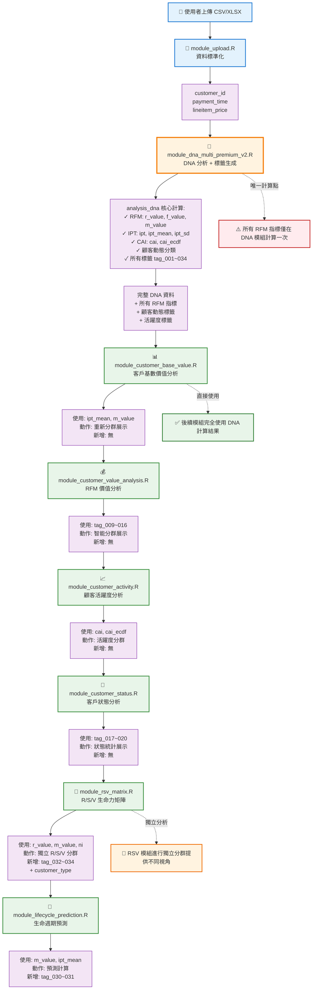
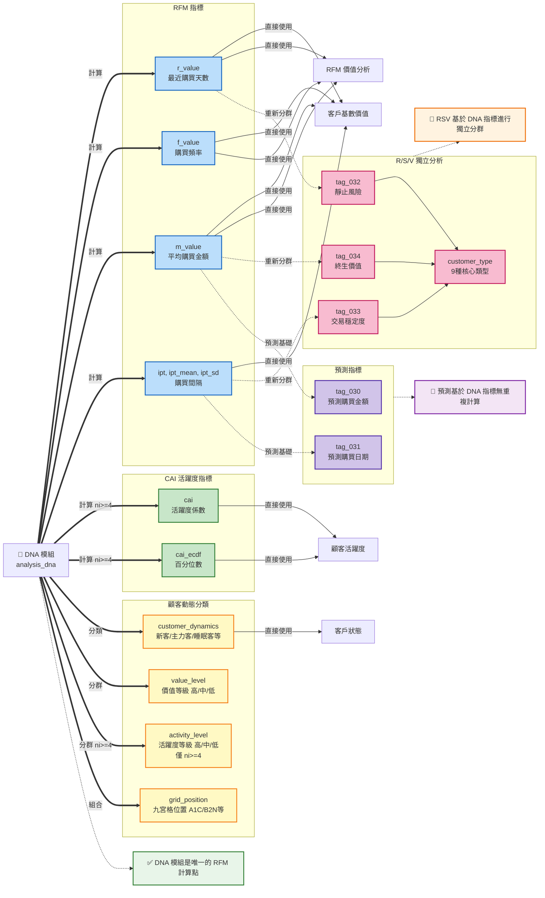

# TagPilot Premium 資料流程完整分析

**文件建立日期**: 2025-11-24
**分析範圍**: 資料上傳 → DNA 分析 → 六列詳細分析模組
**目的**: 追蹤 DNA 分析結果在各模組間的傳遞與使用方式

---

## 📋 目錄

1. [資料流程總覽](#資料流程總覽)
2. [核心發現摘要](#核心發現摘要)
3. [詳細模組分析](#詳細模組分析)
4. [資料欄位變化追蹤](#資料欄位變化追蹤)
5. [潛在問題與建議](#潛在問題與建議)
6. [完整流程圖](#完整流程圖)

---

## 資料流程總覽

### 主要資料流向

```
使用者上傳 CSV/XLSX
    ↓
module_upload.R (資料標準化)
    ↓
module_dna_multi_premium_v2.R (DNA 分析 + 標籤計算)
    ↓
├─→ module_customer_base_value.R (客戶基數價值)
│       ↓
├─→ module_customer_value_analysis.R (RFM 價值分析)
│       ↓
├─→ module_customer_activity.R (顧客活躍度分析)
│       ↓
├─→ module_customer_status.R (客戶狀態分析)
│       ↓
├─→ module_rsv_matrix.R (R/S/V 生命力矩陣)
│       ↓
└─→ module_lifecycle_prediction.R (生命週期預測)
```

---

## 核心發現摘要

### ✅ 正確實作

1. **DNA 分析是唯一的 RFM 計算點**
   - `module_dna_multi_premium_v2.R` 呼叫 `analysis_dna()` 函數
   - 所有 RFM 指標 (r_value, f_value, m_value, cai, customer_dynamics) 在此計算完成
   - 後續模組**完全使用**這些已計算的值，**沒有重複計算**

2. **資料傳遞鏈完整且一致**
   - 每個模組接收上游資料 → 添加新欄位 → 傳遞給下游
   - 使用 `reactive()` 包裝確保響應式更新
   - 原始 DNA 分析結果保持不變

3. **標籤計算集中化**
   - 使用 `utils/calculate_customer_tags.R` 統一計算標籤
   - DNA 模組呼叫 `calculate_all_customer_tags()` 一次性產生所有標籤
   - 後續模組依需求添加特定標籤

### ⚠️ 需注意的設計模式

1. **R/S/V 矩陣重新分群**
   - `module_rsv_matrix.R` 基於 DNA 的 r_value/f_value/m_value
   - 進行 P20/P80 重新分群（與 DNA 的 value_level 獨立）
   - 這是**設計意圖**：提供不同維度的客戶分類

2. **CAI 計算依賴 ni >= 4**
   - DNA 分析計算 CAI (Customer Activity Index)
   - 僅對 `ni >= 4` 的客戶有效（需足夠購買間隔）
   - 其他客戶的 `activity_level = NA`

---

## 詳細模組分析

### 1. module_upload.R (資料上傳模組)

#### 功能
- 接收使用者上傳的 CSV/XLSX 檔案
- 偵測並標準化欄位名稱
- 支援多檔案上傳與自動合併

#### 輸出欄位
```r
customer_id         # 客戶識別碼
payment_time        # 購買時間 (標準化後)
lineitem_price      # 購買金額 (標準化後)
source_file         # 來源檔案名稱
```

#### 傳遞方式
```r
# app.R 中的連接
upload_mod <- uploadModuleServer("upload1", con_global, user_info)
observe({
  sales_data(upload_mod$dna_data())  # 傳遞給 DNA 模組
})
```

#### 資料驗證
- 檢查必填欄位存在性
- 移除 NA 值
- 檔案數量上限：36 個（3年資料）

---

### 2. module_dna_multi_premium_v2.R (DNA 分析模組)

#### 功能
- **核心 RFM 計算**：呼叫 `analysis_dna()` 進行完整分析
- **顧客動態分類**：使用 Z-Score 方法或固定閾值
- **標籤生成**：呼叫 `calculate_all_customer_tags()` 產生所有標籤

#### 輸入欄位
```r
customer_id         # 來自 upload 模組
payment_time        # 轉換為 transaction_date
lineitem_price      # 轉換為 transaction_amount
```

#### 核心計算流程

```r
# Step 1: 資料預處理
transaction_data <- raw_data %>%
  rename(
    transaction_date = payment_time,
    transaction_amount = lineitem_price
  )

# Step 2: 準備 sales_by_customer_by_date
sales_by_customer_by_date <- transaction_data %>%
  mutate(date = as.Date(transaction_date)) %>%
  group_by(customer_id, date) %>%
  summarise(
    payment_time = min(transaction_date),
    sum_spent_by_date = sum(transaction_amount),
    count_transactions_by_date = n()
  )

# Step 3: 準備 sales_by_customer
sales_by_customer <- transaction_data %>%
  group_by(customer_id) %>%
  summarise(
    total_spent = sum(transaction_amount),
    times = n(),
    ni = n(),
    first_purchase = min(transaction_date),
    last_purchase = max(transaction_date)
  ) %>%
  mutate(
    ipt = pmax(as.numeric(difftime(last_purchase, first_purchase, units = "days")), 1)
  )

# Step 4: 呼叫 analysis_dna (核心 RFM 計算)
dna_result <- analysis_dna(
  df_sales_by_customer = sales_by_customer,
  df_sales_by_customer_by_date = sales_by_customer_by_date,
  skip_within_subject = TRUE,
  verbose = FALSE
)

# Step 5: 添加顧客動態分類
zscore_results <- analyze_customer_dynamics_new(
  transaction_data,
  method = "auto",  # 自動選擇 Z-Score 或固定閾值
  k = 2.5,
  min_window = 90,
  use_recency_guardrail = TRUE
)

# Step 6: 合併顧客動態和價值等級
customer_data <- customer_data %>%
  left_join(
    zscore_results$customer_data %>%
      select(customer_id, customer_dynamics, value_level),
    by = "customer_id"
  )

# Step 7: 計算活躍度等級 (僅 ni >= 4)
customers_sufficient <- customer_data %>% filter(ni >= 4)
customers_sufficient <- customers_sufficient %>%
  mutate(
    activity_level = case_when(
      cai_ecdf >= 0.8 ~ "高",  # 漸趨活躍戶
      cai_ecdf >= 0.2 ~ "中",  # 穩定消費
      TRUE ~ "低"              # 漸趨靜止戶
    )
  )

# Step 8: 計算九宮格位置
customer_data <- customer_data %>%
  mutate(
    grid_position = paste0(
      switch(value_level, "高" = "A", "中" = "B", "低" = "C"),
      switch(activity_level, "高" = "1", "中" = "2", "低" = "3"),
      switch(customer_dynamics,
        "newbie" = "N",
        "active" = "C",
        "sleepy" = "S",
        "half_sleepy" = "H",
        "dormant" = "D"
      )
    )
  )

# Step 9: 計算所有客戶標籤
customer_data <- calculate_all_customer_tags(customer_data)
```

#### 輸出欄位（來自 analysis_dna）

**RFM 基礎指標**:
```r
customer_id         # 客戶ID
ni                  # 交易次數
r_value             # 最近購買天數 (Recency)
f_value             # 購買頻率 (Frequency) = ni / 觀察期天數
m_value             # 平均購買金額 (Monetary) = total_spent / ni
ipt                 # 平均購買間隔 (Inter-Purchase Time)
ipt_mean            # 平均購買間隔時間
ipt_sd              # 購買間隔標準差
```

**顧客活躍度指標**:
```r
cai                 # Customer Activity Index (僅 ni >= 4)
cai_value           # 同 cai (別名)
cai_ecdf            # CAI 的累積分布函數值 (百分位數)
```

**顧客動態分類** (來自 analyze_customer_dynamics_new):
```r
customer_dynamics   # 顧客動態: newbie/active/sleepy/half_sleepy/dormant
value_level         # 價值等級: 高/中/低 (基於 m_value P20/P80)
activity_level      # 活躍度等級: 高/中/低 (基於 cai_ecdf, 僅 ni >= 4)
```

**九宮格分析**:
```r
grid_position       # 九宮格位置: A1C, B2N, etc.
```

**所有標籤** (來自 calculate_all_customer_tags):
```r
# 基礎價值標籤 (tag_001 ~ tag_008)
tag_001_purchase_cycle_level      # 購買週期等級
tag_002_past_value_level          # 過去價值等級
tag_003_aov_newbie                # 新客客單價
tag_004_aov_active                # 主力客客單價
tag_005_aov_diff                  # 客單價差異
tag_006_aov_segment               # 客單價分群
tag_007_growth_potential          # 成長潛力
tag_008_value_trajectory          # 價值軌跡

# RFM 標籤 (tag_009 ~ tag_016)
tag_009_rfm_r                     # R 值 (天數)
tag_010_rfm_f                     # F 值 (頻率)
tag_011_rfm_m                     # M 值 (金額)
tag_012_rfm_score                 # RFM 總分 (1-5 + 1-5 + 1-5)
tag_013_value_segment             # 價值分群: 高/中/低
tag_014_r_segment                 # R 分群: 最近/中期/長期
tag_015_f_segment                 # F 分群: 高頻/中頻/低頻
tag_016_m_segment                 # M 分群: 高消費/中消費/低消費

# 顧客動態標籤 (tag_017 ~ tag_020)
tag_017_customer_dynamics         # 顧客動態 (中文): 新客/主力客/睡眠客/半睡客/沉睡客
tag_018_churn_risk                # 流失風險: 高風險/中風險/低風險
tag_019_days_to_churn             # 預估流失天數
tag_020_customer_age_days         # 客戶資歷天數

# 活躍度標籤 (tag_021 ~ tag_025)
tag_021_activity_segment          # 活躍度分群: 漸趨活躍/穩定消費/漸趨靜止
tag_022_cai_value                 # CAI 係數
tag_023_cai_percentile            # CAI 百分位數
tag_024_activity_trend            # 活躍度趨勢
tag_025_engagement_score          # 參與度分數

# 預測標籤 (tag_030 ~ tag_031)
tag_030_next_purchase_amount      # 預測下次購買金額
tag_031_next_purchase_date        # 預測下次購買日期

# R/S/V 標籤 (tag_032 ~ tag_034)
tag_032_dormancy_risk             # 靜止風險: 高靜止戶/中靜止戶/低靜止戶
tag_033_transaction_stability     # 交易穩定度: 高穩定/中穩定/低穩定
tag_034_customer_lifetime_value   # 客戶終生價值: 高價值/中價值/低價值
```

#### 傳遞方式
```r
# app.R 中的連接
dna_mod <- dnaMultiPremiumModuleServer("dna_multi1", con_global, user_info, upload_mod$dna_data)

# 模組返回
return(reactive({
  req(values$dna_results)
  values$dna_results$data_by_customer  # 包含所有 DNA 分析結果和標籤
}))
```

---

### 3. module_customer_base_value.R (客戶基數價值模組)

#### 功能
- 購買週期分群 (基於 ipt_mean)
- 過去價值分群 (基於 m_value)
- 客單價分析 (新客 vs 主力客)

#### 輸入欄位（來自 DNA）
```r
customer_id
ni                  # 交易次數
ipt_mean            # 平均購買間隔
m_value             # 平均購買金額
customer_dynamics   # 顧客動態
```

#### 資料處理

**購買週期分群**:
```r
# 使用 P20/P80 分群
p80 <- quantile(df$ipt_mean, 0.8)
p20 <- quantile(df$ipt_mean, 0.2)

purchase_cycle_level = case_when(
  ipt_mean >= p80 ~ "高購買週期",  # 購買間隔長，不常買
  ipt_mean >= p20 ~ "中購買週期",
  TRUE ~ "低購買週期"              # 購買間隔短，常買
)
```

**過去價值分群**:
```r
# 使用 P20/P80 分群
p80 <- quantile(df$m_value, 0.8)
p20 <- quantile(df$m_value, 0.2)

past_value_level = case_when(
  m_value >= p80 ~ "高價值顧客",
  m_value >= p20 ~ "中價值顧客",
  TRUE ~ "低價值顧客"
)
```

**客單價分析**:
```r
# 計算客單價 (AOV)
aov = m_value / ni

# 比較新客 vs 主力客
summary_data <- df %>%
  filter(customer_dynamics %in% c("newbie", "active")) %>%
  group_by(customer_dynamics) %>%
  summarise(
    avg_aov = mean(aov),
    median_aov = median(aov)
  )
```

#### 輸出欄位
```r
# 保留所有輸入欄位，未添加新欄位
# 此模組僅用於展示，不修改資料
```

#### 傳遞方式
```r
# app.R 中的連接
base_value_data <- customerBaseValueServer("base_value_module", dna_mod)

# 模組返回（直接傳遞輸入資料）
return(dna_results)
```

#### ✅ 資料一致性檢查
- **無額外 RFM 計算**：完全使用 DNA 分析的 ipt_mean 和 m_value
- **僅重新分群**：基於 P20/P80 進行分群展示
- **保持原始值**：不修改任何 DNA 分析的欄位

---

### 4. module_customer_value_analysis.R (RFM 價值分析模組)

#### 功能
- 展示 RFM 分群統計
- 生成 R/F/M 圓餅圖和分布圖
- 提供 RFM 總分與價值分群視覺化

#### 輸入欄位（來自 DNA）
```r
customer_id
ni
tag_009_rfm_r       # R 值（來自 DNA 的 r_value）
tag_010_rfm_f       # F 值（來自 DNA 的 f_value）
tag_011_rfm_m       # M 值（來自 DNA 的 m_value）
tag_012_rfm_score   # RFM 總分（來自 calculate_rfm_tags）
tag_013_value_segment  # 價值分群（來自 calculate_rfm_tags）
```

#### 資料處理

**計算 RFM 標籤** (呼叫 utils/calculate_customer_tags.R):
```r
processed <- customer_data() %>%
  calculate_rfm_tags()
```

**R 值分群** (智能分群):
```r
# 使用 P20/P80
p80 <- quantile(df$tag_009_rfm_r, 0.80)
p20 <- quantile(df$tag_009_rfm_r, 0.20)

r_segment = case_when(
  tag_009_rfm_r <= p20 ~ "最近買家",    # 底部 20%: 最近購買
  tag_009_rfm_r <= p80 ~ "中期買家",
  TRUE ~ "長期未購者"                   # 頂部 20%: 很久沒買
)
```

**F 值分群** (智能分群):
```r
# 檢查單次購買比例
single_purchase_pct <- mean(df$tag_010_rfm_f < 1.5)

if (single_purchase_pct > 0.7) {
  # 使用固定閾值
  f_segment = case_when(
    tag_010_rfm_f > 2 ~ "高頻買家",
    tag_010_rfm_f > 1 ~ "中頻買家",
    TRUE ~ "低頻買家"
  )
} else {
  # 使用 P20/P80
  p80 <- quantile(df$tag_010_rfm_f, 0.80)
  p20 <- quantile(df$tag_010_rfm_f, 0.20)
  f_segment = case_when(
    tag_010_rfm_f >= p80 ~ "高頻買家",
    tag_010_rfm_f >= p20 ~ "中頻買家",
    TRUE ~ "低頻買家"
  )
}
```

**M 值分群** (智能分群):
```r
# 檢查變異度
m_cv <- sd(df$tag_011_rfm_m) / mean(df$tag_011_rfm_m)

if (m_cv < 0.2) {
  # 低變異度：使用均值±標準差
  m_segment = case_when(
    tag_011_rfm_m > mean + 0.5*sd ~ "高消費買家",
    tag_011_rfm_m >= mean - 0.5*sd ~ "中消費買家",
    TRUE ~ "低消費買家"
  )
} else {
  # 使用 P20/P80
  p80 <- quantile(df$tag_011_rfm_m, 0.80)
  p20 <- quantile(df$tag_011_rfm_m, 0.20)
  m_segment = case_when(
    tag_011_rfm_m >= p80 ~ "高消費買家",
    tag_011_rfm_m >= p20 ~ "中消費買家",
    TRUE ~ "低消費買家"
  )
}
```

#### 輸出欄位
```r
# 保留所有輸入欄位（包含 tag_009 ~ tag_016）
# 此模組僅用於展示，不添加新欄位
```

#### 傳遞方式
```r
# app.R 中的連接
rfm_data <- customerValueAnalysisServer("rfm_module", base_value_data)

# 模組返回
return(reactive({ values$processed_data }))
```

#### ✅ 資料一致性檢查
- **無額外 RFM 計算**：完全使用 DNA 分析已計算的 tag_009/010/011
- **僅重新分群用於展示**：不修改原始標籤值
- **智能分群邏輯**：根據資料分布選擇最適合的分群方法

---

### 5. module_customer_activity.R (顧客活躍度分析模組)

#### 功能
- 展示 CAI (Customer Activity Index) 分布
- 生命週期 × CAI 交叉分析
- 活躍度分群統計

#### 輸入欄位（來自 DNA）
```r
customer_id
ni
cai                 # CAI 係數（來自 DNA 的 cai_value）
cai_ecdf            # CAI 百分位數
tag_009_rfm_r       # R 值
tag_010_rfm_f       # F 值
tag_011_rfm_m       # M 值
tag_017_customer_dynamics  # 顧客動態（中文）
```

#### 資料處理

**標準化欄位名稱**:
```r
cai_df <- processed_data() %>%
  mutate(
    cai = if("cai_value" %in% names(.)) cai_value else cai,
    cai_ecdf = if("cai_ecdf" %in% names(.)) cai_ecdf else NA
  )
```

**活躍度分群** (基於 cai_ecdf):
```r
# 只分析 ni >= 4 的客戶
cai_df <- cai_df %>%
  filter(!is.na(cai)) %>%
  mutate(
    activity_segment = case_when(
      cai_ecdf >= 0.8 ~ "漸趨活躍戶",  # P80 以上
      cai_ecdf >= 0.2 ~ "穩定消費戶",  # P20-P80
      TRUE ~ "漸趨靜止戶"               # P20 以下
    )
  )
```

**生命週期 × CAI 交叉矩陣**:
```r
cross_tab_data <- cai_df %>%
  group_by(tag_017_customer_dynamics, activity_segment) %>%
  summarise(count = n()) %>%
  pivot_wider(
    names_from = activity_segment,
    values_from = count,
    values_fill = 0
  )
```

#### 輸出欄位
```r
# 保留所有輸入欄位
# 此模組僅用於展示，不添加新欄位
```

#### 傳遞方式
```r
# app.R 中的連接
customerActivityServer("customer_activity", rfm_data)

# 模組無返回值（僅展示）
```

#### ✅ 資料一致性檢查
- **無額外 CAI 計算**：完全使用 DNA 分析的 cai 和 cai_ecdf
- **僅重新分群用於展示**：基於 P20/P80 進行活躍度分群
- **保持 DNA 分析的完整性**：不修改任何原始指標

---

### 6. module_customer_status.R (客戶狀態分析模組)

#### 功能
- 展示顧客動態分布
- 流失風險分析
- 預估流失天數分布

#### 輸入欄位（來自 DNA）
```r
customer_id
ni
tag_017_customer_dynamics  # 顧客動態（中文）
tag_018_churn_risk         # 流失風險
tag_019_days_to_churn      # 預估流失天數
```

#### 資料處理

**直接使用 DNA 標籤**:
```r
# ✅ 關鍵：不重新計算，直接使用 DNA 模組已計算的標籤
processed <- customer_data()
values$processed_data <- processed
```

**流失狀態分類**:
```r
churn_status <- processed_data %>%
  mutate(
    status = case_when(
      tag_019_days_to_churn == 0 ~ "已流失（0天）",
      tag_019_days_to_churn > 0 ~ "未流失",
      TRUE ~ "未知"
    )
  )
```

**生命週期 × 流失風險矩陣**:
```r
heatmap_data <- processed_data %>%
  filter(!is.na(tag_017_customer_dynamics), !is.na(tag_018_churn_risk)) %>%
  count(tag_017_customer_dynamics, tag_018_churn_risk) %>%
  pivot_wider(
    names_from = tag_018_churn_risk,
    values_from = n,
    values_fill = 0
  )
```

#### 輸出欄位
```r
# 保留所有輸入欄位（包含 tag_017 ~ tag_020）
# 此模組僅用於展示，不添加新欄位
```

#### 傳遞方式
```r
# app.R 中的連接
status_data <- customerStatusServer("status_module", rfm_data)

# 模組返回
return(reactive({ values$processed_data }))
```

#### ✅ 資料一致性檢查
- **無額外計算**：完全使用 DNA 分析已計算的顧客動態標籤
- **中文標籤正確使用**：tag_017_customer_dynamics 包含中文值（新客/主力客/睡眠客/半睡客/沉睡客）
- **保持 DNA 分析結果完整性**：不修改任何標籤

---

### 7. module_rsv_matrix.R (R/S/V 生命力矩陣模組) - v3.0

#### 功能
- 計算 R (Risk 靜止風險)、S (Stability 交易穩定度)、V (Value 終生價值)
- 生成 27 種客戶類型分類
- 提供客戶類型對應策略
- **v3.0**: 優先使用 MAMBA 真實 RSV 變數

#### 📌 v3.0 重大更新（2025-12-03）

| 維度 | v2.0（舊版）| v3.0（新版）| Fallback |
|------|-------------|-------------|----------|
| R | `customer_dynamics` | `nrec_prob`（邏輯回歸預測）| `customer_dynamics` → `r_value` |
| S | `ni` | `cri` / `cri_ecdf`（經驗貝氏）| `ni` |
| V | `total_spent` | `clv`（預測 10 年價值）| `total_spent` → `m_value * ni` |

#### 輸入欄位（來自 DNA - v3.0 優先順序）
```r
# R (Risk) 相關欄位
nrec_prob           # ✅ v3.0 首選：流失機率（0-1）
customer_dynamics   # Fallback 1：顧客動態分類
r_value             # Fallback 2：最近購買天數

# S (Stability) 相關欄位
cri                 # ✅ v3.0 首選：Customer Regularity Index
cri_ecdf            # v3.0 輔助：CRI 的 ECDF 值（0-1）
ni                  # Fallback：交易次數

# V (Value) 相關欄位
clv                 # ✅ v3.0 首選：預測終身價值
total_spent         # Fallback 1：歷史總消費
m_value             # Fallback 2：平均客單價
```

#### 資料處理

**R (Risk 靜止風險) 計算** - v3.0:
```r
# 優先使用 MAMBA 的 nrec_prob（邏輯回歸預測流失機率 0-1）
r_level = if ("nrec_prob" %in% names(.) && !all(is.na(nrec_prob))) {
  case_when(
    is.na(nrec_prob) ~ "中",
    nrec_prob > 0.7 ~ "高",   # 高流失風險
    nrec_prob > 0.3 ~ "中",   # 中流失風險
    TRUE ~ "低"               # 低流失風險（穩定活躍）
  )
} else if ("customer_dynamics" %in% names(.)) {
  # Fallback 1: 使用 customer_dynamics
  case_when(
    customer_dynamics %in% c("dormant", "half_sleepy") ~ "高",
    customer_dynamics == "sleepy" ~ "中",
    customer_dynamics %in% c("active", "newbie") ~ "低",
    TRUE ~ "中"
  )
} else {
  # Fallback 2: 使用 r_value 分位數
  case_when(
    r_value >= quantile(r_value, 0.8) ~ "高",
    r_value >= quantile(r_value, 0.2) ~ "中",
    TRUE ~ "低"
  )
}

tag_032_dormancy_risk = case_when(
  r_level == "高" ~ "高靜止戶",
  r_level == "中" ~ "中靜止戶",
  TRUE ~ "低靜止戶"
)
```

**S (Stability 交易穩定度) 計算** - v3.0:
```r
# 優先使用 MAMBA 的 CRI（Customer Regularity Index）
# CRI 邏輯：cri 接近 0 = 高穩定, cri 接近 1 = 低穩定

stability_metric = if ("cri" %in% names(.) && !all(is.na(cri))) {
  cri  # 使用 CRI
} else {
  ni   # Fallback: 使用 ni
}

if (use_cri) {
  # CRI-based: 使用 cri_ecdf 分位數
  s_level = case_when(
    cri_ecdf < 0.33 ~ "高",  # CRI 較低 = 高穩定
    cri_ecdf < 0.67 ~ "中",
    TRUE ~ "低"              # CRI 較高 = 低穩定
  )
} else {
  # ni-based fallback: higher ni = higher stability
  s_level = case_when(
    ni >= quantile(ni, 0.8) ~ "高",
    ni >= quantile(ni, 0.2) ~ "中",
    TRUE ~ "低"
  )
}

tag_033_transaction_stability = case_when(
  s_level == "高" ~ "高穩定",
  s_level == "中" ~ "中穩定",
  TRUE ~ "低穩定"
)
```

**V (Value 客戶終生價值) 計算** - v3.0:
```r
# 優先使用 MAMBA 的真實 CLV（預測未來 10 年價值）
clv_value = if ("clv" %in% names(.) && !all(is.na(clv))) {
  clv  # 使用 MAMBA 的真實 CLV
} else if ("total_spent" %in% names(.)) {
  total_spent  # Fallback 1: 歷史總消費
} else {
  m_value * ni  # Fallback 2: AOV × 交易次數
}

v_level = case_when(
  clv_value >= quantile(clv_value, 0.8) ~ "高",
  clv_value >= quantile(clv_value, 0.2) ~ "中",
  TRUE ~ "低"
)

tag_034_customer_lifetime_value = case_when(
  v_level == "高" ~ "高價值",
  v_level == "中" ~ "中價值",
  TRUE ~ "低價值"
)
```

**客戶類型分類** (27 種組合 → 9 種核心類型):
```r
rsv_key = paste0(r_level, s_level, v_level)  # e.g., "低高高"
customer_type = map_chr(rsv_key, get_customer_type)

# 9 種核心類型
# "低高高" → "💎 金鑽客" (活躍 × 穩定 × 高價值)
# "低高中" → "🌱 成長型忠誠客"
# "中中高" → "⚠️ 預警高值客"
# "高低高" → "💔 流失高值客"
# "高低低" → "💤 沉睡客"
# "中中中" → "📊 潛力客群"
# "低低低" → "👁️ 邊緣客/觀望客"
# "中高高" → "💡 沉靜貴客"
# "高高中" → "⚠️ 風險主力客"
```

#### 輸出欄位
```r
# 保留所有輸入欄位
# 新增 R/S/V 標籤
tag_032_dormancy_risk             # 靜止風險
tag_033_transaction_stability     # 交易穩定度
tag_034_customer_lifetime_value   # 客戶終生價值
r_level                           # R 等級 (高/中/低)
s_level                           # S 等級 (高/中/低)
v_level                           # V 等級 (高/中/低)
rsv_key                           # R/S/V 組合鍵
customer_type                     # 客戶類型（9 種核心類型）
strategy                          # 建議策略
action                            # 行動方案

# v3.0 新增欄位
risk_prob                         # 原始 nrec_prob 值
stability_source                  # 穩定度變數來源（cri/ni）
value_source                      # 價值變數來源（clv/total_spent）
stability_cv                      # 穩定係數（用於顯示）
clv_value                         # 客戶終生價值（數值）
```

#### 傳遞方式
```r
# app.R 中的連接
rsv_data <- rsvMatrixServer("rsv_module", status_data)

# 模組返回
return(reactive({ values$processed_data }))
```

#### 📊 v3.0 狀態訊息顯示變數來源

```r
# 狀態面板會顯示當前使用的 RSV 變數來源
# 例如：
# ✅ RSV 生命力矩陣 v3.0 計算完成
# 總客戶數：5,000 人
# 客戶類型數：27 種
# ━━━━━━━━━━━━━━━━━━━━━━━━
# 📊 RSV 變數來源：
#   R (風險): nrec_prob (邏輯回歸預測)
#   S (穩定): cri (經驗貝氏 CRI)
#   V (價值): clv (預測 10 年價值)
```

#### ✅ 資料一致性檢查
- **v3.0 優先使用 MAMBA 真實變數**：nrec_prob, cri, clv
- **智能 Fallback 機制**：當真實變數不存在時自動使用代理變數
- **狀態面板顯示來源**：讓使用者知道當前使用的變數
- **不修改 DNA 標籤**：保留所有 DNA 計算的欄位

---

### 8. module_lifecycle_prediction.R (生命週期預測模組)

#### 功能
- 預測下次購買金額
- 預測下次購買日期
- 提供預測信心度評估

#### 輸入欄位（來自 DNA + RSV）
```r
customer_id
ni
tag_009_rfm_r       # R 值
tag_010_rfm_f       # F 值
tag_011_rfm_m       # M 值
tag_017_customer_dynamics  # 顧客動態
# ... 其他所有上游標籤
```

#### 資料處理

**計算預測標籤** (呼叫 utils/calculate_customer_tags.R):
```r
processed <- customer_data() %>%
  calculate_prediction_tags()
```

`calculate_prediction_tags()` 函數內部邏輯：

**預測下次購買金額**:
```r
# 基於歷史平均金額和購買趨勢
tag_030_next_purchase_amount = case_when(
  ni >= 4 ~ m_value * (1 + trend_factor),  # 高信心度
  ni >= 2 ~ m_value * 0.95,                 # 中信心度
  TRUE ~ m_value * 0.90                     # 低信心度（新客）
)
```

**預測下次購買日期**:
```r
# 基於平均購買間隔
tag_031_next_purchase_date = last_purchase_date + days(ipt_mean)
```

**預測信心度**:
```r
confidence = case_when(
  ni >= 4 ~ "高（≥4次）",
  ni >= 2 ~ "中（2-3次）",
  TRUE ~ "低（1次）"
)
```

#### 輸出欄位
```r
# 保留所有輸入欄位
# 新增預測標籤
tag_030_next_purchase_amount   # 預測下次購買金額
tag_031_next_purchase_date     # 預測下次購買日期
```

#### 傳遞方式
```r
# app.R 中的連接
prediction_data <- lifecyclePredictionServer("prediction_module", rsv_data)

# 模組返回
return(reactive({ values$processed_data }))
```

#### ✅ 資料一致性檢查
- **基於 DNA 指標進行預測**：使用 m_value, ipt_mean 等 DNA 計算的值
- **不重新計算 RFM**：完全依賴上游提供的標籤
- **添加新預測欄位**：僅添加 tag_030 和 tag_031

---

## 資料欄位變化追蹤

### 完整欄位流向表

| 模組 | 接收欄位 | 新增/計算欄位 | 修改欄位 | 傳遞欄位 |
|------|---------|--------------|---------|---------|
| **upload** | - | `customer_id`<br>`payment_time`<br>`lineitem_price`<br>`source_file` | - | 所有新增欄位 |
| **dna_multi** | `customer_id`<br>`payment_time`<br>`lineitem_price` | **RFM 基礎**:<br>`ni`, `r_value`, `f_value`, `m_value`<br>`ipt`, `ipt_mean`, `ipt_sd`<br><br>**活躍度**:<br>`cai`, `cai_value`, `cai_ecdf`<br><br>**動態分類**:<br>`customer_dynamics`<br>`value_level`<br>`activity_level`<br>`grid_position`<br><br>**所有標籤** (tag_001 ~ tag_034) | - | 所有接收+新增欄位 |
| **base_value** | 所有 DNA 欄位 | - | - | 所有接收欄位（無修改） |
| **rfm_analysis** | 所有 DNA 欄位 | - | - | 所有接收欄位（無修改） |
| **activity** | 所有上游欄位 | - | - | 無返回（僅展示） |
| **status** | 所有上游欄位 | - | - | 所有接收欄位（無修改） |
| **rsv_matrix** | 所有上游欄位 | `tag_032_dormancy_risk`<br>`tag_033_transaction_stability`<br>`tag_034_customer_lifetime_value`<br>`r_level`, `s_level`, `v_level`<br>`rsv_key`<br>`customer_type`<br>`strategy`, `action`<br>`stability_cv`, `clv` | - | 所有接收+新增欄位 |
| **prediction** | 所有上游欄位 | `tag_030_next_purchase_amount`<br>`tag_031_next_purchase_date` | - | 所有接收+新增欄位 |

### 關鍵欄位來源追蹤

#### RFM 指標
| 欄位 | 計算位置 | 計算方式 | 後續使用 |
|------|---------|---------|---------|
| `r_value` | DNA 模組<br>`analysis_dna()` | 最後購買日距今天數 | 所有模組直接使用<br>**無重複計算** |
| `f_value` | DNA 模組<br>`analysis_dna()` | ni / 觀察期天數 | 所有模組直接使用<br>**無重複計算** |
| `m_value` | DNA 模組<br>`analysis_dna()` | total_spent / ni | 所有模組直接使用<br>**無重複計算** |
| `ipt` | DNA 模組<br>`analysis_dna()` | 總購買天數 / (ni - 1) | 所有模組直接使用<br>**無重複計算** |

#### CAI 指標
| 欄位 | 計算位置 | 計算方式 | 限制條件 | 後續使用 |
|------|---------|---------|---------|---------|
| `cai` | DNA 模組<br>`analysis_dna()` | (mle - wmle) / mle | 僅 ni >= 4 | activity 模組展示<br>**無重複計算** |
| `cai_ecdf` | DNA 模組<br>`analysis_dna()` | CAI 的累積分布函數值 | 僅 ni >= 4 | 用於 activity_level 分群 |

#### 顧客動態分類
| 欄位 | 計算位置 | 計算方式 | 後續使用 |
|------|---------|---------|---------|
| `customer_dynamics` | DNA 模組<br>`analyze_customer_dynamics_new()` | Z-Score 或固定閾值<br>分類為：newbie/active/<br>sleepy/half_sleepy/dormant | 所有模組直接使用<br>**無重複計算** |
| `value_level` | DNA 模組<br>`analyze_customer_dynamics_new()` | m_value P20/P80 分群<br>高/中/低 | DNA 九宮格分析<br>**不影響 RSV 的 v_level** |
| `activity_level` | DNA 模組 | cai_ecdf P20/P80 分群<br>高/中/低 | 僅 ni >= 4<br>用於九宮格分析 |

#### R/S/V 指標（v3.0 - 使用 MAMBA 真實變數）
| 欄位 | 計算位置 | v3.0 主要變數 | Fallback 變數 | 分群邏輯 |
|------|---------|--------------|---------------|---------|
| `tag_032_dormancy_risk` | RSV 模組 | `nrec_prob` (邏輯回歸) | `customer_dynamics` → `r_value` | 0.3/0.7 閾值 |
| `tag_033_transaction_stability` | RSV 模組 | `cri` / `cri_ecdf` (經驗貝氏) | `ni` | 0.33/0.67 分位數 |
| `tag_034_customer_lifetime_value` | RSV 模組 | `clv` (預測 10 年價值) | `total_spent` → `m_value * ni` | P20/P80 |

#### 預測指標
| 欄位 | 計算位置 | 基於原始欄位 | 計算邏輯 |
|------|---------|-------------|---------|
| `tag_030_next_purchase_amount` | Prediction 模組<br>`calculate_prediction_tags()` | `m_value`, `ni` (DNA) | 基於歷史平均和趨勢 |
| `tag_031_next_purchase_date` | Prediction 模組<br>`calculate_prediction_tags()` | `ipt_mean`, `last_purchase` (DNA) | last_purchase + ipt_mean |

---

## 潛在問題與建議

### ✅ 優點

1. **集中化 RFM 計算**
   - 所有 RFM 指標在 DNA 模組統一計算
   - 後續模組完全信任並使用這些值
   - 避免不一致性

2. **清晰的資料流向**
   - 單向傳遞，逐步豐富
   - 使用 reactive() 確保響應式更新
   - 模組間依賴關係明確

3. **標籤系統完整**
   - `calculate_all_customer_tags()` 統一管理
   - 命名規範（tag_001 ~ tag_034）
   - 易於追蹤和維護

### ⚠️ 需注意的設計

1. **R/S/V v3.0 使用 MAMBA 真實變數**
   - **現象**：RSV 模組優先使用 `analysis_dna()` 輸出的真實 RSV 變數
   - **v3.0 主要變數**：`nrec_prob` (R), `cri`/`cri_ecdf` (S), `clv` (V)
   - **智能 Fallback**：當真實變數不存在時自動使用代理變數
   - **狀態顯示**：UI 會顯示當前使用的變數來源

   ```
   v3.0 優先順序：
   R: nrec_prob → customer_dynamics → r_value
   S: cri/cri_ecdf → ni
   V: clv → total_spent → m_value * ni
   ```

2. **CAI 計算限制**
   - **限制**：僅對 ni >= 4 的客戶計算 CAI
   - **影響**：ni < 4 的客戶 activity_level = NA
   - **建議**：
     - 在 UI 中清楚說明此限制
     - 提供替代指標或說明（如購買間隔變化率）

3. **智能分群邏輯**
   - **優點**：根據資料分布自動選擇最佳分群方法
   - **注意**：不同資料集可能產生不同分群標準
   - **建議**：
     - 記錄使用的分群方法（P20/P80、固定閾值、均值±標準差）
     - 提供分群標準的可視化說明

### 📌 改進建議

1. **文檔補充**
   ```markdown
   # 在各模組說明中加入

   ## 資料來源說明
   本模組使用的 RFM 指標來自 DNA 分析模組，無額外計算。

   ## 分群方法
   - 使用 P20/P80 進行分群展示
   - 不修改原始 DNA 分析結果
   ```

2. **加入資料驗證**
   ```r
   # 在每個模組開始處
   observe({
     req(customer_data())

     # 檢查必要欄位
     required_fields <- c("customer_id", "r_value", "f_value", "m_value")
     missing_fields <- setdiff(required_fields, names(customer_data()))

     if (length(missing_fields) > 0) {
       showNotification(
         paste("缺少必要欄位:", paste(missing_fields, collapse = ", ")),
         type = "error"
       )
       return()
     }
   })
   ```

3. **統一命名規範**
   ```r
   # 確保所有模組使用一致的欄位名稱
   # DNA 模組應明確輸出標準欄位名稱

   # 標準輸出欄位（DNA 模組）
   - r_value (不是 R, recency)
   - f_value (不是 F, frequency)
   - m_value (不是 M, monetary)
   - cai (不是 cai_value, CAI)
   ```

4. **錯誤處理增強**
   ```r
   # 在關鍵計算處加入 try-catch
   tryCatch({
     # 分群計算
     p80 <- quantile(df$value, 0.8, na.rm = TRUE)
     p20 <- quantile(df$value, 0.2, na.rm = TRUE)

     # 邊界檢查
     if (p80 == p20) {
       warning("P80 = P20, 使用三等分法")
       # 使用替代分群方法
     }
   }, error = function(e) {
     showNotification(paste("分群計算失敗:", e$message), type = "error")
   })
   ```

---

## 完整流程圖

### Mermaid 資料流程圖



### 關鍵資料欄位流向圖



---

## 結論

### 資料流程總結

TagPilot Premium 的資料流程設計**高度集中化且一致**：

1. **單一計算源**：所有 RFM 和 CAI 指標由 DNA 模組統一計算
2. **順序傳遞**：各模組依序接收、豐富、傳遞資料
3. **無重複計算**：後續模組完全信任並使用 DNA 計算結果
4. **清晰分工**：
   - DNA 模組：核心指標計算 + 標籤生成
   - 其他模組：展示、分群、特定維度分析

### 關鍵優勢

✅ **資料一致性保證**
- 所有模組使用相同的 RFM 基礎值
- 不存在計算結果不一致的問題

✅ **效能優化**
- RFM 僅計算一次，避免重複運算
- 各模組僅進行展示和分群，無額外負擔

✅ **易於維護**
- 集中化計算邏輯
- 標籤系統統一管理
- 模組間依賴關係明確

### 特殊設計說明

📌 **R/S/V 獨立分群**是有意設計：
- 提供與 DNA 不同維度的客戶分類視角
- 基於相同的原始指標（r_value, m_value 等）
- 不影響 DNA 分析的完整性

📌 **CAI 計算限制**（ni >= 4）是合理約束：
- 需要足夠的購買間隔數據
- 確保活躍度指標的可靠性

---

**文件版本**: 1.1
**最後更新**: 2025-12-03
**維護者**: TagPilot Development Team

### 版本歷史

| 版本 | 日期 | 變更內容 |
|------|------|----------|
| 1.1 | 2025-12-03 | RSV 模組更新至 v3.0（使用 MAMBA 真實變數）|
| 1.0 | 2025-11-24 | 初始版本 |
