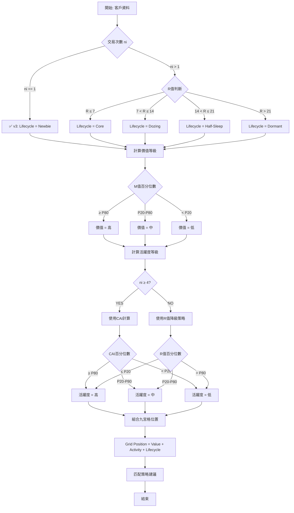

# TagPilot Premium - 九宮格判斷邏輯完整說明

**文檔建立日期**: 2025-10-25
**文檔版本**: v1.1 (更新於 2025-10-26)
**最近更新**: GAP-001 v3 - 簡化新客定義
**用途**: 詳細說明每個九宮格格子的判斷條件、計算邏輯、策略建議

---

## 📋 目錄

1. [九宮格架構概述](#九宮格架構概述)
2. [判斷條件計算邏輯](#判斷條件計算邏輯)
3. [九宮格完整矩陣](#九宮格完整矩陣)
4. [生命週期擴展矩陣](#生命週期擴展矩陣)
5. [判斷流程圖](#判斷流程圖)
6. [特殊情況處理](#特殊情況處理)

---

## 九宮格架構概述

### 基礎矩陣：Value × Activity

```
九宮格結構 (3×3):
           高活躍(A1)    中活躍(A2)    低活躍(A3)
高價值(V1)    A1          A2           A3
中價值(V2)    B1          B2           B3  
低價值(V3)    C1          C2           C3
```

### 擴展維度：Lifecycle (生命週期)

每個基礎格子可以再按照生命週期分為5種狀態：
- **N (Newbie)**: 新客
- **C (Core)**: 主力客
- **D (Dozing)**: 瞌睡客
- **H (Half-Sleep)**: 半睡客
- **S (Sleep/Dormant)**: 沉睡客

**完整組合**: 3 × 3 × 5 = **45 種客戶類型**

---

## 判斷條件計算邏輯

### 條件1: 價值等級 (Value Level)

**計算指標**: M值 (m_value - 總消費金額)

**分類邏輯**:
```r
value_level = case_when(
  m_value >= quantile(m_value, 0.8, na.rm = TRUE) ~ "高",  # P80以上
  m_value >= quantile(m_value, 0.2, na.rm = TRUE) ~ "中",  # P20-P80
  TRUE ~ "低"                                               # P20以下
)
```

**落入條件**:
| 等級 | 條件 | 說明 |
|------|------|------|
| 高價值 | M ≥ P80 | 前20%高消費客戶 |
| 中價值 | P20 ≤ M < P80 | 中間60%客戶 |
| 低價值 | M < P20 | 後20%低消費客戶 |

**計算位置**: `module_dna_multi_premium.R` Line 418-423

---

### 條件2: 活躍度等級 (Activity Level)

**計算指標**: CAI (Customer Activity Index) - 顧客活躍度指數

**前提條件**: **交易次數 ni >= 4** 才能計算CAI

**分類邏輯**:
```r
# 僅對 ni >= 4 的客戶計算
activity_level = case_when(
  !is.na(cai_ecdf) ~ case_when(
    cai_ecdf >= 0.8 ~ "高",  # P80以上 - 漸趨活躍
    cai_ecdf >= 0.2 ~ "中",  # P20-P80 - 穩定
    TRUE ~ "低"              # P20以下 - 漸趨靜止
  ),
  # ni < 4 無CAI值：降級使用r_value
  !is.na(r_value) ~ case_when(
    r_value <= quantile(r_value, 0.2, na.rm = TRUE) ~ "高",
    r_value <= quantile(r_value, 0.8, na.rm = TRUE) ~ "中",
    TRUE ~ "低"
  ),
  TRUE ~ "未知"
)
```

**落入條件**:
| 等級 | ni >= 4 (用CAI) | ni < 4 (用R值) | 說明 |
|------|----------------|---------------|------|
| 高活躍 | CAI ≥ P80 | R ≤ P20 | 購買頻率提升 / 最近購買 |
| 中活躍 | P20 ≤ CAI < P80 | P20 < R ≤ P80 | 穩定購買 |
| 低活躍 | CAI < P20 | R > P80 | 購買頻率下降 / 久未購買 |

**計算位置**: `module_dna_multi_premium.R` Line 438-473

---

### 條件3: 生命週期階段 (Lifecycle Stage)

**計算指標**: R值 (r_value - 最近購買天數) + 交易次數 (times)

**分類邏輯**:
```r
lifecycle_stage = case_when(
  is.na(r_value) ~ "unknown",

  # ✅ GAP-001 v3 修復：簡化新客定義（2025-10-26）
  # 新客：只要購買次數為 1 就是新客（移除時間限制）
  ni == 1 ~ "newbie",

  # 主力客：最近7天內購買
  r_value <= 7 ~ "active",

  # 瞌睡客：7-14天
  r_value <= 14 ~ "sleepy",

  # 半睡客：14-21天
  r_value <= 21 ~ "half_sleepy",

  # 沉睡客：超過21天
  TRUE ~ "dormant"
)
```

**落入條件**:
| 階段 | 條件 | 說明 |
|------|------|------|
| 新客 (N) | ni == 1 | ✅ v3: 購買次數為 1（移除時間限制） |
| 主力客 (C) | R ≤ 7天 | 一週內購買過 |
| 瞌睡客 (D) | 7 < R ≤ 14天 | 1-2週未購買 |
| 半睡客 (H) | 14 < R ≤ 21天 | 2-3週未購買 |
| 沉睡客 (S) | R > 21天 | 超過3週未購買 |

**計算位置**: `module_dna_multi_premium.R` Line 383-415

---

## 九宮格完整矩陣

### A1 - 高價值 × 高活躍

**判斷條件**:
```
m_value >= quantile(m_value, 0.8) AND
(cai_ecdf >= 0.8 OR r_value <= quantile(r_value, 0.2))
```

**如何落入此格**:
1. 總消費金額在前20%
2. 且購買活躍度在前20% (或最近購買在前20%)

**典型客戶特徵**:
- 高消費力
- 頻繁購買
- 購買間隔縮短（活躍度上升）

**策略建議**: VIP社群、新品搶先權、專屬客服

---

### A2 - 高價值 × 中活躍

**判斷條件**:
```
m_value >= quantile(m_value, 0.8) AND
(0.2 <= cai_ecdf < 0.8 OR quantile(r_value, 0.2) < r_value <= quantile(r_value, 0.8))
```

**如何落入此格**:
1. 總消費金額在前20%
2. 且購買活躍度在中間60% (或最近購買在中間60%)

**典型客戶特徵**:
- 高消費力
- 穩定購買
- 購買頻率維持

**策略建議**: 階梯折扣券、生日體驗升級、會員等級維護

---

### A3 - 高價值 × 低活躍

**判斷條件**:
```
m_value >= quantile(m_value, 0.8) AND
(cai_ecdf < 0.2 OR r_value > quantile(r_value, 0.8))
```

**如何落入此格**:
1. 總消費金額在前20%
2. 且購買活躍度在後20% (或最近購買在後20%)

**典型客戶特徵**:
- 高消費力（歷史貢獻大）
- 購買頻率下降
- 可能流失風險

**策略建議**: 專屬客服電話喚醒、流失前最後優惠、VIP挽回禮

---

### B1 - 中價值 × 高活躍

**判斷條件**:
```
quantile(m_value, 0.2) <= m_value < quantile(m_value, 0.8) AND
(cai_ecdf >= 0.8 OR r_value <= quantile(r_value, 0.2))
```

**如何落入此格**:
1. 總消費金額在中間60%
2. 且購買活躍度在前20%

**典型客戶特徵**:
- 中等消費力
- 高度活躍
- 成長潛力大（有機會升級到A1）

**策略建議**: 組合加價購、訂閱制試用、升級誘因

---

### B2 - 中價值 × 中活躍

**判斷條件**:
```
quantile(m_value, 0.2) <= m_value < quantile(m_value, 0.8) AND
(0.2 <= cai_ecdf < 0.8 OR quantile(r_value, 0.2) < r_value <= quantile(r_value, 0.8))
```

**如何落入此格**:
1. 總消費金額在中間60%
2. 且購買活躍度在中間60%

**典型客戶特徵**:
- 中等消費力
- 穩定購買
- 主要客群（數量最多）

**策略建議**: 例行EDM、累積點數、月度熱銷推薦

---

### B3 - 中價值 × 低活躍

**判斷條件**:
```
quantile(m_value, 0.2) <= m_value < quantile(m_value, 0.8) AND
(cai_ecdf < 0.2 OR r_value > quantile(r_value, 0.8))
```

**如何落入此格**:
1. 總消費金額在中間60%
2. 且購買活躍度在後20%

**典型客戶特徵**:
- 中等消費力
- 購買頻率下降
- 需要喚醒

**策略建議**: 回購折扣券、嘗鮮小樣包、Push+SMS雙管齊下

---

### C1 - 低價值 × 高活躍

**判斷條件**:
```
m_value < quantile(m_value, 0.2) AND
(cai_ecdf >= 0.8 OR r_value <= quantile(r_value, 0.2))
```

**如何落入此格**:
1. 總消費金額在後20%
2. 且購買活躍度在前20%

**典型客戶特徵**:
- 低消費力（可能是新客或小額購買）
- 高度活躍
- 潛力客戶（培養對象）

**策略建議**: 新手教學內容、首購加碼、引導升級高單價品

---

### C2 - 低價值 × 中活躍

**判斷條件**:
```
m_value < quantile(m_value, 0.2) AND
(0.2 <= cai_ecdf < 0.8 OR quantile(r_value, 0.2) < r_value <= quantile(r_value, 0.8))
```

**如何落入此格**:
1. 總消費金額在後20%
2. 且購買活躍度在中間60%

**典型客戶特徵**:
- 低消費力
- 穩定但小額購買
- 需要轉換策略

**策略建議**: 配對低客單商品、小額免運、補貨提醒

---

### C3 - 低價值 × 低活躍

**判斷條件**:
```
m_value < quantile(m_value, 0.2) AND
(cai_ecdf < 0.2 OR r_value > quantile(r_value, 0.8))
```

**如何落入此格**:
1. 總消費金額在後20%
2. 且購買活躍度在後20%

**典型客戶特徵**:
- 低消費力
- 低活躍度
- 邊緣客戶

**策略建議**: 清庫存閃購、退訂管控、低成本觸達

---

## 生命週期擴展矩陣

### Lifecycle = Newbie (N) - 新客

**特殊判斷邏輯** (✅ GAP-001 v3 更新於 2025-10-26):
```r
# v3 (最終版): 簡化定義
ni == 1

# 歷史版本：
# v2: ni == 1 AND customer_age_days <= 60
# v1: ni == 1 AND customer_age_days <= avg_ipt (已廢棄)
```

**新客九宮格組合**:

僅顯示 **3種低活躍新客組合** (因新客ni=1不符合ni>=4條件):

| 代號 | 名稱 | 指標 | 行銷方案 |
|-----|------|------|---------|
| **A3N** | 高價值低活躍新客 | 高V 低A 新客 | 首購後48h無互動 → 專屬客服問候 |
| **B3N** | 中價值低活躍新客 | 中V 低A 新客 | 首購加碼券 (限72h) |
| **C3N** | 低價值低活躍新客 | 低V 低A 新客 | 取消後續推播、只留月度新品EDM |

**注意**: A1N, A2N, B1N, B2N, C1N, C2N 理論上不存在（新客無法計算活躍度）

---

### Lifecycle = Core (C) - 主力客

**判斷邏輯**: `r_value <= 7`

**主力客九宮格組合** (9種):

| 代號 | 名稱 | 行銷方案 |
|-----|------|---------|
| **A1C** | 王者引擎 (主力) | VIP社群 + 新品搶先權 |
| **A2C** | 王者穩健 (主力) | 階梯折扣券 (高門檻) |
| **A3C** | 王者休眠 (主力) | 高值客深度訪談+專屬客服 |
| **B1C** | 成長火箭 (主力) | 訂閱制試用 + 個性化推薦 |
| **B2C** | 成長常規 (主力) | 點數倍數日/會員日 |
| **B3C** | 成長停滯 (主力) | 再購提醒 + 小樣包 |
| **C1C** | 潛力新芽 (主力) | 引導升級高單價品 |
| **C2C** | 潛力維持 (主力) | 補貨提醒 + 省運方案 |
| **C3C** | 清倉邊緣 (主力) | 低成本關懷;避免過度促銷 |

---

### Lifecycle = Dozing (D) - 瞌睡客

**判斷邏輯**: `7 < r_value <= 14`

**瞌睡客九宮格組合** (9種):

| 代號 | 名稱 | 行銷方案 |
|-----|------|---------|
| **A1D** | 王者引擎 (瞌睡) | 專屬喚醒券 (8折上限) |
| **A2D** | 王者穩健 (瞌睡) | 客服致電關懷+NPS調查 |
| **A3D** | 王者休眠 (瞌睡) | Win-Back套餐+VIP續會禮 |
| **B1D** | 成長火箭 (瞌睡) | 小遊戲抽獎+回購券 |
| **B2D** | 成長常規 (瞌睡) | 品類換血建議+搭售優惠 |
| **B3D** | 成長停滯 (瞌睡) | Push+SMS雙管齊下 |
| **C1D** | 潛力新芽 (瞌睡) | 低價快速回購品推薦 |
| **C2D** | 潛力維持 (瞌睡) | 簡訊喚醒+滿額贈 |
| **C3D** | 清倉邊緣 (瞌睡) | 清庫存閃購一天 |

---

### Lifecycle = Half-Sleep (H) - 半睡客

**判斷邏輯**: `14 < r_value <= 21`

**半睡客九宮格組合** (9種):

| 代號 | 名稱 | 行銷方案 |
|-----|------|---------|
| **A1H** | 王者引擎 (半睡) | 專屬客服+差異化補貼 |
| **A2H** | 王者穩健 (半睡) | 兩步式「問卷→優惠」 |
| **A3H** | 王者休眠 (半睡) | VIP喚醒券⋯滿額升等 |
| **B1H** | 成長火箭 (半睡) | 會員日兌換券 |
| **B2H** | 成長常規 (半睡) | 價格敏感品小額試用 |
| **B3H** | 成長停滯 (半睡) | 封存前最後折扣 |
| **C1H** | 潛力新芽 (半睡) | 爆款低價促購 |
| **C2H** | 潛力維持 (半睡) | 免運券+再購提醒 |
| **C3H** | 清倉邊緣 (半睡) | 月度EDM;不再Push |

---

### Lifecycle = Sleep/Dormant (S) - 沉睡客

**判斷邏輯**: `r_value > 21`

**沉睡客九宮格組合** (9種):

| 代號 | 名稱 | 行銷方案 |
|-----|------|---------|
| **A1S** | 王者引擎 (沉睡) | 客服電話+專屬復活禮盒 |
| **A2S** | 王者穩健 (沉睡) | 高值客流失調查+買一送一 |
| **A3S** | 王者休眠 (沉睡) | 只做客情維繫,勿頻促 |
| **B1S** | 成長火箭 (沉睡) | 不定期驚喜包 |
| **B2S** | 成長常規 (沉睡) | 庫存清倉先行名單 |
| **B3S** | 成長停滯 (沉睡) | 定向廣告retarget + SMS |
| **C1S** | 潛力新芽 (沉睡) | 簡訊一次+退訂選項 |
| **C2S** | 潛力維持 (沉睡) | 只保留月報EDM |
| **C3S** | 清倉邊緣 (沉睡) | 名單除重/不再接觸 |

---

## 判斷流程圖

### 完整判斷流程



---

## 特殊情況處理

### 情況1: 新客無法計算活躍度

**問題**: 新客 times = 1，不符合 ni >= 4 條件

**解決方案**:
```r
if (lifecycle_stage == "newbie") {
  # 新客強制分配到低活躍
  activity_level <- "低"
  # 或標記為 NA
  activity_level <- NA_character_
}
```

**結果**: 只顯示 A3N, B3N, C3N 三種新客組合

---

### 情況2: 交易次數 2-3 次的客戶

**問題**: 不是新客，但也不符合 ni >= 4

**解決方案**:
```r
if (ni < 4 & lifecycle_stage != "newbie") {
  # 使用 R 值降級策略
  activity_level <- case_when(
    r_value <= quantile(r_value, 0.2) ~ "高",
    r_value <= quantile(r_value, 0.8) ~ "中",
    TRUE ~ "低"
  )
}
```

---

### 情況3: 樣本數不足

**問題**: 總客戶數 < 30，百分位數不穩定

**解決方案**:
```r
MIN_SAMPLE_SIZE <- 30

if (nrow(customer_data) < MIN_SAMPLE_SIZE) {
  showNotification(
    "警告：客戶數量不足，建議至少30個客戶",
    type = "warning"
  )
  
  # 改用固定閾值
  use_fixed_thresholds <- TRUE
}
```

---

### 情況4: 極端值影響

**問題**: 某個超級VIP客戶的M值遠高於其他人

**解決方案**:
```r
# 使用 Winsorization 處理極端值
m_value_winsorized <- case_when(
  m_value > quantile(m_value, 0.99) ~ quantile(m_value, 0.99),
  m_value < quantile(m_value, 0.01) ~ quantile(m_value, 0.01),
  TRUE ~ m_value
)
```

---

## 驗證檢查清單

### 必須通過的檢查

- [ ] **檢查1**: 所有客戶都被分配到唯一格子
- [ ] **檢查2**: 格子分佈合理 (不應有空格子，除非合理)
- [ ] **檢查3**: 新客判斷正確 (有新客且數量合理)
- [ ] **檢查4**: 百分位數計算正確 (高/中/低比例接近20/60/20)
- [ ] **檢查5**: 策略匹配正確 (每個格子都有對應策略)

### 驗證腳本

```r
validate_grid_assignment <- function(customer_data) {
  # 檢查1: 唯一性
  duplicates <- customer_data %>%
    group_by(customer_id) %>%
    filter(n() > 1)
  
  if (nrow(duplicates) > 0) {
    warning("發現重複客戶ID")
  }
  
  # 檢查2: 完整性
  missing_grid <- customer_data %>%
    filter(is.na(grid_position))
  
  if (nrow(missing_grid) > 0) {
    warning("有客戶未分配到格子")
  }
  
  # 檢查3: 分佈
  grid_distribution <- customer_data %>%
    group_by(value_level, activity_level) %>%
    summarise(count = n(), .groups = "drop")
  
  print(grid_distribution)
  
  # 檢查4: 比例
  value_distribution <- customer_data %>%
    group_by(value_level) %>%
    summarise(
      count = n(),
      percentage = round(n() / nrow(customer_data) * 100, 1)
    )
  
  print("價值分佈:")
  print(value_distribution)
  
  return(list(
    valid = nrow(duplicates) == 0 & nrow(missing_grid) == 0,
    distribution = grid_distribution
  ))
}
```

---

## 總結

### 判斷邏輯優先級

1. **生命週期判斷** (最優先)
   - 新客判斷：times == 1 & age <= avg_ipt
   - R值判斷：7/14/21 天臨界值

2. **價值等級判斷**
   - M值百分位數：P80 / P20

3. **活躍度等級判斷**
   - 優先使用 CAI (ni >= 4)
   - 降級使用 R 值 (ni < 4)

### 關鍵數據來源

| 判斷維度 | 數據來源 | 計算位置 |
|---------|---------|---------|
| M值 | DNA分析 | `fn_analysis_dna.R` |
| R值 | DNA分析 | `fn_analysis_dna.R` |
| CAI | DNA分析 | `fn_analysis_dna.R` Line 646-690 |
| ni | DNA分析 | `fn_analysis_dna.R` |
| avg_ipt | DNA分析 | `fn_analysis_dna.R` |

### 完整性檢查

**45種組合中實際可用**:
- ✅ 主力客 (C): 9種全部可用
- ✅ 瞌睡客 (D): 9種全部可用
- ✅ 半睡客 (H): 9種全部可用
- ✅ 沉睡客 (S): 9種全部可用
- ⚠️ 新客 (N): 僅3種可用 (A3N, B3N, C3N)

**總計**: 39種實際可用組合

---

**文檔結束**

**維護建議**:
- 每次修改判斷邏輯，同步更新此文檔
- 定期驗證實際分佈是否符合預期
- 收集業務反饋，優化策略建議

**相關文檔**:
- `logic.md` - 完整計算邏輯
- `warnings.md` - 邏輯衝突記錄
- `Work_Plan_TagPilot_Premium_Enhancement.md` - 工作規劃
