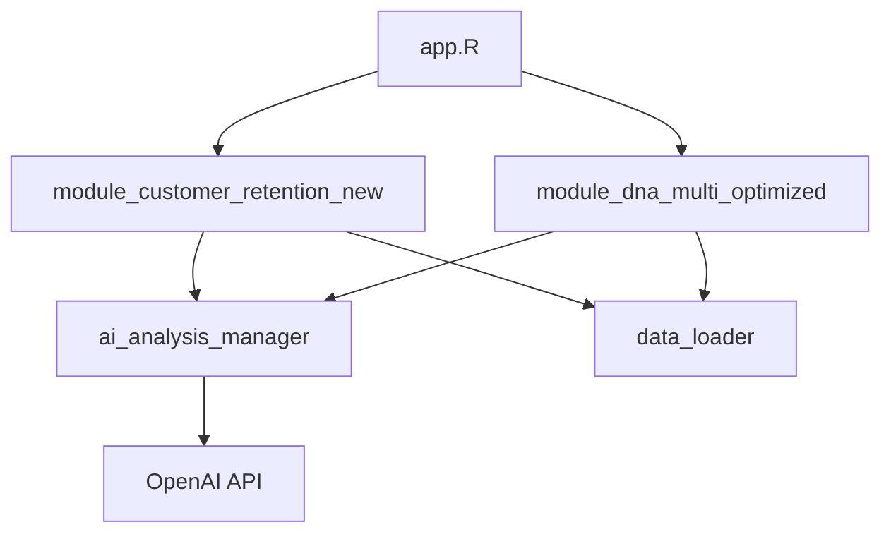

# VitalSigns Premium 完整應用程式文件

## 目錄
1. [應用程式概述](#應用程式概述)
2. [架構設計](#架構設計)
3. [模組定義與功能](#模組定義與功能)
4. [資料流程](#資料流程)
5. [函數定義](#函數定義)
6. [變數定義](#變數定義)
7. [AI整合](#ai整合)
8. [使用指南](#使用指南)

---

## 應用程式概述

### 基本資訊
- **應用名稱**: VitalSigns Premium 客戶精準行銷儀表板
- **版本**: 3.0
- **主程式**: app.R
- **框架**: R Shiny + bs4Dash
- **AI引擎**: OpenAI GPT-4

### 核心功能
1. **客戶DNA分析**: 深度解析客戶行為模式
2. **客戶留存分析**: 追蹤與預測客戶流失
3. **AI智能建議**: 個人化行銷策略生成
4. **即時監控**: 關鍵指標即時更新

---

## 架構設計

### 檔案結構
```
VitalSigns_premium/
├── app.R                                 # 主應用程式
├── modules/
│   ├── module_customer_retention_new.R  # 客戶留存模組（主要）
│   └── module_dna_multi_optimized.R     # DNA分析模組
├── utils/
│   ├── data_loader.R                    # 資料載入工具
│   └── ai_analysis_manager.R            # AI分析管理器
├── database/
│   ├── prompt.csv                       # GPT提示詞庫
│   └── customer_data.csv                # 客戶資料
└── www/
    └── custom.css                        # 自訂樣式
```

### 模組架構


---

## 模組定義與功能

### 1. module_customer_retention_new.R
**用途**: 客戶留存分析與AI智能建議的核心模組

#### UI函數: customerRetentionUI(id)
```r
# 功能: 建立客戶留存分析的使用者介面
# 參數: 
#   id - 模組的命名空間ID
# 回傳: Shiny UI物件

# 主要UI區塊:
- 側邊欄控制面板 (sidebarPanel)
  - 日期範圍選擇器
  - 客戶篩選器
  - 分析參數設定
  
- 主要內容區 (mainPanel)
  - 關鍵指標卡片 (valueBoxes)
  - 客戶分群圖表 (plotlyOutput)
  - AI分析結果 (tabsetPanel with 5 tabs)
```

#### Server函數: customerRetentionServer(id, customer_data)
```r
# 功能: 處理客戶留存分析邏輯
# 參數:
#   id - 模組的命名空間ID
#   customer_data - 反應式客戶資料
# 回傳: 反應式列表包含分析結果
```

### 2. module_dna_multi_optimized.R
**用途**: 多維度客戶DNA分析模組

#### 核心分析維度
- **R (Recency)**: 最近購買時間
- **F (Frequency)**: 購買頻率
- **M (Monetary)**: 購買金額
- **CAI**: 客戶活躍度指數
- **PCV**: 購買週期變異
- **CRI**: 客戶留存指數

---

## 資料流程

### 資料處理管線
```
1. 資料載入 (data_loader.R)
   ↓
2. 資料清理與轉換
   ↓
3. RFM分析計算
   ↓
4. NES狀態判定
   ↓
5. AI分析生成
   ↓
6. UI呈現
```

### NES狀態定義
```r
# N: 新客戶 (New) - 首次購買
# E0: 主力客 (Core) - 活躍核心客戶
# S1: 瞌睡客 (Drowsy) - 開始流失
# S2: 半睡客 (Semi-dormant) - 中度流失
# S3: 沉睡客 (Sleeping) - 嚴重流失
```

---

## 函數定義

### 核心計算函數

#### calculate_rfm_score()
```r
calculate_rfm_score <- function(data, reference_date = Sys.Date()) {
  # 功能: 計算RFM分數
  # 參數:
  #   data - 客戶交易資料框
  #   reference_date - 參考日期
  # 回傳: 包含RFM分數的資料框
  
  # 計算邏輯:
  # 1. Recency = reference_date - last_purchase_date
  # 2. Frequency = count(transactions)
  # 3. Monetary = sum(transaction_amount)
  # 4. 分數標準化 (1-5分)
}
```

#### determine_nes_status()
```r
determine_nes_status <- function(rfm_data) {
  # 功能: 判定客戶NES狀態
  # 參數:
  #   rfm_data - 包含RFM分數的資料框
  # 回傳: 加入NES狀態的資料框
  
  # 判定規則:
  # N: first_purchase_date == last_purchase_date
  # E0: recency <= 30 & frequency >= 3
  # S1: recency 31-60
  # S2: recency 61-90
  # S3: recency > 90
}
```

#### generate_ai_analysis()
```r
generate_ai_analysis <- function(customer_segment, metrics, prompt_type) {
  # 功能: 生成AI分析建議
  # 參數:
  #   customer_segment - 客戶分群類型
  #   metrics - 客戶指標資料
  #   prompt_type - 提示詞類型
  # 回傳: AI生成的分析文本
  
  # 處理流程:
  # 1. 從prompt.csv載入對應提示詞
  # 2. 填入客戶指標
  # 3. 呼叫OpenAI API
  # 4. 格式化回應
}
```

### UI輔助函數

#### create_value_box()
```r
create_value_box <- function(title, value, subtitle = "", icon, color) {
  # 功能: 建立數值指標卡片
  # 參數:
  #   title - 標題
  #   value - 數值
  #   subtitle - 副標題
  #   icon - 圖示
  #   color - 顏色主題
  # 回傳: bs4Dash valueBox物件
}
```

#### render_customer_plot()
```r
render_customer_plot <- function(data, plot_type) {
  # 功能: 渲染客戶分析圖表
  # 參數:
  #   data - 分析資料
  #   plot_type - 圖表類型
  # 回傳: plotly圖表物件
  
  # 支援圖表類型:
  # - "distribution": 客戶分佈圖
  # - "trend": 趨勢圖
  # - "heatmap": 熱力圖
  # - "radar": 雷達圖
}
```

---

## 變數定義

### 全域變數
```r
# 客戶分群定義
CUSTOMER_SEGMENTS <- list(
  new = "首購客",
  core = "主力客",
  drowsy = "瞌睡客",
  semi_dormant = "半睡客",
  sleeping = "沉睡客"
)

# RFM權重設定
RFM_WEIGHTS <- list(
  recency = 0.4,
  frequency = 0.3,
  monetary = 0.3
)

# 流失風險閾值
CHURN_THRESHOLDS <- list(
  high_risk = 60,    # 天數
  medium_risk = 30,
  low_risk = 15
)
```

### 反應式變數
```r
# 過濾後的客戶資料
filtered_data <- reactive({
  # 根據UI選擇過濾資料
})

# 留存指標
retention_metrics <- reactive({
  list(
    total_customers = nrow(data),
    active_rate = active_count / total_customers,
    churn_rate = churned_count / total_customers,
    avg_lifetime_value = mean(customer_ltv)
  )
})

# AI分析結果
ai_results <- reactive({
  # 儲存各分群的AI分析結果
})
```

### 客戶指標變數
```r
# 個別客戶指標
customer_metrics <- list(
  customer_id = "客戶ID",
  last_purchase_date = "最後購買日",
  purchase_frequency = "購買頻率",
  total_spent = "總消費金額",
  avg_order_value = "平均訂單金額",
  days_since_purchase = "距上次購買天數",
  nes_status = "NES狀態",
  churn_probability = "流失機率",
  lifetime_value = "生命週期價值",
  purchase_cycle = "購買週期",
  cai_score = "活躍度指數",
  pcv_score = "週期變異係數",
  cri_score = "留存指數"
)
```

---

## AI整合

### OpenAI API配置
```r
# 環境變數設定
OPENAI_API_KEY = Sys.getenv("OPENAI_API_KEY")

# API參數
api_config <- list(
  model = "gpt-4",
  temperature = 0.7,
  max_tokens = 1000,
  top_p = 0.9
)
```

### 提示詞管理 (prompt.csv)
```csv
prompt_name,prompt_type,prompt_content
"新客戶策略","new_customer_strategy","system: 你是新客戶體驗專家..."
"主力客深化策略","core_customer_strategy","system: 你是VIP客戶經營專家..."
"瞌睡客喚醒策略","drowsy_customer_strategy","system: 你是客戶活化專家..."
"半睡客挽留策略","semi_dormant_customer_strategy","system: 你是客戶挽留專家..."
"沉睡客召回策略","sleeping_customer_strategy","system: 你是流失客戶召回專家..."
```

### AI分析輸出格式
```r
ai_output_structure <- list(
  segment = "客戶分群",
  analysis = list(
    current_status = "現況分析",
    risk_factors = "風險因素",
    opportunities = "機會點"
  ),
  recommendations = list(
    immediate_actions = "立即行動",
    short_term = "短期策略",
    long_term = "長期規劃"
  ),
  expected_results = list(
    conversion_rate = "預期轉換率",
    revenue_impact = "營收影響",
    retention_improvement = "留存改善"
  )
)
```

---

## 使用指南

### 啟動應用程式
```bash
# 1. 設定環境變數
export OPENAI_API_KEY="your-api-key"

# 2. 安裝必要套件
Rscript -e "source('requirements.R')"

# 3. 啟動應用程式
Rscript app.R
```

### 資料準備要求
```r
# 客戶資料格式要求
required_columns <- c(
  "customer_id",      # 唯一識別碼
  "transaction_date", # 交易日期 (YYYY-MM-DD)
  "amount",          # 交易金額
  "product_id",      # 產品ID (選填)
  "channel"          # 購買渠道 (選填)
)

# 資料品質檢查
data_quality_checks <- list(
  no_duplicates = "無重複交易記錄",
  date_format = "日期格式正確",
  positive_amounts = "金額為正值",
  complete_records = "必要欄位完整"
)
```

### 操作流程
1. **資料載入**: 上傳或連接資料源
2. **參數設定**: 選擇分析期間與篩選條件
3. **執行分析**: 點擊「開始分析」按鈕
4. **檢視結果**: 
   - 總覽頁: 關鍵指標儀表板
   - 分群頁: 客戶分群視覺化
   - AI建議: 五種客戶類型的策略建議
5. **匯出報告**: 下載分析結果

### 效能優化建議
```r
# 資料量建議
optimal_data_size <- list(
  customers = "< 100,000",
  transactions = "< 1,000,000",
  time_range = "最近12個月"
)

# 快取設定
cache_config <- list(
  enable = TRUE,
  ttl = 3600,  # 秒
  max_size = "500MB"
)

# 非同步處理
async_processing <- list(
  enable = TRUE,
  workers = 4,
  timeout = 30  # 秒
)
```

---

## 模組互動關係

### 資料流向圖
```
app.R
  ├─> data_loader.R
  │     └─> 載入客戶資料
  │
  ├─> module_customer_retention_new.R
  │     ├─> 計算留存指標
  │     ├─> 判定NES狀態
  │     └─> 生成AI分析
  │           └─> ai_analysis_manager.R
  │                 └─> OpenAI API
  │
  └─> module_dna_multi_optimized.R
        ├─> 計算RFM分數
        ├─> 計算進階指標(CAI, PCV, CRI)
        └─> 產生視覺化圖表
```

### 事件觸發機制
```r
# 使用者操作 -> 資料更新 -> UI更新
observeEvent(input$analyze_btn, {
  # 1. 載入資料
  data <- load_customer_data()
  
  # 2. 執行分析
  results <- perform_analysis(data)
  
  # 3. 生成AI建議
  ai_suggestions <- generate_ai_suggestions(results)
  
  # 4. 更新UI
  update_dashboard(results, ai_suggestions)
})
```

---

## 錯誤處理與日誌

### 錯誤處理模式
```r
safe_analysis <- function(data) {
  tryCatch({
    # 執行分析
    result <- perform_analysis(data)
    return(result)
  }, error = function(e) {
    # 記錄錯誤
    log_error(e)
    # 回傳預設值
    return(default_result())
  })
}
```

### 日誌記錄
```r
# 日誌等級
LOG_LEVELS <- c("DEBUG", "INFO", "WARNING", "ERROR", "CRITICAL")

# 日誌格式
log_entry <- list(
  timestamp = Sys.time(),
  level = "INFO",
  module = "module_name",
  message = "log_message",
  user = Sys.info()["user"]
)
```

---

## 版本更新記錄

### v3.0 (2025-01)
- 新增主力客(E0)和半睡客(S2)的AI分析
- 優化GPT-4整合
- 改善UI響應速度

### v2.0 (2024-12)
- 導入模組化架構
- 新增DNA多維度分析
- 支援批次處理

### v1.0 (2024-11)
- 初始版本發布
- 基礎RFM分析
- 簡單客戶分群

---

## 聯絡資訊
- **開發團隊**: VitalSigns Development Team
- **維護者**: [維護者名稱]
- **最後更新**: 2025-01-03