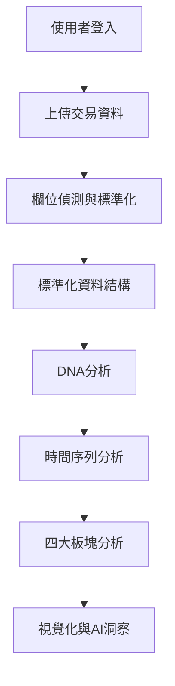

# VitalSigns Premium 精準行銷平台 - 完整技術文件

## 目錄
1. [系統總覽](#系統總覽)
2. [應用程式架構](#應用程式架構)
3. [模組詳細規格](#模組詳細規格)
4. [資料流程與變數定義](#資料流程與變數定義)
5. [關鍵函數與演算法](#關鍵函數與演算法)
6. [資料庫架構](#資料庫架構)
7. [API 整合規格](#api-整合規格)
8. [部署與維護](#部署與維護)

---

## 系統總覽

### 應用程式定義
VitalSigns Premium 是一個基於 R Shiny 和 bs4Dash 框架開發的精準行銷分析平台，專門為品牌提供客戶行為分析、價值評估和行銷策略建議。

### 核心技術堆疊
```yaml
前端框架:
  - R Shiny v1.7+
  - bs4Dash (Bootstrap 4)
  - DT (DataTables)
  - Plotly (互動式圖表)
  - shinyjs (JavaScript 整合)

後端技術:
  - R 4.0+
  - dplyr/tidyverse (資料處理)
  - DBI/RPostgres (資料庫)
  - httr/jsonlite (API 整合)
  - bcrypt (密碼加密)

資料庫:
  - PostgreSQL (生產環境)
  - 支援 JSONB 儲存格式

AI 整合:
  - OpenAI GPT-4o-mini
  - 自訂 chat_api 函數介面
```

---

## 應用程式架構

### 主程式結構 (app.R)

```r
# 應用程式入口點架構
app.R
├── 系統初始化區塊
│   ├── source("config/packages.R")        # 套件管理
│   ├── source("config/config.R")          # 系統配置
│   ├── initialize_packages()              # 套件初始化
│   └── validate_config()                  # 配置驗證
│
├── 資料庫連接區塊
│   ├── source("database/db_connection_lazy.R")  # 延遲載入
│   ├── auth_con <- get_auth_connection()        # 認證連接
│   └── con_global <- reactive({ get_con() })    # 完整連接
│
├── 模組載入區塊
│   ├── 核心模組
│   │   ├── module_login_optimized.R       # 登入模組
│   │   ├── module_upload.R                # 上傳模組
│   │   └── module_dna_multi_optimized.R   # DNA分析模組
│   │
│   ├── 四大板塊模組
│   │   ├── module_revenue_pulse.R         # 營收脈能
│   │   ├── module_customer_acquisition.R  # 客戶增長
│   │   ├── module_customer_retention_new.R # 客戶留存
│   │   └── module_engagement_flow.R       # 活躍轉化
│   │
│   └── 支援模組
│       ├── module_time_series_analysis.R  # 時間序列
│       └── module_wo_b.R                  # 策略分析
│
├── UI 定義區塊
│   ├── 條件式 UI (登入前/後)
│   ├── bs4DashPage 結構
│   └── 資源路徑設定
│
└── Server 邏輯區塊
    ├── Reactive Values 管理
    ├── 模組初始化與串接
    └── Session 管理
```

### UI 層級結構

```r
ui <- fluidPage(
  useShinyjs(),                           # JavaScript 功能啟用
  
  # 條件式渲染
  conditionalPanel(
    condition = "output.user_logged_in == false",
    loginModuleUI("login_optimized")     # 登入介面
  ),
  
  conditionalPanel(
    condition = "output.user_logged_in == true",
    bs4DashPage(                          # 主應用介面
      header = bs4DashNavbar(...),       # 頂部導航
      sidebar = bs4DashSidebar(...),     # 側邊選單
      body = bs4DashBody(                # 主內容區
        bs4TabItems(...)                  # 分頁內容
      ),
      footer = bs4DashFooter(...)        # 頁尾
    )
  )
)
```

### Server 資料流架構

```r
server <- function(input, output, session) {
  # 1. 認證層
  login_result <- loginModuleServer("login_optimized", auth_con)
  
  # 2. 資料庫連接層 (Reactive)
  con_global <- reactive({
    if (login_result$logged_in()) get_con() else NULL
  })
  
  # 3. 全域 Reactive Values
  sales_data <- reactiveVal(NULL)        # 銷售資料儲存
  user_info <- reactive(login_result$user_info())
  
  # 4. 模組串接層
  # 上傳 → DNA分析 → 時間序列 → 四大板塊
  
  # 5. 輸出層
  output$user_logged_in <- reactive(login_result$logged_in())
  output$db_status <- renderUI(...)
  output$welcome_user <- renderText(...)
}
```

---

## 模組詳細規格

### 1. 登入模組 (module_login_optimized.R)

#### UI 函數
```r
loginModuleUI(id)
```

#### Server 函數
```r
loginModuleServer(id, auth_connection)
├── 輸入參數:
│   ├── id: 模組命名空間ID
│   └── auth_connection: DBI連接物件 (認證資料庫)
│
├── 內部 Reactive Values:
│   ├── user_logged_in: 登入狀態 (TRUE/FALSE)
│   ├── user_info: list(id, username, role, login_count)
│   └── login_attempts: 登入嘗試次數
│
├── 主要功能:
│   ├── 密碼驗證 (bcrypt)
│   ├── Session 管理
│   └── 角色權限判斷
│
└── 輸出物件:
    ├── logged_in(): reactive(TRUE/FALSE)
    └── user_info(): reactive(list)
```

### 2. 上傳模組 (module_upload.R)

#### UI 函數
```r
uploadModuleUI(id, enable_hints = TRUE)
```

#### Server 函數
```r
uploadModuleServer(id, con, user_info, enable_hints = TRUE)
├── 輸入參數:
│   ├── id: 模組命名空間ID
│   ├── con: reactive(DBI連接)
│   ├── user_info: reactive(使用者資訊)
│   └── enable_hints: 是否啟用提示系統
│
├── 核心函數:
│   ├── detect_fields(df): 自動偵測欄位
│   │   ├── 客戶ID偵測優先順序:
│   │   │   ├── Email: buyer email, buyer_email, email
│   │   │   └── ID: customer_id, customer, buyer_id, user_id
│   │   ├── 時間欄位: purchase date, payments date, payment_time
│   │   └── 金額欄位: item price, lineitem_price, amount
│   │
│   └── 標準化轉換:
│       ├── customer_id ← 客戶識別欄位
│       ├── payment_time ← 交易時間欄位
│       └── lineitem_price ← 交易金額欄位
│
├── 內部處理流程:
│   ├── 1. 檔案讀取 (CSV/Excel)
│   ├── 2. 多檔案合併
│   ├── 3. 欄位偵測與標準化
│   ├── 4. 資料清理 (移除NA)
│   └── 5. JSON格式儲存至資料庫
│
└── 輸出物件:
    ├── dna_data(): reactive(data.frame) - 標準化交易資料
    └── proceed_step(): reactive(numeric) - 步驟切換觸發器
```

### 3. DNA 分析模組 (module_dna_multi_optimized.R)

#### UI 函數
```r
dnaMultiModuleUI(id, enable_hints = TRUE)
```

#### Server 函數
```r
dnaMultiModuleServer(id, con, user_info, uploaded_dna_data, 
                     chat_api, enable_hints, enable_prompts)
├── 輸入參數:
│   ├── id: 模組命名空間ID
│   ├── con: reactive(DBI連接)
│   ├── user_info: reactive(使用者資訊)
│   ├── uploaded_dna_data: reactive(標準化交易資料)
│   ├── chat_api: OpenAI API函數
│   ├── enable_hints: 啟用提示系統
│   └── enable_prompts: 啟用AI提示
│
├── 內部變數與參數:
│   ├── min_transactions: 最少交易次數門檻 (預設: 2)
│   ├── delta_factor: 時間折扣因子 (預設: 0.1)
│   └── global_params: list(
│       ├── delta: 0.1
│       ├── ni_threshold: 2
│       ├── cai_breaks: c(0, 0.1, 0.9, 1)
│       ├── f_breaks: c(-0.0001, 1.1, 2.1, Inf)
│       ├── r_breaks: c(-0.0001, 0.1, 0.9, 1.0001)
│       └── m_breaks: c(-0.0001, 0.1, 0.9, 1.0001)
│       )
│
├── 核心分析函數:
│   └── analysis_dna(df_sales_by_customer, 
│                     df_sales_by_customer_by_date,
│                     global_params)
│       ├── 計算 RFM 指標
│       ├── 計算 CAI (客戶活躍度)
│       ├── 計算 CLV (客戶終生價值)
│       ├── 計算 NES 狀態分類
│       └── 計算預測指標
│
└── 輸出物件:
    ├── analysis_result(): DNA分析完整結果
    ├── customer_data(): 客戶層級資料
    ├── summary_stats(): 統計摘要
    └── segments_data(): 分群結果
```

### 4. 營收脈能模組 (module_revenue_pulse.R)

#### Server 函數
```r
revenuePulseModuleServer(id, con, user_info, dna_module_result, 
                        time_series_data, enable_hints, enable_gpt, chat_api)
├── 輸入參數:
│   ├── dna_module_result: DNA分析結果
│   └── time_series_data: 時間序列資料
│
├── 計算指標:
│   ├── total_revenue: 總銷售額
│   ├── arpu: 人均購買金額
│   ├── new_customer_aov: 新客單價
│   ├── loyal_customer_aov: 主力客單價
│   ├── avg_clv: 平均CLV
│   └── transaction_stability: 交易穩定度
│
└── 視覺化輸出:
    ├── CLV分群圓餅圖
    ├── 月度收入趨勢圖
    └── AI洞察分析文字
```

### 5. 客戶增長模組 (module_customer_acquisition.R)

#### Server 函數
```r
customerAcquisitionModuleServer(id, con, user_info, dna_module_result,
                                time_series_data, enable_hints, enable_gpt, chat_api)
├── 計算指標:
│   ├── total_customers: 顧客總數
│   ├── cumulative_customers: 累積顧客數
│   ├── new_customer_rate: 新增率
│   ├── customer_structure: NES狀態分布
│   └── acquisition_funnel: 獲客漏斗
│
└── 視覺化輸出:
    ├── 客戶增長趨勢圖
    ├── 客戶結構圓餅圖
    └── 獲客漏斗圖
```

### 6. 客戶留存模組 (module_customer_retention_new.R)

#### Server 函數
```r
customerRetentionModuleServer(id, con, user_info, dna_module_result,
                             enable_hints, enable_gpt, chat_api)
├── 計算指標:
│   ├── retention_rate: 留存率
│   ├── churn_rate: 流失率
│   ├── at_risk_customers: 風險客戶數
│   ├── nes_distribution: 狀態分布
│   └── rfm_segments: RFM分群
│
└── 視覺化輸出:
    ├── RFM熱力圖
    ├── 狀態分布圖
    └── 流失預測分析
```

### 7. 活躍轉化模組 (module_engagement_flow.R)

#### Server 函數
```r
engagementFlowModuleServer(id, con, user_info, dna_module_result,
                          enable_hints, enable_gpt, chat_api)
├── 計算指標:
│   ├── avg_cai: 平均客戶活躍度
│   ├── repurchase_rate: 再購率
│   ├── avg_frequency: 平均購買頻率
│   ├── avg_cycle: 平均購買週期
│   └── conversion_rate: 轉化率
│
└── 視覺化輸出:
    ├── CAI數值顯示 (平均值)
    ├── 購買頻率散佈圖
    └── 轉化漏斗圖
```

### 8. 時間序列分析模組 (module_time_series_analysis.R)

#### Server 函數
```r
timeSeriesAnalysisServer(id, raw_data)
├── 輸入參數:
│   └── raw_data: reactive(原始交易資料)
│
├── 聚合功能:
│   ├── aggregate_time_series(data, period)
│   │   ├── period: "day", "week", "month", "quarter", "year"
│   │   └── 輸出: revenue, customers, transactions
│   │
│   └── calculate_trend(time_series_data)
│       ├── growth_rate: 成長率
│       ├── moving_average: 移動平均
│       └── yoy_growth: 年同比
│
└── 輸出物件:
    ├── daily_data(): 日度聚合
    ├── weekly_data(): 週度聚合
    ├── monthly_data(): 月度聚合
    ├── quarterly_data(): 季度聚合
    └── yearly_data(): 年度聚合
```

---

## 資料流程與變數定義

### 主要資料流程



### 標準化資料結構

```r
# 上傳模組輸出的標準化資料結構
standardized_data <- data.frame(
  customer_id = character(),      # 客戶唯一識別碼
  payment_time = POSIXct(),       # 交易時間 (datetime)
  lineitem_price = numeric(),     # 交易金額
  source_file = character()       # 來源檔案名稱
)
```

### DNA 分析輸出結構

```r
# analysis_dna() 函數輸出結構
dna_results <- list(
  data_by_customer = data.frame(
    customer_id = numeric(),       # 客戶ID
    
    # RFM 核心指標
    r_value = numeric(),          # Recency: 最近購買距今天數
    f_value = numeric(),          # Frequency: 總購買次數
    m_value = numeric(),          # Monetary: 平均單次消費
    
    # 進階指標
    ipt_mean = numeric(),         # Inter-Purchase Time: 平均購買週期
    cai_value = numeric(),        # Customer Activity Index: 活躍度 (0-1)
    clv = numeric(),              # Customer Lifetime Value: 終生價值
    pcv = numeric(),              # Past Customer Value: 過去價值
    cri = numeric(),              # Customer Regularity Index: 規律性
    
    # NES 分類
    nes_status = character(),     # N/E0/S1/S2/S3 狀態
    nes_ratio = numeric(),        # NES 比率
    
    # 預測指標
    nrec = character(),           # 流失預測 (rec/nrec)
    nrec_prob = numeric(),        # 流失機率 (0-1)
    
    # 統計資料
    total_spent = numeric(),      # 總消費金額
    times = integer(),            # 交易次數
    first_purchase = POSIXct(),   # 首次購買時間
    last_purchase = POSIXct()     # 最後購買時間
  ),
  
  segment_summary = data.frame(   # 分群統計摘要
    segment = character(),
    count = integer(),
    percentage = numeric()
  ),
  
  model_params = list(            # 模型參數
    delta = numeric(),
    ni_threshold = integer(),
    breaks = list()
  )
)
```

### NES 狀態定義

```r
# NES (New-Existing-Sleeping) 客戶狀態分類
nes_status_definitions <- list(
  "N" = "新客戶 (New): 首購客戶，只有一次交易",
  "E0" = "主力客戶 (Existing): 活躍客戶，nes_ratio <= 1.7",
  "S1" = "瞌睡客戶 (Sleepy 1): 輕度休眠，1.7 < nes_ratio <= 3.4",
  "S2" = "半睡客戶 (Sleepy 2): 中度休眠，3.4 < nes_ratio <= 5.1",
  "S3" = "沉睡客戶 (Sleepy 3): 深度休眠，nes_ratio > 5.1"
)

# NES Ratio 計算公式
nes_ratio = time_since_last_purchase / average_interpurchase_time
```

---

## 關鍵函數與演算法

### 1. RFM 指標計算

```r
# Recency 計算
r_value = as.numeric(difftime(Sys.time(), last_payment_time, units = "days"))

# Frequency 計算
f_value = n_distinct(transaction_dates)  # 或 count(transactions)

# Monetary 計算
m_value = sum(lineitem_price) / count(transactions)
```

### 2. CAI (Customer Activity Index) 計算

```r
# CAI 反映客戶活躍度變化趨勢
calculate_cai <- function(interpurchase_times, weights) {
  # MLE: Maximum Likelihood Estimation
  mle = sum(interpurchase_times * (1/(length(interpurchase_times)-1)))
  
  # WMLE: Weighted MLE
  wmle = sum(interpurchase_times * weights / sum(weights))
  
  # CAI 計算
  cai = (mle - wmle) / mle
  
  # 值域: -1 到 1
  # > 0: 日益活躍 (購買間隔縮短)
  # = 0: 穩定
  # < 0: 逐漸不活躍 (購買間隔延長)
  
  return(cai)
}
```

### 3. CLV (Customer Lifetime Value) 計算

```r
# CLV 結合歷史價值與預測價值
calculate_clv <- function(customer_data, delta = 0.1) {
  # 歷史價值 (PCV)
  pcv = sum(transaction_amounts * (1 + delta)^(-time_differences))
  
  # 預測價值 (使用 BG/NBD 或 Pareto/NBD 模型)
  future_transactions = predict_future_transactions(customer_data)
  future_value = future_transactions * avg_transaction_value
  
  # CLV = PCV + 折現後的未來價值
  clv = pcv + future_value * discount_factor
  
  return(clv)
}
```

### 4. CRI (Customer Regularity Index) 計算

```r
# CRI 衡量客戶購買行為的規律性
calculate_cri <- function(r_value, f_value, m_value) {
  # 標準化到 0-1 區間
  r_norm = 1 - normalize_01(r_value)  # R值反向(越小越好)
  f_norm = normalize_01(f_value)
  m_norm = normalize_01(m_value)
  
  # 加權平均
  cri = 0.3 * r_norm + 0.3 * f_norm + 0.4 * m_norm
  
  return(cri)
}

# 輔助函數: 0-1 標準化
normalize_01 <- function(x) {
  (x - min(x, na.rm = TRUE)) / (max(x, na.rm = TRUE) - min(x, na.rm = TRUE))
}
```

### 5. 時間序列聚合

```r
# 通用時間序列聚合函數
aggregate_time_series <- function(data, period = "month") {
  library(lubridate)
  
  aggregated <- data %>%
    mutate(
      period = floor_date(payment_time, period)
    ) %>%
    group_by(period) %>%
    summarise(
      revenue = sum(lineitem_price, na.rm = TRUE),
      customers = n_distinct(customer_id),
      transactions = n(),
      avg_transaction_value = mean(lineitem_price, na.rm = TRUE),
      .groups = "drop"
    ) %>%
    arrange(period)
  
  # 計算成長率
  aggregated <- aggregated %>%
    mutate(
      revenue_growth = (revenue - lag(revenue)) / lag(revenue) * 100,
      customer_growth = (customers - lag(customers)) / lag(customers) * 100
    )
  
  return(aggregated)
}
```

---

## 資料庫架構

### 資料表結構

```sql
-- 使用者表
CREATE TABLE users (
  id           SERIAL PRIMARY KEY,
  username     TEXT UNIQUE NOT NULL,
  hash         TEXT NOT NULL,          -- bcrypt 加密密碼
  role         TEXT DEFAULT 'user',    -- user/admin
  login_count  INTEGER DEFAULT 0,
  created_at   TIMESTAMPTZ DEFAULT now()
);

-- 原始資料表 (JSON 格式儲存)
CREATE TABLE rawdata (
  id           SERIAL PRIMARY KEY,
  user_id      INTEGER REFERENCES users(id),
  uploaded_at  TIMESTAMPTZ DEFAULT now(),
  json         JSONB NOT NULL          -- 儲存標準化交易資料
);

-- 處理後資料表
CREATE TABLE processed_data (
  id            SERIAL PRIMARY KEY,
  user_id       INTEGER REFERENCES users(id),
  processed_at  TIMESTAMPTZ DEFAULT now(),
  json          JSONB NOT NULL         -- 儲存 DNA 分析結果
);

-- 銷售資料表
CREATE TABLE salesdata (
  id           SERIAL PRIMARY KEY,
  user_id      INTEGER REFERENCES users(id),
  uploaded_at  TIMESTAMPTZ DEFAULT now(),
  json         JSONB NOT NULL
);
```

### 資料庫連接管理

```r
# 延遲載入策略
# 1. 認證階段: 僅連接 users 表
auth_con <- get_auth_connection()

# 2. 登入成功後: 建立完整連接
con_global <- reactive({
  if (logged_in()) get_con() else NULL
})

# 3. 連接資訊結構
db_info <- list(
  type = "PostgreSQL",
  host = Sys.getenv("PGHOST"),
  port = Sys.getenv("PGPORT"),
  dbname = Sys.getenv("PGDATABASE"),
  icon = "🐘",
  color = "#336791",
  status = "正式環境"
)
```

---

## API 整合規格

### OpenAI API 整合

```r
# chat_api 函數定義
chat_api <- function(messages, 
                     model = "gpt-4o-mini",
                     api_key = Sys.getenv("OPENAI_API_KEY"),
                     timeout_sec = 60) {
  
  # API 請求結構
  body <- list(
    model = model,
    messages = messages,
    temperature = 0.3,      # 低溫度確保穩定輸出
    max_tokens = 500        # 控制回應長度
  )
  
  # HTTP POST 請求
  response <- httr::POST(
    url = "https://api.openai.com/v1/chat/completions",
    httr::add_headers(
      "Authorization" = paste("Bearer", api_key),
      "Content-Type" = "application/json"
    ),
    body = jsonlite::toJSON(body, auto_unbox = TRUE),
    httr::timeout(timeout_sec)
  )
  
  # 解析回應
  content <- httr::content(response, as = "text", encoding = "UTF-8")
  result <- jsonlite::fromJSON(content)
  
  return(result$choices[[1]]$message$content)
}
```

### Prompt 管理系統

```r
# database/prompt.csv 結構
prompts <- data.frame(
  module = character(),        # 模組名稱
  analysis_type = character(), # 分析類型
  prompt_text = character(),   # 完整提示文本
  updated_at = POSIXct()       # 更新時間
)

# 取得提示函數
get_prompt <- function(module_name, analysis_type) {
  prompts %>%
    filter(module == module_name, 
           analysis_type == analysis_type) %>%
    pull(prompt_text)
}
```

### Hint 系統

```r
# database/hint.csv 結構
hints <- data.frame(
  module_name = character(),   # 模組名稱
  hint_id = character(),       # 提示ID
  title = character(),         # 提示標題
  content = character(),       # HTML 內容
  category = character(),      # 分類
  order = integer(),           # 顯示順序
  active = logical()           # 是否啟用
)

# 渲染提示面板
render_hint_panel <- function(module_name, ns) {
  hints %>%
    filter(module_name == module_name, active == TRUE) %>%
    arrange(order) %>%
    # 生成 HTML 面板
}
```

---

## 部署與維護

### 環境變數配置

```bash
# PostgreSQL 資料庫配置
export PGHOST="your-db-host"
export PGPORT="5432"
export PGUSER="your-username"
export PGPASSWORD="your-password"
export PGDATABASE="your-database"
export PGSSLMODE="require"

# OpenAI API 配置
export OPENAI_API_KEY="your-api-key"
```

### 部署檢查清單

```yaml
部署前檢查:
  - [ ] 環境變數設定完整
  - [ ] 資料庫連接測試通過
  - [ ] 所有套件版本相容
  - [ ] manifest.json 更新
  - [ ] 測試帳號已創建

部署步驟:
  1. 推送程式碼至 Git
  2. 在 Posit Connect 創建應用
  3. 設定環境變數
  4. 部署 manifest.json
  5. 測試所有功能

部署後驗證:
  - [ ] 登入功能正常
  - [ ] 資料上傳成功
  - [ ] DNA 分析執行正確
  - [ ] 四大板塊顯示正常
  - [ ] AI 分析回應正確
```

### 效能優化建議

```r
# 1. 使用延遲載入
con <- reactive({ if(needed()) get_connection() })

# 2. 快取計算結果
results <- memoise::memoise(expensive_calculation)

# 3. 使用 data.table 處理大數據
dt <- data.table::as.data.table(large_dataset)

# 4. 並行處理
future::plan(multisession)
results <- furrr::future_map(data_chunks, process_chunk)

# 5. 資料分頁
DT::renderDataTable(data, options = list(pageLength = 25))
```

### 監控與日誌

```r
# 效能監控
system.time({
  # 耗時操作
})

# 錯誤日誌
tryCatch({
  # 風險操作
}, error = function(e) {
  log_error(paste("Error:", e$message))
})

# 使用者活動追蹤
log_user_action <- function(user_id, action, details) {
  dbExecute(con, 
    "INSERT INTO user_logs (user_id, action, details, timestamp) 
     VALUES (?, ?, ?, ?)",
    list(user_id, action, details, Sys.time())
  )
}
```

---

## 故障排除指南

### 常見問題與解決方案

#### 1. 資料上傳問題
```r
問題: 欄位偵測失敗
解決: 
- 檢查欄位名稱是否符合偵測模式
- 確認資料編碼 (UTF-8)
- 手動指定欄位對應

問題: 檔案大小限制
解決:
options(shiny.maxRequestSize = 200*1024^2)  # 200MB
```

#### 2. DNA 分析錯誤
```r
問題: 最少交易次數不足
解決:
- 調整 ni_threshold 參數
- 檢查資料完整性

問題: 記憶體不足
解決:
- 使用資料分批處理
- 增加伺服器記憶體配置
```

#### 3. API 連接問題
```r
問題: OpenAI API 逾時
解決:
- 增加 timeout_sec 參數
- 檢查網路連接
- 驗證 API key 有效性

問題: Rate limit 錯誤
解決:
- 實施請求限流
- 使用指數退避重試
```

---

## 聯絡資訊

**技術支援**: partners@peakedges.com  
**開發團隊**: 祈鋒行銷科技有限公司

---

*文件版本: v3.0*  
*最後更新: 2024-12-27*  
*此文件提供完整的技術規格，確保開發團隊能完全理解和維護 VitalSigns Premium 平台*