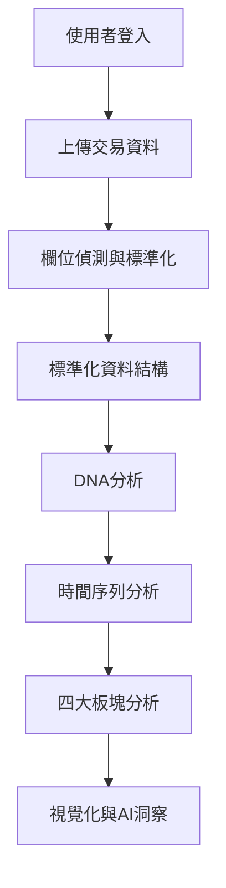

# VitalSigns Premium 完整技術文件 (整合版)

## 目錄
1. [系統總覽](#系統總覽)
2. [應用程式架構](#應用程式架構)
3. [核心模組詳細規格](#核心模組詳細規格)
4. [四大板塊功能模組](#四大板塊功能模組)
5. [資料流程與變數定義](#資料流程與變數定義)
6. [關鍵函數與演算法](#關鍵函數與演算法)
7. [資料庫架構](#資料庫架構)
8. [API整合規格](#api整合規格)
9. [UI/UX設計規範](#uiux設計規範)
10. [安全性與認證](#安全性與認證)
11. [部署與維護](#部署與維護)
12. [使用指南](#使用指南)
13. [故障排除與效能優化](#故障排除與效能優化)
14. [版本歷史](#版本歷史)

---

## 系統總覽

### 應用程式定義
VitalSigns Premium 是一個基於 R Shiny 和 bs4Dash 框架開發的精準行銷分析平台，專門為品牌提供客戶行為分析、價值評估和 AI 驅動的行銷策略建議。平台整合 NLP、推薦系統與自動化分析，以及統計和行銷理論。

### 核心技術堆疊
```yaml
前端框架:
  - R Shiny v1.7+
  - bs4Dash (Bootstrap 4)
  - DT (DataTables)
  - Plotly (互動式圖表)
  - shinyjs (JavaScript 整合)
  - shinycssloaders (載入動畫)

後端技術:
  - R 4.0+
  - dplyr/tidyverse (資料處理)
  - data.table (大數據處理)
  - DBI/RPostgres (資料庫)
  - httr/jsonlite (API 整合)
  - bcrypt (密碼加密)
  - future/furrr (並行處理)

資料庫:
  - PostgreSQL (生產環境)
  - 支援 JSONB 儲存格式
  - 自動建表機制

AI整合:
  - OpenAI GPT-4 / GPT-4o-mini
  - 自訂 chat_api 函數介面
  - 集中化提示詞管理系統
```

### 主要特色
- **AI驅動的客戶DNA分析**：運用 RFM 分析與進階演算法深入了解客戶行為
- **五大客戶分群精準定位**：N(新客)、E0(主力客)、S1(瞌睡客)、S2(半睡客)、S3(沉睡客)
- **多檔案批次處理**：支援 Amazon 銷售報告與一般交易記錄的自動合併
- **智慧欄位偵測**：自動識別客戶ID、時間、金額等關鍵欄位
- **四大板塊分析儀表板**：營收脈能、客戶增長、客戶留存、活躍轉化
- **模組化架構**：遵循 257+ 條原則的嚴謹開發框架

---

## 應用程式架構

### 主程式結構 (app.R)

```r
app.R (版本: v18, bs4Dash架構)
├── 系統初始化區塊
│   ├── source("config/packages.R")        # 套件管理
│   ├── source("config/config.R")          # 系統配置
│   ├── initialize_packages()              # 套件初始化
│   └── validate_config()                  # 配置驗證
│
├── 資料庫連接區塊
│   ├── source("database/db_connection_lazy.R")  # 延遲載入
│   ├── auth_con <- get_auth_connection()        # 認證連接
│   └── con_global <- reactive({ get_con() })    # 完整連接
│
├── 模組載入區塊
│   ├── 核心模組
│   │   ├── module_login_optimized.R       # 登入模組
│   │   ├── module_upload.R                # 上傳模組
│   │   └── module_dna_multi_optimized.R   # DNA分析模組
│   │
│   ├── 四大板塊模組
│   │   ├── module_revenue_pulse.R         # 營收脈能
│   │   ├── module_customer_acquisition.R  # 客戶增長
│   │   ├── module_customer_retention_new.R # 客戶留存
│   │   └── module_engagement_flow.R       # 活躍轉化
│   │
│   └── 支援模組
│       ├── module_time_series_analysis.R  # 時間序列
│       ├── module_wo_b.R                  # 策略分析
│       └── utils/ai_analysis_manager.R    # AI分析管理
│
├── UI定義區塊
│   ├── 條件式UI (登入前/後)
│   ├── bs4DashPage結構
│   └── 資源路徑設定
│
└── Server邏輯區塊
    ├── Reactive Values管理
    ├── 模組初始化與串接
    └── Session管理
```

### UI層級結構

```r
ui <- fluidPage(
  useShinyjs(),                           # JavaScript功能啟用
  
  # 條件式渲染
  conditionalPanel(
    condition = "output.user_logged_in == false",
    loginModuleUI("login_optimized")     # 登入介面
  ),
  
  conditionalPanel(
    condition = "output.user_logged_in == true",
    bs4DashPage(                          # 主應用介面
      header = bs4DashNavbar(
        title = "Vital Signs Premium",
        rightUi = list(
          uiOutput("db_status"),          # 資料庫狀態
          uiOutput("user_menu")           # 使用者選單
        )
      ),
      sidebar = bs4DashSidebar(
        歡迎訊息 (welcome_banner),
        步驟指示器 (step-indicator),
        選單項目:
          ├── 資料上傳 (upload)
          ├── 客戶DNA分析 (dna_analysis)
          ├── 營收脈能 (revenue_pulse)
          ├── 客戶增長 (customer_acquisition)
          ├── 客戶留存 (customer_retention)
          ├── 活躍轉化 (engagement_flow)
          └── 關於我們 (about)
      ),
      body = bs4DashBody(
        bs4TabItems(...)                  # 分頁內容
      ),
      footer = bs4DashFooter(...)         # 頁尾
    )
  )
)
```

### Server資料流架構

```r
server <- function(input, output, session) {
  # 1. 認證層
  login_result <- loginModuleServer("login_optimized", auth_con)
  
  # 2. 資料庫連接層 (Reactive)
  con_global <- reactive({
    if (login_result$logged_in()) get_con() else NULL
  })
  
  # 3. 全域Reactive Values
  sales_data <- reactiveVal(NULL)        # 銷售資料儲存
  user_info <- reactive(login_result$user_info())
  
  # 4. 模組串接層 (上傳→DNA分析→時間序列→四大板塊)
  upload_mod <- uploadModuleServer("upload1", con_global, user_info)
  dna_mod <- dnaMultiModuleServer("dna_multi1", con_global, user_info, 
                                  upload_mod$dna_data, chat_api)
  time_series_mod <- timeSeriesAnalysisServer("time_series", 
                                             raw_data = upload_mod$dna_data)
  
  # 5. 四大板塊模組初始化
  revenue_mod <- revenuePulseModuleServer(...)
  acquisition_mod <- customerAcquisitionModuleServer(...)
  retention_mod <- customerRetentionModuleServer(...)
  engagement_mod <- engagementFlowModuleServer(...)
  
  # 6. 輸出層
  output$user_logged_in <- reactive(login_result$logged_in())
  output$db_status <- renderUI(...)
  output$welcome_user <- renderText(...)
}
```

### 檔案結構

```
VitalSigns_premium/
├── app.R                                 # 主應用程式
├── config/
│   ├── config.R                         # 系統配置
│   └── packages.R                       # 套件管理
├── modules/
│   ├── module_upload.R                  # 資料上傳模組
│   ├── module_dna_multi_optimized.R     # DNA分析模組
│   ├── module_wo_b.R                    # 策略分析模組
│   ├── module_login_optimized.R         # 登入認證模組
│   ├── module_revenue_pulse.R           # 營收脈能模組
│   ├── module_customer_acquisition.R    # 客戶增長模組
│   ├── module_customer_retention_new.R  # 客戶留存模組
│   ├── module_engagement_flow.R         # 活躍轉化模組
│   └── module_time_series_analysis.R    # 時間序列分析模組
├── database/
│   ├── db_connection_lazy.R             # 資料庫連接管理
│   ├── prompt.csv                       # AI提示詞庫
│   └── hint.csv                         # 使用者提示系統
├── utils/
│   ├── data_loader.R                    # 資料載入工具
│   ├── ai_analysis_manager.R            # AI分析管理器
│   ├── prompt_manager.R                 # 提示詞管理
│   ├── hint_system.R                    # 提示系統
│   ├── reactive_loading.R               # 載入動畫
│   └── loading_animation.R              # 動畫效果
├── www/                                 # 靜態資源
├── documents/                           # 專案文件
└── tests/                               # 測試檔案
```

---

## 核心模組詳細規格

### 1. 登入模組 (module_login_optimized.R)

#### UI函數
```r
loginModuleUI(id)
```

#### Server函數
```r
loginModuleServer(id, auth_connection)
├── 輸入參數:
│   ├── id: 模組命名空間ID
│   └── auth_connection: DBI連接物件 (認證資料庫)
│
├── 內部Reactive Values:
│   ├── user_logged_in: 登入狀態 (TRUE/FALSE)
│   ├── user_info: list(id, username, role, login_count)
│   └── login_attempts: 登入嘗試次數
│
├── 主要功能:
│   ├── 密碼驗證 (bcrypt)
│   ├── Session管理
│   └── 角色權限判斷
│
└── 輸出物件:
    ├── logged_in(): reactive(TRUE/FALSE)
    └── user_info(): reactive(list)
```

### 2. 上傳模組 (module_upload.R)

#### UI函數
```r
uploadModuleUI(id, enable_hints = TRUE)
```

#### Server函數
```r
uploadModuleServer(id, con, user_info, enable_hints = TRUE)
├── 輸入參數:
│   ├── id: 模組命名空間ID
│   ├── con: reactive(DBI連接)
│   ├── user_info: reactive(使用者資訊)
│   └── enable_hints: 是否啟用提示系統
│
├── 核心函數:
│   ├── detect_fields(df): 自動偵測欄位
│   │   ├── 客戶ID偵測優先順序:
│   │   │   ├── Email: buyer email, buyer_email, email
│   │   │   └── ID: customer_id, customer, buyer_id, user_id
│   │   ├── 時間欄位: purchase date, payments date, payment_time
│   │   └── 金額欄位: item price, lineitem_price, amount
│   │
│   └── 標準化轉換:
│       ├── customer_id ← 客戶識別欄位
│       ├── payment_time ← 交易時間欄位
│       └── lineitem_price ← 交易金額欄位
│
├── 內部處理流程:
│   ├── 1. 檔案讀取 (CSV/Excel)
│   ├── 2. 多檔案合併
│   ├── 3. 欄位偵測與標準化
│   ├── 4. 資料清理 (移除NA)
│   └── 5. JSON格式儲存至資料庫
│
└── 輸出物件:
    ├── dna_data(): reactive(data.frame) - 標準化交易資料
    └── proceed_step(): reactive(numeric) - 步驟切換觸發器
```

### 3. DNA分析模組 (module_dna_multi_optimized.R)

#### UI函數
```r
dnaMultiModuleUI(id, enable_hints = TRUE)
```

#### Server函數
```r
dnaMultiModuleServer(id, con, user_info, uploaded_dna_data, 
                     chat_api, enable_hints, enable_prompts)
├── 輸入參數:
│   ├── id: 模組命名空間ID
│   ├── con: reactive(DBI連接)
│   ├── user_info: reactive(使用者資訊)
│   ├── uploaded_dna_data: reactive(標準化交易資料)
│   ├── chat_api: OpenAI API函數
│   ├── enable_hints: 啟用提示系統
│   └── enable_prompts: 啟用AI提示
│
├── 內部變數與參數:
│   ├── min_transactions: 最少交易次數門檻 (預設: 2)
│   ├── delta_factor: 時間折扣因子 (預設: 0.1)
│   └── global_params: list(
│       ├── delta: 0.1
│       ├── ni_threshold: 2
│       ├── cai_breaks: c(0, 0.1, 0.9, 1)
│       ├── f_breaks: c(-0.0001, 1.1, 2.1, Inf)
│       ├── r_breaks: c(-0.0001, 0.1, 0.9, 1.0001)
│       └── m_breaks: c(-0.0001, 0.1, 0.9, 1.0001)
│       )
│
├── 核心分析函數:
│   └── analysis_dna(df_sales_by_customer, 
│                     df_sales_by_customer_by_date,
│                     global_params)
│       ├── 計算RFM指標
│       ├── 計算CAI (客戶活躍度)
│       ├── 計算CLV (客戶終生價值)
│       ├── 計算NES狀態分類
│       └── 計算預測指標
│
└── 輸出物件:
    ├── analysis_result(): DNA分析完整結果
    ├── customer_data(): 客戶層級資料
    ├── summary_stats(): 統計摘要
    └── segments_data(): 分群結果
```

---

## 四大板塊功能模組

### 1. 營收脈能模組 (module_revenue_pulse.R)

**用途**: 量化收入規模、單客價值與獲利韌性

#### Server函數
```r
revenuePulseModuleServer(id, con, user_info, dna_module_result, 
                        time_series_data, enable_hints, enable_gpt, chat_api)
├── 輸入參數:
│   ├── dna_module_result: DNA分析結果
│   └── time_series_data: 時間序列資料
│
├── 計算指標:
│   ├── total_revenue: 總銷售額
│   ├── arpu: 人均購買金額
│   ├── new_customer_aov: 新客單價
│   ├── loyal_customer_aov: 主力客單價
│   ├── avg_clv: 平均CLV
│   └── transaction_stability: 交易穩定度
│
└── 視覺化輸出:
    ├── CLV分群圓餅圖
    ├── 月度收入趨勢圖
    └── AI洞察分析文字
```

### 2. 客戶增長模組 (module_customer_acquisition.R)

**用途**: 監測客戶池擴張速度與結構健康

#### Server函數
```r
customerAcquisitionModuleServer(id, con, user_info, dna_module_result,
                                time_series_data, enable_hints, enable_gpt, chat_api)
├── 計算指標:
│   ├── total_customers: 顧客總數
│   ├── cumulative_customers: 累積顧客數
│   ├── new_customer_rate: 新增率
│   ├── customer_structure: NES狀態分布
│   └── acquisition_funnel: 獲客漏斗
│
└── 視覺化輸出:
    ├── 客戶增長趨勢圖
    ├── 客戶結構圓餅圖
    └── 獲客漏斗圖
```

### 3. 客戶留存模組 (module_customer_retention_new.R)

**用途**: 衡量基盤穩定度與流失風險，提供五大客群精準策略

#### UI函數
```r
customerRetentionUI(id)
├── 側邊欄控制面板:
│   ├── 日期範圍選擇器
│   ├── 客戶篩選器
│   └── 分析參數設定
│
└── 主要內容區:
    ├── 關鍵指標卡片 (valueBoxes)
    ├── 客戶分群圖表 (plotlyOutput)
    └── AI智能分析與建議 (tabsetPanel):
        ├── 首購客引導 (N)
        ├── 主力客深化 (E0)
        ├── 瞌睡客喚醒 (S1)
        ├── 半睡客挽留 (S2)
        └── 沉睡客召回 (S3)
```

#### Server函數
```r
customerRetentionModuleServer(id, con, user_info, dna_module_result,
                             enable_hints, enable_gpt, chat_api)
├── 計算指標:
│   ├── retention_rate: 留存率
│   ├── churn_rate: 流失率
│   ├── at_risk_customers: 風險客戶數
│   ├── nes_distribution: 狀態分布
│   └── rfm_segments: RFM分群
│
├── AI分析輸出 (五大客群):
│   ├── output$ai_new_customer: 首購客引導策略
│   ├── output$ai_core_customer: 主力客深化策略
│   ├── output$ai_drowsy_customer: 瞌睡客喚醒策略
│   ├── output$ai_semi_dormant_customer: 半睡客挽留策略
│   └── output$ai_sleeping_customer: 沉睡客召回策略
│
└── 視覺化輸出:
    ├── RFM熱力圖
    ├── 狀態分布圖
    └── 流失預測分析
```

### 4. 活躍轉化模組 (module_engagement_flow.R)

**用途**: 掌握互動→再購→喚醒的節奏深度

#### Server函數
```r
engagementFlowModuleServer(id, con, user_info, dna_module_result,
                          enable_hints, enable_gpt, chat_api)
├── 計算指標:
│   ├── avg_cai: 平均客戶活躍度 (顯示格式: "+X.XX (平均)")
│   ├── repurchase_rate: 再購率
│   ├── avg_frequency: 平均購買頻率
│   ├── avg_cycle: 平均購買週期
│   └── conversion_rate: 轉化率
│
└── 視覺化輸出:
    ├── CAI數值顯示 (平均值)
    ├── 購買頻率散佈圖 (每點代表一客戶)
    └── 轉化漏斗圖
```

### 5. 時間序列分析模組 (module_time_series_analysis.R)

**用途**: 提供統一的時間序列數據處理接口

#### Server函數
```r
timeSeriesAnalysisServer(id, raw_data)
├── 輸入參數:
│   └── raw_data: reactive(原始交易資料)
│
├── 聚合功能:
│   ├── aggregate_time_series(data, period)
│   │   ├── period: "day", "week", "month", "quarter", "year"
│   │   └── 輸出: revenue, customers, transactions
│   │
│   └── calculate_trend(time_series_data)
│       ├── growth_rate: 成長率
│       ├── moving_average: 移動平均
│       └── yoy_growth: 年同比
│
└── 輸出物件:
    ├── daily_data(): 日度聚合
    ├── weekly_data(): 週度聚合
    ├── monthly_data(): 月度聚合
    ├── quarterly_data(): 季度聚合
    └── yearly_data(): 年度聚合
```

---

## 資料流程與變數定義

### 主要資料流程



### 標準化資料結構

```r
# 上傳模組輸出的標準化資料結構
standardized_data <- data.frame(
  customer_id = character(),      # 客戶唯一識別碼
  payment_time = POSIXct(),       # 交易時間 (datetime)
  lineitem_price = numeric(),     # 交易金額
  source_file = character()       # 來源檔案名稱
)
```

### DNA分析輸出結構

```r
# analysis_dna() 函數輸出結構
dna_results <- list(
  data_by_customer = data.frame(
    customer_id = numeric(),       # 客戶ID
    
    # RFM核心指標
    r_value = numeric(),          # Recency: 最近購買距今天數
    f_value = numeric(),          # Frequency: 總購買次數
    m_value = numeric(),          # Monetary: 平均單次消費
    
    # 進階指標
    ipt_mean = numeric(),         # Inter-Purchase Time: 平均購買週期
    cai_value = numeric(),        # Customer Activity Index: 活躍度 (0-1)
    clv = numeric(),              # Customer Lifetime Value: 終生價值
    pcv = numeric(),              # Past Customer Value: 過去價值
    cri = numeric(),              # Customer Regularity Index: 規律性
    
    # NES分類
    nes_status = character(),     # N/E0/S1/S2/S3狀態
    nes_ratio = numeric(),        # NES比率
    
    # 預測指標
    nrec = character(),           # 流失預測 (rec/nrec)
    nrec_prob = numeric(),        # 流失機率 (0-1)
    
    # 統計資料
    total_spent = numeric(),      # 總消費金額
    times = integer(),            # 交易次數
    first_purchase = POSIXct(),   # 首次購買時間
    last_purchase = POSIXct()     # 最後購買時間
  ),
  
  segment_summary = data.frame(   # 分群統計摘要
    segment = character(),
    count = integer(),
    percentage = numeric()
  ),
  
  model_params = list(            # 模型參數
    delta = numeric(),
    ni_threshold = integer(),
    breaks = list()
  )
)
```

### NES狀態定義

```r
# NES (New-Existing-Sleeping) 客戶狀態分類
nes_status_definitions <- list(
  "N" = list(
    name = "新客戶/首購客 (New)",
    description = "首次購買，只有一次交易",
    strategy = "引導二購、建立信任"
  ),
  "E0" = list(
    name = "主力客戶 (Core/Existing)",
    description = "活躍客戶，nes_ratio <= 1.7",
    strategy = "深化關係、提升價值"
  ),
  "S1" = list(
    name = "瞌睡客戶 (Drowsy)",
    description = "輕度休眠，1.7 < nes_ratio <= 3.4",
    strategy = "喚醒行動、預防流失"
  ),
  "S2" = list(
    name = "半睡客戶 (Semi-dormant)",
    description = "中度休眠，3.4 < nes_ratio <= 5.1",
    strategy = "緊急挽留、重建連結"
  ),
  "S3" = list(
    name = "沉睡客戶 (Sleeping)",
    description = "深度休眠，nes_ratio > 5.1",
    strategy = "召回策略、重新激活"
  )
)

# NES Ratio計算公式
nes_ratio = time_since_last_purchase / average_interpurchase_time
```

### 全域變數定義

```r
# 客戶分群定義
CUSTOMER_SEGMENTS <- list(
  new = "首購客",
  core = "主力客",
  drowsy = "瞌睡客",
  semi_dormant = "半睡客",
  sleeping = "沉睡客"
)

# RFM權重設定
RFM_WEIGHTS <- list(
  recency = 0.4,
  frequency = 0.3,
  monetary = 0.3
)

# 流失風險閾值
CHURN_THRESHOLDS <- list(
  high_risk = 60,    # 天數
  medium_risk = 30,
  low_risk = 15
)

# API配置
API_CONFIG <- list(
  model = "gpt-4",
  temperature = 0.7,
  max_tokens = 1000,
  timeout = 60
)
```

---

## 關鍵函數與演算法

### 1. RFM指標計算

```r
# Recency計算
r_value = as.numeric(difftime(Sys.time(), last_payment_time, units = "days"))

# Frequency計算
f_value = n_distinct(transaction_dates)  # 或 count(transactions)

# Monetary計算
m_value = sum(lineitem_price) / count(transactions)
```

### 2. CAI (Customer Activity Index) 計算

```r
# CAI反映客戶活躍度變化趨勢
calculate_cai <- function(interpurchase_times, weights) {
  # MLE: Maximum Likelihood Estimation
  mle = sum(interpurchase_times * (1/(length(interpurchase_times)-1)))
  
  # WMLE: Weighted MLE
  wmle = sum(interpurchase_times * weights / sum(weights))
  
  # CAI計算
  cai = (mle - wmle) / mle
  
  # 值域: -1 到 1
  # > 0: 日益活躍 (購買間隔縮短)
  # = 0: 穩定
  # < 0: 逐漸不活躍 (購買間隔延長)
  
  return(cai)
}
```

### 3. CLV (Customer Lifetime Value) 計算

```r
# CLV結合歷史價值與預測價值
calculate_clv <- function(customer_data, delta = 0.1) {
  # 歷史價值 (PCV)
  pcv = sum(transaction_amounts * (1 + delta)^(-time_differences))
  
  # 預測價值 (使用BG/NBD或Pareto/NBD模型)
  future_transactions = predict_future_transactions(customer_data)
  future_value = future_transactions * avg_transaction_value
  
  # CLV = PCV + 折現後的未來價值
  clv = pcv + future_value * discount_factor
  
  return(clv)
}
```

### 4. CRI (Customer Regularity Index) 計算

```r
# CRI衡量客戶購買行為的規律性
calculate_cri <- function(r_value, f_value, m_value) {
  # 標準化到0-1區間
  r_norm = 1 - normalize_01(r_value)  # R值反向(越小越好)
  f_norm = normalize_01(f_value)
  m_norm = normalize_01(m_value)
  
  # 加權平均
  cri = 0.3 * r_norm + 0.3 * f_norm + 0.4 * m_norm
  
  return(cri)
}

# 輔助函數: 0-1標準化
normalize_01 <- function(x) {
  (x - min(x, na.rm = TRUE)) / (max(x, na.rm = TRUE) - min(x, na.rm = TRUE))
}
```

### 5. 時間序列聚合

```r
# 通用時間序列聚合函數
aggregate_time_series <- function(data, period = "month") {
  library(lubridate)
  
  aggregated <- data %>%
    mutate(
      period = floor_date(payment_time, period)
    ) %>%
    group_by(period) %>%
    summarise(
      revenue = sum(lineitem_price, na.rm = TRUE),
      customers = n_distinct(customer_id),
      transactions = n(),
      avg_transaction_value = mean(lineitem_price, na.rm = TRUE),
      .groups = "drop"
    ) %>%
    arrange(period)
  
  # 計算成長率
  aggregated <- aggregated %>%
    mutate(
      revenue_growth = (revenue - lag(revenue)) / lag(revenue) * 100,
      customer_growth = (customers - lag(customers)) / lag(customers) * 100
    )
  
  return(aggregated)
}
```

### 6. NES狀態判定

```r
determine_nes_status <- function(rfm_data) {
  rfm_data %>%
    mutate(
      # 計算NES比率
      nes_ratio = as.numeric(difftime(Sys.Date(), last_purchase, units = "days")) / ipt_mean,
      
      # 判定狀態
      nes_status = case_when(
        times == 1 ~ "N",                    # 新客戶
        is.na(nes_ratio) ~ "N",              # 無法計算比率視為新客
        nes_ratio <= 1.7 ~ "E0",             # 主力客
        nes_ratio <= 3.4 ~ "S1",             # 瞌睡客
        nes_ratio <= 5.1 ~ "S2",             # 半睡客
        TRUE ~ "S3"                          # 沉睡客
      )
    )
}
```

---

## 資料庫架構

### 資料表結構

```sql
-- 使用者表
CREATE TABLE users (
  id           SERIAL PRIMARY KEY,
  username     TEXT UNIQUE NOT NULL,
  hash         TEXT NOT NULL,          -- bcrypt加密密碼
  role         TEXT DEFAULT 'user',    -- user/admin
  login_count  INTEGER DEFAULT 0,
  created_at   TIMESTAMPTZ DEFAULT now()
);

-- 原始資料表 (JSON格式儲存)
CREATE TABLE rawdata (
  id           SERIAL PRIMARY KEY,
  user_id      INTEGER REFERENCES users(id),
  uploaded_at  TIMESTAMPTZ DEFAULT now(),
  json         JSONB NOT NULL          -- 儲存標準化交易資料
);

-- 處理後資料表
CREATE TABLE processed_data (
  id            SERIAL PRIMARY KEY,
  user_id       INTEGER REFERENCES users(id),
  processed_at  TIMESTAMPTZ DEFAULT now(),
  json          JSONB NOT NULL         -- 儲存DNA分析結果
);

-- 銷售資料表
CREATE TABLE salesdata (
  id           SERIAL PRIMARY KEY,
  user_id      INTEGER REFERENCES users(id),
  uploaded_at  TIMESTAMPTZ DEFAULT now(),
  json         JSONB NOT NULL
);
```

### 資料庫連接管理

```r
# 延遲載入策略
# 1. 認證階段: 僅連接users表
auth_con <- get_auth_connection()

# 2. 登入成功後: 建立完整連接
con_global <- reactive({
  if (logged_in()) get_con() else NULL
})

# 3. 連接資訊結構
db_info <- list(
  type = "PostgreSQL",
  host = Sys.getenv("PGHOST"),
  port = Sys.getenv("PGPORT"),
  dbname = Sys.getenv("PGDATABASE"),
  icon = "🐘",
  color = "#336791",
  status = "正式環境"
)

# 4. 跨資料庫查詢函數
db_query <- function(query, params = NULL) {
  tryCatch({
    con <- get_con()
    if (is.null(params)) {
      dbGetQuery(con, query)
    } else {
      dbGetQuery(con, query, params)
    }
  }, error = function(e) {
    stop("資料庫查詢錯誤: ", e$message)
  })
}
```

---

## API整合規格

### OpenAI API整合

```r
# chat_api函數定義
chat_api <- function(messages, 
                     model = "gpt-4o-mini",
                     api_key = Sys.getenv("OPENAI_API_KEY"),
                     timeout_sec = 60) {
  
  # API請求結構
  body <- list(
    model = model,
    messages = messages,
    temperature = 0.3,      # 低溫度確保穩定輸出
    max_tokens = 500        # 控制回應長度
  )
  
  # HTTP POST請求
  response <- httr::POST(
    url = "https://api.openai.com/v1/chat/completions",
    httr::add_headers(
      "Authorization" = paste("Bearer", api_key),
      "Content-Type" = "application/json"
    ),
    body = jsonlite::toJSON(body, auto_unbox = TRUE),
    httr::timeout(timeout_sec)
  )
  
  # 解析回應
  content <- httr::content(response, as = "text", encoding = "UTF-8")
  result <- jsonlite::fromJSON(content)
  
  return(result$choices[[1]]$message$content)
}
```

### Prompt管理系統

```r
# database/prompt.csv結構
prompts <- data.frame(
  prompt_name = character(),       # 提示名稱
  prompt_type = character(),       # 提示類型
  prompt_content = character(),    # 提示內容
  module = character(),            # 模組名稱
  analysis_type = character(),     # 分析類型
  updated_at = POSIXct()          # 更新時間
)

# 提示詞範例
prompt_examples <- list(
  new_customer_strategy = "system: 你是新客戶體驗專家，請根據以下資料提供首購客引導策略...",
  core_customer_strategy = "system: 你是VIP客戶經營專家，請分析主力客深化機會...",
  drowsy_customer_strategy = "system: 你是客戶活化專家，請提供瞌睡客喚醒方案...",
  semi_dormant_strategy = "system: 你是客戶挽留專家，請制定半睡客緊急挽回策略...",
  sleeping_customer_strategy = "system: 你是流失客戶召回專家，請設計沉睡客重新激活計畫..."
)

# 取得提示函數
get_prompt <- function(module_name, analysis_type) {
  prompts %>%
    filter(module == module_name, 
           analysis_type == analysis_type) %>%
    pull(prompt_content)
}
```

### Hint系統

```r
# database/hint.csv結構
hints <- data.frame(
  module_name = character(),   # 模組名稱
  hint_id = character(),       # 提示ID
  title = character(),         # 提示標題
  content = character(),       # HTML內容
  category = character(),      # 分類
  order = integer(),           # 顯示順序
  active = logical()           # 是否啟用
)

# 渲染提示面板
render_hint_panel <- function(module_name, ns) {
  hints %>%
    filter(module_name == module_name, active == TRUE) %>%
    arrange(order) %>%
    # 生成HTML面板
}
```

### 載入動畫系統

```r
# utils/ai_loading_manager.R - AI分析載入管理
create_ai_loading_ui <- function(id, message, submessage) {
  div(
    id = id,
    class = "ai-loading-container",
    div(class = "loading-spinner"),
    h4(message),
    p(submessage)
  )
}

# utils/reactive_loading.R - Reactive載入動畫
create_pulse_loading <- function(message, icon_name = "robot") {
  div(
    class = "pulse-loading",
    icon(icon_name, class = "pulse-icon"),
    span(message, class = "pulse-text")
  )
}

# 使用範例
output$ai_analysis <- renderUI({
  if(exists("create_pulse_loading")) {
    analysis <- ai_analysis_result()
    if(is.null(analysis)) {
      invalidateLater(500)
      return(create_pulse_loading("AI分析中...", "chart-pie"))
    }
  }
  # 顯示分析結果
  return(format_analysis_result(analysis))
})
```

---

## UI/UX設計規範

### 設計原則
1. **一致性**: 使用bs4Dash統一風格
2. **響應式**: 適配不同螢幕尺寸
3. **直覺性**: 清晰的導航和操作流程
4. **效能優先**: 快速載入和流暢互動

### 顏色規範
```css
:root {
  --primary: #007bff;      /* 主色調 */
  --success: #28a745;      /* 成功狀態 */
  --warning: #ffc107;      /* 警告狀態 */
  --danger: #dc3545;       /* 危險狀態 */
  --info: #17a2b8;         /* 資訊提示 */
  --dark: #343a40;         /* 深色背景 */
  --light: #f8f9fa;        /* 淺色背景 */
}
```

### UI元件標準

#### ValueBox (數值卡片)
```r
valueBox(
  value = format_number(value),
  subtitle = "指標名稱",
  icon = icon("chart-line"),
  color = "primary",
  width = 3
)
```

#### 圖表配色
```r
plotly_colors <- c(
  "#007bff",  # 主要
  "#28a745",  # 次要
  "#ffc107",  # 強調
  "#dc3545",  # 警示
  "#6c757d"   # 中性
)
```

### 互動設計
- **載入狀態**: 使用脈動動畫和進度條
- **錯誤提示**: 友善的錯誤訊息和建議
- **成功反饋**: 即時的操作確認
- **工具提示**: 關鍵功能的說明文字

---

## 安全性與認證

### 登入系統
```r
# bcrypt密碼加密
password_hash <- bcrypt::hashpw(password, bcrypt::gensalt())

# 密碼驗證
is_valid <- bcrypt::checkpw(input_password, stored_hash)

# Session管理
session$userData <- list(
  user_id = user_id,
  username = username,
  role = role,
  login_time = Sys.time()
)
```

### 資料保護
1. **環境變數管理**: 敏感資訊存於環境變數
2. **SQL注入防護**: 使用參數化查詢
3. **客戶資料加密**: JSONB格式加密儲存
4. **存取控制**: 基於角色的權限管理

### API安全
```r
# API Key管理
api_key <- Sys.getenv("OPENAI_API_KEY")
if(is.na(api_key) || nchar(api_key) == 0) {
  stop("未設定API Key")
}

# 請求限流
rate_limit <- list(
  max_requests = 100,
  time_window = 3600,  # 秒
  current_count = 0
)

# 錯誤處理
tryCatch({
  result <- chat_api(messages)
}, error = function(e) {
  log_error("API錯誤", e)
  return(default_response())
})
```

---

## 部署與維護

### 環境需求
```bash
# R版本
R >= 4.0.0

# 必要套件
shiny, bs4Dash, DT, plotly, dplyr, tidyverse
DBI, RPostgres, RSQLite, duckdb
httr, jsonlite, bcrypt
future, furrr
```

### 環境變數設定
```bash
# OpenAI API
export OPENAI_API_KEY="your-api-key"

# PostgreSQL (生產環境)
export PGHOST="your-host"
export PGPORT="5432"
export PGUSER="your-user"
export PGPASSWORD="your-password"
export PGDATABASE="your-database"
export PGSSLMODE="require"
```

### 部署流程

#### 1. Posit Connect部署
```yaml
部署前檢查:
  - [ ] 環境變數設定完整
  - [ ] 資料庫連接測試通過
  - [ ] 所有套件版本相容
  - [ ] manifest.json更新
  - [ ] 測試帳號已創建

部署步驟:
  1. 推送程式碼至Git
  2. 在Posit Connect創建應用
  3. 設定環境變數
  4. 部署manifest.json
  5. 測試所有功能

部署後驗證:
  - [ ] 登入功能正常
  - [ ] 資料上傳成功
  - [ ] DNA分析執行正確
  - [ ] 四大板塊顯示正常
  - [ ] AI分析回應正確
```

#### 2. 本地開發
```bash
# 啟動應用
Rscript app.R

# 或使用RStudio
runApp(".")
```

### 監控與日誌

```r
# 效能監控
system.time({
  # 耗時操作
})

# 錯誤日誌
log_error <- function(message, error = NULL) {
  log_entry <- list(
    timestamp = Sys.time(),
    level = "ERROR",
    message = message,
    error = if(!is.null(error)) error$message else NA,
    user = session$user$username
  )
  
  # 寫入日誌檔或資料庫
  write_log(log_entry)
}

# 使用者活動追蹤
log_user_action <- function(user_id, action, details) {
  dbExecute(con, 
    "INSERT INTO user_logs (user_id, action, details, timestamp) 
     VALUES (?, ?, ?, ?)",
    list(user_id, action, details, Sys.time())
  )
}
```

---

## 使用指南

### 快速開始

#### 1. 系統登入
- 開啟應用程式URL
- 輸入使用者名稱和密碼
- 點擊「登入」按鈕

#### 2. 資料上傳
- 進入「資料上傳」頁面
- 選擇CSV或Excel檔案
- 支援多檔案同時上傳
- 系統自動偵測欄位
- 確認欄位對應後上傳

#### 3. DNA分析
- 自動執行RFM分析
- 計算CAI、CLV等進階指標
- 生成NES客戶分群
- 查看統計摘要和分布圖

#### 4. 四大板塊分析
- **營收脈能**: 查看收入指標和CLV分布
- **客戶增長**: 追蹤客戶池變化
- **客戶留存**: 分析五大客群和流失風險
- **活躍轉化**: 評估客戶活躍度和再購率

#### 5. AI智能建議
- 每個客群都有專屬AI分析
- 提供具體可執行的策略建議
- 支援匯出分析報告

### 資料準備要求

```r
# 必要欄位
required_columns <- c(
  "customer_id",      # 客戶唯一識別碼
  "transaction_date", # 交易日期 (YYYY-MM-DD)
  "amount"           # 交易金額
)

# 選填欄位
optional_columns <- c(
  "product_id",      # 產品ID
  "channel",         # 購買渠道
  "category"         # 產品類別
)

# 資料品質要求
data_requirements <- list(
  no_duplicates = "無重複交易記錄",
  date_format = "日期格式正確",
  positive_amounts = "金額為正值",
  complete_records = "必要欄位完整",
  encoding = "UTF-8編碼"
)
```

### 操作技巧

#### 批次上傳
```r
# 支援多檔案選擇
# 系統會自動合併相同格式的檔案
# 適用於月度銷售報告的整合
```

#### 篩選功能
```r
# 日期範圍篩選
# 客戶群組篩選
# 金額區間篩選
# 產品類別篩選
```

#### 匯出功能
```r
# 匯出DNA分析結果 (CSV)
# 匯出視覺化圖表 (PNG/SVG)
# 匯出AI分析報告 (PDF/HTML)
```

---

## 故障排除與效能優化

### 常見問題

#### 1. 資料上傳問題
```r
問題: 欄位偵測失敗
解決: 
- 檢查欄位名稱是否符合偵測模式
- 確認資料編碼 (UTF-8)
- 手動指定欄位對應

問題: 檔案大小限制
解決:
options(shiny.maxRequestSize = 200*1024^2)  # 200MB
```

#### 2. DNA分析錯誤
```r
問題: 最少交易次數不足
解決:
- 調整ni_threshold參數
- 檢查資料完整性

問題: 記憶體不足
解決:
- 使用資料分批處理
- 增加伺服器記憶體配置
```

#### 3. API連接問題
```r
問題: OpenAI API逾時
解決:
- 增加timeout_sec參數
- 檢查網路連接
- 驗證API key有效性

問題: Rate limit錯誤
解決:
- 實施請求限流
- 使用指數退避重試
```

### 效能優化建議

#### 1. 資料處理優化
```r
# 使用data.table處理大數據
library(data.table)
dt <- as.data.table(large_dataset)

# 平行處理
library(future)
plan(multisession, workers = 4)
results <- future_map(data_chunks, process_chunk)
```

#### 2. 快取策略
```r
# 使用memoise快取計算結果
library(memoise)
expensive_calculation <- memoise(function(x) {
  # 耗時計算
})

# Reactive快取
cached_result <- reactive({
  invalidateLater(3600000)  # 1小時更新
  perform_calculation()
})
```

#### 3. 資料庫優化
```r
# 建立索引
CREATE INDEX idx_user_id ON rawdata(user_id);
CREATE INDEX idx_uploaded_at ON rawdata(uploaded_at);

# 分頁查詢
SELECT * FROM table 
LIMIT 100 OFFSET 0;

# 使用連接池
pool <- dbPool(
  drv = RPostgres::Postgres(),
  host = db_host,
  minSize = 1,
  maxSize = 10
)
```

#### 4. UI優化
```r
# 使用DataTable分頁
DT::renderDataTable(
  data,
  options = list(
    pageLength = 25,
    processing = TRUE,
    serverSide = TRUE
  )
)

# 延遲載入
renderUI({
  if(input$tab == "analysis") {
    # 只在需要時載入
    render_analysis()
  }
})
```

### 建議配置

```yaml
開發環境:
  CPU: 2核心
  記憶體: 4GB
  儲存: 20GB
  
測試環境:
  CPU: 4核心
  記憶體: 8GB
  儲存: 50GB
  
生產環境:
  CPU: 8核心
  記憶體: 16GB
  儲存: 100GB
  資料庫: PostgreSQL專用實例
```

---

## 版本歷史

### v3.0 (2025-01-03)
- ✅ 新增主力客(E0)和半睡客(S2)的AI分析
- ✅ 完成五大客群完整策略體系
- ✅ 優化GPT-4整合
- ✅ 改善UI響應速度
- ✅ 整合完整技術文件

### v2.3 (2025-08-13)
- ✅ AI分析整合修復
- ✅ 載入動畫系統實作
- ✅ CAI顯示改為平均值
- ✅ 購買頻率圖表改為散佈圖
- ✅ 移除API狀態顯示
- ✅ 統一OpenAI API環境變數

### v2.1 (2025-08-07)
- ✅ 新增時間序列分析模組
- ✅ 修復RFM熱力圖資料類型問題
- ✅ 營收脈能新增月度趨勢圖
- ✅ 客戶增長新增增長趨勢圖
- ✅ 完整時間序列指標定義

### v2.0 (2024-12-26)
- ✅ 新增VitalSigns旗艦版四大板塊
- ✅ 實作營收脈能、客戶增長、客戶留存、活躍轉化
- ✅ 完整指標計算定義
- ✅ 更新系統架構

### v1.0 (2024-06-23)
- ✅ 初始版本發布
- ✅ 基本DNA分析功能
- ✅ 資料上傳處理
- ✅ 策略分析模組

---

## 聯絡資訊

**開發團隊**: 祈鋒行銷科技有限公司 (PeakEdges Marketing Technology)  
**技術支援**: partners@peakedges.com  
**專案負責人**: VitalSigns Development Team  
**最後更新**: 2025-01-03  

---

*本文件整合了VitalSigns Premium平台的完整技術規格、操作指南和最佳實踐，確保開發團隊和使用者能完全理解並有效運用本平台的所有功能。*