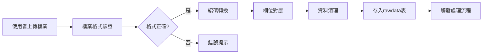

# 資料庫設計與資料流架構

## 資料庫架構概覽

TagPilot Premium 採用雙資料庫模式，支援生產環境的 PostgreSQL 和開發測試的 SQLite。

### 資料庫切換機制
```r
# 自動偵測與切換
get_con() 函數邏輯：
1. 優先嘗試 PostgreSQL 連線
2. 失敗時自動切換到 SQLite
3. 建立必要的資料表結構
4. 返回統一的連線物件
```

## 資料表結構

### 1. users 表 - 使用者管理
```sql
-- PostgreSQL 版本
CREATE TABLE users (
  id           SERIAL PRIMARY KEY,
  username     TEXT UNIQUE,
  hash         TEXT,                    -- bcrypt 密碼雜湊
  role         TEXT DEFAULT 'user',     -- admin/user
  login_count  INTEGER DEFAULT 0        -- 登入次數統計
);

-- SQLite 版本
CREATE TABLE users (
  id           INTEGER PRIMARY KEY AUTOINCREMENT,
  username     TEXT UNIQUE,
  hash         TEXT,
  role         TEXT DEFAULT 'user',
  login_count  INTEGER DEFAULT 0
);
```

### 2. rawdata 表 - 原始資料儲存
```sql
-- PostgreSQL 版本
CREATE TABLE rawdata (
  id           SERIAL PRIMARY KEY,
  user_id      INTEGER REFERENCES users(id),
  uploaded_at  TIMESTAMPTZ DEFAULT now(),
  json         JSONB                    -- 彈性資料儲存
);

-- SQLite 版本
CREATE TABLE rawdata (
  id           INTEGER PRIMARY KEY AUTOINCREMENT,
  user_id      INTEGER,
  uploaded_at  DATETIME DEFAULT CURRENT_TIMESTAMP,
  json         TEXT,                    -- JSON字串
  FOREIGN KEY (user_id) REFERENCES users(id)
);
```

### 3. processed_data 表 - 處理後資料
```sql
CREATE TABLE processed_data (
  id            SERIAL/INTEGER PRIMARY KEY,
  user_id       INTEGER REFERENCES users(id),
  processed_at  TIMESTAMPTZ/DATETIME DEFAULT now(),
  json          JSONB/TEXT,
  -- 可擴展欄位
  analysis_type VARCHAR(50),            -- DNA/ROS/Score
  segment       VARCHAR(20),             -- T1/T2/T3
  score         DECIMAL(10,2)
);
```

### 4. salesdata 表 - 銷售資料
```sql
CREATE TABLE salesdata (
  id           INTEGER PRIMARY KEY,
  user_id      INTEGER,
  uploaded_at  TIMESTAMPTZ/DATETIME DEFAULT now(),
  json         JSONB/TEXT,
  -- 業務欄位
  customer_id  VARCHAR(100),
  order_date   DATE,
  amount       DECIMAL(10,2),
  product_id   VARCHAR(100)
);
```

### 5. 策略對應表 (CSV檔案)
```csv
# database/strategy.csv
segment,risk_level,opportunity,strategy,priority
T1,Low,High,維持忠誠度計畫,1
T2,Medium,Medium,提升購買頻率,2
T3,High,Low,挽回流失客戶,3
```

### 6. 對應規則表 (CSV檔案)
```csv
# database/mapping.csv
field_original,field_standard,data_type,required
客戶編號,customer_id,varchar,true
購買日期,order_date,date,true
購買金額,amount,decimal,true
產品編號,product_id,varchar,false
```

## 資料流程設計

### 1. 資料上傳流程


### 2. 資料處理流程
```r
# 資料處理管線
process_data <- function(raw_data) {
  raw_data %>%
    # 步驟1: 資料清理
    clean_missing_values() %>%
    remove_duplicates() %>%
    
    # 步驟2: 資料轉換
    standardize_dates() %>%
    convert_data_types() %>%
    
    # 步驟3: 特徵工程
    calculate_rfm_scores() %>%
    calculate_ipt_values() %>%
    
    # 步驟4: 客戶分群
    segment_customers() %>%
    
    # 步驟5: 儲存結果
    save_to_processed_data()
}
```

### 3. DNA分析資料流
```r
# DNA分析資料管線
dna_pipeline <- function(customer_data) {
  customer_data %>%
    # 計算核心指標
    mutate(
      recency = calculate_recency(),
      frequency = calculate_frequency(),
      monetary = calculate_monetary(),
      ipt_mean = calculate_ipt()
    ) %>%
    
    # IPT分群
    calculate_ipt_segments_full() %>%
    
    # 風險評估
    assess_churn_risk() %>%
    
    # 機會識別
    identify_opportunities() %>%
    
    # 生成策略
    generate_recommendations()
}
```

## 資料存取層設計

### 統一資料存取介面
```r
# utils/data_access.R

# 使用 tbl2 統一資料存取
get_customer_data <- function(con, filters = NULL) {
  query <- tbl2(con, "processed_data")
  
  if (!is.null(filters)) {
    query <- apply_filters(query, filters)
  }
  
  query %>% collect()
}

# 參數化查詢防止SQL注入
safe_query <- function(con, sql, params) {
  if (inherits(con, "PqConnection")) {
    # PostgreSQL 參數格式: $1, $2
    sql <- convert_placeholders(sql)
  }
  
  dbGetQuery(con, sql, params)
}
```

### 跨資料庫相容性處理
```r
# 處理資料庫差異
db_specific_query <- function(con, query_type) {
  if (inherits(con, "SQLiteConnection")) {
    switch(query_type,
      "current_time" = "datetime('now')",
      "json_extract" = "json_extract(json, '$.field')",
      "auto_increment" = "AUTOINCREMENT"
    )
  } else {
    switch(query_type,
      "current_time" = "now()",
      "json_extract" = "json->>'field'",
      "auto_increment" = "SERIAL"
    )
  }
}
```

## 資料安全機制

### 1. 連線安全
```r
# PostgreSQL SSL連線
con <- dbConnect(
  RPostgres::Postgres(),
  sslmode = "require",  # 強制SSL
  # ... 其他參數
)

# 連線池管理
pool <- dbPool(
  drv = RPostgres::Postgres(),
  maxSize = 10,
  idleTimeout = 3600000
)
```

### 2. 資料加密
```r
# 敏感資料加密
encrypt_sensitive <- function(data) {
  # 使用 sodium 套件加密
  key <- sodium::keygen()
  encrypted <- sodium::simple_encrypt(
    serialize(data, NULL),
    key
  )
  
  list(data = encrypted, key = key)
}

# 密碼雜湊
hash_password <- function(password) {
  bcrypt::hashpw(password)
}
```

### 3. 存取控制
```r
# 角色基礎存取控制 (RBAC)
check_permission <- function(user_role, resource) {
  permissions <- list(
    admin = c("read", "write", "delete", "admin"),
    user = c("read", "write"),
    guest = c("read")
  )
  
  resource %in% permissions[[user_role]]
}
```

## 資料備份與恢復

### 自動備份策略
```r
# 定期備份
schedule_backup <- function() {
  later::later(function() {
    backup_database()
    schedule_backup()  # 重新排程
  }, delay = 86400)  # 每24小時
}

backup_database <- function() {
  if (db_type == "SQLite") {
    file.copy(
      "database/vitalsigns_test.db",
      paste0("backups/backup_", Sys.Date(), ".db")
    )
  } else {
    # PostgreSQL pg_dump
    system(paste(
      "pg_dump",
      "-h", Sys.getenv("PGHOST"),
      "-U", Sys.getenv("PGUSER"),
      "-d", Sys.getenv("PGDATABASE"),
      ">", paste0("backups/backup_", Sys.Date(), ".sql")
    ))
  }
}
```

## 效能優化策略

### 1. 索引優化
```sql
-- 常用查詢索引
CREATE INDEX idx_user_id ON rawdata(user_id);
CREATE INDEX idx_upload_date ON rawdata(uploaded_at);
CREATE INDEX idx_customer_segment ON processed_data(segment);

-- 複合索引
CREATE INDEX idx_user_date ON salesdata(user_id, order_date);
```

### 2. 查詢優化
```r
# 使用 dbplyr 延遲執行
lazy_query <- tbl(con, "large_table") %>%
  filter(date >= start_date) %>%
  group_by(customer_id) %>%
  summarise(total = sum(amount))

# 只在需要時執行
result <- lazy_query %>% collect()
```

### 3. 快取策略
```r
# 記憶體快取
cache <- new.env()

get_cached_data <- function(key, compute_func) {
  if (exists(key, envir = cache)) {
    return(get(key, envir = cache))
  }
  
  data <- compute_func()
  assign(key, data, envir = cache)
  
  # 設定過期時間
  later::later(function() {
    rm(key, envir = cache)
  }, delay = 3600)
  
  return(data)
}
```

## 資料庫監控

### 效能監控
```r
# 查詢效能追蹤
track_query_performance <- function(query, con) {
  start_time <- Sys.time()
  
  result <- tryCatch({
    dbGetQuery(con, query)
  }, error = function(e) {
    log_error(e)
    NULL
  })
  
  execution_time <- Sys.time() - start_time
  
  # 記錄慢查詢
  if (execution_time > 1) {
    log_slow_query(query, execution_time)
  }
  
  result
}
```

### 連線池監控
```r
# 監控連線池狀態
monitor_connection_pool <- function(pool) {
  list(
    size = pool$size,
    available = pool$available,
    in_use = pool$size - pool$available,
    max_size = pool$maxSize
  )
}
```

## 資料遷移策略

### 版本控制
```r
# 資料庫版本管理
migrations <- list(
  v1.0 = function(con) {
    # 初始架構
  },
  v1.1 = function(con) {
    # 新增欄位
    dbExecute(con, "ALTER TABLE users ADD COLUMN last_login TIMESTAMP")
  },
  v1.2 = function(con) {
    # 新增表格
    dbExecute(con, "CREATE TABLE audit_log (...)")
  }
)

run_migrations <- function(con, current_version) {
  for (version in names(migrations)) {
    if (version > current_version) {
      migrations[[version]](con)
      update_version(con, version)
    }
  }
}
```

---
**文件版本**: v1.0  
**更新日期**: 2024-08-26  
**維護者**: Claude Code