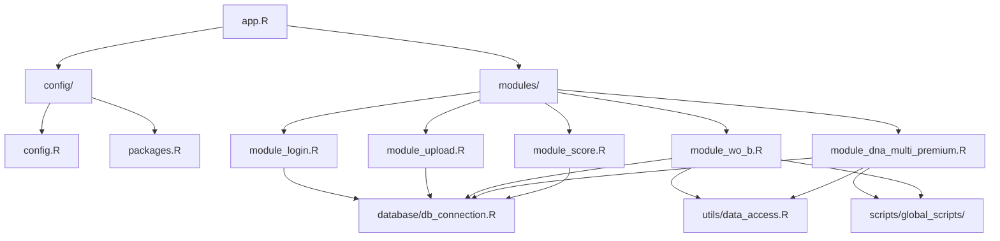

# 模組架構詳細分析

## 模組化設計理念

TagPilot Premium 採用高度模組化的架構設計，遵循以下原則：
- **單一職責原則 (SRP)**: 每個模組負責一個特定功能
- **鬆耦合**: 模組間透過定義良好的介面通訊
- **高內聚**: 相關功能集中在同一模組內
- **可重用性**: 模組可在不同應用中重複使用

## 核心模組詳解

### 1. module_wo_b.R - 主分析模組
```r
# 功能職責：
- ROS (Risk-Opportunity-Stability) 框架實作
- 客戶行為分析
- 策略建議生成

# 關鍵函數：
- calculate_ros_scores()    # 計算ROS分數
- generate_strategies()     # 生成行銷策略
- analyze_customer_behavior() # 客戶行為分析

# 資料依賴：
- 輸入: 客戶交易資料
- 輸出: ROS評分、策略建議
```

### 2. module_dna_multi_premium.R - DNA分析模組
```r
# 核心演算法：
calculate_ipt_segments_full <- function(dna_data) {
  # IPT (Inter-Purchase Time) 計算
  # T1: Top 20% - 高頻客戶
  # T2: Middle 30% - 中頻客戶  
  # T3: Long Tail 50% - 低頻客戶
}

# 特色功能：
- 多檔案批次處理
- 動態分群邊界調整
- AI洞察整合
- 視覺化報表生成

# UI整合：
- Input: fileInput (多檔案上傳)
- Processing: withProgress顯示進度
- Output: DT表格 + Plotly圖表
```

### 3. module_upload.R - 上傳模組
```r
# 支援格式：
- CSV (UTF-8, Big5編碼)
- Excel (.xlsx, .xls)
- JSON資料格式

# 驗證流程：
1. 檔案格式檢查
2. 編碼自動偵測
3. 必要欄位驗證
4. 資料型態轉換
5. 錯誤處理與回饋

# 資料處理：
- 自動清理空白列
- 日期格式標準化
- 數值型態轉換
- 缺失值處理策略
```

### 4. module_login.R - 認證模組
```r
# 安全機制：
- bcrypt密碼雜湊
- Session管理
- 登入次數追蹤
- 角色權限控制

# 使用者角色：
admin:
  - 全部功能存取
  - 系統設定管理
  - 使用者管理
  
user:
  - 基本功能存取
  - 個人資料管理
  - 限制功能權限
```

### 5. module_score.R - 評分模組
```r
# 評分維度：
- 購買頻率 (Frequency)
- 購買金額 (Monetary)
- 最近購買 (Recency)
- 客戶價值 (CLV)
- 流失風險 (Churn Risk)

# 評分方法：
- Z-Score標準化
- 百分位排名
- 機器學習模型
- 專家規則系統
```

## 模組間通訊架構

### 資料流向
```
登入模組 → 驗證成功 → 載入主介面
    ↓
上傳模組 → 資料驗證 → 存入資料庫
    ↓
分析模組 → 讀取資料 → 執行分析
    ↓
DNA模組 → IPT分群 → 生成報表
    ↓
評分模組 → 客戶評分 → 策略建議
```

### Reactive通訊模式
```r
# 全域reactive values
values <- reactiveValues(
  user_data = NULL,
  analysis_results = NULL,
  current_segment = NULL
)

# 模組間事件觸發
observeEvent(input$upload_complete, {
  values$user_data <- uploaded_data()
  trigger_analysis()
})

# 跨模組資料共享
module_results <- callModule(
  analysisModule,
  "analysis",
  data = reactive(values$user_data)
)
```

## 模組化最佳實踐

### 1. 命名空間隔離
```r
# UI函數
analysisModuleUI <- function(id) {
  ns <- NS(id)
  tagList(
    selectInput(ns("method"), ...),
    plotOutput(ns("results"))
  )
}

# Server函數
analysisModule <- function(input, output, session, data) {
  # 模組邏輯
}
```

### 2. 參數傳遞模式
```r
# 使用reactive傳遞動態資料
callModule(
  moduleServer,
  "module_id",
  data = reactive(input_data),
  config = reactive(app_config)
)

# 返回值處理
results <- callModule(...)
observeEvent(results(), {
  # 處理返回結果
})
```

### 3. 錯誤處理策略
```r
# 模組內錯誤捕獲
tryCatch({
  # 執行模組邏輯
}, error = function(e) {
  showNotification(
    paste("錯誤:", e$message),
    type = "error"
  )
  return(NULL)
})

# 優雅降級
if (is.null(data())) {
  return(default_output())
}
```

## 模組擴展指南

### 新增模組步驟
1. 創建 `modules/module_new_feature.R`
2. 定義UI函數: `newFeatureUI(id)`
3. 定義Server函數: `newFeatureServer(input, output, session, ...)`
4. 在 `app.R` 中載入: `source("modules/module_new_feature.R")`
5. 整合到UI和Server

### 模組模板
```r
# modules/module_template.R

# UI函數
templateModuleUI <- function(id) {
  ns <- NS(id)
  tagList(
    # UI元素
  )
}

# Server函數
templateModuleServer <- function(input, output, session, data = reactive(NULL)) {
  ns <- session$ns
  
  # 初始化
  values <- reactiveValues()
  
  # 主要邏輯
  observe({
    req(data())
    # 處理資料
  })
  
  # 輸出
  output$result <- renderPlot({
    # 生成輸出
  })
  
  # 返回值
  return(reactive(values$result))
}

# 輔助函數
helper_function <- function() {
  # 輔助邏輯
}
```

## 模組依賴關係圖



## 效能考量

### 模組載入優化
- 延遲載入: 只在需要時載入模組
- 條件載入: 根據使用者權限載入
- 快取機制: 避免重複計算

### 記憶體管理
- 及時清理大型物件
- 使用 `reactiveVal()` 管理狀態
- 避免全域變數污染

### 非同步處理
```r
# 使用future包進行非同步處理
library(future)
library(promises)

future_promise({
  # 耗時運算
  heavy_computation()
}) %...>% {
  # 處理結果
  update_ui()
}
```

## 測試策略

### 單元測試
```r
# tests/test_module_dna.R
test_that("IPT分群正確", {
  test_data <- create_test_data()
  result <- calculate_ipt_segments_full(test_data)
  
  expect_equal(sum(result$ipt_segment == "T1"), 20)
  expect_equal(sum(result$ipt_segment == "T2"), 30)
  expect_equal(sum(result$ipt_segment == "T3"), 50)
})
```

### 整合測試
- 模組間通訊測試
- 資料流測試
- UI響應測試

---
**文件版本**: v1.0  
**更新日期**: 2024-08-26  
**維護者**: Claude Code