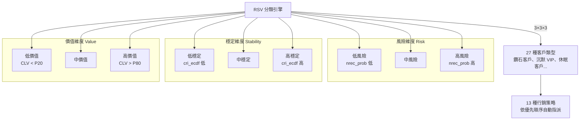
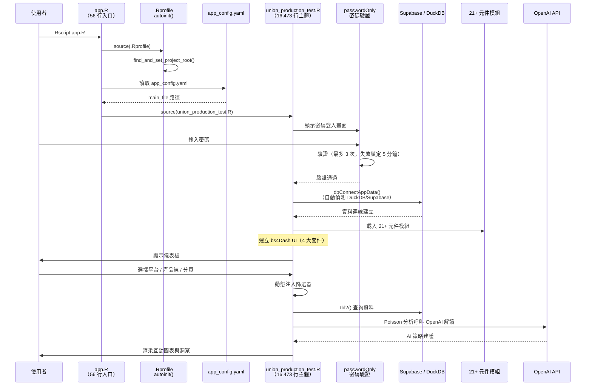
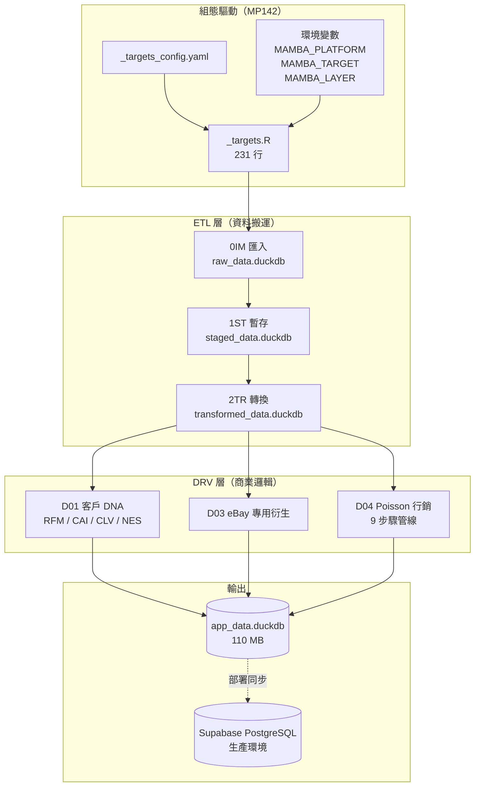
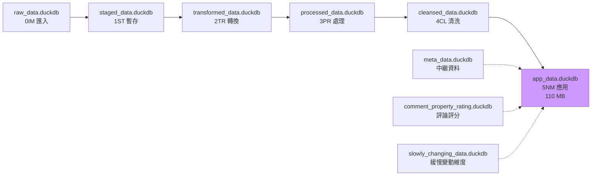
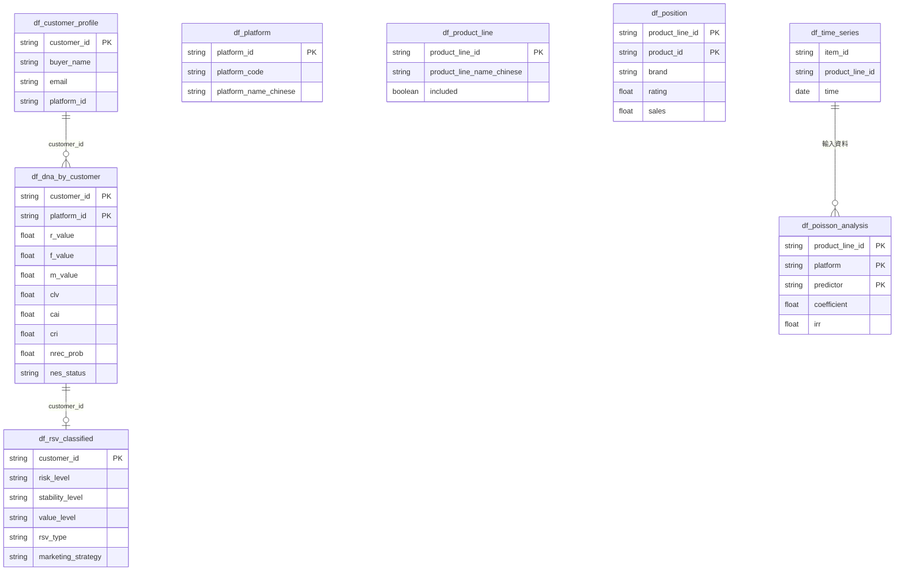
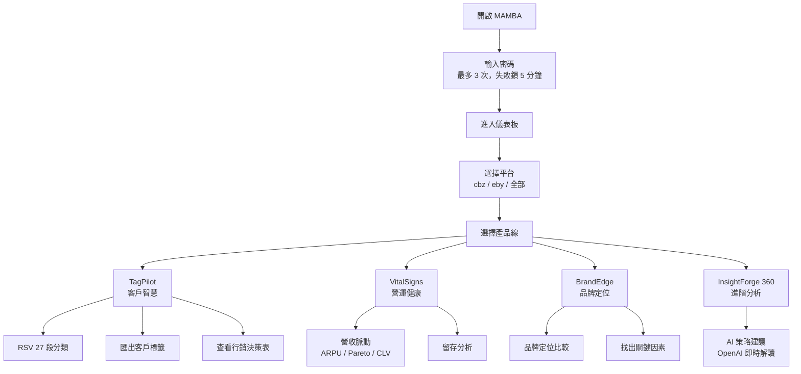

# MAMBA 子專案研究報告

> **名稱**：MAMBA — Member Analytics and Marketing Platform（會員分析與行銷平台）  
> **層級**：L4 Enterprise  
> **總檔案數**：約 12,063 個  
> **專案大小**：約 2.6 GB  
> **主應用程式**：app.R（56 行入口）→ union_production_test.R（16,473 行主體）

---

## 1. 使用的程式語言與技術

| 語言/技術 | 用途 | 檔案數量 |
|-----------|------|---------|
| **R** | 主要語言：Shiny 應用、統計建模、ETL 管線 | ~1,007 |
| **Python** | AI 處理：評論評分、性別預測 | ~5+ |
| **SQL** | 資料庫查詢、參考文件 | ~26 |
| **YAML** | 組態管理（`app_config.yaml`、`_targets_config.yaml`） | 數個 |
| **Bash** | 自動化腳本：根目錄檢查、備份清理、文件生成 | 4（772 行） |
| **Makefile** | 部署自動化（rsync + git push） | 1（123 行） |
| **CSV/Excel** | 原始資料與匯出 | ~176 |

### 核心 R 套件

```r
# UI 框架
shiny, bs4Dash, DT, plotly, shinycssloaders, shinyjs

# 資料處理
dplyr, tidyr, data.table, dtplyr

# 統計建模
survival (Cox PH), NbClust, caret, MASS, psych

# 管線編排
targets

# 非同步處理
future, furrr

# API 整合
httr, jsonlite, reticulate

# 資料庫
DBI, duckdb, RPostgres

# Google Sheets
googlesheets4
```

---

## 2. 功能清單

### 四大產品套件 + 報表中心

```mermaid
graph TB
    APP[MAMBA Enterprise Platform<br/>會員分析與行銷平台]

    subgraph "TagPilot 客戶智慧（8 模組）"
        T1[客戶價值 RFM]
        T2[客戶活躍度 CAI]
        T3[客戶狀態 NES]
        T4[客戶結構分析]
        T5[生命週期預測]
        T6[RSV 生命力矩陣<br/>27 段客戶分類]
        T7[行銷決策表<br/>13 種策略自動指派]
        T8[顧客標籤輸出<br/>19 欄標準化匯出]
    end

    subgraph "Marketing VitalSigns 營運健康（4 模組）"
        V1[營收脈動 Revenue Pulse<br/>ARPU / CLV / Pareto 80/20]
        V2[顧客獲取 Acquisition]
        V3[顧客參與 Engagement]
        V4[顧客留存 Retention]
    end

    subgraph "BrandEdge 品牌定位（6 模組）"
        B1[品牌屬性評價表]
        B2[品牌 DNA 視覺化]
        B3[市場區隔與目標市場 MDS]
        B4[關鍵因素分析 KFE]
        B5[理想點分析]
        B6[品牌定位策略建議]
    end

    subgraph "InsightForge 360 進階分析（3 模組）"
        I1[市場賽道<br/>Poisson 評論分析]
        I2[時間分析<br/>Poisson 時序分析]
        I3[精準行銷<br/>Poisson 特徵分析]
    end

    RC[報表中心 Report Center]

    APP --> T1 & T2 & T3 & T4 & T5 & T6 & T7 & T8
    APP --> V1 & V2 & V3 & V4
    APP --> B1 & B2 & B3 & B4 & B5 & B6
    APP --> I1 & I2 & I3
    APP --> RC
```



### 完整功能列表

| 套件 | 模組 | 功能說明 |
|------|------|---------|
| **TagPilot** | 客戶價值 (RFM) | 近期/頻率/金額三維分析與視覺化 |
| **TagPilot** | 客戶活躍度 (CAI) | 活躍指數追蹤，辨識活躍/衰退客戶 |
| **TagPilot** | 客戶狀態 (NES) | N/E0/S1/S2/S3 狀態監控 |
| **TagPilot** | 客戶結構 | 客戶群體結構分佈分析 |
| **TagPilot** | 生命週期預測 | 預測客戶未來行為與價值 |
| **TagPilot** | RSV 生命力矩陣 | **27 段客戶分類**（風險×穩定×價值） |
| **TagPilot** | 行銷決策表 | **13 種行銷策略自動指派**，含優先順序 |
| **TagPilot** | 顧客標籤輸出 | 19 欄標準化客戶資料匯出 |
| **VitalSigns** | 營收脈動 | ARPU、平均 CLV、交易一致性、Pareto 80/20 曲線 |
| **VitalSigns** | 顧客獲取 | 新客獲取指標與趨勢 |
| **VitalSigns** | 顧客參與 | 客戶互動與參與度追蹤 |
| **VitalSigns** | 顧客留存 | 留存率與流失預測 |
| **BrandEdge** | 品牌屬性評價 | 產品屬性比較表（智慧 NA 處理） |
| **BrandEdge** | 品牌 DNA | 多維度品牌定位散佈圖/熱力圖 |
| **BrandEdge** | 市場區隔 | MDS 多元尺度分析，找出市場群集 |
| **BrandEdge** | KFE 分析 | 重要性-績效矩陣，識別關鍵因素 |
| **BrandEdge** | 理想點分析 | 產品與理想位置距離排名 |
| **BrandEdge** | 策略建議 | AI 驅動的四象限策略定位建議 |
| **InsightForge** | 市場賽道 | Poisson 迴歸分析評論/口碑對市場定位的影響 |
| **InsightForge** | 時間分析 | 時序 Poisson 分析：年效果、月季節性、星期效果 |
| **InsightForge** | 精準行銷 | 產品特徵 Poisson 迴歸 + AI 策略解讀 |
| **報表中心** | 報表生成 | 即時回饋式報表產出（MP88） |

### MAMBA 獨有功能

#### RSV 生命力矩陣（27 段客戶分類）



#### 13 種行銷策略（優先順序）

| 優先序 | 策略名稱 | 觸發條件 |
|--------|---------|---------|
| 1 | 喚醒/回歸 | 休眠客戶（S1/S2/S3） |
| 2 | 關係修復 | 低活躍 + 高風險 |
| 3 | 成本控制 | 高風險客戶 |
| 4 | 新客培育 | NES = N（新客） |
| 5 | 低成本培育 | 低 RFM + 低 CLV |
| 6 | 標準培育（保守/核心/進階） | 一般活躍客戶 |
| 7 | VIP 維護（低/中/高穩定） | 高價值客戶 |
| 8 | 高端留存 | 活躍 + 高 CLV |
| 9 | 基礎維護 | 預設策略 |

---

## 3. 程式運作邏輯

### 應用程式啟動流程



### ETL 管線架構（targets 框架）



### D04 Poisson 行銷管線（9 步驟）

| 步驟 | 腳本 | 功能 |
|------|------|------|
| D04_01 | 時間標籤豐富化 | 為銷售資料加入時間特徵 |
| D04_02 | 核心 Poisson 分析設置 | 建立迴歸模型架構 |
| D04_03 | R120 中繼資料生成 | 產生 UI 滑桿範圍設定 |
| D04_04 | 時間序列準備 | 準備完整時間序列資料 |
| D04_05 | Poisson 包裝函式 | 封裝迴歸計算邏輯 |
| D04_06 | 應用資料發布 | 寫入 app_data.duckdb |
| D04_07 | 精準時間序列 | 精準行銷專用時間序列 |
| D04_08 | 精準 Poisson 分析 | 精準行銷迴歸分析 |
| D04_09 | 特徵準備 | 最終特徵工程 |

### 平台支援

| 平台代碼 | 平台名稱 | 資料來源 | 衍生腳本 |
|---------|---------|---------|---------|
| `cbz` | Cyberbiz | REST API（api.cyberbiz.io） | D01, D04 |
| `eby` | eBay | SQL Server（SSH 隧道） | D01, D03, D04 |
| `amz` | Amazon | API（已設定，較少使用） | — |
| `all` | 跨平台彙總 | 彙總以上平台 | 商品檔案、中繼資料 |
| `precision` | 精準行銷 | 衍生資料 | 專用管線 |

---

## 4. 應用場景

MAMBA 專為**需要完整會員生命週期管理**的中大型電商企業設計：

| 場景 | 使用的功能 | 商業價值 |
|------|-----------|---------|
| **會員分群精準行銷** | RSV 27 段分類 + 13 種策略 | 自動為每位客戶指派最佳行銷策略 |
| **營收健康監控** | VitalSigns 營收脈動 | ARPU、CLV、Pareto 分析即時掌握營收結構 |
| **客戶流失預警** | NES 狀態 + 留存分析 | 提前辨識休眠/流失客戶，啟動喚醒策略 |
| **跨平台整合分析** | cbz + eby 跨平台彙總 | 整合 Cyberbiz 與 eBay 的客戶與銷售資料 |
| **競品品牌定位** | BrandEdge 6 大分析 | 了解品牌在市場中的位置與差異化空間 |
| **銷售時序預測** | Poisson 時間分析 | 預測不同時段、季節的銷售模式 |
| **AI 策略建議** | OpenAI + Poisson 整合 | GPT 自動解讀統計結果，產出策略建議 |
| **客戶資料匯出** | 顧客標籤輸出 | 19 欄標準化資料匯出，供外部系統使用 |
| **定價最佳化** | 最佳定價模型 | 找到利潤最大化的價格點 |

### 產品線範例

涵蓋汽車零配件產品線：turbo（渦輪）、wastegate（洩壓閥）、compressor wheel（壓縮輪）、repair kit（修理包）、oil/water line kit（油水管線包）等。

---

## 5. 資料庫結構 Schema

### 6 層 DuckDB 架構



### 資料庫雙模式

```yaml
# app_config.yaml
database:
  mode: "supabase"    # 生產環境：Supabase PostgreSQL
  # mode: "duckdb"    # 本地開發：DuckDB
  duckdb:
    path: "data/app_data/app_data.duckdb"
    read_only: true
```

| 模式 | 用途 | 連線方式 |
|------|------|---------|
| **Supabase** | 生產環境（Posit Connect） | `SUPABASE_DB_HOST` 環境變數 |
| **DuckDB** | 本地開發 | `data/app_data/app_data.duckdb` |

### 核心資料表

#### 原始層（0IM）— 平台特定格式

**Cyberbiz 原始表 `df_cbz_sales___raw`**
```
├── 訂單欄位：order_number, order_id, sales_transaction_id
├── 巢狀 JSON：line_items.*, customer.*, receiver.*, prices.*
├── 狀態：statuses.*, fulfillments_json, return_histories_json
├── UTM 追蹤：cbz_utm_source, cbz_utm_medium, cbz_utm_campaign
├── 會員：cbz_member_id, cbz_member_level, cbz_points_balance
└── 中繼資料：import_source, import_timestamp, platform_code
```

**eBay 原始表 `df_eby_orders___raw___MAMBA`**
```
├── 交易欄位：eby_item_id, eby_transaction_id, eby_buyer_username
├── 物流：eby_shipping_service, eby_shipping_cost, eby_ship_to_*
├── 評價：eby_feedback_score, eby_feedback_percentage
└── 時間：eby_sale_date, eby_paid_date, eby_shipped_date
```

#### 轉換層（2TR）— 跨平台標準化

**`df_{platform}_sales___transformed`**
```
├── 標準欄位：transaction_id, order_id, customer_id, product_id
├── 產品：product_name, sku
├── 金額：quantity, unit_price (NUMERIC), line_total (DECIMAL(10,2))
├── 時間：order_date (DATE), order_year, order_month, order_quarter
└── 財務：discount_amount, tax_amount
```

#### 衍生層（DRV）— 商業邏輯

**客戶 DNA 表 `df_dna_by_customer`（47 欄）**
```
├── 識別：customer_id, platform_id
├── RFM 指標
│   ├── r_value（近期天數）, f_value（購買次數）, m_value（消費金額）
│   ├── r_ecdf, f_ecdf, m_ecdf（百分位）
│   └── r_label, f_label, m_label（分類標籤）
├── 進階指標
│   ├── clv（客戶終身價值）
│   ├── cai / cai_ecdf（客戶活躍指數）
│   ├── pcv（歷史客戶價值）
│   ├── cri / cri_ecdf（客戶風險指數）
│   └── ipt（購買間隔天數）
├── NES 分群
│   ├── nes_ratio, nes_status（N/E0/S1/S2/S3）
│   └── nrec, nrec_prob（流失預測，BG/NBD）
├── 消費統計：total_spent, times
├── 地理位置：zipcode, state, lat, lng
└── 時間：time_first, payment_time, min_time, nt, time_first_to_now
```

**RSV 分類表 `df_rsv_classified`**（UX_P002 預計算）
```
├── customer_id
├── risk_level（低/中/高，基於 nrec_prob）
├── stability_level（低/中/高，基於 cri_ecdf）
├── value_level（低/中/高，基於 clv，P20/P80 門檻）
├── rsv_type（27 種客戶類型名稱）
└── marketing_strategy（13 種策略名稱 + 優先順序）
```

**Poisson 分析表 `df_{platform}_poisson_analysis_{product_line}`**
```
├── 識別：product_line_id, platform, predictor
├── 模型結果：coefficient, incidence_rate_ratio, std_error, z_value, p_value
├── 信賴區間：conf_low, conf_high, irr_conf_low, irr_conf_high
├── UI 設定：predictor_min, predictor_max, track_multiplier
├── 顯示：display_name, display_category, display_description
└── 主鍵：(product_line_id, platform, predictor, analysis_date)
```

### 資料表關係圖



---

## 6. 多國語系支援

| 項目 | 狀態 | 說明 |
|------|------|------|
| **UI 語言** | 繁體中文（zh_TW.UTF-8） | `app_config.yaml` 中設定 |
| **翻譯機制** | `translate()` 函式 | `fn_translation.R`，英文鍵值 → 中文 |
| **翻譯初始化** | `fn_initialize_ui_translation.R` | 應用啟動時載入翻譯表 |
| **語言範圍** | `fn_get_language_scope.R` | 支援 `ui_text` 和 `product_line_labels` |
| **AI Prompt** | 語系客製化 | 依 locale 載入不同 system_prompt |
| **欄位命名** | 英文內部 / 中文顯示 | DEV_R052 原則 |
| **SCD 參數** | `chinese_labels.yaml` | 緩慢變動的中文標籤定義 |

### 擴充新語系步驟

1. 在 `ui_terminology.csv` 新增語言欄位
2. 建立對應的 `chinese_labels.yaml`（或其他語系標籤檔）
3. 在 `ai_prompts.yaml` 新增語系的 system_prompt
4. 修改 `app_config.yaml` 中的 `language` 設定

---

## 7. 前後端可擴充或移除的選項

### 前端（可擴充）

| 項目 | 方式 | 相關檔案 |
|------|------|---------|
| **新增套件分頁** | 在 `sidebarMenu` + `dashboardBody` 加入 | `union_production_test.R` |
| **新增元件** | 建立 `*UI.R` + `*Server.R` + `*Defaults.R` | `global_scripts/10_rshinyapp_components/` |
| **新增圖表** | `renderPlotly()` / `renderDT()` | 各元件模組 |
| **修改主題** | 變更 `bootswatch` | `app_config.yaml` |
| **新增篩選器** | sidebar accordion 加入 filter | union 檔案 sidebar 區塊 |
| **自訂 CSS** | 新增 `.css` 檔 | `global_scripts/19_CSS/` |

### 前端（可移除）

| 項目 | 方式 |
|------|------|
| **移除整個套件** | 從 sidebar + body 移除對應 `menuItem` + `tabItem` |
| **移除個別元件** | 移除 `source_once()` + UI/Server 呼叫 |
| **停用密碼驗證** | 移除 passwordOnly 模組，直接進入儀表板 |
| **停用報表中心** | 移除 Report Center 分頁 |

### 後端（可擴充）

| 項目 | 方式 | 說明 |
|------|------|------|
| **新增平台** | `app_config.yaml` + ETL 腳本 | 如加入 Shopify |
| **新增產品線** | `df_product_line` + ETL 設定 | 新增類別代碼 |
| **新增衍生腳本** | `_targets_config.yaml` | 新增 D05/D06 群組 |
| **新增統計模型** | `global_scripts/07_models/` | 新增 `.R` 模型檔 |
| **新增 AI 功能** | `global_scripts/08_ai/` | 新增 prompt 或模型 |
| **遷移資料庫** | `database.mode` 設定 | DuckDB ↔ Supabase 切換 |
| **新增 API 來源** | `global_scripts/26_platform_apis/` | 新增平台 API 整合 |

### 後端（可移除）

| 項目 | 影響範圍 |
|------|---------|
| **停用 AI** | 移除 `OPENAI_API_KEY`，InsightForge 的 AI 解讀停用 |
| **停用 Poisson** | 移除 InsightForge 360 全部 3 個模組 |
| **停用特定平台** | `_targets_config.yaml` 設為 `enabled: false` |
| **停用密碼驗證** | 切換為無驗證模式 |
| **簡化為單平台** | 移除 platform 篩選器 |

---

## 8. 安裝、啟動、執行與使用

### 系統需求

- **R** >= 4.0.0
- **DuckDB**（透過 R 套件自動安裝）
- **PostgreSQL 客戶端**（Supabase 模式需要）
- **OpenAI API Key**（AI 功能需要）
- **SSH 客戶端**（eBay SQL Server 需要 SSH 隧道）
- **make**（部署自動化需要）

### 安裝步驟

```bash
# 1. 進入專案目錄
cd l4_enterprise/MAMBA

# 2. 複製環境變數範本
cp .env.template .env

# 3. 編輯 .env 填入實際值
# 必要變數：
#   OPENAI_API_KEY          — AI 功能
#   SUPABASE_DB_HOST        — 生產資料庫
#   SUPABASE_DB_PORT=5432
#   SUPABASE_DB_NAME=postgres
#   SUPABASE_DB_USER
#   SUPABASE_DB_PASSWORD
#   APP_PASSWORD            — 應用程式密碼（預設 admin）
#   EBY_SQL_HOST            — eBay SQL Server
#   CBZ_API_KEY             — Cyberbiz API

# 4. 確認 global_scripts 已同步
cd ../..
./bash/subrepo_sync.sh
```

### 啟動應用程式

```bash
# 本地開發模式（DuckDB）
cd l4_enterprise/MAMBA
Rscript app.R

# 或在 RStudio 中開啟 MAMBA.Rproj 後按 Run App
```

### 執行 ETL 管線

```bash
# 使用 targets 框架執行完整管線
cd l4_enterprise/MAMBA
Rscript -e "targets::tar_make()"

# 僅執行特定平台
MAMBA_PLATFORM=cbz Rscript -e "targets::tar_make()"

# 僅執行 ETL 層（不含衍生）
MAMBA_LAYER=etl Rscript -e "targets::tar_make()"

# 僅執行衍生層
MAMBA_LAYER=drv Rscript -e "targets::tar_make()"

# 使用 Makefile 中的 bash 腳本批次執行
./scripts/bash/execute_all_weeks.sh
```

### 部署至 Posit Connect

```bash
# 步驟 1：同步開發 → 部署目錄（解析 symlink）
make deploy-sync

# 步驟 2：檢查變更
make deploy-diff

# 步驟 3：提交並推送（觸發自動部署）
make deploy-push

# 或使用一鍵部署腳本
Rscript deployment/deploy_now.R
```

**部署目標：**
- **伺服器**：Posit Connect Cloud（connect.posit.cloud）
- **帳號**：kyle-lin
- **App ID**：mamba-enterprise
- **觸發方式**：GitHub webhook（push 自動部署）

### 使用流程



---

## 目錄結構

```
MAMBA/
├── app.R                         # 入口（56 行）
├── app_config.yaml               # 組態（82 行）
├── .env / .env.template          # 環境變數（102 行範本）
├── .Rprofile                     # R 初始化
├── Makefile                      # 部署自動化（123 行）
├── _targets.R                    # targets 管線定義（231 行）
├── _targets_config.yaml          # 管線組態
├── manifest.json                 # Posit Connect 套件清單（13,871 行）
├── README.md                     # 專案說明（111 行）
├── MAMBA.Rproj                   # RStudio 專案
├── scripts/
│   ├── global_scripts/           # 共用模組（symlink → shared/）
│   ├── bash/                     # 自動化腳本（4 支）
│   └── nsql/                     # SQL 腳本
├── data/
│   ├── app_data/
│   │   ├── app_data.duckdb       # 應用資料庫（110 MB）
│   │   └── parameters/           # SCD 參數
│   │       ├── scd_type1/        # df_product_line.csv
│   │       └── scd_type2/        # brand_aliases.yaml, chinese_labels.yaml
│   ├── local_data/               # ETL 管線資料庫（6 個 DuckDB）
│   │   ├── raw_data.duckdb
│   │   ├── staged_data.duckdb
│   │   ├── transformed_data.duckdb
│   │   ├── processed_data.duckdb
│   │   ├── cleansed_data.duckdb
│   │   └── meta_data.duckdb
│   ├── database_to_csv/          # CSV 匯出（86 檔）
│   ├── backups/                  # 資料庫備份
│   └── local_data/rawdata_MAMBA/ # 原始檔案（45 檔）
│       ├── cbz_sales/            # Cyberbiz 銷售
│       ├── cyberbiz/             # Cyberbiz 訂單
│       ├── eBay Sales/           # eBay 銷售（UK/US/CA）
│       ├── eBay_SQL/             # eBay SQL 匯出
│       ├── official_website_sales/ # 官網銷售（7 產品類別）
│       └── promotion/            # 促銷活動（30+ CSV）
├── deployment/
│   └── mamba-enterprise/         # 部署用倉庫（269 MB）
│       ├── app.R
│       ├── scripts/global_scripts/ # 真實檔案（非 symlink）
│       └── manifest.json
├── tests/                        # 測試（CBZ API 測試）
├── validation/                   # 驗證結果
├── logs/                         # 執行日誌（10+ 檔）
├── cache/                        # 快取
└── archive/                      # 歷史封存（393 MB）
```

---

## MAMBA vs kitchenMAMA 差異比較

| 面向 | MAMBA | kitchenMAMA |
|------|-------|-------------|
| **套件數** | 4 大套件 + 報表中心（21+ 元件） | 3 大套件（~12 元件） |
| **獨有功能** | RSV 27 段分類、行銷決策表、VitalSigns | 存活分析（Kaplan-Meier） |
| **資料庫模式** | 雙模（Supabase + DuckDB） | 純 DuckDB |
| **管線框架** | targets（MP142 組態驅動） | 手動腳本依序執行 |
| **部署方式** | Makefile + rsync + GitHub webhook | Posit Connect 直接部署 |
| **密碼驗證** | passwordOnly 模組（3 次失敗鎖定） | 無 |
| **平台** | Cyberbiz + eBay | Amazon |
| **app_data 大小** | 110 MB | 4.6 MB |
| **主體程式** | 16,473 行（union） | 566 行（app.R） |
| **產品類型** | 汽車零配件 | 廚房用品 |

---

## 技術重點摘要

| 面向 | 內容 |
|------|------|
| **架構模式** | 元件化 Shiny + MP122 四軌共用 symlink 架構 |
| **資料存取** | tbl2() 增強資料存取（R116），DuckDB/Supabase 雙模 |
| **元件模式** | FilterUI + DisplayUI + Server 三件式（R09） |
| **管線編排** | targets 框架（MP140/MP142），組態驅動 |
| **AI 整合** | OpenAI GPT 即時解讀 Poisson 分析結果 |
| **客戶分群** | RSV 27 段分類（風險×穩定×價值）→ 13 種策略自動指派 |
| **統計建模** | Poisson 迴歸、BG/NBD、RFM、CAI、CLV、NES |
| **認證安全** | 密碼驗證（3 次失敗鎖定 5 分鐘） |
| **部署架構** | 雙倉庫（開發 symlink + 部署真實檔案）+ Makefile 自動化 |
| **部署目標** | Posit Connect Cloud（mamba-enterprise） |
